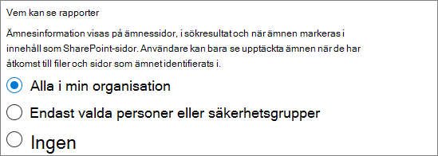

# Konfigurera ämnen i Microsoft 365

Du kan använda Microsoft 365 Admin Center för att konfigurera och konfigurera [avsnitts upplevelser](knowledge-management-overview.md). 

Det är viktigt att planera det bästa sättet att konfigurera och konfigurera ämnen i miljön. Se till att läsa [Plans erfarenheterna](plan-topic-experiences.md) innan du börjar procedurerna i den här artikeln.

Du måste vara global administratör eller SharePoint-administratör för att få åtkomst till administrations centret för Microsoft 365 och konfigurera ämnen.

## Konfigurera ämnen

Så här konfigurerar du ämnen i Microsoft 365

1. I [administrations centret för Microsoft 365](https://admin.microsoft.com)väljer du **Konfigurera** och sedan avsnittet **filer och innehåll** .
2. I avsnittet **filer och innehåll** klickar du på **Anslut personer till kunskap**.

     

3. På sidan **Anslut personer till kunskap** klickar du på **komma igång** för att vägleda dig genom installations processen.

     

4. På sidan **Välj hur kunskaps nätverket kan hitta ämnes** sidor konfigurerar du identifiering av avsnitt. Välj vilka SharePoint-webbplatser som ska crawlas som källor för dina ämnen under identifiering i avsnittet Välj avsnitts **källor för SharePoint** . Välj från:
    - **Alla webbplatser**: alla SharePoint-webbplatser i organisationen. Detta inkluderar aktuella och framtida webbplatser.
    - **Alla, förutom markerade webbplatser**: Skriv namnen på de webbplatser du vill undanta.  Du kan också ladda upp en lista med webbplatser som du inte vill ska ingå i sökningen. Webbplatser som skapats i framtiden tas med i källor för avsnitts identifiering. 
    - **Endast valda webbplatser**: Skriv in namnen på de webbplatser du vill ta med. Du kan också ladda upp en lista med webbplatser. Webbplatser som skapats i framtiden kommer inte att ingå som källor för identifiering av ämnen.
    - **Inga webbplatser**: det finns inga SharePoint-webbplatser.

     
   
5. I avsnittet **undanta ämnen efter namn** kan du lägga till namn på ämnen som du vill undanta från avsnitts identifiering. Använd den här inställningen för att förhindra att känslig information tas med i avsnittet. Alternativen är:
    - **Utelämna inte ämnen** 
    - **Utelämna ämnen efter namn**

     

    (Kunskaps chefer kan också utesluta ämnen i ämnes centret efter identifiering.)

    #### Så här utesluter du ämnen efter namn    

    Om du behöver undanta ämnen, efter att du har valt **Uteslut ämnen efter namn**, väljer du Hämta CSV-mallen och uppdaterar den med listan med avsnitt som du vill undanta från identifierings resultaten.

     

    I CSV-mallen anger du följande information om de avsnitt som du vill undanta:

    - **Namn**: Skriv namnet på det ämne som du vill undanta. Du kan göra det på två sätt:
        - Exakt träff: du kan ange exakt namn eller akronym (till exempel *contoso* eller *ATL*).
        - Ofullständig matchning: du kan exkludera alla ämnen som har ett visst ord i det.  Till exempel kommer *bågen* att exkludera alla ämnen med ord *båge* i det, till exempel *båge cirkel*, *plasma båge svets* eller *tränings båge*. Observera att den inte utesluter ämnen där texten är inkluderad som en del av ett ord, till exempel *arkitekturen*.
    - **Står för (valfritt)**: om du vill utesluta en akronym skriver du orden som förkortningen står för.
    - **MatchType-exakt/delvis**: Skriv om det namn du angav är en *exakt* eller *delvis* matchnings typ.

    När du är klar med och sparat CSV-filen väljer du **Bläddra** och letar reda på den.
    
    Välj **Nästa**.

6. På sidan **vem kan se ämnen och var de kan se dem ser** du avsnitts visning. I listan **vilka kan se ämnen i kunskaps nätverkets** inställning väljer du vilka som ska ha åtkomst till ämnen, till exempel markerade ämnen, ämnes kort, ämnes svar i sökningar och avsnitts sidor. Du kan välja:
    - **Alla i organisationen**
    - **Endast valda personer eller säkerhets grupper**
    - **Ingen**

      

 > [!Note] 
 > Med den här inställningen kan du välja vilken användare som helst i din organisation, men endast användare som har olika ämnen har tilldelats licenser kan se ämnen.

7. På sidan **behörigheter för hantering av ämnen** kan du välja vem som ska kunna skapa, redigera och hantera ämnen. I avsnittet **vilka som kan skapa och redigera ämnen** kan du välja:
    - **Alla i organisationen**
    - **Endast valda personer eller säkerhets grupper**
    - **Ingen**

     

8. I avsnittet **vilka kan hantera ämnen** kan du välja:
    - **Alla i organisationen**
    - **Endast valda personer eller säkerhets grupper**

     

    Välj **Nästa**.

9. På sidan **skapa ämnes Center** kan du skapa en ämnes Center-webbplats där du kan visa ämnes sidor och ämnen kan hanteras. I rutan **webbplats namn** skriver du ett namn på ämnes Center. Du kan också skriva en kort beskrivning i rutan **Beskrivning** . 

Välj **Nästa**.

     

10. På sidan **Granska och slutför** kan du titta på vald inställning och välja att göra ändringar. Om du är nöjd med dina val väljer du **Aktivera**.

11. Sidan **kunskaps nätverk aktive rad** visar och bekräftar att systemet kommer att börja analysera dina valda webbplatser för att få hjälp med ämnen och att skapa kunskaps Center webbplatsen. Välj **Klar**.

12. Du kommer att återföras till sidan **Koppla personer till kunskap** . På den här sidan kan du välja **Hantera** om du vill göra ändringar i dina konfigurationsinställningar. 

        

## Tilldela licenser

När du har konfigurerat ämnen måste du tilldela licenser för de användare som ska använda ämnes upplevelsen. Endast användare med en licens kan se information om ämnen, till exempel markeringar, ämnes kort, ämnes sidor och ämnes Center. 

För att tilldela licenser:

1. I Administrationscenter för Microsoft 365 klickar du på **Användare** > **Aktiva användare**.

2. Välj de användare som du vill licensiera och klicka på **Hantera produktlicenser**.

3. Välj **Tilldela fler**.

4. Under **licenser** väljer du **avsnitts upplevelser**.

5. Under **appar** bör du kontrol lera att **Graph Connectors söker med index** och att **ämnes upplevelser** är markerade.

    > [!div class="mx-imgBorder"]
    > 

6. Klicka på **Spara ändringar**.

## Hantera avsnitts upplevelser

När du har konfigurerat ämnen kan du ändra inställningarna under installationen i [administrations centret för Microsoft 365](https://admin.microsoft.com/AdminPortal#/featureexplorer/csi/KnowledgeManagement). Se följande exempel:

- [Hantera identifiering av avsnitt i Microsoft 365](topic-experiences-discovery.md)
- [Hantera ämnets synlighet i Microsoft 365](topic-experiences-knowledge-rules.md)
- [Hantera behörigheter för ämne i Microsoft 365](topic-experiences-user-permissions.md)
- [Ändra namnet på ämnes centret i Microsoft 365](topic-experiences-administration.md)

## Se även

[Översikt över kunskaps hantering](knowledge-management-overview.md)
