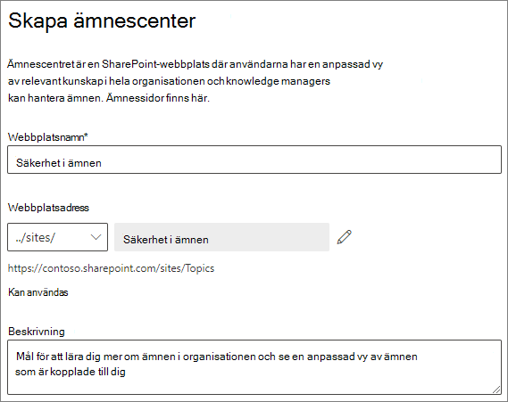

# Konfigurera Microsoft Viva-ämnen

Du kan använda Microsoft 365 för att konfigurera och konfigurera [ämnen.](topic-experiences-overview.md) 

Det är viktigt att planera det bästa sättet att konfigurera ämnen i din miljö. Läs Planera för [Microsoft Viva Topics innan du](plan-topic-experiences.md) börjar med procedurerna i den här artikeln.

Du måste prenumerera [på Viva Topics](https://www.microsoft.com/microsoft-viva/topics) och vara global administratör eller SharePoint administratör för att få åtkomst Microsoft 365 administrationscenter och konfigurera Ämnen.

Om du har konfigurerat SharePoint kräver [hanterade enheter](/sharepoint/control-access-from-unmanaged-devices)måste du konfigurera Ämnen från en hanterad enhet.

## Videodemonstration

I den här videon visas processen för att konfigurera ämnen i Microsoft 365.

 

> [!VIDEO https://www.microsoft.com/videoplayer/embed/RE4Li0E]  

 

## Tilldela licenser

Du måste tilldela licenser för de användare som ska använda ämnen. Endast användare med en licens kan se information om ämnen, till exempel höjdpunkter, ämneskort, ämnessidor och ämnescentret. 

För att tilldela licenser:

1. I Administrationscenter för Microsoft 365 klickar du på **Användare** > **Aktiva användare**.

2. Välj de användare som du vill licensiera och klicka på **Licenser och appar.**

3. Under **Licenser** väljer du **Viva Ämnen.**

4. Kontrollera **att** Graph **Med Index (Viva Ämnen)** och **Viva** Ämnen under Appar är markerade.

   > [!div class="mx-imgBorder"]
   > 

5. Klicka på **Spara ändringar**.

Det kan ta upp till en timme för användarna att få åtkomst till Ämnen när licenserna har tilldelats.

## Konfigurera ämnen

Så här ställer du in ämnen

1. I Microsoft 365 [väljer du](https://admin.microsoft.com) **Konfigurera** och visar sedan **avsnittet Filer och** innehåll.
2. I avsnittet **Filer och innehåll** klickar du på Dela Anslut att få kunskap **om**.

     

3. På sidan **Anslut att få information** klickar du på **Kom** igång för att gå igenom installationsprocessen.

     

4. På sidan **Välj hur Viva Ämnen kan hitta ämnen** konfigurerar du identifiering av ämnen. I avsnittet **Välj SharePoint ämneskällor** väljer du vilka SharePoint ska crawlas som källor för ämnen under identifieringen. Välj mellan:
    - **Alla webbplatser:** alla SharePoint webbplatser i organisationen. Det omfattar nuvarande och framtida webbplatser.
    - **Alla, förutom valda webbplatser:** Skriv namnen på de webbplatser som du vill utesluta.  Du kan också ladda upp en lista över webbplatser som du vill avanmäla från identifiering. Webbplatser som skapas i framtiden kommer att ingå som källor för upptäckt av ämnen. 
    - **Endast valda webbplatser**: Skriv namnen på de webbplatser som du vill ska ingå. Du kan också ladda upp en lista med webbplatser. Webbplatser som skapas i framtiden inkluderas inte som källor för ämnesidentifiering.
    - **Inga webbplatser**: Inkludera inte några SharePoint webbplatser.

     
   
5. I avsnittet **Exkludera ämnen efter namn** kan du lägga till namn på ämnen som du inte vill ska upptäckas. Använd den här inställningen för att förhindra att känslig information inkluderas som ämnen. Alternativen är:
    - **Undanta inte några ämnen** 
    - **Utesluta ämnen efter namn**

     

    (Knowledge managers can also exclude topics in the topic center after discovery.)

    #### Så här utesluter du ämnen efter namn    

    Om du behöver utesluta ämnen efter att ha valt Exkludera ämnen efter namn **laddar** du ned .csv-mallen och uppdaterar den med listan med ämnen som du vill utesluta från dina identifieringsresultat.

     

    I CSV-mallen anger du följande information om de ämnen som du inte vill ska ingå:

    - **Namn**: Skriv namnet på det ämne som du vill utesluta. Du kan göra det på två sätt:
        - Exakt matchning: Du kan ta med det exakta namnet eller förkortningen (till exempel *Contoso* eller *ATL*).
        - Delvis matchning: Du kan utesluta alla avsnitt som innehåller ett visst ord.  En båge *utesluter* till exempel  alla ämnen som innehåller ordet båge, t.ex. arcuscirkel,  *Arcus* arcus- eller *utbildningsbåge.* Observera att den inte exkluderar ämnen där texten ingår i ett ord, till exempel *Arkitektur.*
    - **Står för (valfritt)**: Om du vill utesluta en förkortning skriver du orden förkortningen står för.
    - **MatchType-Exact/Partial**: Ange om namnet du angav var en *exakt eller* *delvis* matchningstyp.

    När du har slutfört och sparat filen .csv väljer du Bläddra **för att** leta reda på och markera den.
    
    Välj **Nästa**.

6. På sidan **Vem kan se ämnen och var de kan se dem** konfigurerar du synligheten för avsnittet. I avsnittet **Vem se** inställningen för ämnen väljer du vilka som ska ha åtkomst till ämnesinformation, till exempel markerade ämnen, ämneskort, ämnessvar i sökningar och ämnessidor. Du kan välja:
    - **Alla i min organisation**
    - **Endast valda personer eller säkerhetsgrupper**
    - **Ingen**

      

    > [!Note] 
    > Med den här inställningen kan du välja vilken användare som helst i organisationen, men endast användare som har tilldelats ämneserfarenhetslicenser kan visa ämnen.

7. På sidan **Behörigheter för ämneshantering** väljer du vilka som ska kunna skapa, redigera eller hantera ämnen. I avsnittet **Vem skapa och redigera ämnen** kan du välja:
    - **Alla i min organisation**
    - **Endast valda personer eller säkerhetsgrupper**
    - **Ingen**

     

8. I avsnittet **Vem kan hantera ämnen** kan du välja:
    - **Alla i min organisation**
    - **Endast valda personer eller säkerhetsgrupper**

     

    Välj **Nästa**.

9. På sidan **Skapa ämnescenter** kan du skapa en ämnescenterwebbplats där ämnessidor kan visas och ämnen kan hanteras. Ange **ett namn** på ämnescentret i rutan Webbplatsnamn. Du kan också skriva en kort beskrivning i **rutan** Beskrivning. 

   Välj **Nästa**.

     

10. På sidan **Granska och slutför** kan du titta på vald inställning och välja att göra ändringar. Om du är nöjd med dina val väljer du **Aktivera**.

11. Sidan **Viva Ämnen som** har aktiverats visas och bekräftar att systemet nu börjar analysera valda webbplatser för ämnen och skapa webbplatsen för ämnescenter. Välj **Klar**.

12. Du kommer nu tillbaka till sidan Anslut **personer på kunskapssidan.** På den här sidan kan du välja **Hantera** om du vill göra ändringar i dina konfigurationsinställningar. 

        

Observera att första gången ämnesidentifiering är aktiverat kan det ta upp till två veckor för alla föreslagna ämnen att visas i vyn Hantera ämnen. Ämnesidentifiering fortsätter allt eftersom nytt innehåll eller uppdateringar av innehåll görs. Det är normalt att ha fluktuationer i antalet föreslagna ämnen i organisationen eftersom Viva Topics utvärderar ny information.

## Hantera ämnesupplevelser

När du har ställt in Ämnen kan du ändra de inställningar som du valde under installationen Microsoft 365 [administrationscentret.](https://admin.microsoft.com/AdminPortal#/featureexplorer/csi/KnowledgeManagement) Se följande exempel:

- [Hantera identifiering av ämnen i Microsoft Viva-ämnen](topic-experiences-discovery.md)
- [Hantera synlighet för ämnen i Microsoft Viva-ämnen](topic-experiences-knowledge-rules.md)
- [Hantera ämnesbehörigheter i Microsoft Viva-ämnen](topic-experiences-user-permissions.md)
- [Ändra namnet på ämnescentret i Microsoft Viva-ämnen](topic-experiences-administration.md)

## Se även

[Översikt över ämnesupplevelser](topic-experiences-overview.md)
