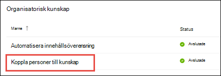

# Översikt över avsnitts Center (för hands version)Topic center overview (Preview)

> [!Note] 
> Innehållet i den här artikeln gäller för projekt cortex privat för hands version.The content in this article is for Project Cortex Private Preview. [Läs mer om Project Cortex](https://aka.ms/projectcortex).[Find out more about Project Cortex](https://aka.ms/projectcortex).

Ämnes Center är en modern SharePoint-webbplats som fungerar som en grupp kunskap för organisationen.The topic center is a Modern SharePoint site that serves as a center of knowledge for your organization. Det skapas vid [konfiguration av kunskaps hantering](set-up-knowledge-network.md) i administrations centret för Microsoft 365.It is created during [Knowledge Management setup](set-up-knowledge-network.md) in the Microsoft 365 admin center.

Ämnes Center har en standard start sida där du kan se avsnitten som du har anslutit till eller föreslog att de ska vara anslutna till.The topic center has a default home page where you can see the topics to which you have been connected or suggested to be connected. Användare med rätt behörighet kan också:Users with the proper permissions can also:

- Skapa en ny ämnes sidaCreate a new topic page
- Bekräfta eller avvisa föreslagna ämnenConfirm or reject suggested topics
- Redigera och publicera ändringar på en ämnes sidaEdit and publish changes to a topic page

> [!Note] 
> Du kan läsa mer om varje uppgift i [arbeta med ämnen i ämnes centret](work-with-topics.md).You can learn more about each task in [Work with topics in the topic center](work-with-topics.md).

## Var finns ämnes CenterWhere is the topic center

Ditt ämnes Center skapas under Inställningar för kunskaps hantering.Your topic center is created during Knowledge Management setup. När installationen är slutförd kan administratören hitta URL-adressen på [sidan hantering av kunskaps Center](manage-knowledge-network.md).After setup completes, an admin can find the URL on the [knowledge center management page](manage-knowledge-network.md).

1. I administrations centret för Microsoft 365 väljer du **Konfigurera** i navigerings fönstret och väljer **Anslut personer till kunskap** i avsnittet **organisationsinformation** .In the Microsoft 365 admin center, select **Setup** in the navigation pane, and in the **Organizational Knowledge** section, select **Connect people to knowledge**.

     

2. På sidan **Connect personer to knowledgeation** går du till avsnitts **Center adress** för webbplats-URL: **en** .On the **Connect people to knowledge** page, in the **At a glance** section, see **Topic center address** for the site URL.

## Start sidaHome page

Om du vill visa ämnes Center måste du ha behörighet att Visa ämnen och ämnena.To see the topic center, you need to have permissions to view topics and the topic experiences. Administratören kan tilldela dessa behörigheter till användare under [inställning av kunskaps hantering](set-up-knowledge-network.md), eller så kan nya användare [läggas till senare](give-user-permissions-to-the-topic-center.md) av en administratör via administrations centret för Microsoft 365.Your admin can assign these permissions to users during [knowledge management setup](set-up-knowledge-network.md), or new users can be [added afterwards](give-user-permissions-to-the-topic-center.md) by an admin through the Microsoft 365 admin center.

På Start SidanOn the home page 
- **Visa ämnen** : Visa avsnitts upplevelser.**View topics** : view topic experiences. Så att du kan se ämnen i organisationen och ge feedback om ämnen där du är ansluten:So you can see topics in the organization and give feedback on topics where you have been connected:
1. Föreslagna anslutningar-det här är avsnitt där anslutningen har föreslagitsSuggested connections - these are topics where my connection has been suggested
2. Bekräftade anslutningar – det här är avsnitt där jag fäster på ämnet eller när jag har bekräftat att mina anslutnings ämnen kommer att flyttas från det föreslagna avsnittet som är bekräftat när jag bekräftar en föreslagen anslutning.Confirmed connections - these are topics where I am pinned on the topic or I've confirmed my connection Topics will move from the suggested to confirmed section when I confirm a suggested connection.
När jag har fäst kan du redigera sidan för att granska min anslutning.Once I'm pinned, edits to the topic page can be done to curate my connection.

- **Skapa och redigera ämnen** : nytt ämne är tillgängligt och du kan redigera sidor**Create and edit topics** : New topic is available and you can edit pages

## Behörighet att använda ämnes Center för hantera ämnenPermissions to use the Manage Topics capability topic center

Om du vill arbeta i avsnittet hantera ämnen i ämnes Center måste du ha den behörighet som krävs.To work in the Manage Topics section of topic center, you need to have the required permissions. Administratören kan tilldela dessa behörigheter till användare under [inställning av kunskaps hantering](set-up-knowledge-network.md), eller så kan nya användare [läggas till senare](give-user-permissions-to-the-topic-center.md) av en administratör via administrations centret för Microsoft 365.Your admin can assign these permissions to users during [knowledge management setup](set-up-knowledge-network.md), or new users can be [added afterwards](give-user-permissions-to-the-topic-center.md) by an admin through the Microsoft 365 admin center.

Användare av ämnes Center kan få två uppsättningar behörigheter:Topic center users can be given two sets of permissions:

- **Hantera ämnen** : Använd instrument panelen ämne för att granska ämnen i hela organisationen.**Manage topics** : Use the topic dashboard to review topics across the organization. Användare kan utföra åtgärder som att bekräfta och avvisa obekräftade ämnen.Users can perform actions such as confirming and rejecting unconfirmed topics.

En användare kan få båda uppsättnings behörigheter eller bara en om det behövs.A user can be given both sets of permissions, or only one if needed. 

## Granska ämnen i ämnes instrument panelenReviewing topics in the topic dashboard

På instrument panelen ämne visas avsnitt som mined från dina angivna käll platser.The topic dashboard shows topics that were mined from your specified source locations. Varje ämne visar datumet som identifieras och om någon feedback har lämnats in.Each topic will show the date the topic was discovered and if any feedback has been provided on it. En användare som har tilldelats **Hantera avsnitts** behörigheter kan granska de obekräftade ämnena och välja att:A user who was assigned **Manage topics** permissions can review the unconfirmed topics and choose to:
- Bekräfta ämnet: markerar ämnet för användare som har åtkomst till och visar det associerade ämnes-och ämnes sidan.Confirm the topic: Highlights the topic to users who have access and lets them see the associated topic card and topic page.
- Avvisa ämnet: gör att avsnittet inte är tillgängligt för användarna.Reject the topic: Makes the topic not available to users. Avsnittet flyttas till fliken **avvisad** och kan bekräftas senare om det behövs.The topic is moved to the **Rejected** tab and can be confirmed later if needed.

## Skapa eller redigera ett ämneCreate or edit a topic

Om du har behörigheterna **skapa och redigera ämnen** kan du välja att:If you have **Create and edit topics** permissions, you can choose to:

- Redigera befintliga ämnen: du kan göra ändringar i befintliga ämnes sidor som skapats genom identifiering.Edit existing topics: You can make changes to existing topic pages that were created through discovery.
- Skapa nya ämnen: du kan skapa nya ämnen för dem som inte hittats via Upptäck, eller om AI-verktygen inte hittade tillräckligt många belägg för att skapa ett ämne.Create new topics: You can create new topics for ones that were not found through discovery, or if AI tools did not find enough evidence to create a topic.

## Se ävenSee also

  

