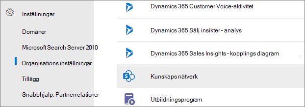
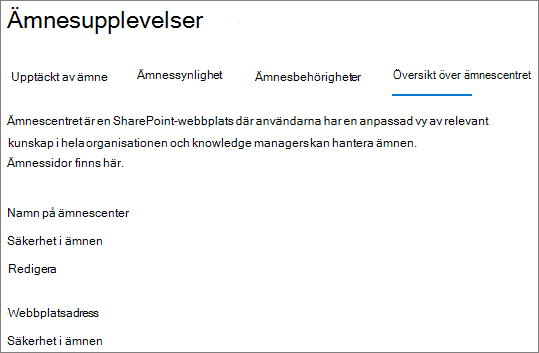
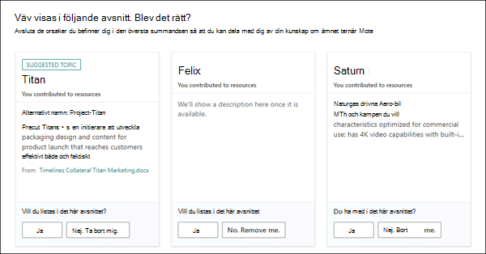
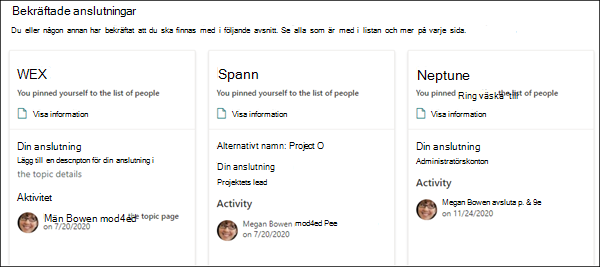

# Översikt över Ämnescenter i Microsoft Viva TopicsTopic center overview in Microsoft Viva Topics

I Microsoft Viva Topics är ämnescentret en modern SharePoint som fungerar som ett kunskapscenter för organisationen.In Microsoft Viva Topics, the topic center is a modern SharePoint site that serves as a center of knowledge for your organization. Den skapas under installationen [av Viva Topics](set-up-topic-experiences.md) i Administrationscenter för Microsoft 365.It's created during [Viva Topics setup](set-up-topic-experiences.md) in the Microsoft 365 admin center.

I ämnescentret finns en  standardhemsida med webbdelen Ämnen där alla licensierade användare kan se ämnen som de har en anslutning till.The topic center has a default home page with the **Topics** web part where all licensed users can see the topics to which they have a connection. 

Alla licensierade användare som kan visa ämnen har tillgång till ämnescentret, men knowledge managers kan också hantera ämnen via **sidan Hantera** ämnen.While all licensed users who can view topics will have access to the topic center, knowledge managers can also manage topics through the **Manage topics** page. Fliken **Hantera ämnen** visas bara för användare som har behörigheten Hantera ämnen.The **Manage topics** tab will only display to users who have the Manage topics permissions. 

## Var finns mitt ämnescenter?Where is my topic center

Ämnescentret skapas under installationen av Viva Topics.The topic center is created during Viva Topics setup. När installationen är klar kan administratören hitta URL-adressen på sidan [För hantering av ämnescenter.](./topic-experiences-administration.md#to-access-topics-management-settings)After setup completes, an admin can find the URL on the [Topic center management page](./topic-experiences-administration.md#to-access-topics-management-settings).

1. I Administrationscenter för Microsoft 365 väljer du **Inställningar** och sedan **Organisationsinställningar**.In the Microsoft 365 admin center, select **Settings**, and then select **Org settings**.
2. Välj **Ämnesupplevelser** på **fliken Tjänster.**On the **Services** tab, select **Topic Experiences**.

     

3. Välj fliken **Ämnescenter.** Under **Webbplatsadress** finns en länk till ämnescentret.Select the **Topic center** tab. Under **Site address** is a link to your topic center.

     

## StartsidaHome page

 

> [!VIDEO https://www.microsoft.com/videoplayer/embed/RE4LAhZ]  

 

På startsidan för ämnescentret kan du se de ämnen i organisationen som du har en anslutning till.On the topic center home page, you can see the topics in your organization to which you have a connection.

- Föreslagna anslutningar – Du ser ämnen listade under **Vi har listat dig om dessa ämnen. Blev det rätt?**Suggested connections - You will see topics listed under **We've listed you on these topics. Did we get it right?** Det här är ämnen där din koppling till ämnet har föreslagits via AI.These are topics in which your connection to the topic has been suggested through AI. Du kan till exempel vara författare till en relaterad fil eller webbplats.For example, you might be an author of a related file or site. Du uppmanas att bekräfta att du bör vara listad som en relaterad person för ämnet.You are asked to confirm that you should stay listed as a related person for the topic.

    
 
- Bekräftade anslutningar – Det här är ämnen där du är fäst på ämnessidan eller om du har bekräftat en föreslagen anslutning till avsnittet.Confirmed connections - These are topics in which you are pinned on the topic page or you've confirmed a suggested connection to the topic. Ämnen flyttas från det föreslagna avsnittet till bekräftad när du bekräftar en föreslagen anslutning.Topics will move from the suggested to confirmed section when you confirm a suggested connection.
 
    

När en användare bekräftar sin anslutning till ett ämne kan användaren göra ändringar på ämnessidan för att curate anslutningen.Once a user confirms their connection to a topic, the user can make edits to the topic page to curate their connection. De kan till exempel ge mer information om anslutningen till ämnet.For example, they can provide more information about their connection to the topic.

## Sidan Hantera ämnenManage topics page

För att kunna arbeta **med sidan** Hantera ämnen i ämnescentret måste du ha den behörighet för Hantera ämnen som krävs för knowledge manager-rollen.To work on the **Manage topics** page of topic center, you need to have the required Manage topics permissions needed for the knowledge manager role. Administratören kan tilldela de här behörigheterna till användare under  konfigurationen av [Viva Topics](set-up-topic-experiences.md), eller så kan nya användare läggas till efteråt av en administratör via Administrationscenter för Microsoft 365.Your admin can assign these permissions to users during [Viva Topics setup](set-up-topic-experiences.md), or new users can be [added afterwards](topic-experiences-knowledge-rules.md) by an admin through the Microsoft 365 admin center.

På sidan **Hantera ämnen** visar instrumentpanelen ämne alla ämnen, du har åtkomst till, som har identifierats från dina angivna källplatser.On the **Manage topics** page, the topic dashboard shows all the topics, you have access to, that were identified from your specified source locations. Varje ämne kommer att visa det datum då ämnet upptäcktes.Each topic will show the date the topic was discovered. En användare som har tilldelats behörigheten Hantera ämnen kan granska de ofirmerade ämnena och välja att:A user who was assigned Manage topics permissions can review the unconfirmed topics and choose to:

- Bekräfta ämnet: Anger för användare att ett AI-föreslaget ämne har validerats av en mänsklig man.Confirm the topic: Indicates to users that an AI-suggested topic has been validated by a human curator.

- Publicera ämnet: Redigera ämnesinformationen för att förbättra kvaliteten på det ämne som ursprungligen identifierades och markerar avsnittet för alla användare som har åtkomst till ämnen.Publish the topic: Edit the topic information to improve the quality of the topic that was initially identified, and highlights the topic to all users who have view access to topics.
 
- Ta bort ämnet: Gör att ämnet inte kan upptäckts för slutanvändare.Remove the topic: Makes the topic undiscoverable to end users. Avsnittet flyttas till fliken **Borttaget** och kan bekräftas senare om det behövs.The topic is moved to the **Removed** tab and can be confirmed later if needed. 

Mer information om hur du hanterar ämnen på sidan **Hantera ämnen** finns i [Hantera ämnen.](manage-topics.md)For more information about how to manage topics on the **Manage topics** page, see [Manage topics](manage-topics.md).

## Skapa eller redigera ett ämneCreate or edit a topic

Om du har behörigheten Skapa och redigera ämnen kan du:If you have Create and edit topics permissions, you can:

- [Redigera befintliga ämnen:](edit-a-topic.md)Du kan göra ändringar i befintliga ämnessidor som skapats genom identifiering.[Edit existing topics](edit-a-topic.md): You can make changes to existing topic pages that were created through discovery.

- [Skapa nya ämnen:](create-a-topic.md)Du kan skapa nya ämnen för ämnen som inte hittades genom upptäckten eller om AI-verktygen inte hittade tillräckligt många bevis för att skapa ett ämne.[Create new topics](create-a-topic.md): You can create new topics for ones that were not found through discovery, or if AI tools did not find enough evidence to create a topic.

## Se ävenSee also

[Hantera ämnen i ämnes centretManage topics in the topic center](manage-topics.md)

