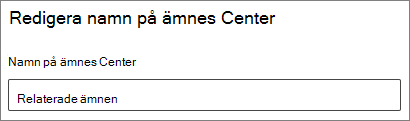

# Ändra namnet på ämnes centret i Microsoft 365

Du kan ändra namnet på ditt ämnes Center i [administrations centret för Microsoft 365](https://admin.microsoft.com). Du måste vara global administratör eller SharePoint-administratör för att utföra dessa uppgifter.

## Så här öppnar du inställningar för hantering av ämnen:

1. I administrations centret för Microsoft 365 klickar du på **Inställningar** och sedan på **org Settings**.
2. Klicka på **kunskaps nätverk** på fliken **tjänster** .

     

3. Välj fliken för **avsnitts Center** . I följande avsnitt finns information om de olika inställningarna.

     

##  Uppdatera namnet på ämnes Center

Så här ändrar du namnet på ämnes Center

1. Välj **Redigera** under **ämnes Center namn** på fliken **ämnes Center** .
2. Skriv det nya namnet på ämnes centret i rutan **namn** på sidan **Redigera ämnes Center namn** .
3. Välj **Spara**

      

## Se även

[Hantera identifiering av avsnitt i Microsoft 365](topic-experiences-discovery.md)

[Hantera ämnets synlighet i Microsoft 365](topic-experiences-knowledge-rules.md)

[Hantera behörigheter för ämne i Microsoft 365](topic-experiences-user-permissions.md)
