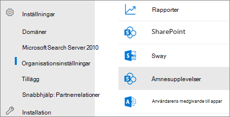

# Ändra namnet på ämnescentret i Microsoft Viva-ämnen

Du kan ändra namnet på ämnescentret i administrationscentret för [Microsoft 365.](https://admin.microsoft.com) Du måste vara global administratör eller SharePoint-administratör för att kunna utföra de här uppgifterna.

## Så här kommer du åt inställningar för hantering av ämnen:

1. Klicka på Inställningar och sedan Organisationsinställningar i **administrationscentret** **för** Microsoft 365.
2. Klicka på **Ämnesupplevelser** på **fliken Tjänster.**

     

3. Välj fliken **Ämnescenter.** I följande avsnitt finns information om de olika inställningarna.

     

##  Uppdatera ämnescenternamnet

Så här byter du namn på ämnescentret

1. Välj Redigera **under Ämnescenter** **på fliken Ämnescenter.** 
2. På **namnsidan för Redigera ämnescenter** skriver **du** det nya namnet på ämnescentret i namnrutan Ämnescenter.
3. Välj **Spara**

      

## Se även

[Hantera identifiering av ämnen i Microsoft Viva-ämnen](topic-experiences-discovery.md)

[Hantera synlighet för ämnen i Microsoft Viva-ämnen](topic-experiences-knowledge-rules.md)

[Hantera ämnesbehörigheter i Microsoft Viva-ämnen](topic-experiences-user-permissions.md)
