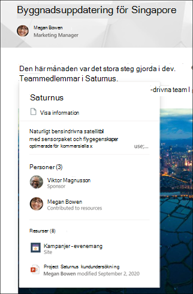

# Identifiering och säkring av Microsoft Viva-ämnenMicrosoft Viva Topics discovery and curation 

Viva Ämnen ordnar information till kunskap i din Microsoft 365 miljö.Viva Topics organizes information to knowledge in your Microsoft 365 environment. Vi har all erfarenhet av att läsa igenom dokument och webbplatssidor där vi stöter på termer som vi inte är vana vid.We've all experienced reading through documents and site pages where we encounter terms we are unfamiliar with. Många gånger stannar vi vad vi gör för att ägna tid åt att söka efter mer information.Many times we stop what we are doing to spend precious time searching for more information.

Viva Topics använder Microsoft Graph och AI för att identifiera **ämnen** i organisationen.Viva Topics uses Microsoft Graph and AI to identify **topics** in your organization.  Ett ämne är en fras eller term som har en särskild betydelse för organisationen och har relaterade resurser som kan hjälpa andra att förstå vad det är och hitta mer information om det.A topic is a phrase or term that has a specific meaning to the organization, and has resources related to it that can help people understand what it is and find more information about it. Det finns många olika typer av ämnen som är viktiga för din organisation.There are lots of different types of topics that will be important to your organization. Till en början kan du identifiera följande typer av ämnen:Initially, the following types of topics can be identified:
- ProjectProject
- HändelseEvent
- OrganisationOrganization
- PlatsLocation
- ProduktProduct
- Kreativt arbeteCreative work
- StudiefältField of study

AI identifierar personer och innehåll som är kopplat till ämnet, och om tillräckligt många upptäcks blir det ett föreslaget ämne.AI identifies people and content connected to the topic, and if enough is discovered, it becomes a suggested topic. Du identifierar följande egenskaper och visar dem på en **ämnessida:**It looks to identify the following properties and display them on a **Topic page**:
- Alternativa namn och/eller förkortningar.Alternate names and/or acronyms.
- En kort beskrivning om ämnet.A short description of the topic.
- Personer som kan vara kunniga om ämnet.People who might be knowledgeable about the topic.
- Filer, sidor och webbplatser som är relaterade till ämnet.Files, pages, and sites that are related to the topic.

Egenskaperna identifieras från filerna och sidorna som är en del av bevisen för att identifiera ämnet.The properties are identified from the files and pages that are part of the evidence for identifying the topic. Alternativa namn och förkortningar kommer från dessa filer och sidor.Alternate names and acronyms are sourced from these files and pages. Den korta beskrivningen kommer från dessa filer och sidor, eller från Internet via Wikipedia.The short description is sourced from these files and pages, or from the internet through Wikipedia. Källfilen, sidan eller Wikipedia-artikeln refereras tillsammans med de föreslagna egenskaperna.The source file, page, or Wikipedia article is referenced alongside the suggested properties. Personer föreslås utifrån deras aktiva bidrag (till exempel redigeringar) i filerna och sidorna.People are suggested based on their active contributions (for example, edits) to the files and pages. En referens till beloppet för en viss person ger en ledtråd till varför personen har identifierats.A reference to the amount of contributions from a particular person provides a hint as to why the person has been identified. Filer, sidor och webbplatser rangordnas utifrån om de är centrala för ämnet, oavsett om de kan ge en översikt eller introduktion till ämnet.Files, pages, and sites are ranked based on whether they are central to the topic, whether they can give an overview or introduction to the topic. 

Det är inte alla ämnen som du bör ha nytta av i din organisation.Not every identified topic will be useful to your organization. Den kanske inte har identifierat något av rätt alternativa namn, beskrivningar, lämpliga personer eller innehåll.It may not have identified any of the correct alternate names, descriptions, the appropriate people, or content. Möjligheten att lägga till ämnen som inte har identifierats, hålla föreslagna ämnen och särskilt viktiga för att förbättra kvaliteten på ämnen som kan upptäckas i organisationen.So the ability to add topics that aren't identified, keep suggested topics, and curate topics is critical to improving the quality of the topics that are discoverable in your organization.

När kontexten är lämplig föreslår Viva Ämnen att följande ämnen markeras på alla SharePoint webbplatssidor i klientorganisationen.Viva Topics then, when the context is appropriate, will suggest these topics to be highlighted on all SharePoint modern site pages in your tenant. En sidförfattare kan också referera direkt till avsnittet SharePoint webbplatsens moderna sida.The topic can also be directly referenced on the SharePoint modern site page by a page author. När en användare är nyfiken på att få mer information om  ett ämne kan de välja det markerade avsnittet för att visa ett kort med en kort ämnessammanfattning som ger en kort beskrivning.When a user is curious to learn more about a topic, they can select the highlighted topic to view a **Topic summary** card that provides a short description. Och om de vill veta mer kan de välja länken **Ämnesinformation** i sammanfattningen för att öppna sidan med detaljerad information.And if they want to learn more, they can select a **Topic details** link in the summary to open the detailed topic page.

  

Dessutom kan användare hitta ämnen via Microsoft Search.Additionally, users will also be able to find topics through Microsoft Search.

## Ämnes curation och feedbackTopic curation and feedback

Viva Topics tar gärna del av en person som vill förbättra kvaliteten på dina ämnen.Viva Topics welcomes human contribution to improve the quality of your topics. Även om AI först identifierar och föreslår ämnen är det manuellt gjorda redigeringar av innehåll från deltagare, manuellt tillagda ämnen, bekräftelse från användare av AI-upptäckta egenskaper och innehåll och feedback på användbara ämnen allt viktigt.While AI initially identifies and suggests topics, manually made edits to content from contributors, manually added topics, confirmation from users for AI discovered properties and content, and feedback on the usefulness of topics are all essential.

- Ämnen kan granskas av **kunskapschefer** i organisationen.Topics can be reviewed by **knowledge managers** in your organization. Knowledge Manager kan granska ämnen som de har behörighet att se.The knowledge manager can review topics that they have permissions to see. På sidan Hantera ämnen i ämnescentret kan de välja att bekräfta AI-genererade ämnen (&quot;föreslagna ämnen") som giltiga, avvisa ämnen för att förhindra att innehållet visas som ett ämne, skapa ämnen som inte identifierats av AI eller identifiera ämnen som kan dra nytta av några redigeringar av ämnesexperter för att vara mer användbara eller korrekta.In the Manage Topics page in the Topic Center, they can choose to confirm AI-generated topics ("suggested topics") as valid, reject topics to prevent the content from being viewed as a topic, create topics that were not discovered by AI, or identify topics that could benefit from a few edits by subject matter experts to be more helpful or accurate. Mer information finns i [Hantera ämnen i Ämnescenter.](manage-topics.md)For more information, see [Manage topics in the Topic center](manage-topics.md).

- Du kan tilldela *behörigheten Skapa och* redigera ämnen till en av dina licensierade användare så att de kan göra ändringar i befintliga ämnen eller skapa nya ämnen.You can assign *Create and edit topics* permissions to any of your licensed users so that they can make changes to existing topics or create new topics. På så sätt kan användare med kunskap om avsnittet uppdatera ämnessidan direkt för att göra korrigeringar eller lägga till ytterligare information.This allows users that are knowledgeable about the topic to update the topic page directly to make corrections or add additional information. De kan också lägga till nya ämnen som AI inte kunde identifiera.They can also add new topics that AI wasn't able to identify. Om det finns tillräckligt med information om dessa manuellt tillagda ämnen, och AI kan identifiera den här typen av ämne, kan ytterligare förslag från AI förbättra dessa manuellt tillagda ämnen.If there is enough information on these manually added topics, and AI is able to identify this type of topic, additional suggestions from AI may enhance these manually added topics. Människor och AI kan hålla kunskap rätt med tiden och inte ha den här på en person.Together, humans and AI can keep knowledge accurate over time and not have this rest on a single person. Mer information finns i [Skapa ett nytt ämne](./create-a-topic.md) och Redigera ett [ämne.](./edit-a-topic.md)For more information, see [Create a new topic](./create-a-topic.md) and [Edit a topic](./edit-a-topic.md).

- Även användare som bara har läsbehörighet till ämne (ämnes läsare) kommer att uppmanas att kontrollera hur användbara vissa ämnen är.Even users who only have read access to topic (topic viewers) will be asked to verify the usefulness of specific topics. Feedbackfrågor ställs på kortet **Ämnessammanfattning** för att förbättra värdet på ämnet och dess information.Feedback questions are asked on the **Topic summary** card to improve the value of the topic and its information. Frågor om kvaliteten och användbarheten för AI-förslagen presenteras för användarna ett i taget.Questions about the quality and usefulness of the AI suggestions are presented to users one at a time. Frågor som ingår:Questions include: 

    1. Att kunna identifiera ämnet på SharePoint var användbart.Whether identifying the topic in the SharePoint page was helpful. Det finns en möjlighet att ta bort markeringen om den inte är korrekt eller användbar.There's an opportunity to remove the highlight if it's not accurate or helpful. Om tillräckligt många personer anger att ett ämne inte identifieras korrekt på en viss sida kommer den här markeringen så småningom att tas bort för alla användare.If enough people indicate that a topic is not correctly identified on a particular page, this highlight will eventually be removed for all users. 

    2. Om det föreslagna ämnet är värdefullt för organisationen.Whether the suggested topic is valuable to the organization. Om tillräckligt många personer anger att det föreslagna ämnet är värdefullt bekräftas ämnet automatiskt.If enough people indicate that the suggested topic is valuable, the topic is automatically confirmed. Om det föreslagna ämnet inte är värdefullt avvisas ämnet automatiskt.Alternatively, if the suggested topic is not valuable, the topic is automatically rejected. Knowledge Manager kan observera den här aktiviteten i vyn Hantera ämnen.The Knowledge Manager can observe this activity in the Manage Topics view.

    3. Om personer och resursförslag är användbara.Whether the people and resource suggestions are helpful.

    4. På startsidan för Ämnescenter kan du se de ämnen i organisationen som du har en anslutning till.On the Topic Center home page, you can see the topics in your organization to which you have a connection. Du kan välja att själv stanna kvar i ämnet eller ta bort dig själv.You can choose to remain listed on the topic or remove yourself. Den här feedbacken återspeglas för alla som upptäcker det här avsnittet.This feedback is reflected to everyone who discovers this topic. Se [Översikt över ämnescenter](./topic-center-overview.md) för mer information på startsidan för ämnescentret.See [Topic center overview](./topic-center-overview.md) for more details on the topic center home page.

Även om människor redigerar söker AI kontinuerligt efter mer information om ämnen och söker efter mänsklig verifiering.Even with human edits, AI will continually look for more information about topics, and will look for human verification. Om AI till exempel tror att du är en person som ska finnas med som expert på ett ämne, kommer den att be dig att bekräfta detta.For example, if AI thinks you are a person that should be listed as an expert on a topic, it will ask you to confirm this. 

## Se ävenSee also