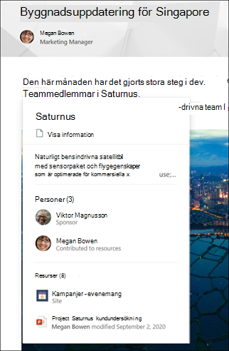

# Ämnen Upptäck och granska (för hands version)Topic Experiences discovery and curation (Preview)

> [!Note] 
> Innehållet i den här artikeln gäller för projekt cortex privat för hands version.The content in this article is for Project Cortex Private Preview. [Läs mer om Project Cortex](https://aka.ms/projectcortex).[Find out more about Project Cortex](https://aka.ms/projectcortex).

Avsnitts upplevelser konverterar kunskaps information till kunskap i din Microsoft 365-miljö.Topic Experiences converts knowledge information to knowledge in your Microsoft 365 environment. Vi har allt Läs igenom dokument och webbplats sidor där vi inte känner till termer.We've all experienced reading through documents and site pages where we encounter terms we are unfamiliar with. Många gånger vi håller på att avbryta det vi gör för att göra en genom gång av mer information.Many times we stop what we are doing to spend precious time searching for more information.

Vilka ämnes upplevelser använder Microsoft Graph och AI för att identifiera **ämnen** i din organisation.What Topic Experiences does is use Microsoft Graph and AI to identify **topics** in your organization.  Ett ämne är en fras eller en term som har en specifik betydelse för en organisation, där användare skulle vilja ha nytta av att visa en wiki-sida om den.A topic is a phrase or term that has a specific meaning to an organization, where users would benefit by being able to view a wiki page about it. AI söker efter personer och innehåll som är anslutna till ämnet, och om det upptäcks blir det ett förslag till ämne.AI searches for people and content connected to the topic, and if enough it discovered, it becomes a suggested topic.

Informationen om AI-genererat ämne läggs till på en **ämnes sida**, som kan innehålla:The AI generated topic information is added to a **Topic page**, which can contain:
- En kort beskrivning av ämnet.A short description of the topic.
- Alternativa namn för ämnet.Alternate names for the topic.
- Personer som kan veta mer om ämnet.People who might know more about the topic.
- Webbplatser, filer och sidor som kan vara relaterade till ämnet.Sites, files, and pages that might be related to the topic.

Avsnitts upplevelser ser då till att alla förekomster av ett avsnitt är markerade på alla SharePoint-moderna webbplats sidor i klient organisationen.Topic experiences then makes sure that every instance of a topic is highlighted on all SharePoint modern site pages in your tenant. När en användare är nyfiken på mer information om ett ämne kan de välja det markerade avsnittet för att visa ett **sammanfattnings** kort för ämne med en kort beskrivning.When a user is curious to learn more about a topic, they can select the highlighted topic to view a **Topic summary** card that provides a short description. Och om de vill lära sig mer kan de välja en länk för **ämnes information** i sammanfattningen för att öppna sidan detaljerad avsnitt.And if they want to learn more, they can select a **Topic details** link in the summary to open the detailed topic page.

  

Dessutom kan användarna Hitta ämnen via Microsoft Search.Additionally, users will also be able to find topics through Microsoft Search.

## Ämnes underavsnittTopic curation

Ämnen som går vidare med "beslagning" för att förbättra kvaliteten på dina ämnen.Topic Experiences welcomes human "curation" to improve the quality of your topics. Även om AI från början identifierar och föreslår ämnen, manuellt gjorda uppdateringar av innehåll från deltagare, bekräftelse från användare för AI-genererat innehåll och feedback om användbarheten av ämnena är allt som behövs.While AI initially identifies and suggests topics, manually made updates to content from contributors, confirmation from users for AI generated content, and feedback on the usefulness of topics are all essential.

- AI-genererade ämnen ("föreslagna ämnen") kan granskas av **kunskaps cheferna** i din organisation.AI generated topics ("suggested topics") can be reviewed by **knowledge managers** in your organization. På sidan Hantera ämnen i ämnes Center kan de välja att bekräfta att de är giltiga eller avvisa dem för att förhindra att de visas.In the Manage Topics page in the Topic Center, they can choose to confirm them as valid, or reject them to prevent them from being viewed.

- Du kan tilldela behörigheter för att *skapa och redigera ämnen* till alla dina licensierade användare så att de kan göra ändringar i befintliga ämnen eller skapa nya ämnen när de behövs.You can assign *Create and edit topics* permissions to any of your licensed users so that they can make changes to existing topics or create new topics when needed. 

- Även användare som bara har Läs åtkomst till ämne (ämnes visnings program) ombeds att bekräfta att vissa ämnen är användbara.Even users who only have read access to topic (topic viewers) will be asked to verify the usefulness of specific topics.

Även med mänsklig granskning letar AI efter mer information om ämnen och söker efter mänsklig verifiering.Even with human curation, AI will continually look for more information about topics, and will look for human verification. Om t ex AI tror att du är en person som ska fästas som expert på ett ämne ber vi dig bekräfta detta.For example, if AI thinks you are a person that should be pinned as an expert on a topic, it will ask you to confirm this. 

## Se ävenSee also

  

