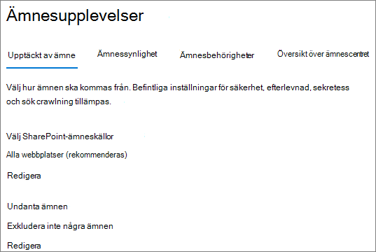
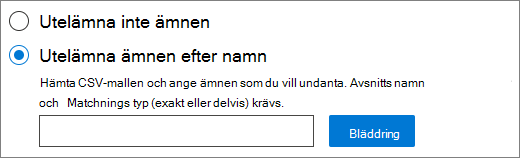

# <a name="manage-topic-discovery-in-microsoft-viva-topics"></a>Hantera identifiering av ämnen i Microsoft Viva-ämnen

Du kan hantera inställningar för identifiering av ämnen i [administrationscentret för Microsoft 365.](https://admin.microsoft.com) Du måste vara global administratör eller SharePoint-administratör för att utföra de här uppgifterna.

## <a name="to-access-topics-management-settings"></a>Så här kommer du åt inställningar för hantering av ämnen:

1. I administrationscentret för Microsoft 365 klickar du på **Inställningar** och sedan **på Organisationsinställningar**.
2. Klicka på **Ämnesupplevelser** på **fliken Tjänster.**

     

3. Välj fliken **Ämnesidentifiering.** I följande avsnitt finns information om de olika inställningarna.

     

## <a name="select-sharepoint-topic-sources"></a>Välj SharePoint-ämneskällor

Du kan ändra vilka SharePoint-webbplatser i organisationen som ska crawlas för ämnen.

Om du vill ta med eller utesluta en viss lista över webbplatser kan du använda följande CSV-mall:

``` csv
Site name,URL
```

Om du lägger till webbplatser med hjälp av webbplatsväljaren läggs de till i den befintliga listan över webbplatser som ska inkluderas eller exkluderas. Om du laddar upp en CSV-fil skriver den över alla befintliga listor. Om du tidigare har lagt till eller uteslutit specifika webbplatser kan du ladda ned listan som en CSV-fil, göra ändringar och ladda upp den nya listan.

Välja webbplatser för att hitta ämnen

1. På fliken **Ämnesidentifiering** under **Välj SharePoint-ämneskällor** väljer du **Redigera**.
2. På sidan **Välj SharePoint-ämneskällor** väljer du vilka SharePoint-webbplatser som ska crawlas som källor för ämnen under identifieringen. Det omfattar:
    - **Alla webbplatser**: Alla SharePoint-webbplatser i klientorganisationen. Då fångar vi aktuella och framtida webbplatser.
    - **Alla, förutom valda webbplatser:** Skriv namnen på de webbplatser som du vill utesluta.  Du kan också ladda upp en lista över webbplatser som du vill avanmäla från identifiering. Webbplatser som skapas i framtiden kommer att ingå som källor för upptäckt av ämnen. 
    - **Endast valda webbplatser**: Skriv namnen på de webbplatser som du vill ska ingå. Du kan också ladda upp en lista med webbplatser. Webbplatser som skapas i framtiden inkluderas inte som källor för ämnesidentifiering.
    - **Inga webbplatser:** Ämnen genereras eller uppdateras inte automatiskt med SharePoint-innehåll. Befintliga ämnen finns kvar i ämnescentret.

    
   
3. Klicka på **Spara**.

## <a name="exclude-topics-by-name"></a>Utesluta ämnen efter namn

Du kan utesluta ämnen från identifiering genom att ladda upp en lista med en CSV-fil. Om du tidigare har uteslutit ämnen kan du ladda ned CSV-filen, göra ändringar och ladda upp den igen.

1. På fliken **Ämnesidentifiering** under **Exkludera ämnen** väljer du **Redigera.**
2. Klicka **på Exkludera ämnen efter namn.**
3. Om du behöver skapa en lista laddar du ned CSV-mallen och lägger till de ämnen som du inte vill ska vara med (se Arbeta med *CSV-mallen* nedan). När filen är klar klickar du på **Bläddra** och laddar upp filen. Om det finns en befintlig lista kan du ladda ned CSV-filen som innehåller listan.
4. Klicka på **Spara**.

    

### <a name="working-with-the-csv-template"></a>Arbeta med CSV-mallen

Du kan kopiera CSV-mallen nedan:

``` csv
Name (required),Expansion,MatchType- Exact/Partial (required)
```

I CSV-mallen anger du följande information om de ämnen som du inte vill ska ingå:

- **Namn**: Skriv namnet på det ämne som du vill utesluta. Du kan göra det på två sätt:
    - Exakt matchning: Du kan utesluta det exakta namnet eller förkortningen (till exempel *Contoso* eller *ATL*).
    - Delvis matchning: Du kan utesluta alla avsnitt som innehåller ett visst ord.  En båge *utesluter* till exempel  alla ämnen som innehåller ordet båge, t.ex. arcuscirkel,  *Arcus* arcus- eller *utbildningsbåge.* Observera att den inte exkluderar ämnen där texten ingår i ett ord, till exempel *Arkitektur.*
- **Står för (valfritt)**: Om du vill utesluta en förkortning skriver du orden förkortningen står för.
- **MatchType-Exact/Partial**: Ange om namnet du angav var en *exakt eller* *delvis* matchningstyp.

     

## <a name="see-also"></a>Se även

[Hantera synlighet för ämnen i Microsoft 365](topic-experiences-knowledge-rules.md)

[Hantera ämnesbehörigheter i Microsoft 365](topic-experiences-user-permissions.md)

[Ändra namn på ämnescentret i Microsoft 365](topic-experiences-administration.md)
