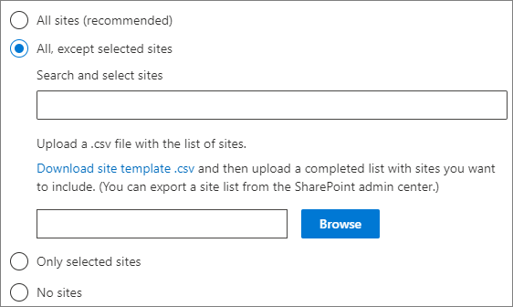

# <a name="manage-topic-discovery-in-microsoft-365"></a>Hantera identifiering av avsnitt i Microsoft 365

Du kan hantera identifierings inställningar för avsnitt i [administrations centret för Microsoft 365](https://admin.microsoft.com). Du måste vara global administratör eller SharePoint-administratör för att utföra dessa uppgifter.

## <a name="to-access-topics-management-settings"></a>Så här öppnar du inställningar för hantering av ämnen:

1. I administrations centret för Microsoft 365 klickar du på **Inställningar** och sedan på **org Settings**.
2. Klicka på **kunskaps nätverk** på fliken **tjänster** .

     

3. Välj fliken **identifiering av ämne** . I följande avsnitt finns information om de olika inställningarna.

     

## <a name="select-sharepoint-topic-sources"></a>Välj SharePoint-rubriker

Du kan ändra de SharePoint-webbplatser i din organisation som ska crawlas för avsnitt.

Om du vill ta med eller utesluta en viss lista med webbplatser kan du använda följande. csv-mall:

``` csv
Site name,URL
```

Om du lägger till webbplatser med webbplats väljaren läggs de till i den befintliga listan över webbplatser som ska inkluderas eller exkluderas. Om du laddar upp en CSV-fil skrivs en befintlig lista över. Om du tidigare har inkluderat eller uteslutit vissa webbplatser kan du hämta listan som en CSV-fil, göra ändringar och ladda upp den nya listan.

Välja webbplatser för identifiering av ämnen

1. På fliken **identifiering** , under **Välj SharePoint-ämnes källor**, väljer du **Redigera**.
2. På sidan **Select SharePoint topic sources** väljer du vilka SharePoint-webbplatser som ska crawlas som källor för dina ämnen under identifiering. Detta inkluderar:
    - **Alla webbplatser**: alla SharePoint-webbplatser i din klient organisation. Här fångar du aktuella och framtida webbplatser.
    - **Alla, förutom markerade webbplatser**: Skriv namnen på de webbplatser du vill undanta.  Du kan också ladda upp en lista med webbplatser som du inte vill ska ingå i sökningen. Webbplatser som skapats i framtiden kommer att inkluderas som källor för avsnitts identifiering. 
    - **Endast valda webbplatser**: Skriv in namnen på de webbplatser du vill ta med. Du kan också ladda upp en lista med webbplatser. Webbplatser som skapats i framtiden kommer inte att ingå som källor för identifiering av ämnen.
    - **Inga webbplatser**: ämnen skapas eller uppdateras inte automatiskt med SharePoint-innehåll. Befintliga avsnitt finns kvar i ämnes centret.

    
   
3. Klicka på **Spara**.

## <a name="exclude-topics-by-name"></a>Utelämna ämnen efter namn

Du kan utesluta ämnen från Upptäck genom att överföra en lista med en CSV-fil. Om du tidigare har uteslutit ämnen kan du ladda ned. csv, göra ändringar och ladda upp den igen.

1. På fliken **identifiering** , under **utelämna ämnen**, väljer du **Redigera**.
2. Klicka på **utelämna ämnen efter namn**.
3. Om du behöver skapa en lista kan du Hämta CSV-mallen och lägga till ämnen som du vill undanta (se *arbeta med CSV-mallen* nedan). När filen är klar klickar du på **Bläddra** och laddar upp filen. Om det finns en befintlig lista kan du Hämta CSV-filen som innehåller listan.
4. Klicka på **Spara**.

    

### <a name="working-with-the-csv-template"></a>Arbeta med CSV-mallen

Du kan kopiera CSV-mallen nedan:

``` csv
Name (required),Expansion,MatchType- Exact/Partial (required)
```

I CSV-mallen anger du följande information om de avsnitt som du vill undanta:

- **Namn**: Skriv namnet på det ämne som du vill undanta. Du kan göra det på två sätt:
    - Exakt träff: du kan ange exakt namn eller akronym (till exempel *contoso* eller *ATL*).
    - Ofullständig matchning: du kan exkludera alla ämnen som har ett visst ord i det.  Till exempel kommer *bågen* att exkludera alla ämnen med ord *båge* i det, till exempel *båge cirkel*, *plasma båge svets* eller *tränings båge*. Observera att den inte utesluter ämnen där texten är inkluderad som en del av ett ord, till exempel *arkitekturen*.
- **Står för (valfritt)**: om du vill utesluta en akronym skriver du orden som förkortningen står för.
- **MatchType-exakt/delvis**: Skriv om det namn du angav är en *exakt* eller *delvis* matchnings typ.

     

## <a name="see-also"></a>Se även

[Hantera ämnets synlighet i Microsoft 365](topic-experiences-knowledge-rules.md)

[Hantera behörigheter för ämne i Microsoft 365](topic-experiences-user-permissions.md)

[Ändra namnet på ämnes centret i Microsoft 365](topic-experiences-administration.md)

