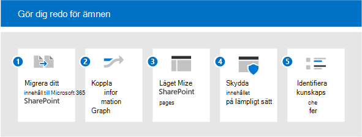

# Få din miljö klar för Microsoft Viva Ämnen

För att få ut mesta möjliga av Viva-ämnen vill du ha med så mycket innehåll som möjligt för att kunna upptäcka ämnen, så att du kan ha en omfattande uppsättning ämnen för användarna. Men vilket innehåll ska användas för identifiering av ämnen? Hur maximerar du innehållet som indexeras och håller kontrollen över det? Ju mer innehåll som omfattas, desto bättre kan insikterna som artificiell intelligens kan upptäcka. I den här artikeln får du hjälp med planeringen för att se till att du tar med rätt innehåll och att du har rätt personer och resurser för att göra en bra upplevelse för användarna.

För att planera för Viva Topics behöver du:

1. [Migrera innehåll till SharePoint](#1-migrate-content-to-microsoft-365)
    - Ämnesindexeringen omfattar endast innehåll på SharePoint-webbplatser.
      - Migrera om möjligt värdefullt innehåll till SharePoint Online från externa källor.
      - Prioritera innehållskällor med hög potential för tacit-kunskap.
      - Markera fördelarna med hantering av kunskap för att uppmuntra användarna att flytta innehåll från OneDrive till SharePoint-webbplatser.

2. [Koppla information till Microsoft Graph](#2-connect-information-to-microsoft-graph)
    - I framtiden kan externt innehåll läggas till i kunskapsdiagrammet och bli tillgängligt.
    - Om du vill flytta innehåll som inte kan flyttas kan du använda Graph Connectors för att förbättra sökningen och förbereda för framtida inkludering.

3. [Modernisera SharePoint-sidor](#3-modernize-sharepoint-pages)
    - Ämneskort kan endast användas på moderna sidor.
    - Identifiera klassiska sidor med hög profil som går att modernisera.

4. [Skydda innehåll på rätt sätt](#4-secure-content-appropriately)
    - Ämnesresurser säkerhets trimas baserat på en användares behörigheter.
    - Identifiera innehåll som kan ha felaktigt omfattande eller restriktiva behörigheter:
      - Uppmuntra webbplatsägare att använda delningsrapporterna för att granska behörigheter
      - Få administratörer att granska brett delat innehåll med hjälp av Sökning
      - Uppmuntra innehållsägare att dela innehåll som inte är känsligt och som kan vara till bredare fördelar för organisationen.
    - Granska Microsoft Graph-konfigurationen för användare och innehåll:
      - Konfiguration av ämnesindexering med undantag för innehåll från Sök eller Delve (till exempel NOINDEX). Kontrollera om de här konfigurationerna fortfarande är relevanta.

5. [Identifiera kunskapschefer och ämnen](#5-identify-knowledge-managers-and-topics)
    - Använd befintliga taxonomier för att skapa ämnen manuellt, eller hjälp med att bekräfta AI-föreslagna ämnen.
    - Identifiera ämnesexperter (SS) för förväntade eller idelade ämnen.
    - Identifiera webbplatser som täcker en stor mängd värdefulla data som kan användas för att pilottesta näring inom olika ämnesområden.
    - Engagera Knowledge Managers och communities.

## 1. Migrera innehåll till Microsoft 365

Det finns flera verktyg och tjänster som hjälper dig med migreringen – du kan få en översikt och information om hur du migrerar i Migrera ditt innehåll till [Microsoft 365.](/sharepointmigration/migrate-to-sharepoint-online) Migreringsverktygen omfattar:

- [Migreringshanteraren](/sharepointmigration/mm-get-started)
- [Migreringsverktyget för SharePoint (SPMT)](/sharepointmigration/introducing-the-sharepoint-migration-tool)
- [Microsoft 365 FastTrack](https://www.microsoft.com/fasttrack/microsoft-365)
- [Verktyg och tjänster för partnermigrering](https://www.microsoft.com/solution-providers)

Få ut det mesta av migreringen:

- Migrera till en modern webbplats – som innehåller Microsoft Teams. Indexeringen kan ske på alla SharePoint-webbplatser (klassiska eller moderna), och ämnen som visas för användare med markeringar och kort händer bara på moderna sidor.
- Behåll användarnamn – de flesta migreringsverktyg låter dig mappa användaridentiteter under migreringen, så att egenskaper som Skapad av eller Ändrad av bibehålls efter migreringen. Det här är viktigt för ämnen eftersom redigering av filer används för att identifiera de experter som läggs till på en ämnessida eller ett kort. 
- Ange beskrivande namn på tjänstkontot – I vissa fall går det inte att underhålla användarnamn. Till exempel om du migrerar innehåll som har skapats av någon som inte längre är anställd i organisationen. I den här instansen flyttar de flesta migreringsverktyg en fil som om den skapades av ett administratörskonto eller ett tjänstkonto. Om detta inträffar ofta kan det tjänstkontot sedan listas mot ämnen som en expert. Det är här namnet på kontot blir mycket viktigt. Om du ger den en beskrivande beskrivning blir förekomsten av dessa icke-mänskliga konton lättförståelig genom användarnas användning av ämnen.

## 2. Koppla information till Microsoft Graph

Om du inte kan migrera visst innehåll kan du ansluta det till Microsoft Graph:

- Överväg att [implementera Graph Content Connectors](/microsoftsearch/connectors-overview). Med hjälp av kopplingar kan externt innehåll indexeras i Microsoft Graph, där användare sedan kan hitta det via Microsoft Search.
- Framtida utvecklingar kommer att hämta externa data till Viva Topics.

## 3. Modernisera SharePoint-sidor

Eftersom ämneskort och höjdpunkter bara kan visas på moderna sidor uppdaterar du alla sidor som du vill ska ingå i Viva Ämnen från klassisk till modern. Se [Modernisera dina klassiska SharePoint-webbplatser](/sharepoint/dev/transform/modernize-classic-sites). Du kan använda [SharePoint Modernization-skannern](/sharepoint/dev/transform/modernize-scanner) för att förbereda dina klassiska webbplatser för modernisering.

Om du har många klassiska webbplatser bör du prioritera profilsidor som ska konverteras till moderna.

## 4. Skydda innehåll på rätt sätt

När användare interagerar med ett ämneskort eller en ämnessida kan de se olika resurser. Det beror på att de har åtkomst till olika filer som är kopplade till avsnittet. Om de underliggande behörigheterna är för stränga kan de serendiörda aspekterna av upptäckten av information med hjälp av ämnen minska. Om ämnet är för brett kan däremot ett ämne ytinnehåll till en användare som du inte vill att de ska se.
Här är det viktigt med bra behörighetshantering. Och god behörighetshantering baseras på ett pågående samarbete mellan administratörer och innehållsägare. Det kan vara en pågående aktivitet, men det finns några praktiska åtgärder som du kan vidta när du förbereder för ämnen:

- Uppmuntra webbplatsägare att granska delning och behörigheter.

  SharePoint-webbplatsägare kan granska en delningsrapport för sin webbplats med fullständig information om alla behörigheter och delningslänkar som konfigurerats på webbplatsen. Se [Dela rapporter](/sharepoint/sharing-reports). Här listas interna och externa (gäst)användare.

  Webbplatsägare kan också se vem som har behörighet för webbplatsen genom att gå till sidorna **Webbplatsbehörigheter** **och Avancerade behörighetsinställningar.**

  1. Välj Inställningar Webbplatsbehörigheter **på**  >  **din webbplats.** Kontrollera vem som visas under Webbplatsägare, Webbplatsmedlemmar och Webbplatsbesökare. Kontrollera om det finns gästanvändare.
  2. Välj **Avancerade behörighetsinställningar** **på sidan Behörigheter.** Du kan söka efter unika behörigheter och se vem som har begränsad åtkomst till objekt på webbplatsen.

- Granska Microsoft 365-grupper och -team för att se till att de är korrekt inställda som offentliga eller privata grupper. Nya grupper i Teams och Microsoft 365 är inställda på privata som standard, men när de först släpps är offentliga som standard. Om du redan var adopter av dessa tekniker kanske du vill granska. Dessutom utvecklas en grupps funktion ofta under hela livscykeln, och inställningen kan behöva uppdateras så att den återspeglar den aktuella användningen av gruppen.
- Granska användningen av "alla", "alla utom externa användare" eller breda säkerhetsgrupper. Innehållet kan delas felaktigt med dessa värden. Om du vill granska hur de här grupperna används kan du:
  - Skapa ett konto som inte har några gruppmedlemskap
  - Använd sökfunktionen med det här kontot om du vill hitta innehåll som delas allmänt.
  - Om olämpligt innehåll visas för det här kontot via sökning kan du arbeta med webbplatsägarna och korrigera behörighetskonfigurationen.

Förutom behörigheter kan du även styra omfattningen av vad som kan upptäckas via ämnen. Du har alltid kontroll över vad som indexeras.

Administratörer kan konfigurera indexering i Administrationscenter för Microsoft 365. När du [konfigurerar Knowledge Management](set-up-topic-experiences.md)kan du:

- Tillåt identifiering på alla SharePoint-webbplatser eller ange webbplatser som ska ingå eller uteslutas som ämneskällor.
- Om du har känsliga termer kan du också utesluta ämnen med namn. Om du till exempel har namnet på ett känsligt projekt, där du inte vill att en markering eller ett kort ska visas, oavsett användarens behörighet, kan du utesluta det projektnamnet.

På innehållsnivå kan du också styra vad som kan upptäckas. Alla konfigurationer som du har gjort för att utesluta innehåll från sökning används också för identifiering av innehåll. Om du till exempel har uteslutit att ett visst dokumentbibliotek visas i sökresultat används inte det här dokumentbiblioteket för identifiering av ämnen.

## 5. Identifiera knowledge managers och ämnen

Hantering av ämnen omfattar tre viktiga roller, inklusive två nya Azure Active Directory-roller (AAD): Knowledge Administrator och Knowledge Manager:

- Kunskapsadministratören (KA) är en teknisk roll, oftast inom IT. Med den här rollen kan du konfigurera Viva Topics i administrationscentret för M365, samt konfigurationen av identifiering av ämnen och synlighet.
- Knowledge Manager (KM) arbetar med ämnena själva och övervakar deras kvalitet och fullständighet.
- Ämnesdeltagare (TCs) är inte baserade på en AAD-roll, men behörigheter i administrationscentret. De är ämnesexperter som kan ta hand om innehållet i ämnen och lägga till resurser och personer.

Beroende på vilken organisation du har kanske det är få eller många som arbetar i de här rollerna. För vissa organisationer kan dessa personer vara samma personer.

| Kunskapsadministratör | Knowledge Manager | Ämnesdeltagare |
|:-------|:-------|:-------|:-------|
| AAD-roll | AAD-roll | SÅ här ser DET ut |
| Har åtkomst till administrationscentret | Har åtkomst till administrationscentret | Ingen åtkomst till administrationscentret |
| Uppsättningar Med Viva-ämnen | Äger hantering och kvalitet för ämnen | Bidrar till ämnen baserade på deras expertis. |
| Säkerställer att säkerhet- och efterlevnadsstandarder tillämpas och förstår licensavtalet.| Utför ämneshanteringsuppgifter, till exempel att skapa, redigera, ta bort och avvisa ämnen. Stöder ämnesdeltagare med sina uppgifter. | Visar information och innehåll på ämnessidor, inklusive vilka personer och resurser som är fästa vid det ämnet. |

Höjdpunkter och kort visas för användare i sitt arbete, till exempel när de bläddrar bland moderna sidor i SharePoint. Du kan styra slutanvändarupplevelsen för ämnen.

- Vem kan se Ämnen? Synligheten för ämnen har konfigurerats i administrationscentret för Microsoft 365. Välj vilka grupper du vill tillåta för att visa avsnitt:
  - Alla i min organisation. "Alla" inkluderar inte gäster, det är alla interna användare i katalogen
  - Endast valda personer eller säkerhetsgrupper (det här alternativet är bra medan du fortfarande distribuerar Viva Ämnen, så att du kan testa med några av användarna). Om du vill att gäster ska kunna visa ämnen måste du använda alternativet "valda personer eller säkerhetsgrupper" och ge dem en licens.
  - Ingen.

    Alla användare, även gästanvändare, måste ha en licens tillämpad för att kunna visa ämnesupplevelsen. Kom ihåg att behörigheter alltid styr vad som visas.

- Vilka ämnen visas? Du kan välja att:
  - Visa alla kandidatämnen.
  - Visa endast bekräftade ämnen.

Nu när vi har chefer, experter och användare kan vi prata om själva ämnena.

- Det är en bra idé att lägga till ämnen i ämneslistan. Kvaliteten och antalet ämnen baseras på ditt innehåll. Det skapas bara som ett ämne om det ingår i det innehåll som omfattas. Om det finns tillräcklig information och bevis för ämnet skapas det av AI. Med hjälp av ämnen kan Knowledge Manager och ämnesexperter vara till hjälp. Att kombinera kunskap från människor med AI är den bästa vägen för ämnen av hög kvalitet. Så om du tror att du kan skapa dem manuellt i Ämnescenter. Om du gör det får AI en stark signal om ämnets relevans och identifierar resurser och personer att associera med ämnet.
- Använd befintliga taxonomier för att planera ditt ämne, antingen från SharePoint eller någon annanstans. Befintliga taxonomier omfattar ofta organisationstermer, produkter, ämnesområden och så vidare. Källor för ämnen kan också komma från listor med projekt, befintliga sökbokmärken och så vidare.