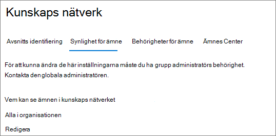
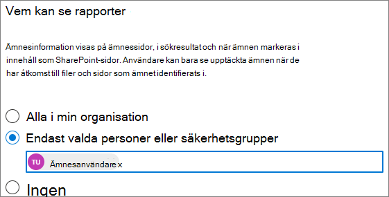

# Hantera synlighet för ämnen i Microsoft Viva-ämnenManage topic visibility in Microsoft Viva Topics

Du kan hantera vem som kan se viktiga ämnen, ämneskort och ämnescentret i [Administrationscenter för Microsoft 365](https://admin.microsoft.com).You can manage who can see topic highlights, topic cards, and the topic center in the [Microsoft 365 admin center](https://admin.microsoft.com). Du måste vara global administratör eller administratör SharePoint grupper eller administratör för att utföra de här uppgifterna.You must be a global administrator or SharePoint administrator and Groups admin to do these tasks.

## Så här kommer du åt inställningar för hantering av ämnen:To access topics management settings:

1. I dialogrutan Administrationscenter för Microsoft 365 du på **Inställningar** och sedan **på Organisationsinställningar**.In the Microsoft 365 admin center, click **Settings**, then **Org settings**.
2. Klicka på **Ämnesupplevelser** på **fliken Tjänster.**On the **Services** tab, click **Topic experiences**.

     

3. Välj fliken **Ämnessynlighet.** I följande avsnitt finns information om de olika inställningarna.Select the **Topic visibility** tab. See the following sections for information about each setting.

     

##  Ändra vem som kan se ämnen i organisationenChange who can see topics in your organization

Du kan ändra vilka användare som kan se ämnen i organisationen.You can change the users who can see topics in your organization.

1. På fliken **Ämnessynlighet** går du **till fliken Vem kan se avsnitt** och väljer **Redigera**.On the **Topic visibility** tab, under **Who can see topics**, select **Edit**.
2. På sidan **Vem kan** se ämnen väljer du vilka som ska ha åtkomst till ämnesinformation, till exempel markerade ämnen, ämneskort, ämnessvar i sökningar och ämnessidor.On the **Who can see topics** page, you choose who will have access to topic details, such as highlighted topics, topic cards, topic answers in search, and topic pages. Du kan välja:You can select:
    - **Alla i organisationen****Everyone in your organization**
    - **Endast valda personer eller säkerhetsgrupper****Only selected people or security groups**
    - **Ingen****No one**

     

3. Välj **Spara**.Select **Save**.  
 
> [!Note] 
> Med den här inställningen kan du välja vilken användare som helst i organisationen, men endast användare som har tilldelats ämneserfarenhetslicenser kan visa ämnen.While this setting allows you to select any user in your organization, only users who have Topic Experiences licenses assigned to them will be able to view topics.

## Se ävenSee also

[Hantera identifiering av ämnen i Microsoft Viva-ämnenManage topic discovery in Microsoft Viva Topics](topic-experiences-discovery.md)

[Hantera ämnesbehörigheter i Microsoft Viva-ämnenManage topic permissions in Microsoft Viva Topics](topic-experiences-user-permissions.md)

[Ändra namnet på ämnescentret i Microsoft Viva-ämnenChange the name of the topic center in Microsoft Viva Topics](topic-experiences-administration.md)

