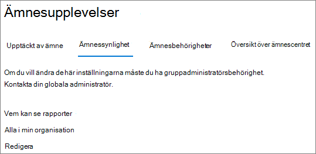

# Hantera ämnets synlighet i Microsoft 365

Du kan hantera uppsättningen med användare som kan se ämnes markeringar, ämnes kort och ämnes Center i [administrations centret för Microsoft 365](https://admin.microsoft.com). Du måste vara global administratör eller SharePoint-administratör för att utföra dessa uppgifter.

## Så här öppnar du inställningar för hantering av ämnen:

1. I administrations centret för Microsoft 365 klickar du på **Inställningar** och sedan på **org Settings**.
2. Klicka på **kunskaps nätverk** på fliken **tjänster** .

     

3. Välj fliken **synlighet** . I följande avsnitt finns information om de olika inställningarna.

     

##  Ändra vem som kan se ämnen i din organisation

Du kan ändra vilka användare som kan se ämnen i din organisation.

1. På fliken **synlighet** under **vem kan se ämnen i kunskaps nätverket** väljer du **Redigera**.
2. På sidan **vem kan se ämnen i kunskaps nätverk** väljer du vilka som kommer att ha till gång till ämnen, till exempel markerade ämnen, ämnes kort, ämnes svar i sökningar och avsnitts sidor. Du kan välja:
    - **Alla i organisationen**
    - **Endast valda personer eller säkerhets grupper**
    - **Ingen**

     

3. Välj **Spara**.  
 
> [!Note] 
> Med den här inställningen kan du välja vilken användare som helst i din organisation, men endast användare som har olika ämnen har tilldelats licenser kan se ämnen.

## Se även

[Hantera identifiering av avsnitt i Microsoft 365](topic-experiences-discovery.md)

[Hantera behörigheter för ämne i Microsoft 365](topic-experiences-user-permissions.md)

[Ändra namnet på ämnes centret i Microsoft 365](topic-experiences-administration.md)

