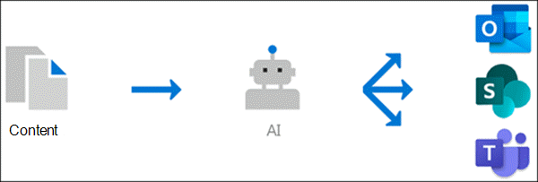

# Avsnitts översikt (för hands version)

> [!Note] 
> Innehållet i den här artikeln gäller för projekt cortex privat för hands version. [Läs mer om Project Cortex](https://aka.ms/projectcortex).

Avsnitts upplevelser använder Microsoft AI Technology, Microsoft 365, Delve, Microsoft Graph, Sök och andra komponenter och tjänster för att bygga ett kunskaps nätverk i din Microsoft 365-miljö. 

      

Målet är att konvertera information till kunskap och skicka den till dina användare i program de använder varje dag, till exempel SharePoint-moderna sidor och Microsoft Search.

Avsnitts upplevelser hjälper till att adressera ett viktigt företags problem i många företag – vilket ger informationen till användarna när de behöver det. Nya anställda måste till exempel snabbt lära sig mer om nya uppgifter och få sökord som de inte känner till när de läser via företags information. För att få veta mer kan användaren behöva gå vidare från vad de gör och lägga ner värdefull Tidssökning för information, till exempel information om vad termen är, vilka i organisationen är ett ämne och kanske webbplatser och dokument som är relaterade till termen.

Ämnen kan användas för att automatiskt söka efter och identifiera **ämnen** i din organisation. Den sammanfattar information om dem, till exempel en kort beskrivning, ämnes experter på ämnet och webbplatser, filer och sidor som är relaterade till den. En kunskaps chef eller deltagare kan välja att uppdatera ämnes informationen efter behov. Avsnitten är tillgängliga för användarna, vilket innebär att för varje förekomst av avsnittet som visas på en modern SharePoint-webbplats i Nyheter och sidor, markeras texten. Användare kan välja att välja ämne för att lära dig mer om det i avsnitts informationen. Du hittar även ämnen i SharePoint-sökning.

## Hur ämnen visas för användarna

När ett ämne omnämns i innehåll på nyheter och sidor i SharePoint visas det markerat. Du kan öppna sammanfattningen av rubriken från markeringen. Öppna avsnitts informationen från sammanfattningens rubrik. Det omnämnda ämnet kan identifieras automatiskt eller ha lagts till på sidan med en direkt referens till ämnet av sidans författare. 

      

## Kunskaps indexering

Avsnitts upplevelser använder Microsoft AI-teknik för att identifiera **ämnen** i din Microsoft 365-miljö.

Ett ämne är en fras eller en term som är organiserad eller viktig. Den har en specifik innebörd för organisationen och har resurser relaterade till det som kan hjälpa folk förstå vad det är och få mer information om den.

När ett ämne identifieras och AI avgör att det finns tillräckligt med information för att det ska vara ett föreslaget ämne, skapas en sida med namnet på en **sidan** som innehåller information som samlats in genom indexering, till exempel:

- Alternativa namn och/eller akronymer.
- En kort beskrivning av ämnet.
- Användare som kan vara kunskapsbaserade i avsnittet.
- Filer, sidor och webbplatser som är relaterade till avsnittet.

Dina kunskaps administratörer kan välja att crawla alla SharePoint-webbplatser i din klient organisation för ämnen eller bara att välja vissa.

## Role

När du använder avsnitts upplevelser i Microsoft 365-miljön får användarna följande roller:

- Visnings program: användare som kan se ämnes markeringar på SharePoint-moderna webbplatser som de har minst *Läs* åtkomst till och i Microsoft Search. De kan välja ämnes rubriker för att Visa ämnes information på ämnes sidor. Med avsnitts visnings program kan du ge feedback om hur användbart ett ämne är.

- Deltagare: användare som har behörighet att redigera befintliga ämnen eller skapa nya. Kunskaps administratörer tilldelar deltagare behörigheter till användare via inställningar för ämnen i administrations centret för Microsoft 365. Observera att du också kan välja att ge alla ämnen behörighet att redigera och skapa ämnen så att de också kan bidra till ämnen som de ser.

- Kunskaps chefer: användare som vägleder dig genom ämnes livs cykeln. Kunskaps chefer använder sidan **hantera ämnen** i ämnes centret för att bekräfta eller ta bort AI-förslag, samt redigera befintliga ämnen eller skapa nya och är de enda användare som har till gång till det. Kunskaps administratörer tilldelar kunskaps chefs behörigheter till användare via hjälp avsnitten administratörs inställningar i administrations centret för Microsoft 365. 

- Kunskaps administratörer: kunskaps administratörer har konfigurerat ämnen och hanterar dem via administratörs kontrollerna i administrations centret för Microsoft 365. För närvarande kan en Microsoft 365 global-eller SharePoint-administratör fungera som kunskaps administratör.

Mer information finns i [roll avsnitts funktionerna](topic-experiences-roles.md) .

## Hantering av ämnen

Hantering av ämnen finns på sidan **Hantera** ämne i organisationens **ämnes Center**. Ämnes Center skapas under installationen och fungerar som din grupp kunskap för organisationen. 

Alla licensierade användare kommer att kunna se ämnen som de ansluts till i ämnes centret, men endast användare med behörigheten *hantera ämnen* (kunskaps chefer) kan visa och använda sidan Hantera ämnen.

Kunskaps cheferna kan:

- Bekräfta eller avvisa ämnen som upptäckts i klient organisationen.
- Skapa nya ämnen manuellt efter behov (till exempel om det inte finns tillräckligt med information för att det ska identifieras via AI).
- Redigera befintliga avsnitts sidor. 

Se [hantera ämnen i ämnes centret](manage-topics.md) för mer information.  

## Administratörs kontroller

Med administratörs kontroller i Microsoft 365 Admin Center kan du hantera kunskaps nätverk. De tillåter en Microsoft 365 global-eller SharePoint-administratör att:

- Kontrol lera vilka användare i organisationen som får till gång till ämnen i SharePoint-moderna sidor eller i Sök resultat i SharePoint.
- Kontrol lera vilka SharePoint-webbplatser som ska crawlas för att söka efter avsnitt.
- Konfigurera avsnitts identifiering så att specifika ämnen inte hittas.
- Kontrol lera vilka användare som kan hantera ämnen i ämnes centret.
- Kontrol lera vilka användare som kan skapa och redigera ämnen i ämnes centret.
- Ange vilken användare som ska kunna visa ämnen.

Se [Tilldela användar behörigheter](https://docs.microsoft.com/microsoft-365/knowledge/plan-topic-experiences#user-permissions), [Hantera avsnitts synlighet](https://docs.microsoft.com/microsoft-365/knowledge/topic-experiences-knowledge-rules)och [Hantera identifiering av avsnitt](https://docs.microsoft.com/microsoft-365/knowledge/topic-experiences-discovery) för att få mer information om administratörs kontroller.

## Avsnitts information & feedback

AI fungerar fort löp ande för att ge förslag på att förbättra dina ämnen när ändringar sker i miljön. 

Användare som du tillåter åtkomst till för att se ämnen i deras dagliga arbete kan tillfrågas om avsnittet var användbart för dem. AI kontrollerar dessa svar och använder dem för att bestämma vad som visas i avsnitts sammanfattningar och avsnitts information.

Användare med behörigheten redigera eller skapa ämnen kan uppdatera ämnes sidor direkt om de vill göra korrigeringar eller lägga till ytterligare information. 

Dessutom kan användare med rätt behörighet tagga objekt som Yammer-konversationer som är relevanta för ett ämne och lägga till dem i ett visst ämne. 

## Se även

