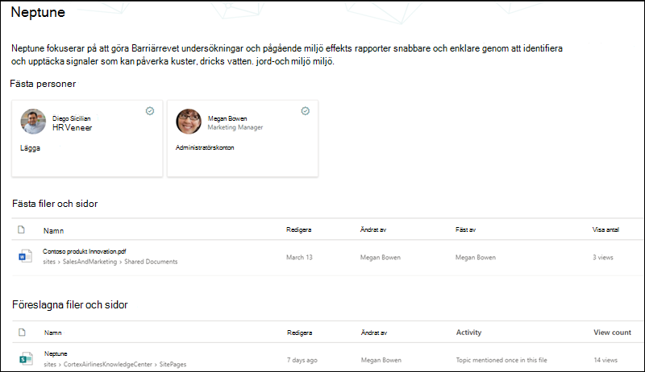
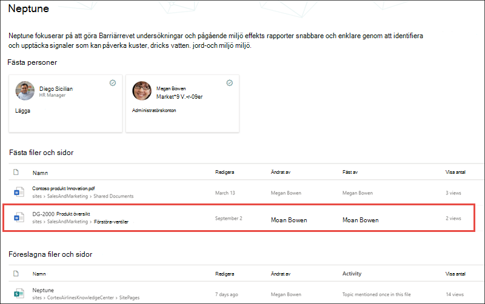

# Säkerhets trimning för Microsoft Viva TopicsMicrosoft Viva Topics security trimming 

Viva Topics-användare kan inte visa information i ämnen som deras befintliga Office 365-behörigheter hindrar dem från att se.Viva Topics users can't view information in topics that their existing Office 365 permissions prevent them from seeing. Allt som en användare ser på en ämnessida (till exempel SharePoint-webbplatser, dokument och filer) blir information som användaren redan har tillåtelse att se.Everything a user sees on a topic page (for example, SharePoint sites, documents, files) will be information they are already allowed to see. Viva Topics gör inga ändringar av befintliga behörigheter.Viva Topics does not make changes to any existing permissions.

## Varför två användare kan ha olika vyer av samma ämneWhy two users may have different views of the same topic

När ett ämne skapas med AI eller manuell läroplan kan det innehålla en beskrivning av ämnet, alternativa namn, personer kopplade till ämnet samt webbplatser, sidor och filer relaterade till ämnet.When a topic is created through AI or manual curation, it can contain a description of the topic, alternative names, people associated with the topic, as well as sites, pages, and files related to the topic. När den här informationen visas på en ämnessida är det möjligt att två användare som visar samma ämne min inte ser samma information.When this information is viewed on a topic page, it is possible that two users who are viewing the same topic my not see the same information.
  
När användare 1 till exempel visar ämnessidan för Neptune kan de se den här vyn av ämnessidan.For example, when User 1 views the Neptune topic page, they might see this view of the topic page.

   

Men när Användare 2 tittar på samma ämnessida för Neptune skiljer sig deras vy från Användare 1.However, when User 2 looks at the same Neptune topic page, their view differs from User 1.  Användare 2 kan se *FILEN DG-2000 Produktöversikt* i avsnittet Fästa filer och sidor på ämnessidan, som inte visas för Användare 1. User 2 is able to see the *DG-2000 Product Overview* file in the **Pinned files and pages** section of the topic page, which does not appear for User 1. 

   

Skillnaden i vad användarna kan se i samma ämne är att användarna kanske inte har Office 365-behörighet att visa en relaterad webbplats eller fil.The difference in what users may see on the same topic is because users may not have the Office 365 permissions to view a related site or file.  Viva Topics respekterar behörigheterna som anges för objekt i ett ämne och kan inte ändra åtkomsten till dem.Viva Topics respects the permissions that are set on items in a topic, and cannot change access to them. I vårt exempel kan användare 1 inte visa *filen DG-2000 Produktöversikt* på ämnessidan för Neptune eftersom Användare 1 inte har Office 365-behörigheter för att visa filen.In our example, User 1 is not able to view the *DG-2000 Product Overview* file in their topic page for Neptune because User 1 does not have Office 365 permissions to view the file.

Om en användare inte kan se tillräckligt med information i ett ämne för att det ska vara användbart, är avsnittet inte tillgängligt för användaren.If a user is not able to see enough information in a topic for it to be useful, the topic will not be available to the user. När det händer kan användaren inte se det markerade avsnittet.When this happens, the user will not see the highlighted topic. En annan användare som har behörighet till mer information i avsnittet för att den ska vara användbar kommer att kunna se ämnet.A different user who has permissions to more information in the topic for it to be useful, will be able to see the topic.

## Ämnesbehörigheter för knowledge managers och ämnesdeltagareTopic permissions for knowledge managers and topic contributors

Användare som har tilldelats behörighet att hantera ämnen – knowledge managers – kommer bara att kunna visa information som de har behörighet att se i ämnen.Users that are assigned permissions to manage topics - knowledge managers - will only be able to view information they have permissions to see within topics.

På samma sätt kan användare som har behörighet att skapa och redigera ämnesbehörigheter – ämnesdeltagare – bara visa information som de har behörighet att se i ämnen.Similarly, users who have create and edit topic permissions - topic contributors - will only be able to view information they have permissions to see within topics. 

## AI kontra manuellt curated topic informationAI versus manually curated topic information

Ämnen kan innehålla information som genereras av AI och information som lagts till eller redigerats av ämnesdeltagare eller kunskapshanterare.Topics can contain information generated by AI and information added or edited by topic contributors or knowledge managers.

 - Information i ett ämne som lagts till av AI visas bara för personer som har åtkomst till källinnehållet.Information in a topic that was added by AI is only visible to people who have access to the source content.
 - Information om ämnen och personer som manuellt har lagts till eller redigerats av en ämnesdeltagare eller knowledge manager är synliga för alla som kan se ämnet.Topic description and people information that has been manually added or edited by a topic contributor or knowledge manager is visible to everyone who can see the topic.
 - Filer, sidor och webbplatser visas bara för användare som har behörighet till källinnehållet, oavsett om de har lagts till manuellt eller lagts till av AI.Files, pages, and sites are only visible to users who have permissions to the source content, whether manually added or added by AI.

I följande tabell beskrivs vad användare – ämnesanvändare, deltagare och kunskapshanterare – kan se i ett visst ämne baserat på deras behörigheter.The following table describes what users - topic viewers, contributors, and knowledge managers - can see in a given topic based on their permissions.

|ÄmnesobjektTopic item|Vad användarna kan seWhat users can see|
|:---------|:------------------|
|ÄmnesnamnTopic name|Användarna kan se ämnesnamnet för alla ämnen i ämnescentret.Users can see the topic name of all topics in the topic center. Vissa ämnen kanske inte visas om de har en låg relevans för användaren.Some topics may not be visible if they have a low relevancy to the user.|
|ÄmnesbeskrivningTopic description|AI-genererade beskrivningar visas endast för användare som har behörighet till källinnehållet.AI-generated descriptions are visible only to users who have permissions to the source content. Manuellt angivna eller redigerade beskrivningar visas för alla användare.Manually entered or edited descriptions are visible to all users.|
|KontakterPeople|Fästa personer visas för alla användare.Pinned people are visible to all users. Föreslagna personer visas bara för användare som har behörighet till källinnehållet.Suggested people are only visible to users who have permissions to the source content.|
|FilerFiles|Filer visas bara för användare som har behörighet till källinnehållet.Files are only visible to users who have permissions to the source content.|
|SidorPages|Sidor visas bara för användare som har behörighet till källinnehållet.Pages are only visible to users who have permissions to the source content.|
|WebbplatserSites|Webbplatser visas bara för användare som har behörighet till källinnehållet.Sites are only visible to users who have permissions to the source content.|

## Se ävenSee also

