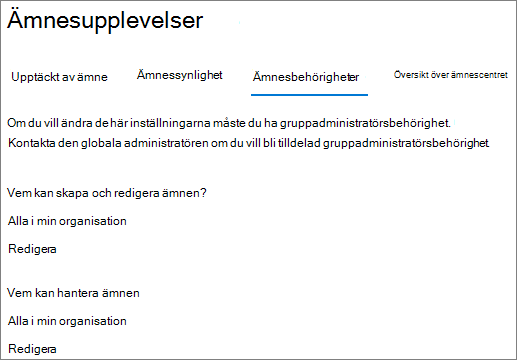
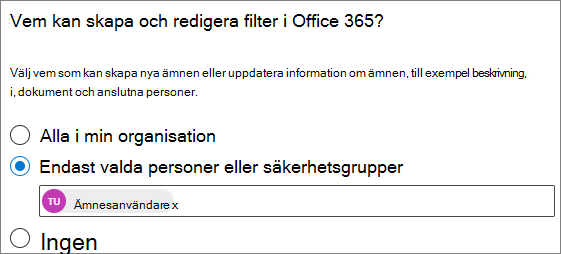
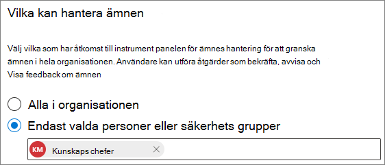

# Hantera ämnesbehörigheter i Microsoft Viva-ämnenManage topic permissions in Microsoft Viva Topics

Du kan hantera inställningar för ämnesbehörigheter [Microsoft 365 administrationscentret](https://admin.microsoft.com).You can manage topic permissions settings in the [Microsoft 365 admin center](https://admin.microsoft.com). Du måste vara global administratör SharePoint administratör för att utföra de här uppgifterna.You must be a global administrator or SharePoint administrator to perform these tasks.

Med inställningar för ämnesbehörighet kan du välja:With topic permissions settings you can choose:

- Vilka användare kan skapa och redigera ämnen: Skapa nya ämnen som inte hittades vid identifieringen eller redigera befintlig ämnesinformation.Which users can create and edit topics: Create new topics that were not found during discovery or edit existing topic details.
- Vilka användare kan hantera ämnen: Komma åt ämneshanteringscentret och visa feedback om ämnen samt flytta ämnen genom livscykeln.Which users can manage topics: Access the topic management center and view feedback on topics as well as move topics through the lifecycle.

## Så här kommer du åt inställningar för hantering av ämnen:To access topics management settings:

1. I Microsoft 365 klickar du på **Inställningar** och sedan **på Organisationsinställningar.**In the Microsoft 365 admin center, click **Settings**, then **Org settings**.
2. Klicka på **Ämnesupplevelser** på **fliken Tjänster.**On the **Services** tab, click **Topic experiences**.

     

3. Välj fliken **Ämnesbehörigheter.** I följande avsnitt finns information om de olika inställningarna.Select the **Topic permissions** tab. See the following sections for information about each setting.

     

## Ändra vem som har behörighet att uppdatera ämnesinformationChange who has permissions to update topic details

Så här uppdaterar du vem som har behörighet att skapa och redigera ämnen:To update who has permissions to create and edit topics:

1. Välj **Redigera på fliken** **Ämnesbehörigheter under Vem kan skapa och redigera** **ämnen.**On the **Topic permissions** tab, under **Who can create and edit topics**, select **Edit**.
2. På sidan **Vem skapa och redigera ämnen** kan du välja:On the **Who can create and edit topics** page, you can select:
    - **Alla i organisationen****Everyone in your organization**
    - **Endast valda personer eller säkerhetsgrupper****Only selected people or security groups**
    - **Ingen****No one**

      

3. Välj **Spara**.Select **Save**.

Så här uppdaterar du vem som har behörighet att hantera ämnen:To update who has permissions to manage topics:

1. Välj **Redigera på fliken** Ämnesbehörigheter under Vem **kan hantera** **ämnen**.On the **Topic permissions** tab, under **Who can manage topics**, select **Edit**.
2. På sidan **Vem kan hantera ämnen** kan du välja:On the **Who can manage topics** page, you can select:
    - **Alla i organisationen****Everyone in your organization**
    - **Valda personer eller säkerhetsgrupper****Selected people or security groups**

      

3. Välj **Spara**.Select **Save**.

## Se ävenSee also

[Hantera identifiering av ämnen i Microsoft Viva-ämnenManage topic discovery in Microsoft Viva Topics](topic-experiences-discovery.md)

[Hantera synlighet för ämnen i Microsoft Viva-ämnenManage topic visibility in Microsoft Viva Topics](topic-experiences-knowledge-rules.md)

[Ändra namnet på ämnescentret i Microsoft Viva-ämnenChange the name of the topic center in Microsoft Viva Topics](topic-experiences-administration.md)
