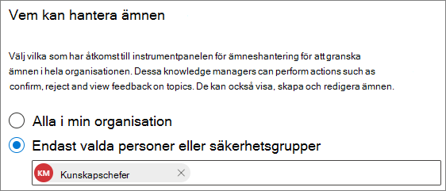

# Hantera behörigheter för ämne i Microsoft 365

Du kan hantera inställningar för ämnes behörighet i [administrations centret för Microsoft 365](https://admin.microsoft.com). Du måste vara global administratör eller SharePoint-administratör för att utföra dessa uppgifter.

Med behörighets inställningar för ämne kan du välja:

- Vilka användare som kan skapa och redigera ämnen: skapa nya avsnitt som inte hittades under identifiering eller redigera befintlig information.
- Vilka användare som kan hantera ämnen: kom åt ämnes hanterings centret och Visa feedback om ämnen samt flytta ämnen via livs cykeln.

## Så här öppnar du inställningar för hantering av ämnen:

1. I administrations centret för Microsoft 365 klickar du på **Inställningar** och sedan på **org Settings**.
2. Klicka på **kunskaps nätverk** på fliken **tjänster** .

     

3. Välj fliken **behörigheter för ämne** . I följande avsnitt finns information om de olika inställningarna.

     

## Ändra vem som har behörighet att uppdatera ämnets information

Så här uppdaterar du vilka som har behörighet att skapa och redigera ämnen:

1. På fliken **behörigheter** under **vem kan skapa och redigera ämnen** väljer du **Redigera**.
2. På sidan **vem som kan skapa och redigera ämnen** kan du välja:
    - **Alla i organisationen**
    - **Endast valda personer eller säkerhets grupper**
    - **Ingen**

      

3. Välj **Spara**.

Så här uppdaterar du vilka som har behörighet att hantera ämnen:

1. Välj **Redigera** under **vilka kan hantera ämnen** på fliken **behörigheter** .
2. På sidan **vem kan hantera ämnen** kan du välja:
    - **Alla i organisationen**
    - **Markerade personer eller säkerhets grupper**

      

3. Välj **Spara**.

## Se även

[Hantera identifiering av avsnitt i Microsoft 365](topic-experiences-discovery.md)

[Hantera ämnets synlighet i Microsoft 365](topic-experiences-knowledge-rules.md)

[Ändra namnet på ämnes centret i Microsoft 365](topic-experiences-administration.md)
