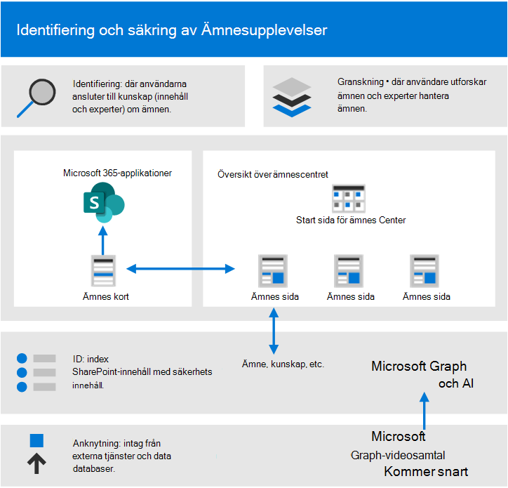
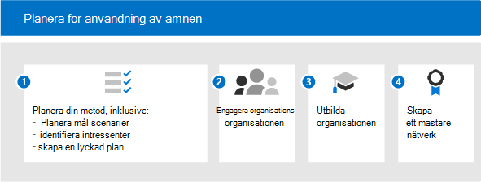

# Kom igång med införandet av Microsoft Viva Topics

Innan du börjar använda programmet måste du förstå begreppen inom kunskapshantering och Viva-ämnen. Följande diagram visar vad som händer vid identifiering och identifiering av ämnen:

- **Upptäckt:** Användare kan upptäcka kunskaper i de appar de använder varje dag via ämneskort – de kan också upptäcka ämnen i Microsoft Search.
- **Läroplan:** Ämnesexperter (SM: Ämnesexperter) förfinar ämnen genom ämnessidor och AI lär sig av deras input. Ämnescentret innehåller ämnessidor som användare kan utforska och experter kan hantera.
- **Identifiering:** Med Microsoft Graph och AI-kunskaper (artificiell intelligens) identifieras och ordnas personer (ämnen, färdigheter och så vidare) automatiskt i relaterade ämnen. SharePoint-innehåll indexeras med säkerhetsinnehåll.
- **Tillägg:** Med Microsoft Graph-innehållsanslutningar (kommer snart) kan du mata in kunskap från externa tjänster och datakällor.

Mer information finns i översikten [och får](topic-experiences-overview.md) en introduktion.

Tänk på följande:

- Identifiering av ämnen förbättras när mer innehåll är tillgängligt.
- Säkerheten, sekretessen och platsen för dina data bevaras även om informationen presenteras i en ny upplevelse.
- Användarna behöver en licens för att visa Viva Topics.
- Identifiering finns först på innehåll på engelska.

För att förbereda dig bör du tänka igenom följande frågor:

- Vilket innehåll ska användas för identifiering av ämnen?
- Vem ska hantera ämnen?
- Vilka kommer att se ämneskort och höjdpunkter?
- Vilka ämnen förväntas?

Läs igenom den här listan med förutsättningar för att få ut mesta av Viva-ämnen:

|Produkt eller funktion |Beskrivning |
|:-------|:--------|
|SharePoint Online med moderna SharePoint-sidor |Ämnesnäring omfattar endast innehåll på SharePoint-webbplatser och ämneskort kan bara visas på moderna sidor.|
|Microsoft Graph |Med Microsoft Graph-inställningarna kan du styra om ämnen ska tas med eller undantas från Sök eller Delve. |

## Planera för införande

För att planera införandet av Viva Topics måste du:

1. Planera din metod och dina målscenarier:
    - Fundera på att definiera och prioritera [scenarierna.](#target-scenarios)
    - Tänk på de [intressenter](#identify-stakeholders) och projektgruppmedlemmar du behöver ha med.  
    - Ta reda på vilken inverkan företaget har på vägen och hur du ska mäta [framgången.](#create-a-success-plan)

2. Engagera organisationen:
    - Identifiera de affärsgrupper och affärsteam som måste vara inblandade och få bättre justering över de och de scenarier som du planerar.
    - Börja fundera på hur du engagerar vissa tidiga användare för att få kritisk och tidig feedback så att du kan iterera för att få den bästa lösningen.
    - Börja skapa communityn och fundera på hur Viva Topics kan användas i organisationen av de olika grupperna.

3. Utbilda din organisation: De flesta användare kommer att intuitivt förstå konceptet med ämnen och hur ämneskort sammanställer relevant information och förstår och ser värdet. Men du kanske vill skapa utbildning som är skräddarsydd för din egen kultur och organisation för att visa hur du vill att Viva-ämnen ska användas. Några utbildningsresurser:
    - [Project Resource Center](https://aka.ms/projectcortex). Innehåller översikts- och funktionsinformation, inspelade videor och presentationer på kontorstid samt information om partners och deras erbjudanden.
    - Kommer snart, utbildningsvideor och hjälp för slutanvändare.

4. [Skapa ett mästarenätverk:](#build-a-champion-network)
    - Det kanske redan finns grupper av övning eller mästare på nätverk. Det här är bra sätt att umgås och sprida och få kollegor engagerade i att hjälpa varandra. Och de kan dela framgångar som kan vara värdefulla. De kan ge råd och skapa intresse.

### Målscenarier

Bestäm hur du vill använda Viva-ämnen i organisationen så att du kan använda dem. Här är några scenarier där kunskapshantering och ämnen kan hjälpa din organisation:

- Introduktion till &: Att förstå den nya organisationens terminologi, nyckelprojekt och kultur är viktiga steg i introduktionen. Enkel upptäckt av ämnen kan hjälpa nya anställda att snabbt komma igång med nya jobb, roller eller projekt.
- Expertkunskap och delning av information: När ämnen hanteras och delas kan personer i organisationen enklare hitta information och experter som kan hjälpa dem i det dagliga arbetet.
- Utökat beslutsfattande och förbättrad tid på marknaden: När information och experter är lätta att nå kan du fatta beslut enklare och få tid att ta ledigt från projekt.

#### Exempelscenario för roll onboarding

En HR-chef måste ge information till nya medarbetare som snabbt kan hjälpa dem att komma igång med företaget och deras team. De vill att de ska peka på rätt resurser, dokument och gruppmedlemmar som de behöver för att komma igång snabbt och effektivt. De letar efter en lösning som gör att den nya medarbetaren snabbt kan hitta den information de behöver utan att behöva söka på flera lagringsplatsen eller lämna de program de redan använder.

Till exempel:

- En anställd (Jordan) har en ny roll eller har nyligen anställts och har bara börjat med en roll. Jordan vill bli inblandat och produktivt så snabbt som möjligt. Men Jordan behöver också hjälp med att hitta en startpunkt.
- En kollega (Kim) som var med i rollen innan Jordan skapade ämnessidor som kan hjälpa nya anställda och alla andra som letar efter den informationen.
- Kim var MED OCH hade behörighet att titta på ofirmerade ämnessidor. Unconfirmed topic pages are great starting points for what the AI has discovered and created, and Kim was able to edit them to add expert resources, definitions, and pin other resources.
- När Jordan läser upp ett nytt inlägg på SharePoint kan de se ett ämne som markeras och hovra över det för att snabbt få en definition av termen och vem de ska kontakta med fler frågor. Tidigare kunde Jordan ha varit tvungen att leta efter den här informationen och kontakta kollegor för att se vem som ska fråga om något.
- Det kan vara kraftfullt att använda den här informationen, eftersom den informationen kan ha varit tillgänglig tidigare, men den kan ha blivit siloerad och svår att hitta. Genom att föra in programmet i de program som Jordan använder och hjälpa dem att hitta dessa experter kan det även skapa en känsla av engagemang och community. Det kan också hjälpa dem att känna sig mer ged när de hanterar den nya rollen.

När du automatiserar det här scenariot kan du se till att:

- Nya medarbetare kan snabbt ansluta till rätt personer på rätt projekt.
- Nya medarbetare har direkt åtkomst till den senaste projektinformationen i flödet av sitt arbete.
- Söktiderna minskas avsevärt.
- Introduktionstiderna är mycket kortare.

#### Exempelscenario för kundtjänst

Du kan göra det möjligt för kundtjänst att snabbt hitta filer och experter som kan hjälpa till med ovanliga skattefrågor och snabbt dokumentera svaret för andra att enkelt komma åt med Viva-ämnen.

En supportrepresentant behöver till exempel snabbt hitta kunskapsbasartiklar, dokument och principer så att de kan stödja kunder. De vill hitta rätt information vid rätt tidpunkt, utan att behöva bläddra manuellt genom flera databaser, lagringsplatsen eller program eller skicka ett samtal. Och de letar efter en lösning som gör att de kan hålla sig inom sina huvudsakliga principer för samtalsuppringning och åtkomstpolicyer, föreskrifter och riktlinjer i flödet av konversationer, så att de snabbt kan svara på frågor och uppdatera ärendet.

När du automatiserar det här scenariot med Viva Topics kan du se till att:

- Supportsamtalstiderna minskas.
- Eskalering till stöd på andra och tredje nivån minskas.
- Antalet uppringningar för ett givet ärende minskas.
- Nöjdare kunder ökar.

#### Prioritera dina scenarier

När du har identifierat dina scenarier kan du prioritera scenarierna:

Ett sätt att prioritera dem är att rita ut dina scenarier i ett rutnät som visar påverkan jämfört med enkel implementering. Leta efter scenarier som har både hög effekt och är lätta att implementera och ge dessa sådana högsta prioritet. Låg inverkan och svåra att implementera scenarier är din lägsta prioritet. När du har en snabb vinst med ett bra scenario som är lätt att implementera hjälper det människor att bli glada och se möjligheterna med att använda ämnen.

Välj några viktiga scenarier att fokusera på först, arbeta med dina tidiga användare för att få lite feedback och sedan distribuera dem stegvis. På så sätt kan du iterera, göra förbättringar och få feedback så att du kan öka införandet med tiden.

### Identifiera intressenter

Identifiera projektets intressenter. Huvudrollerna är huvudsponsorn, framgångsägaren och mästare.

|Roll |Ansvarsområden |Department |
|:-------|:-------|:--------|
| Huvudsponsorer   | Kommunicera visioner och värden på hög nivå till företaget   |  Ledning   |
| Projektledarna | Övervaka hela lanseringen av körningen och lanseringsprocessen | Projektledning |
| Kunskapsadministratörer| Konfigurera Och konfigurera Viva-ämnen | IT-avdelning |
| Kunskapschefer | Hantera ämnen och övervaka taxonomin | Valfri avdelning |
| Taxonomihanterare | Övervaka taxonomin | Alla avdelningar |
| Ämnesexperter och ämnesdeltagare | Skapa eller granska ämnen och beskrivningar | Alla avdelningar |
| Mästare | Hjälp till att sprida och hantera stötande hantering | Alla avdelningar (personal) |
| Innehavaradministratör | Konfigurera inställningar på klientorganisationsnivå | IT-avdelning |
| Administratör för Power Platform| Konfigurera en vanlig datatjänstmiljö | IT-avdelning |
| Sökadministratör eller chef | Konfigurera sökinställningar | IT-avdelning |

I en större organisation kan du också ha flera personer i de här rollerna och du måste göra koordinationen mellan dem. I ett mindre företag kan en person ha flera av dessa roller. Olika roller kan vara mer engagerade i olika faser av projektet. Till exempel blir innehavaradministratörer mer engagerade i att konfigurera funktionerna, medan ämnesexperter och mästare inte blir inblandade förrän du börjar definiera ämnen.
 
Även om vi rekommenderar att var och en av de här rollerna har uppfyllts under hela utrullningen kan det hända att du inte behöver alla för att komma igång med din identifierade lösning.

### Skapa en framgångsplan

Använd de här indikatorerna för att mäta framgången med Viva-ämnen i organisationen. Titta på:

1. Ämnesanvändning:
      - Ämnesintryck
      - Antal ämnen – både bekräftade och inte bekräftade i din ämneslista.
      - Antalet publicerade ämnessidor.
1. Feedback från ämneskort för slutanvändare.
1. Gör enkäter om medarbetarnöjning. Viva Topics bör förbättra de anställdas möjligheter att hitta information, så att de kan samla in information och feedback om den upplevelsen.
1. Positiv inverkan på sökanalys. Eftersom ämnen visas i sökfunktionen kan du med tiden se lägre priser för övergiven sökning eftersom det är enklare för personer att hitta ämnena i sökningen. 

### Skapa ett mästarenätverk

Skapa ett mästarenätverk i din organisation. Mästare är viktiga eftersom de kan:

- Skapa en cirkel med inflytande i deras team
- Avsnittshantering av enhet & underhåll

Du kan rekrytering av mästare från olika roller – kunskapschefer och ämnesexperter.

Många av mästare på nätverk använder Yammer plattform. I Yammer kan personer publicera frågor och få svar och dela framgångar. Det är svårt att bara få ut ordet, så du kan förlita dig på nätverket av personer i hela företaget för att ge råd till kollegor och visa hur teamet använder Viva Topics så att andra grupper kan tänka ut sina egna scenarier.

En del organisationer använder hackan (formellt eller informellt, virtuellt eller personligt) för att samla grupper med personer för att arbeta med ett visst projekt. Du kan till exempel samla dina ämnesexperter och be dem att samarbeta för att hålla en uppsättning ämnessidor.

Fundera på hur du kan känna igen din mästare. Belöna deras aktiviteter, ge dem ett erkännande och skapa en synlig community-känsla och engagemang så att de känner att de bidrar till något och de får också något tillbaka från sina investeringar.

Nu när du är redo att distribuera bör du se till att uppmuntra kontinuerligt engagemang.

- Se till att Yammer aktiva grupper för din mästare.
- Dela framgångar.
- Med jämna mellanrum värdar du engagemangshändelser för att dela berättelser eller introducera nya funktioner.
- Ställ in utmaningar för personer och kör tävlingar.

## Nästa steg

När du är redo att distribuera Viva Topics måste du få människor engagerade.

- Börja introducera funktionsuppsättningen och få dem att tänka på deras scenarier.
- Samla intressenter och skapa scenarier.
- Driv communityn och tänk på hur du kommer att engagera dem.
- Slutför sedan förberedelsestegen. En del kan vara teknisk beredskap och viss beredskap för företag.
- Slutligen kan du umgås och lyfta fram.
