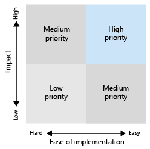

# Kom igång med införandet av Microsoft Viva Topics

Innan du börjar med införandet måste du förstå begreppen som ingår i kunskapshantering och Viva-ämnen. Följande diagram visar vad som händer vid identifiering och identifiering av ämnen:

- **Upptäckt:** Användare kan upptäcka kunskaper i appar som de använder varje dag via ämneskort – de kan också upptäcka ämnen i Microsoft Search.
- **Läroplan:** Experter inom området för företag förfinar ämnen genom ämnessidor och AI lär sig av deras input. Ämnescentret innehåller ämnessidor som användare kan utforska och experter kan hantera.
- **Identifiering:** Med Microsoft Graph och AI-kunskap (AI) (ämnen, kunskaper och så vidare) identifieras och ordnas automatiskt i närliggande ämnen. SharePoint är indexerat med säkerhetsinnehåll.
- **Tillägg:** Med Microsoft Graph för innehållsanslutningar (kommer snart) kan du mata in kunskap från externa tjänster och lagringsplatsen för data.

Om du vill ha mer information kan du läsa [översikten](topic-experiences-overview.md) och få en introduktion.

Tänk på följande:

- Identifiering av ämnen förbättras när mer innehåll finns tillgängligt.
- Säkerheten, sekretessen och platsen för dina data bevaras även om informationen presenteras i en ny upplevelse.
- Användarna behöver en licens för att visa Viva Ämnen.
- Identifiering finns först på innehåll på engelska.

För att förbereda dig kan du tänka igenom de här frågorna:

- Vilket innehåll ska användas för att identifiera ämnen?
- Vem hanterar du ämnen?
- Vem att se ämneskort och höjdpunkter?
- Vilka ämnen förväntas?

Läs den här listan över förutsättningarna för att få ut mesta av Viva Ämnen:

|Produkt eller funktion |Beskrivning |
|:-------|:--------|
|SharePoint Online med moderna SharePoint sidor |Ämnesnäring inkluderar endast innehåll SharePoint på webbplatser och ämneskort kan endast användas på moderna sidor.|
|Microsoft Graph |Du kan styra om ämnen ska tas med eller undantas från Sökningar eller Delve med Microsofts Graph inställningar. |

## Planera för införande

För att planera för införandet av Viva Topics behöver du:

1. Planera din metod och dina målscenarier:
    - Fundera på att definiera och prioritera [scenarierna](#target-scenarios).
    - Tänk på de [intressenter](#identify-stakeholders) och projektgruppmedlemmar du behöver vara med i.  
    - Ta reda på vilken inverkan du vill ha på företaget och hur du ska [mäta framgång.](#create-a-success-plan)

2. Engagera organisationen:
    - Identifiera de affärsgrupper och affärsteam som behöver vara inblandade och få en bättre överensstämmelse mellan dem och de scenarier som du planerar.
    - Börja fundera på hur du engagerar vissa tidiga användare för att få kritisk, tidig feedback så att du kan iterera för att få den bästa lösningen.
    - Börja skapa communityn och fundera på hur Viva Topics kan användas av de olika grupperna i organisationen.

3. Utbilda din organisation: De flesta människor kommer intuitivt att förstå konceptet med ämnen och hur ämneskort sammanställer relevant information och förstår och ser värdet. Men du kanske vill skapa utbildning som är skräddarsydd för din egen kultur och organisation för att visa hur du vill att Viva Ämnen ska användas. Några utbildningsresurser:
    - [Project Resurscenter .](https://aka.ms/projectcortex) Innehåller översikts- och funktionsinformation, inspelade videofilmer och presentationer på kontorstid samt information om partner och deras erbjudanden.
    - Kommer snart, utbildningsvideor och hjälp för slutanvändare.

4. [Skapa ett mästarenätverk](#build-a-champion-network):
    - Det kanske redan finns grupper av övningsnätverk eller mästare på plats. Det här är bra sätt att umgås och sprida information och hjälpa kollegor att hjälpa varandra. Och de kan dela framgångar som kan vara värdefulla. De kan ge råd och skapa intresse.

### Målscenarier

Bestäm hur du vill använda Viva-ämnen i organisationen så att du kan använda dem. Här är några scenarier där knowledge management och ämnen kan hjälpa din organisation:

- Introduktion av roller & utbildning: Att förstå terminologi, nyckelprojekt och kultur i en ny organisation är viktiga steg i introduktionen. Enkel identifiering av ämnen kan hjälpa nyanställda att snabbt komma igång med nya jobb, roller eller projekt.
- Söka efter expertkunskap och dela information: När ämnen hanteras och delas kan personer i organisationen enklare hitta information och experter som kan hjälpa dem i det dagliga arbetet.
- Utökat beslutsfattar och förbättrad tid på marknaden: När information och experter är lätta att nå kan du fatta beslut enklare och få bort stiden från projekt.

#### Exempelscenario för roll onboarding

En HR-chef måste tillhandahålla information till nya anställda som snabbt kan hjälpa dem att komma igång med företaget och deras team. De vill visa rätt resurser, dokument och gruppmedlemmar som de behöver för att komma igång snabbt och effektivt. De letar efter en lösning som gör att den nya medarbetaren snabbt kan hitta den information de behöver utan att behöva söka på flera lagringsplatsen eller lämna de program de redan använder.

Till exempel:

- En anställd (Jordan) har fått en ny roll eller har nyligen anställts och har bara börjat med en roll. Jordan vill bli engagerad och produktiv så snabbt som möjligt. Men Jordan behöver också hjälp med att hitta en startpunkt.
- En kollega (Kim) som var med i rollen innan Jordan skapade ämnessidor som kan hjälpa nya anställda och andra som söker efter den informationen.
- Kim var EN SÅD OCH hade behörighet att titta på obekrräftade ämnessidor. Unconfirmed topic pages are great starting points for what the AI has discovered and created, and Kim was able to edit them to add expert resources, definitions, and pin other resources.
- När Jordan läser upp ett nytt inlägg på SharePoint kan de se ett ämne som markeras och hovra över det för att snabbt få en definition av termen och vem de ska kontakta med fler frågor. Tidigare kunde Jordan ha varit tvungen att leta efter den här informationen och kontakta kollegor för att ta kontakt med dem som ska fråga om något.
- Det kan vara kraftfullt att använda den här informationen genom ämnen, eftersom den kan ha varit tillgänglig tidigare men den kan ha blivit siloerad och svår att hitta. Att föra in det i program som Jordan använder och hjälpa dem att hitta dessa experter kan också få en känsla för engagemang och community. Det kan också hjälpa dem att känna sig mer ged när de hanterar den nya rollen.

När du automatiserar det här scenariot kan du se till att:

- Nya medarbetare kan snabbt kommunicera med rätt personer i rätt projekt.
- Nya medarbetare har direkt åtkomst till den senaste projektinformationen i sitt arbete.
- Söktiderna minskas avsevärt.
- Introduktionstiderna försämras avsevärt.

#### Exempelscenario för kundtjänst

Du kan göra det möjligt för kundtjänsten att snabbt hitta filer och experter som kan hjälpa till med ovanliga skattefrågor och snabbt dokumentera svaret för andra att enkelt komma åt med Viva Ämnen.

En supportrepresentant behöver till exempel snabbt hitta kunskapsbasartiklar, dokument och principer så att de kan stödja kunder. De vill hitta rätt information vid rätt tidpunkt utan att behöva bläddra igenom flera databaser, lagringskällor eller program manuellt eller skicka ett samtal. Och de letar efter en lösning som gör att de kan hålla sig inom sin huvuduppringningsprinciper, regler och riktlinjer i flödet av konversationer, så att de snabbt kan svara på frågor och uppdatera ärendet.

När du automatiserar det här scenariot med Viva Topics kan du se till att:

- Supportsamtalstiderna minskas.
- Eskalering till stöd på andra och tredje nivån har minskats.
- Antalet motringningar i ett givet ärende minskas.
- Nöjdare kunder ökar.

#### Prioritera dina scenarier

När du har identifierat dina scenarier kan du prioritera scenarierna:

Ett sätt att prioritera dem är att rita ut dina scenarier i ett rutnät som visar påverkan jämfört med enkel implementering. Leta efter scenarier som har både hög effekt och är enkla att implementera och ge dessa sådana högsta prioritet. Den lägsta prioriteten är låg och svår att implementera scenarier. När du har en snabb vinst med hög effekt, ett scenario som är lätt att implementera hjälper det folk att bli glada och se möjligheterna med att använda ämnen.

Välj några viktiga scenarier att fokusera på från början, arbeta med dina tidiga användare för att få lite feedback och sedan distribuera dem stegvis. På så sätt kan du iterera, göra förbättringar och få feedback så att du kan växa med tiden.

### Identifiera intressenter

Identifiera projektets intressenter. Huvudrollerna är sponsorn, framgångsägaren och mästare.

|Roll |Ansvarsområden |Department |
|:-------|:-------|:--------|
| Sponsor(er)   | Kommunicera visioner och värden på hög nivå till företaget   |  Ledning   |
| Project eller lead | Övervaka hela startkörningen och lanseringsprocessen | Project hantering |
| Kunskapsadministratörer| Konfigurera och konfigurera Viva Ämnen | IT-avdelning |
| Kunskapsansvariga | Hantera ämnen och övervaka taxonomin | Alla avdelningar |
| Taxonomihanterare | Övervaka taxonomin | Alla avdelningar |
| Ämnesexperter och ämnesdeltagare | Skapa eller granska ämnen och beskrivningar | Alla avdelningar |
| Mästare | Hjälpa till att sprida och hantera stötande hantering | Alla avdelningar (personal) |
| Innehavaradministratör | Konfigurera inställningar på klientnivå | IT-avdelning |
| Power Platform-administratör| Konfigurera en vanlig miljö för datatjänster | IT-avdelning |
| Sökadministratör eller chef | Konfigurera sökinställningar | IT-avdelning |

I en större organisation kanske du också har flera personer i de här rollerna och du måste skapa koordination mellan dem. I ett mindre företag kan en person ha flera av dessa roller. Olika roller kan vara mer engagerade i olika faser av projektet. Till exempel är innehavaradministratörer mer engagerade i att konfigurera funktionerna, medan ämnesexperter och mästare inte blir engagerade förrän du börjar definiera ämnen.
 
Vi rekommenderar att alla de här rollerna har uppfyllts under hela utrullningen, men du kanske upptäcker att du inte behöver dem alla för att komma igång med din identifierade lösning.

### Skapa en framgångsplan

Använd de här indikatorerna för att mäta framgången med Viva-ämnen i organisationen. Titta på:

1. Användning av ämnen:
      - Ämnesintryck
      - Antal ämnen – både bekräftade och inte bekräftade i din ämneslista.
      - Antalet publicerade ämnessidor.
1. Feedback från ämneskort för slutanvändare.
1. Gör enkäter om medarbetarnöjning. Viva Ämnen ska förbättra anställdas möjligheter att hitta information, så att du kan samla in deras input och feedback om den upplevelsen.
1. Positiv inverkan på sökanalys. Eftersom ämnen visas i sökfunktionen kommer du med tiden kanske att se lägre kostnader för övergiven sökning eftersom det är lättare för personer att hitta ämnena i sökningen. 

### Skapa ett mästarenätverk

Skapa ett mästarenätverk i din organisation. Mästare är viktiga eftersom de kan:

- Skapa en cirkel med inflytande i deras team
- Hantering av enhetsavsnitt & underhåll

Du kan rekrytering av mästare från olika roller – kunskapschefer och ämnesexperter.

Många mästare på nätverk använder Yammer som plattform. I Yammer kan personer publicera frågor och få svar och dela framgångar. Det är svårt att bara få ut ordet, så du kan förlita dig på att nätverket av personer i hela företaget ger råd till kollegor och visar hur teamet använder Viva-ämnen så att andra grupper kan tänka ut sina egna scenarier.

En del organisationer använder hackathons (formella eller informella, virtuella eller personligen) för att samla grupper av personer för att arbeta med ett visst projekt. Du kan till exempel samla dina ämnesexperter och få dem att samarbeta för att hålla i en uppsättning ämnessidor.

Tänk på hur du kan identifiera dina mästare. Belöna deras aktiviteter, ge dem ett erkännande och skapa en synlig community-känsla och engagemang så att de känner att de bidrar till något och de får också något tillbaka från sina investeringar.

Nu när du är redo att komma igång bör du se till att du uppmuntrar kontinuerligt deltagande.

- Behåll aktiva Yammer grupper för dina mästare.
- Dela framgångar.
- Då och då vara värd för engagemangshändelser för att dela berättelser eller introducera nya funktioner.
- Ställ in utmaningar för människor och kör tävlingar.

## Nästa steg

När du är redo att distribuera Viva Ämnen måste du engagera personerna.

- Börja introducera funktionsuppsättningen och få dem att tänka på scenarierna.
- Samla intressenter och skapa scenarier.
- Drive the community and think about how you're going to engage them.
- Sedan är det klart att förbereda sig. En del kan vara teknisk beredskap och en del beredskap i verksamheten.
- Slutligen bör du umgås och marknadsföra.
