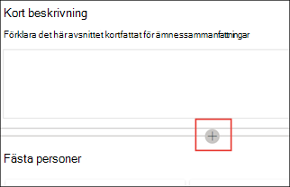

# Arbeta med ämnen i ämnes centret (för hands version)Work with topics in the topic center (Preview)

> [!Note] 
> Innehållet i den här artikeln gäller för projekt cortex privat för hands version.The content in this article is for Project Cortex Private Preview. [Läs mer om Project Cortex](https://aka.ms/projectcortex).[Find out more about Project Cortex](https://aka.ms/projectcortex).

I ämnes Center kan en kunskaps chef granska ämnen som har mined och upptäckts i de SharePoint source locations som du har angett, och du kan antingen bekräfta eller avvisa dem.In the topic center, a knowledge manager can review topics that have been mined and discovered in the SharePoint source locations you specified, and can either confirm or reject them. En kunskaps chef kan också skapa och publicera nya avsnitts sidor om en sådan inte fanns i ämnes identifieringen eller redigera befintliga om de måste uppdateras.A knowledge manager can also create and publish new topic pages if one was not found in topic discovery, or edit existing ones if they need to be updated.

## KravRequirements

För att kunna arbeta i ämnes centret måste du ha nödvändig behörighet.In order to work in the topic center, you need to have the required permissions. Din administratör kan lägga till dig under [Inställningar för kunskaps hantering](set-up-knowledge-network.md), eller så kan nya användare [läggas till senare](give-user-permissions-to-the-topic-center.md).Your admin can add you during [knowledge management setup](set-up-knowledge-network.md), or new users can be [added afterwards](give-user-permissions-to-the-topic-center.md).

Användare av ämnes Center kan få två uppsättningar behörigheter:Topic center users can be given two sets of permissions:

- Skapa och redigera ämnen: skapa nya avsnitt eller uppdatera ämnets innehåll som beskrivning, dokument och associerade personer.Create and edit topics: Create new topics or update topic content such as the description, documents and associated persons.

- Hantera ämnen: Använd instrument panelen för ämnes hantering för att granska ämnen i hela organisationen.Manage topics: Use the Topic management dashboard to review topics across the organization. Användare kan utföra åtgärder som att bekräfta och avvisa ämnen.Users can perform actions such as confirm and reject topics.

## Granska förslag till ämnenReview suggested topics

På Start sidan för ämnes Center visas de avsnitt som upptäckts på dina angivna SharePoint source locations på fliken **föreslaget** . En användare med behörighet att hantera ämnen kan granska obekräftade ämnen och välja att bekräfta eller avvisa dem.On the topic center home page, topics that were discovered in your specified SharePoint source locations will be listed in the **Suggested** tab. A user with permissions to manage topics can review unconfirmed topics and choose to confirm or reject them.

Så här granskar du ett föreslaget ämne:To review a suggested topic:

1. Gå till fliken **föreslagen** och markera avsnittet för att öppna sidan ämne.On the **Suggested** tab, select the topic to open the topic page. 

2. På sidan ämne granskar du sidan ämne och väljer **Redigera** om du behöver göra några ändringar på sidan.On the topic page, review the topic page, and select **Edit** if you need to make any changes to the page.

3. På Start sidan för kunskaps Center går du till det valda avsnittet:On the Knowledge Center home page, for the selected topic, you can:

    1. Markera kryss rutan för att bekräfta att du vill behålla avsnittet.Select the check to confirm that you want to keep the topic.
    
    1. Välj **x** om du vill avvisa avsnittet.Select the **x** if you want to reject the topic.

    Bekräftade ämnen kommer att tas bort från den **obekräftade** listan och kommer nu att visas på fliken **Bekräfta** .Confirmed topics will be removed from the **Unconfirmed** list and will now display in the **Confirmed** tab.

    Avvisade ämnen tas bort från den **obekräftade** listan och visas nu på fliken **avvisad eller utesluten** .Rejected topics will be removed from the **Unconfirmed** list and will now display in the **Rejected or Excluded** tab.

## Granska bekräftade ämnenReview confirmed topics

På Start sidan för ämnes Center, de avsnitt som upptäckts på dina angivna SharePoint-källor och har bekräftats av en kunskaps chef eller en crowdsourced som bekräftats av två eller fler personer via kort återkopplings funktionen visas en lista på fliken **bekräftad** . En användare med behörighet att hantera ämnen kan granska bekräftade ämnen och välja att avvisa dem.On the topic center home page, topics that were discovered in your specified SharePoint source locations and have been confirmed by a knowlege manager or crowdsourced confirmed by 2 or more people through the card feedback mechanism will be listed in the **Confirmed** tab. A user with permissions to manage topics can review confirmed topics and choose to reject them.

Så här granskar du ett bekräftat ämne:To review a confirmed topic:

1. På fliken **bekräftat** markerar du avsnittet för att öppna sidan ämne.On the **Confirmed** tab, select the topic to open the topic page. 

2. På sidan ämne granskar du sidan ämne och väljer **Redigera** om du behöver göra några ändringar på sidan.On the topic page, review the topic page, and select **Edit** if you need to make any changes to the page.

3. Du kan avvisa det ocksåYou can reject it too

## Granska publicerade ämnenReview published topics
Publicerade ämnen har redigerats så att specifika-informationen alltid visas för alla som betecknar sidan.Published topics have been edited so that speific information will always appear to whoever encountrs the page. Här visas manuellt avsnitt.Manually created topics show here.

   
## Skapa ett nytt ämneCreate a new topic

En användare med behörigheten Skapa eller redigera ämnen kan skapa ett nytt avsnitt om det behövs.A user with create or edit topic permissions can create a new topic if needed. Det kan hända att du måste göra det här om det inte upptäcks under identifiering eller om AI-tekniken inte hittade tillräckligt många belägg för att det ska bli ett ämne.You might need to do this if the topic was not discovered through discovery or if the AI technology did not find enough evidence to establish it as a topic.

Så här skapar du ett nytt ämne:To create a new topic:

1. På sidan avsnitt Center väljer du **nytt** och sedan **sidan ämne**.On the topic center page, select **New** , then select **Topic Page**.

    

2. På sidan ny ämne kan du fylla i informationen om den nya ämnes mal len:On the new topic page, you can fill in the information on the new topic template:

    1. Skriv namnet på det nya avsnittet i avsnittet **namn i det här avsnittet** .In the **Name this topic** section, type the name of the new topic.
    
    1. I avsnittet **alternativa namn** skriver du namn eller akronymer som också används för att referera till ämnet.In the **Alternate names** section, type names or acronyms that are also used to refer to the topic.
    
    1. Skriv en eller två meningar för ämnet i avsnittet **kort beskrivning** .In the **Short description** section, type a one or two sentence description of the topic. Den här texten används för det associerade ämnes kortet.This text will be used for the associated topic card.
    
    1. Skriv namnen på ämnes experterna i avsnittet **personer** .In the **People** section, type the names of subject matter experts for the topic.
    
    1. I avsnittet **filer och sidor** väljer du **Lägg till** och på nästa sida kan du välja associerade OneDrive-filer eller SharePoint Online-sidor.In the **Files and pages** section, select **Add** and then on the next page you can select associated OneDrive files or SharePoint Online pages.
    
    1. I avsnittet **Sites** väljer du **Add**.In the **Sites** section, select **Add**. I fönstret  **webbplatser** som visas väljer du de webbplatser som är kopplade till avsnittet.In the  **Sites** pane that displays, select the sites that are associated to the topic.

    
    
3. Om du behöver lägga till andra komponenter på sidan, till exempel text, bilder, webb delar, länkar o.s.v., väljer du ikonen arbets yta mitt på sidan för att hitta och lägga till dem.If you need to add other components to the page, such as text, images, webparts, links, etc., select the canvas icon in the middle of the page to locate and add them.

    

4. När du är klar väljer du **publicera** för att publicera avsnitts sidan.When you are done, select **Publish** to publish the topic page. Publicerade ämnes sidor visas på fliken **sidor** .Published topic pages will display in the **Pages** tab.

> [!Note] 
> Sidan ny ämne består av webb delar som är *medvetna om kunskaps nätverk*.The new topic page is made up of web parts that are *knowledge network aware*. Det innebär att när AI samlar in mer information om ämnet, uppdateras informationen i dessa webb delar med förslag för att göra sidan mer användbar för användarna.This means that as AI gathers more information on the topic, the information in these web parts will be updated with suggestions to make the page more useful to users.

## Redigera en befintlig ämnes sidaEdit an existing topic page

Befintliga sidor finns på sidan **sidor** .Existing topic pages can be found in the **Pages** page. 

1. Välj **sidor** på sidan avsnitts Center.On the Topic Center page, select **Pages**.

2. På sidan **sidor** visas en lista med avsnitts sidor.On the **Pages** page, you will see a list of topic pages. Använd sökrutan för att hitta den sida du vill uppdatera.Use the Search box to find the topic page you want to update. Klicka på namnet på den avsnitts sida som du vill redigera.Click on the name of the topic page that you want to edit.

3. På sidan ämne väljer du **Redigera**.On the topic page, select **Edit**.

4. Gör de ändringar du behöver på sidan.Make the changes you need to the page. Detta inkluderar uppdateringar av följande fält:This includes updates to the following fields:

    1. Alternativa namnAlternate names
    1. BeskrivningDescription
    1. KontakterPeople
    1. Filer och sidorFiles and pages
    1. SidorSites
    1. Du kan också lägga till statiska objekt på sidan, till exempel text, bilder eller länkar – genom att välja ikonen för arbets ytan.You can also add static items to the page—such as text, images, or link—by selecting the canvas icon.

5. Välj **publicera** för att spara ändringarna.Select **Republish** to save your changes.

<!--## See also-->

