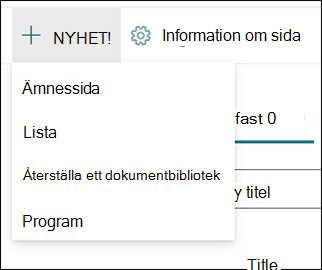
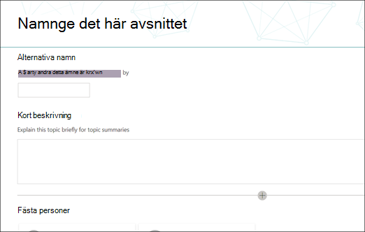

# Arbeta med ämnen i ämnes centret (för hands version)

> [!Note] 
> Innehållet i den här artikeln gäller för projekt cortex privat för hands version. [Lär dig mer om Project cortex](https://aka.ms/projectcortex).

I ämnes Center kan en kunskaps chef granska ämnen som har mined och upptäckts i de SharePoint source locations som du har angett, och du kan antingen bekräfta eller avvisa dem. En kunskaps chef kan också skapa och publicera nya avsnitts sidor om en sådan inte fanns i ämnes identifieringen eller redigera befintliga om de måste uppdateras.

## Krav

För att kunna arbeta i ämnes centret måste du ha nödvändig behörighet. Din administratör kan lägga till dig under [Inställningar för kunskaps hantering](set-up-knowledge-network.md), eller så kan nya användare [läggas till senare](give-user-permissions-to-the-topic-center.md).

Användare av ämnes Center kan få två uppsättningar behörigheter:

- Skapa och redigera ämnen: skapa nya avsnitt eller uppdatera ämnets innehåll som beskrivning, dokument och associerade personer
- Hantera ämnen: Använd instrument panelen för ämnes hantering för att granska ämnen i hela organisationen. Användare kan utföra åtgärder som bekräfta och avvisa ämnen

## Granska obekräftade ämnen

På Start sidan för ämnes Center visas de avsnitt som upptäckts på dina angivna SharePoint source locations på fliken **obekräftat** . En användare med behörighet att hantera ämnen kan granska obekräftade ämnen och välja att bekräfta eller avvisa dem.

Så här granskar du ett obekräftat avsnitt:

1. På fliken **obekräftade** markerar du avsnittet för att öppna sidan ämne. 

2. På sidan ämne granskar du sidan ämne och väljer **Redigera** om du behöver göra några ändringar på sidan.
3. På Start sidan för kunskaps Center går du till det valda avsnittet: 
    a. Markera kryss rutan för att bekräfta att du vill behålla avsnittet. 
    b. Välj **x** om du vill avvisa avsnittet. 

    Bekräftade ämnen kommer att tas bort från den **obekräftade** listan och kommer nu att visas på fliken **Bekräfta** . 

    Avvisade ämnen tas bort från den **obekräftade** listan och visas nu på fliken **avvisad eller utesluten** . 
    
   
## Skapa ett nytt ämne

En användare med behörigheten Skapa eller redigera ämnen kan skapa ett nytt avsnitt om det behövs. Det kan hända att du måste göra det här om det inte upptäcks under identifiering eller om AI-tekniken inte hittade tillräckligt många belägg för att det ska bli ett ämne.

Så här skapar du ett nytt ämne:
1. På sidan avsnitt Center väljer du **nytt**och sedan **sidan ämne**. 

      

2. På sidan ny ämne kan du fylla i informationen om den nya ämnes mal len: 
    a. Skriv namnet på det nya avsnittet i avsnittet **namn i det här avsnittet** . 
    b. I avsnittet **alternativa namn** skriver du namn eller akronymer som också används för att referera till ämnet. 
    c. Skriv en eller två meningar för ämnet i avsnittet **kort beskrivning** . Den här texten används för det associerade ämnes kortet. 
    d. Skriv namnen på ämnes experterna i avsnittet **personer** . 
    e. I avsnittet **filer och sidor** väljer du **Lägg till** och på nästa sida kan du välja associerade OneDrive-filer eller SharePoint Online-sidor. 
    f. I avsnittet **Sites** väljer du **Add**. I fönstret  **webbplatser** som visas väljer du de webbplatser som är kopplade till avsnittet. 

      
3. Om du behöver lägga till andra komponenter på sidan, till exempel text, bilder, webb delar, länkar o.s.v., väljer du ikonen arbets yta mitt på sidan för att hitta och lägga till dem.
       

4. När du är klar väljer du **publicera** för att publicera avsnitts sidan. Publicerade ämnes sidor visas på fliken **sidor** .

> [!Note] 
> Sidan ny ämne består av webb delar som är *medvetna om kunskaps nätverk*. Det innebär att när AI samlar in mer information om ämnet, uppdateras informationen i dessa webb delar med förslag för att göra sidan mer användbar för användarna.

## Redigera en befintlig ämnes sida

Befintliga sidor finns på sidan **sidor** . 

1. Välj **sidor**på sidan avsnitts Center. 
2. På sidan **sidor** visas en lista med avsnitts sidor. Använd sökrutan för att hitta den sida du vill uppdatera. Klicka på namnet på den avsnitts sida som du vill redigera. 
3. På sidan ämne väljer du **Redigera**.  
4. Gör de ändringar du behöver på sidan. Detta inkluderar uppdateringar av följande fält: 
    a. Alternativa namn 
    b. Beskrivning 
    c. Kontakter 
    d. Filer och sidor 
    e. Sidor 
    f. Du kan också lägga till statiska objekt på sidan – till exempel text, bilder eller länk – genom att välja ikonen för arbets ytan. 

5. Välj **publicera** för att spara ändringarna.

## Se även

  

