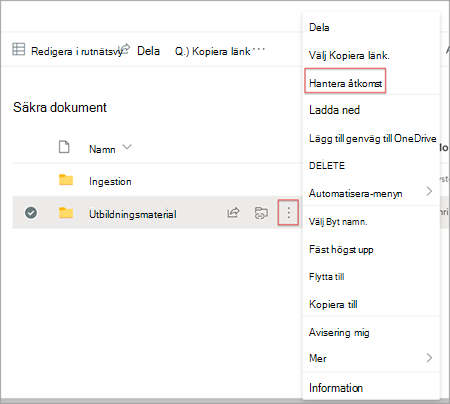
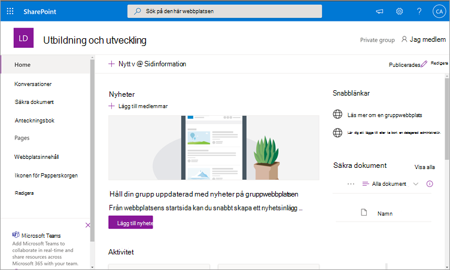
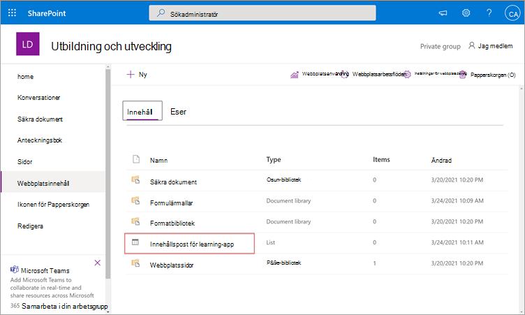
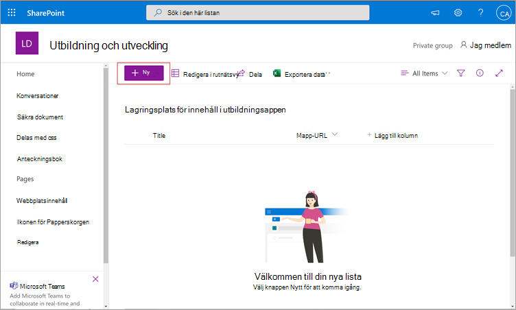
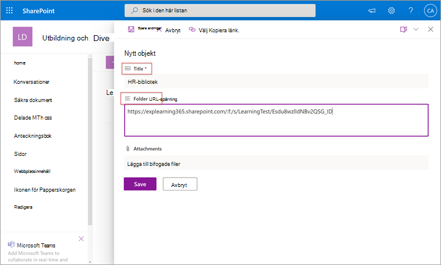
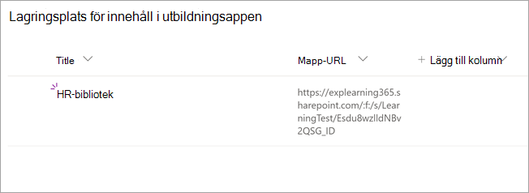
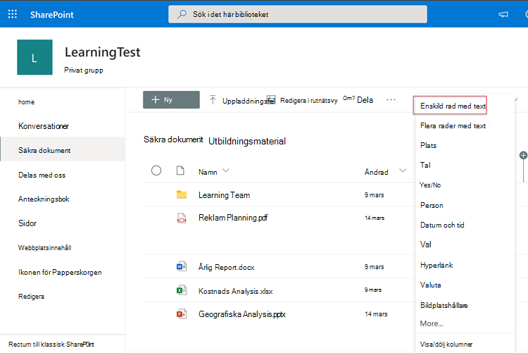
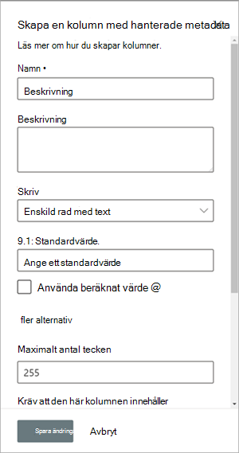
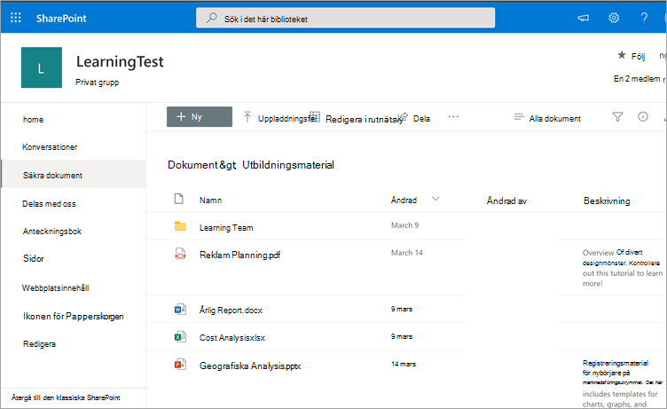
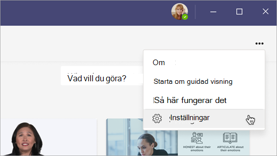

# Kommer snart: Konfigurera SharePoint som en källa för utbildningsinnehåll för Microsoft Viva Learning (förhandsversion)

> [!NOTE]
> Informationen i den här artikeln gäller en förhandsversion av en produkt som kan komma att ändras väsentligt innan den släpps till kommersiellt bruk. 

Du kan konfigurera SharePoint som källa för utbildningsinnehåll så att organisationens eget innehåll blir tillgängligt i Viva Learning (förhandsversion).

## Översikt

Kunskapsadministratören (eller global administratör) tillhandahåller en webbplats-URL till där tjänsten utbildningstjänst kan skapa en tom centraliserad plats – lagringsplatsen för innehåll i utbildningsappen – i form av en strukturerad SharePoint-lista. Den här listan kan användas av din organisation för att hålla länkar till SharePoint-mappar som innehåller utbildningsinnehåll över hela företaget. Administratörer ansvarar för att samla in och administrera en lista med URL:er för mappar. De här mapparna bör endast innehålla innehåll som kan göras tillgängligt i Viva Learning (förhandsversion).

Viva Learning (förhandsversion) har stöd för följande dokumenttyper:

- Word, PowerPoint, Excel, PDF
- Ljud (.m4a)
- Video (.mov, .mp4, .avi)

Mer information finns i Begränsningar [för SharePoint.](/office365/servicedescriptions/sharepoint-online-service-description/sharepoint-online-limits?redirectSourcePath=%252farticle%252fSharePoint-Online-limits-8f34ff47-b749-408b-abc0-b605e1f6d498) 

## Behörigheter

URL-adresser för dokumentbiblioteksmappar kan samlas in från alla SharePoint-webbplatser i organisationen. Viva Learning (förhandsversion) följer alla befintliga innehållsbehörigheter. Därför är endast innehåll där en användare har behörighet att komma åt sökbart och synligt i Viva Learning (förhandsversion). Allt innehåll i de här mapparna är sökbart, men endast innehåll som de enskilda anställda har behörighet till kan användas.

Borttagning av innehåll från organisationens lagringsplats stöds inte för närvarande.

Gör så här om du vill ta bort innehåll som inte fick visas av dig:

1.  Om du vill begränsa åtkomsten till dokumentbiblioteket **väljer du alternativet Visa** åtgärder och sedan Hantera **åtkomst.**
     
     

2.  Ta bort det ursprungliga dokumentet i dokumentbiblioteket.

Mer information finns i [Delning och behörigheter i det moderna SharePoint-använda användavärdet.](/sharepoint/modern-experience-sharing-permissions) 

## Utbildningstjänst

Tjänsten utbildning använder de angivna mapp-URL:erna för att hämta metadata från allt innehåll som lagras i de mapparna. Inom 24 timmar efter att mapp-URL:en har levererats på den centrala lagringsplatsen kan anställda söka efter och använda organisationens innehåll i Viva Learning (förhandsversion). Alla ändringar av innehåll, inklusive uppdaterade metadata och behörigheter, kommer också att tillämpas i utbildningstjänsten inom 24 timmar.

## Konfigurera SharePoint som källa

Du måste vara global Microsoft 365-administratör, SharePoint-administratör eller kunskapsadministratör för att kunna utföra de här uppgifterna.

Om du vill konfigurera SharePoint som källor för utbildningsinnehåll för Viva Learning (förhandsversion) gör du så här:

1.  I det vänstra navigeringsfältet i administrationscentret för Microsoft 365 går du till  >  **Inställningar Organisationsinställningar.**
 
2.  Välj  **Viva Learning (förhandsversion)** **på** fliken Tjänster på sidan Organisationsinställningar.

     

3.  På panelen **Viva Learning (förhandsversion)** under SharePoint hittar du webbplats-URL:en till Den SharePoint-webbplats där du vill att Viva Learning (förhandsversion) ska skapa en central lagringsplats.

     

4.  En SharePoint-lista skapas automatiskt på den angivna SharePoint-webbplatsen.

     

     I det vänstra navigeringsfältet på SharePoint-webbplatsen väljer du **Webbplatsinnehåll**  >  **lagringsplats för utbildning av appinnehåll.** 

      

5. På sidan **Lagringsplats för innehåll i** utbildningsappar fyller du i SharePoint-listan med WEBBADRESSer till mapparna med utbildningsinnehåll.

   1. Välj **Ny** för att visa **panelen Nytt** objekt. 

       
 
   2. På panelen **Nytt objekt** går du till **fältet Rubrik** och lägger till ett valfri katalognamn. Lägg till **URL:en** till mappen utbildningsinnehåll i fältet Mapp-URL. Välj **Spara**.

       

   3. Sidan **lagringsplats för innehåll i utbildningsappen** uppdateras med det nya utbildningsinnehållet.

       

> [!NOTE]
> För att ge bredare åtkomst till lagringsplatsen för innehåll i utbildningsappen kommer en länk till listan snart att finnas i gränssnittet för Viva Learning (förhandsversion) där användare kan begära åtkomst och få hjälp med att fylla på listan. Webbplatsägare och globala administratörer måste bevilja åtkomst till listan. Access är bara specifikt för listan och gäller inte för webbplatsen där listan lagras. Mer information finns i [Artikeln om att tillhandahålla organisationens innehåll](#provide-your-own-organizations-content) längre fram i den här artikeln.

### Dokumentbiblioteks curation för mapp-URL

Standardmetadata (t.ex. ändringsdatum, skapat av, dokumentnamn, innehållstyp och organisationsnamn) hämtas automatiskt till Viva Learning (förhandsversion) av Microsoft Graph API.
 
För att förbättra den övergripande identifieringen och sökrelevansen för innehållet rekommenderar vi att du lägger till **en beskrivningskolumn.**

Så här lägger **du** till en beskrivningskolumn på dokumentbibliotekssidan:

1.  På sidan **Dokument** väljer du Lägg **till kolumn**.

2. Välj **alternativet Visa** åtgärder och välj sedan **Enskild rad med text.**

     

3. Lägg **till ett beskrivande** namn för **kolumnen i fältet** Namn på panelen Skapa en kolumn. Välj **Spara**.

     
 
4. Lägg **till anpassade** beskrivningar för **varje objekt** i kolumnen Beskrivning på sidan Dokument. Om ingen beskrivning anges ger Viva Learning (förhandsversion) ett standardmeddelande som markerar innehållet som från ditt eget SharePoint-bibliotek. 

     
 
### Tillhandahålla innehållet för din egen organisation

Knowledge admins can access their organization's Learning App Content Repository in SharePoint, where they can provide references to cross-organization document libraries. Innehåll i de här biblioteken visas sedan som utbildningsinnehåll i Viva Learning (förhandsversion).

1. I Viva Learning (förhandsversion) väljer **du Fler alternativ** (**...**) och sedan **Inställningar**.

     
     
2. Välj **Behörigheter** under **Inställningar.**

     

3. Välj **Kontrollera åtkomst** för att ansluta till organisationens centrala bibliotek.
     
