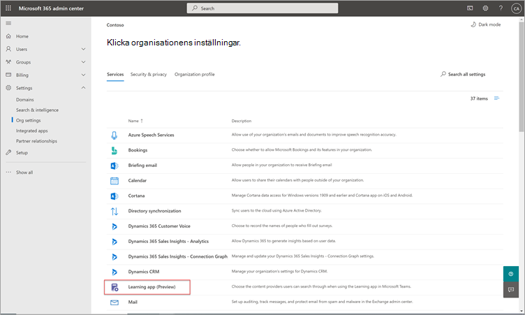
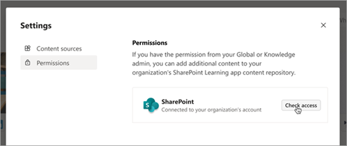

# Kommer snart: Konfigurera SharePoint som en källa för utbildningsinnehåll för Microsoft Viva Learning (förhandsversion)Coming soon: Configure SharePoint as a learning content source for Microsoft Viva Learning (Preview)

> [!NOTE]
> Informationen i den här artikeln gäller en förhandsversion av en produkt som kan komma att ändras väsentligt innan den släpps till kommersiellt bruk.The information in this article relates to a preview product that may be substantially modified before it's commercially released. 

Du kan konfigurera SharePoint som källa för utbildningsinnehåll så att organisationens eget innehåll blir tillgängligt i Viva Learning (förhandsversion).You can configure SharePoint as a learning content source to make your organization's own content available in Viva Learning (Preview).

## ÖversiktOverview

Kunskapsadministratören (eller global administratör) tillhandahåller en webbplats-URL till där tjänsten utbildningstjänst kan skapa en tom centraliserad plats – lagringsplatsen för innehåll i utbildningsappen – i form av en strukturerad SharePoint-lista.The knowledge admin (or global administrator) provides a site URL to where the Learning Service can create an empty centralized location—the Learning App Content Repository—in the form of a structured SharePoint list. Den här listan kan användas av din organisation för att hålla länkar till SharePoint-mappar som innehåller utbildningsinnehåll över hela företaget.This list can be used by your organization to house links to cross-company SharePoint folders that contain learning content. Administratörer ansvarar för att samla in och administrera en lista med URL:er för mappar.Admins are responsible for collecting and curating a list of URLs for folders. De här mapparna bör endast innehålla innehåll som kan göras tillgängligt i Viva Learning (förhandsversion).These folders should only include content that can be made available in Viva Learning (Preview).

Viva Learning (förhandsversion) har stöd för följande dokumenttyper:Viva Learning (Preview) supports the following document types:

- Word, PowerPoint, Excel, PDFWord, PowerPoint, Excel, PDF
- Ljud (.m4a)Audio (.m4a)
- Video (.mov, .mp4, .avi)Video (.mov, .mp4, .avi)

Mer information finns i Begränsningar [för SharePoint.](/office365/servicedescriptions/sharepoint-online-service-description/sharepoint-online-limits?redirectSourcePath=%252farticle%252fSharePoint-Online-limits-8f34ff47-b749-408b-abc0-b605e1f6d498)For more information, see [SharePoint limits](/office365/servicedescriptions/sharepoint-online-service-description/sharepoint-online-limits?redirectSourcePath=%252farticle%252fSharePoint-Online-limits-8f34ff47-b749-408b-abc0-b605e1f6d498). 

## BehörigheterPermissions

URL-adresser för dokumentbiblioteksmappar kan samlas in från alla SharePoint-webbplatser i organisationen.Document library folder URLs can be collected from any SharePoint site in the organization. Viva Learning (förhandsversion) följer alla befintliga innehållsbehörigheter.Viva Learning (Preview) follows all existing content permissions. Därför är endast innehåll där en användare har behörighet att komma åt sökbart och synligt i Viva Learning (förhandsversion).Therefore, only content for which a user has permission to access is searchable and visible within Viva Learning (Preview). Allt innehåll i de här mapparna är sökbart, men endast innehåll som de enskilda anställda har behörighet till kan användas.Any content within these folders will be searchable, but only content to which the individual employee has permissions can be used.

Borttagning av innehåll från organisationens lagringsplats stöds inte för närvarande.Content deletion from your organization’s repository is not currently supported.

Gör så här om du vill ta bort innehåll som inte fick visas av dig:To remove unintentionally surfaced content, follow these steps:

1.  Om du vill begränsa åtkomsten till dokumentbiblioteket **väljer du alternativet Visa** åtgärder och sedan Hantera **åtkomst.**To restrict access to the document library, select the **Show actions** option, and then select **Manage access**.
     
     

2.  Ta bort det ursprungliga dokumentet i dokumentbiblioteket.Delete the original document within the document library.

Mer information finns i [Delning och behörigheter i det moderna SharePoint-använda användavärdet.](/sharepoint/modern-experience-sharing-permissions)For more information, see [Sharing and permissions in the SharePoint modern experience](/sharepoint/modern-experience-sharing-permissions). 

## UtbildningstjänstLearning Service

Tjänsten utbildning använder de angivna mapp-URL:erna för att hämta metadata från allt innehåll som lagras i de mapparna.The Learning Service uses the provided folder URLs to get metadata from all content stored in those folders. Inom 24 timmar efter att mapp-URL:en har levererats på den centrala lagringsplatsen kan anställda söka efter och använda organisationens innehåll i Viva Learning (förhandsversion).Within 24 hours of supplying the folder URL in the centralized repository, employees can search for and use your organization’s content within Viva Learning (Preview). Alla ändringar av innehåll, inklusive uppdaterade metadata och behörigheter, kommer också att tillämpas i utbildningstjänsten inom 24 timmar.All changes to content, including updated metadata and permissions, will also be applied in the Learning Service within 24 hours.

## Konfigurera SharePoint som källaConfigure SharePoint as a source

Du måste vara global Microsoft 365-administratör, SharePoint-administratör eller kunskapsadministratör för att kunna utföra de här uppgifterna.You must be a Microsoft 365 global administrator, SharePoint administrator, or knowledge admin to perform these tasks.

Om du vill konfigurera SharePoint som källor för utbildningsinnehåll för Viva Learning (förhandsversion) gör du så här:To configure SharePoint as a learning content sources in for Viva Learning (Preview), follow these steps:

1.  I det vänstra navigeringsfältet i administrationscentret för Microsoft 365 går du till  >  **Inställningar Organisationsinställningar.**In the left navigation of the Microsoft 365 admin center, go to **Settings** > **Org settings**.
 
2.  Välj  **Viva Learning (förhandsversion)** **på** fliken Tjänster på sidan Organisationsinställningar.On the **Org settings** page, on the **Services** tab, select **Viva Learning (Preview)**.

     

3.  På panelen **Viva Learning (förhandsversion)** under SharePoint hittar du webbplats-URL:en till Den SharePoint-webbplats där du vill att Viva Learning (förhandsversion) ska skapa en central lagringsplats.On the **Viva Learning (Preview)** panel, under SharePoint, provides the site URL to the SharePoint site where you want Viva Learning (Preview) to create a centralized repository.

     

4.  En SharePoint-lista skapas automatiskt på den angivna SharePoint-webbplatsen.A SharePoint list is created automatically within the provided SharePoint site.

     

     I det vänstra navigeringsfältet på SharePoint-webbplatsen väljer du **Webbplatsinnehåll**  >  **lagringsplats för utbildning av appinnehåll.**In the left navigation of the SharePoint site, select **Site contents** > **Learning App Content Repository**. 

      

5. På sidan **Lagringsplats för innehåll i** utbildningsappar fyller du i SharePoint-listan med WEBBADRESSer till mapparna med utbildningsinnehåll.On the **Learning App Content Repository** page, populate the SharePoint list with URLs to the learning content folders.

   1. Välj **Ny** för att visa **panelen Nytt** objekt.Select **New** to view the **New item** panel. 

       
 
   2. På panelen **Nytt objekt** går du till **fältet Rubrik** och lägger till ett valfri katalognamn.On the **New item** panel, in the **Title** field, add a directory name of your choice. Lägg till **URL:en** till mappen utbildningsinnehåll i fältet Mapp-URL.In the **Folder URL** field, add the URL to the learning content folder. Välj **Spara**.Select **Save**.

       

   3. Sidan **lagringsplats för innehåll i utbildningsappen** uppdateras med det nya utbildningsinnehållet.The **Learning App Content Repository** page is updated with the new learning content.

       

> [!NOTE]
> För att ge bredare åtkomst till lagringsplatsen för innehåll i utbildningsappen kommer en länk till listan snart att finnas i gränssnittet för Viva Learning (förhandsversion) där användare kan begära åtkomst och få hjälp med att fylla på listan.To allow for broader access to the Learning App Content Repository, a link to the list soon will be available in the Viva Learning (Preview) interface where users can request access and ultimately help populate the list. Webbplatsägare och globala administratörer måste bevilja åtkomst till listan.Site owners and global administrators will be required to grant access to the list. Access är bara specifikt för listan och gäller inte för webbplatsen där listan lagras.Access is specific to the list only and does not apply to the site where the list is stored. Mer information finns i [Artikeln om att tillhandahålla organisationens innehåll](#provide-your-own-organizations-content) längre fram i den här artikeln.For more information, see [Provide your own organization's content](#provide-your-own-organizations-content) later in this article.

### Dokumentbiblioteks curation för mapp-URLFolder URL document library curation

Standardmetadata (t.ex. ändringsdatum, skapat av, dokumentnamn, innehållstyp och organisationsnamn) hämtas automatiskt till Viva Learning (förhandsversion) av Microsoft Graph API.Default metadata (such as modified date, created by, document name, content type, and organization name) is automatically pulled into Viva Learning (Preview) by the Microsoft Graph API.
 
För att förbättra den övergripande identifieringen och sökrelevansen för innehållet rekommenderar vi att du lägger till **en beskrivningskolumn.**To improve overall discovery and search relevance of the content, we recommend adding a **Description** column.

Så här lägger **du** till en beskrivningskolumn på dokumentbibliotekssidan:To add a **Description** column to the document library page, follow these steps:

1.  På sidan **Dokument** väljer du Lägg **till kolumn**.On the **Documents** page, select **Add column**.

2. Välj **alternativet Visa** åtgärder och välj sedan **Enskild rad med text.**Select the **Show actions** option, and then select **Single line of text**.

     

3. Lägg **till ett beskrivande** namn för **kolumnen i fältet** Namn på panelen Skapa en kolumn.On the **Create a column** panel, in the **Name** field, add a descriptive name for the column. Välj **Spara**.Select **Save**.

     
 
4. Lägg **till anpassade** beskrivningar för **varje objekt** i kolumnen Beskrivning på sidan Dokument.On the **Documents** page, in the **Description** column, add custom descriptions for each item. Om ingen beskrivning anges ger Viva Learning (förhandsversion) ett standardmeddelande som markerar innehållet som från ditt eget SharePoint-bibliotek.If no description is supplied, Viva Learning (Preview) will provide a default message that highlights the content as being from your own SharePoint library. 

     
 
### Tillhandahålla innehållet för din egen organisationProvide your own organization's content

Knowledge admins can access their organization's Learning App Content Repository in SharePoint, where they can provide references to cross-organization document libraries.Knowledge admins can access their organization’s Learning App Content Repository in SharePoint, where they can provide references to cross-organization document libraries. Innehåll i de här biblioteken visas sedan som utbildningsinnehåll i Viva Learning (förhandsversion).Content within these libraries will be then surfaced as learning content in Viva Learning (Preview).

1. I Viva Learning (förhandsversion) väljer **du Fler alternativ** (**...**) och sedan **Inställningar**.In Viva Learning (Preview), select **More options** (**...**), and then select **Settings**.

     
     
2. Välj **Behörigheter** under **Inställningar.**Under **Settings**, select **Permissions**.

     

3. Välj **Kontrollera åtkomst** för att ansluta till organisationens centrala bibliotek.Select **Check access** to connect to your organization’s centralized library.
     
