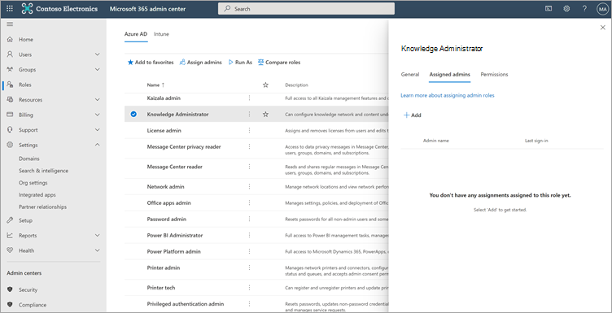
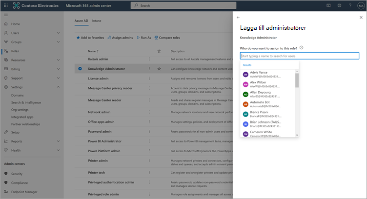
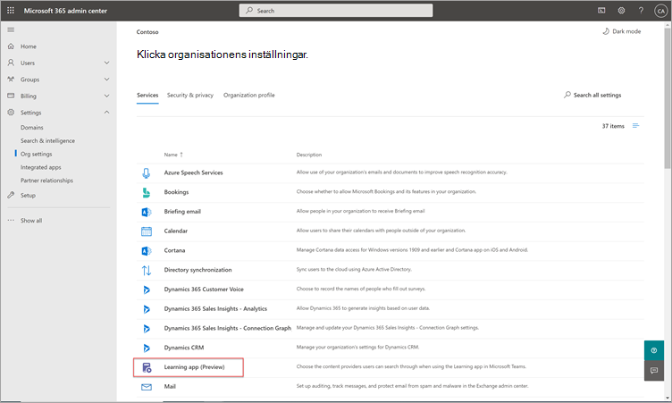
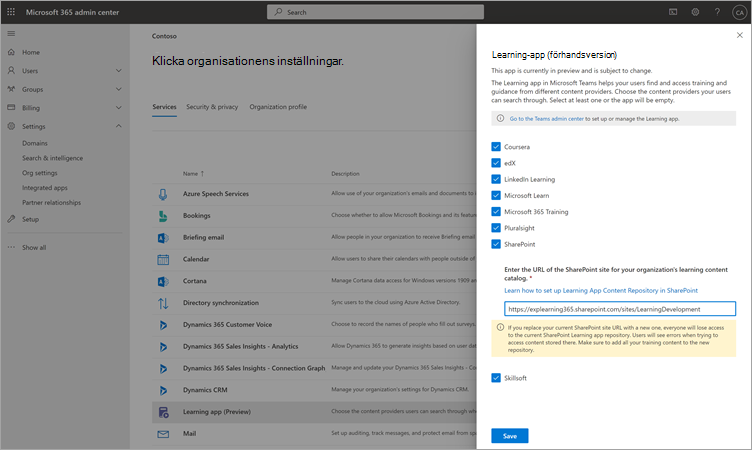

# Konfigurera utbildningsinnehållskällor för Microsoft Viva Learning (förhandsversion) Microsoft 365 administrationscentret för utbildningConfigure learning content sources for Microsoft Viva Learning (Preview) in the Microsoft 365 admin center

> [!NOTE]
> Informationen i den här artikeln gäller en förhandsversion av en produkt som kan komma att ändras väsentligt innan den släpps till kommersiellt bruk.The information in this article relates to a preview product that may be substantially modified before it's commercially released. 

Administratörerna för administrationscentret i Microsoft 365 – antingen på egen hand eller genom att tilldela rollen som kunskapsadministratör till valda personer i organisationen – kan hantera inställningar för Viva Learning (förhandsversion) och konfigurera källor för utbildningsinnehåll.The administrators for the Microsoft 365 admin center—either by themselves or by assigning the knowledge admin role to selected individuals in your organization—can manage settings related to Viva Learning (Preview) and can configure the learning content sources.

Administratören väljer vilka andra källor för utbildningsinnehåll (till exempel SharePoint eller källor som stöds från tredjepartsleverantörer av innehåll) som är tillgängliga för användare av Viva Learning (förhandsversion).The administrator selects which other learning content sources (for example, SharePoint or supported third-party content provider sources) will be available to users of Viva Learning (Preview). Administratören konfigurerar sedan dessa källor för att se till att innehållet är tillgängligt för sökning och identifiering och kan bläddras bland de anställda som använder Viva Learning (förhandsversion).The admin then configures those sources to make sure the content is available for search and discovery and can be browsed by the employees who use Viva Learning (Preview).

> [!NOTE]
>  Användarna loggar in på andra program än Microsoft och LinkedIn Learning Pro i en webbläsare eller ett inbäddat visningsprogram.Users sign in to non-Microsoft and LinkedIn Learning Pro learnings in a browser or embedded viewer. Den konfigurerade inlärningen omfattas av separata licens-, sekretess- och tjänstvillkor mellan din organisation och tredje part, och inte villkoren för Viva Learning (förhandsversion).This configured learning is subject to the separate license, privacy and service terms between your organization and the third party, and not the Viva Learning (Preview) terms. Innan du väljer den här typen av utbildning bör du kontrollera att organisationen och användarna har ett avtal.Before selecting this type of learning, verify you have an agreement in place for your organization and users.

## Tilldela knowledge admin-rollen (valfritt)Assign the knowledge admin role (Optional)

Du måste vara global Microsoft 365 för att utföra de här uppgifterna.You must be a Microsoft 365 global administrator to perform these tasks.

> [!TIP]
> Kunskapsadministratören bör vara måttligt teknisk och ha befintliga autentiseringsuppgifter som SharePoint-administratör, helst någon som är väl insatt inom utbildning, utbildning eller medarbetarupplevelse inom organisationen.The knowledge admin should be moderately technical and have existing SharePoint admin credentials, preferably someone who is well-versed in the education, learning, training, or employee experience part of the organization.

### Lägga till en kunskapsadministratörAdd a knowledge admin

Följ de här stegen om du vill lägga till en kunskapsadministratör för Viva Learning (förhandsversion):To add a knowledge admin for Viva Learning (Preview), follow these steps:

1.  I det vänstra navigeringsfältet i Microsoft 365 går du till **Roller**.In the left navigation of the Microsoft 365 admin center, go to **Roles**.

2.  På sidan **Roller** på fliken **Azure AD** väljer du **Knowledge Administrator**.On the **Roles** page, on the **Azure AD** tab, select **Knowledge Administrator**.
 
3.  På panelen **Knowledge Administrator** väljer du Tilldelade **administratörer och** sedan Lägg **till**.On the **Knowledge Administrator** panel, select **Assigned admins**, and then select **Add**.

     

3.  På panelen **Lägg till administratörer** väljer du den person du väljer för rollen och väljer sedan Lägg **till**.On the **Add admins** panel, select the person you choose for the role, and then select **Add**.

     

### Ta bort en kunskapsadministratörRemove a knowledge admin

Om du vill ta bort en kunskapsadministratör för Viva Learning (förhandsversion) gör du så här:To remove a knowledge admin for Viva Learning (Preview), follow these steps:

1.  I det vänstra navigeringsfältet i Microsoft 365 går du till **Roller**.In the left navigation of the Microsoft 365 admin center, go to **Roles**.

2.  På sidan **Roller** går du till **fliken Azure AD** och väljer sedan **Kunskapsadministratör.**On the **Roles** page, on the **Azure AD** tab, and then select **Knowledge Administrator**.
 
3.  På panelen **Kunskapsadministratör** på fliken **Tilldelade administratörer väljer** du Ta **bort** och sedan den person du vill ta bort från rollen.On the **Knowledge Administrator** panel, on the **Assigned Admins** tab, select **Remove**, and then select the person you want to remove from the role. Bekräfta genom att välja Ta **bort**.To confirm, select **Remove**.

     

## Konfigurera inställningar för källor för utbildningsinnehållConfigure settings for the learning content sources

Du måste vara global Microsoft 365 eller kunskapsadministratör för att kunna utföra de här uppgifterna.You must be a Microsoft 365 global administrator or knowledge admin to perform these tasks.

Så här konfigurerar du inställningar för källor för utbildningsinnehåll i Viva Learning:To configure settings for learning content sources in Viva Learning, follow these steps:

1.  I det vänstra navigeringsfältet i Microsoft 365 administrationscenter går du **till Inställningar**  >  **Organisationsinställningar.**In the left navigation of the Microsoft 365 admin center, go to **Settings** > **Org settings**.

2.  Välj  **Viva Learning (förhandsversion)** **på** fliken Tjänster på sidan Organisationsinställningar.On the **Org settings** page, on the **Services** tab, select **Viva Learning (Preview)**.

     

3.  På panelen **Viva Learning (förhandsversion)** väljer du de utbildningsinnehållskällor du vill konfigurera för organisationen och väljer sedan **Spara**.On the **Viva Learning (Preview)** panel, select the learning content sources you want to configure for the organization, and then select **Save**.

     

En del av alla utbildningskällor är aktiverade som standard.Among all the learning sources that exist, some will be enabled by default. Följande utbildningskällor omfattar:These learning sources include:

- LinkedIn Learning (kostnadsfritt innehåll)LinkedIn Learning (free content)
- Microsoft LearnMicrosoft Learn
- Microsoft 365 UtbildningMicrosoft 365 Training

> [!NOTE]
> Kostnadsfritt LinkedIn-innehåll tillhandahålls till användare enligt sekretesspolicyn och användaravtalet för LinkedIn.LinkedIn free content is provided to users under the LinkedIn privacy policies and user agreement. LinkedIn tar emot användarens IP-adress, eventuella cookies som tidigare ställts in av LinkedIn, och ställer in en ny cookie för att spåra användningen av kostnadsfritt innehåll.LinkedIn will receive the user’s IP address, any cookies previously set by LinkedIn, and will set a new cookie to track use of free content. Användarna behöver inte logga in med LinkedIn för att få kostnadsfritt innehåll.Users are not required to sign in with LinkedIn to receive free content.  
För LinkedIn premiuminnehåll behöver organisationen en prenumeration för ditt team för att få åtkomst till innehållet.For LinkedIn premium content, your organization needs a subscription for your team to access that content. Användarna måste logga in på LinkedIn för att få åtkomst till inlärningen, som tillhandahålls i villkoren för din organisations och din organisations användningsvillkor med LinkedIn.Users will need to sign into LinkedIn to access that learning, which is provided under the terms of your organization’s and user terms with LinkedIn.   För icke-Microsoft-innehåll (med undantag för kostnadsfritt LinkedIn-innehåll) ska du se till att din organisation har en prenumeration för användarna att komma åt innehållet med ett arbetskonto innan de ansluter det till Viva Learning (förhandsversion).For non-Microsoft content (except free LinkedIn content), ensure your organization has a subscription for your users to access that content using a work account before connecting it to Viva Learning (Preview). Användarnas personliga prenumerationer på icke-Microsoft-utbildningsleverantörer kommer inte att integreras med Viva Learning (förhandsversion).Users’ personal subscriptions to non-Microsoft learning providers will not be integrated with Viva Learning (Preview). Användarna loggar in på andra program än Microsoft och LinkedIn Learning Pro i en webbläsare eller ett inbäddat visningsprogram.Users sign in to non-Microsoft and LinkedIn Learning Pro learnings in a browser or embedded viewer. Om användarna navigerar till innehåll där de inte har en organisationsprenumeration kan de se en leverantörssida där de kan registrera sig för en enskild prenumeration.If users navigate to content where they do not have an organizational subscription, they may see a provider page where they could sign up for an individual subscription. All utbildning som inte är microsoft tillhandahålls enligt villkoren för icke-Microsoft-leverantör och inte som en del av Viva Learning.All non-Microsoft learning is provided under the non-Microsoft provider’s terms and not as part of Viva Learning. 

Om du vill aktivera eller inaktivera en källa för utbildningsinnehåll markerar du kryssrutan bredvid källan.To enable or disable a learning content source, select the check box next to the source. Om en källa är aktiverad visas en bockmarkering.If a source is enabled, a check mark will be visible.

## Tredjepartsleverantörer av innehållThird-party content providers 

Uppsättningen tillgängliga anslutna utbildningsleverantörer kan ändras när som helst.The set of available connected learning providers might change at any time. Fler leverantörer ansluter allt eftersom programmet växer.More providers will join as the program grows. Tillgängliga leverantörer kan också välja att avbryta sin anslutning med Viva Learning (förhandsversion).Available providers might also choose to discontinue their connection with Viva Learning (Preview).

### Skillsoft som innehållskällaSkillsoft as a content source  

För Viva Learning (förhandsversion) hamnar användare som har Skillsoft aktiverat och väljer att visa Kompetenssoft-innehåll på en Percipio-sida där de uppmanas att ange organisationens Percipio-webbplatsnamn.For Viva Learning (Preview), users who have Skillsoft enabled and choose to view Skillsoft content will land on a Percipio page that asks them to input your organization's Percipio site name. När användarna matar in organisationens webbplatsnamn dirigeras de till sidan för att logga in på din organisations Percipio-webbplats.After users input your organization's site name, they will be directed to page to sign in to your organization's Percipio site. Användarna loggar in med sina befintliga autentiseringsuppgifter och ser innehållet som de ursprungligen valde.Users will sign in by using their existing credentials and see the content they originally selected. Användarna uppmanas att ange Percipio-webbplatsens namn endast en gång, tills deras webbläsarcache har rensats.Users will be asked to input the Percipio site name only once, until their browser cache is cleared. För att effektivisera den här upplevelsen för dina användare rekommenderar vi att du inkluderar percipiowebbplatsnamnet i den interna kommunikation som du skickar om Viva Learning (förhandsversion).To streamline this experience for your users, we recommend including your Percipio site name in internal communications you send about Viva Learning (Preview).

Det här är tänkt som en tillfällig upplevelse för förhandsversionen och vi arbetar med Skillsoft för att möjliggöra en klientspecifik integrering för allmän tillgänglighet, vilket kringgår steget som kräver att användarna anger organisationens Percipio-webbplatsnamn.This is intended to be a temporary experience for preview, and we are working with Skillsoft to enable tenant-specific integration for general availability, which will bypass the step that requires users to provide your organization's Percipio site name. 

### Information om Microsoft – MicrosoftDetails on Microsoft substrate  

För data som du kopierar till Viva Learning (förhandsversion) från en tjänst som inte är en Microsoft-tjänst (utbildningsleverantör eller utbildningshanteringssystem) kan du inte direkt extrahera, korrigera eller ta bort dessa data i Viva Learning (förhandsversion).For data that you copy to Viva Learning (Preview) from a non-Microsoft service (learning provider or learning management system), you are not able to directly extract, correct, or delete that data in Viva Learning (Preview). Vi uppdaterar de data du importerar från leverantörer som inte är Microsoft-leverantörer snabbt för att återspegla ändringar och borttagningar i källdata som inte kommer från Microsoft.We refresh the data you import from non-Microsoft providers promptly to reflect changes and deletions in the non-Microsoft source data.

Du måste arbeta med leverantören av tjänsten som inte är Microsoft för att få åtkomst till, korrigera, ta bort eller extrahera data under licensen, tjänsten eller sekretessvillkoren för icke-Microsoft-tjänsten.You need to work with the supplier of the non-Microsoft service to access, correct, delete or extract data under the license, service, or privacy terms of the non-Microsoft service. Ändringarna som görs där återspeglas i de data som bearbetats för din användning i Viva Learning (förhandsversion) när datauppdateringscyklerna för tjänster som inte är Microsoft och Viva Learning (förhandsversion) har slutförts.The changes made there will be reflected in the data processed for your use in Viva Learning (Preview) upon completion of the data update cycles of the non-Microsoft service and Viva Learning (Preview). Om du stänger av anslutningen mellan Viva Learning (förhandsversion) och en tjänst som inte är en Microsoft-tjänst tas alla data du tidigare importerat från den tjänsten bort.If you turn off the connection between Viva Learning (Preview) and a non-Microsoft service, all data you had previously imported from that service will be deleted. 

## Nästa stegNext step

[Konfigurera SharePoint som källa för utbildningsinnehåll för Microsoft Viva Learning (förhandsversion)Configure SharePoint as a learning content source for Microsoft Viva Learning (Preview)](configure-sharepoint-content-source.md)