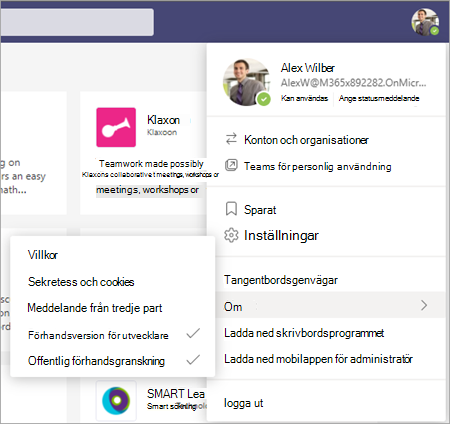
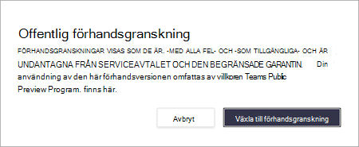
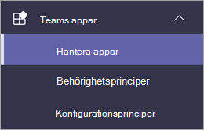
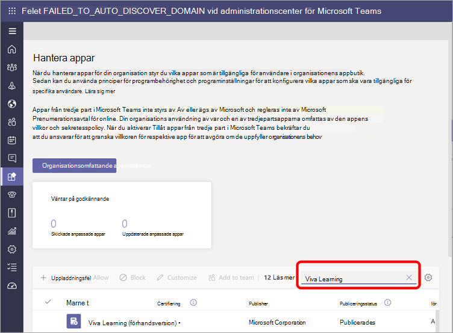
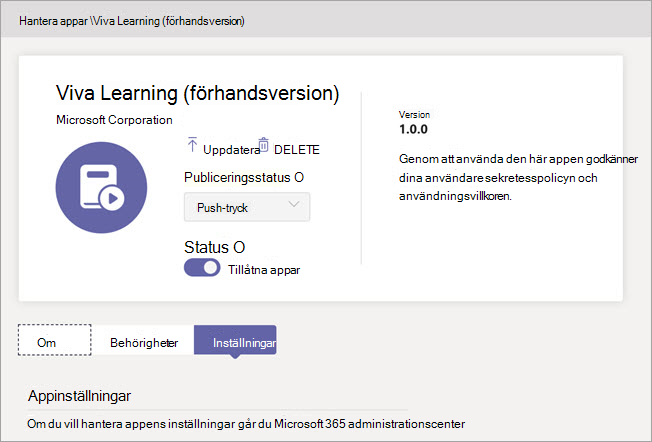
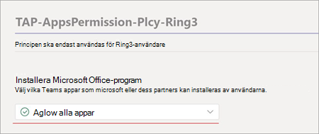

# Konfigurera Microsoft Viva Learning (förhandsversion) i Teams administrationscenter

> [!NOTE]
> Informationen i den här artikeln gäller en förhandsversion av en produkt som kan komma att ändras väsentligt innan den släpps till kommersiellt bruk. 

Administratören Teams vissa steg för att aktivera Viva Learning (förhandsversion) för sina användare i klientorganisationen. De här stegen varierar beroende på hur klientorganisationen är aktiverad: [*Offentlig förhandsversion*](set-up-teams-admin-center.md#public-preview-tenants) eller [ *Privat förhandsversion* (eller betaversion).](set-up-teams-admin-center.md#private-preview-tenants)

## Offentliga förhandsversionsklienter

### Administratörssteg för offentliga förhandsversionsklienter

Eftersom Viva-Learning (förhandsversion) ännu inte är tillgängligt i allmänhet krävs vissa steg för att aktivera funktioner och ange behörigheter för specifika användare eller grupper. 

1. Aktivera funktioner för offentlig förhandsversion för Viva Learning -användare (förhandsversion).

    a. Ändra Teams för att aktivera funktioner för offentlig förhandsgranskning. Se [Microsoft Teams offentlig förhandsversion](/microsoftteams/public-preview-doc-updates).

    b. Aktivera uppdateringsprincipen för användare eller grupper som ska utföra Viva Learning testning (förhandsversion). Se [Tilldela principer till användare och grupper.](/microsoftteams/assign-policies-users-and-groups)

2. Ändra appens behörighetsprincip för Viva Learning -användare (förhandsversion).

    a. Såvida den inte ingår i den globala principen ska du tillåta alla Microsoft-appar i appens behörighetsprincip. Se [Hantera appbehörighetsprinciper i Microsoft Teams](/microsoftteams/teams-app-permission-policies). 

    b. Aktivera appens behörighetsprincip för användare eller grupper som utför Viva Learning testning (förhandsversion). Se [Tilldela principer till användare och grupper.](/microsoftteams/assign-policies-users-and-groups)

3. Meddela användare som ska testa Viva Learning (förhandsversion) för att byta sin build-klient till [offentlig förhandsversion för Teams.](set-up-teams-admin-center.md#user-steps-for-public-preview-tenants)

> [!IMPORTANT]
> För klientorganisation av offentlig förhandsversion visas Viva Learning (förhandsversion) inte i Hanterade appar i Teams administrationscenter förrän den slutgiltiga produktlansen.  Aktiverade användare av offentlig förhandsversion kan hitta Viva Learning (förhandsversion) i appbutiken Teams och använda den, när rätt principer och behörigheter har angetts.

### Användarsteg för offentliga förhandsversionsklienter

Användare som har aktiverats för test av den offentliga förhandsversionen – genom att aktivera de principer som tidigare beskrivits [–](set-up-teams-admin-center.md#administrator-steps-for-public-preview-tenants) måste växla till offentlig förhandsgranskning i Teams klient. 

1. Användarna måste välja sin profilbild > **om**  >  **offentlig förhandsversion**.

    

2. Användarna måste godkänna villkoren för den offentliga förhandsversionen.

    

3. Användare kan nu hitta Viva Learning (förhandsversion) i Teams App Store och börja använda den.

## Privata förhandsversionsklienter

### Administratörssteg för privata förhandsversionsklienter (eller betaklienter)

Det finns inga ytterligare principer som behöver aktiveras för klientorganisationen av den privata förhandsversionen. Men Viva Learning (förhandsversion) måste göras tillgängligt för användare i organisationen.

1. I det vänstra navigeringsfältet i Teams administrationscenter går du till Teams   >  **Hantera appar**.

   

2. På sidan **Hantera appar** skriver du *Viva Learning* i sökrutan och väljer sedan **Viva Learning (förhandsversion)**.

   

3. På **sidan Viva Learning (förhandsversion)** under **Status**  väljer du Tillåts att aktivera Viva Learning (förhandsversion).

   

<!---
The Teams admin installs Viva Learning (Preview) and applies permission policies through the Teams admin center.

1. For Viva Learning (Preview), you must first set the Update policy in Teams. For more information, see [Microsoft Teams Public Preview](/MicrosoftTeams/public-preview-doc-updates).

    1. Sign in to the Teams admin center.

    2. Select **Teams** > **Update policies**.

    3. Select **Add**. 

    4. Name the update policy, add a policy, and turn on **Show preview features**.

2. The admin must notify users of the policy update so that they move their build into the Public Preview for Teams. 

    1. Users must select their profile image > **About** > **Public Preview**.
   
        
    
    2. Users must accept the **Public preview** terms and conditions.

        
 
3. For organizations that have restrictive policies and need to enable Viva Learning (Preview), follow the process in the next section.

## Manage settings for Viva Learning (Preview)

You must be an administrator in the Teams admin center to perform these tasks.

To make Viva Learning (Preview) available for users in your organization, follow these steps:

1. In the left navigation of the Teams admin center, go to **Teams apps** > **Manage apps**.

   

2. On the **Manage apps** page, in the search box, type *Viva learning*, and then select **Viva Learning (Preview)**.

   

3. On the **Viva Learning (Preview)** page:

   1. Under **Status**, select **Allowed** to turn on Viva Learning (Preview).

   2. On the **Settings** tab, under **App settings**, go to the Microsoft 365 admin center to [configure learning content sources](content-sources-365-admin-center.md).

   

4. After **Manage app** settings, go to **Permission policies** and **Setup policies** to grant permission to employees who should have access to Viva Learning (Preview) as part of your organization's participation in the preview.

> [!NOTE]
>  If your organization is in Ring 4.0 as part of Teams TAP100 program, you might need to enable approved users in Ring 3.0 to access Viva Learning (Preview).   As part of the preview, Viva Learning (Preview) is released in Ring 3.0. If your organization is in Ring 4.0, you won’t see Viva Learning (Preview) on the **Manage apps** page. To test the app, you need to create a custom apps permission policy, set it to **Allow all apps**, and assign it to Ring 3.0 approved users.      

--->

## Nästa steg

[Konfigurera utbildningsinnehållskällor för Viva Learning (förhandsversion) i Administrationscenter för Microsoft 365](content-sources-365-admin-center.md)
