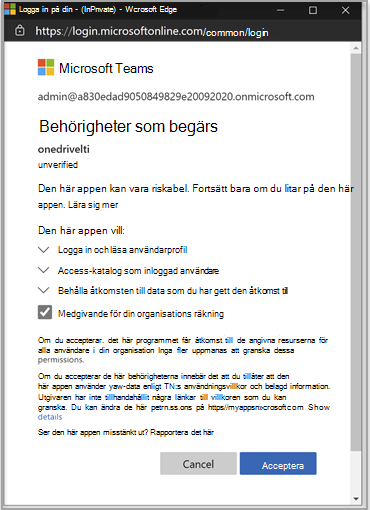
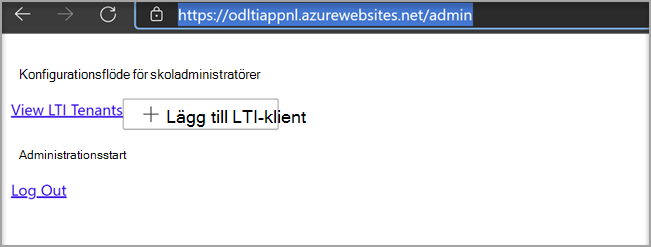
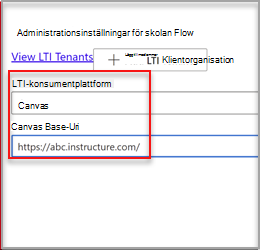

# Använda Microsoft OneDrive LTI med CanvasUse Microsoft OneDrive LTI with Canvas

> [!IMPORTANT]
> En del information gäller förinstallerad produkt som kan ha ändrats mycket innan den släpps kommersiellt.Some information relates to prereleased product which may be substantially modified before it's commercially released. Microsoft lämnar inga garantier, uttryckliga eller underförstådda, med avseende på den information som anges här.Microsoft makes no warranties, express or implied, with respect to the information provided here.

## Integrera med CanvasIntegrate with Canvas

Den person som utför den här integrationen bör vara administratör för Canvas och administratör för Microsoft 365 klientorganisationen.The person who performs this integration should be an admin of Canvas and an admin of the Microsoft 365 tenant.

1. Logga in på Microsoft Azure med klientorganisationens administratörskonto.Sign in to the Microsoft Azure portal with the tenant admin account. Azure-innehavaradministratören bör också ha rollen Gruppadministratör.The Azure tenant administrator should also have the Group administrator role.

    

2. Logga in på Microsoft [OneDrive LTI-portalen](https://odltiappnl.azurewebsites.net/admin).Sign in to the Microsoft [OneDrive LTI portal](https://odltiappnl.azurewebsites.net/admin).

3. Godkänn behörigheterna för att slutföra inloggningen.Accept the permissions to complete the sign-in.

    

4. Välj **Lägg till LTI-klient.**Select **Add LTI Tenant**.

     

5. Välj **LTI Consumer Platform** som **Canvas** i listrutan.Select **LTI Consumer Platform** as **Canvas** from the dropdown.

6. Välj **Arbetsytebas-URL** och välj sedan **Nästa**.Select **Canvas Base URL** and then select **Next**.

    

   På nästa skärm visas fält som är konfidentiella.The next screen shows fields that are confidential to you.

7. Välj **Nästa** från ??Select **Next** from ?? .page. KAN GRANSKARE FYLLA I DET TOMMA HÄR?CAN REVIEWERS FILL IN THE BLANK HERE?

8. Välj **Nästa** på skärmen som visar information som är konfidentiell.Select **Next** in the screen that shows information that's confidential to you.

   Den sista skärmen i Azure-portalen visar nästa steg för att lägga till din Canvas-instans.The final screen of the Azure portal shows the next steps for adding your Canvas instance.

9. Kopiera utvecklarnycklarna från den här skärmen.Copy the Developer Keys from this screen. Du kommer att använda när du skapar Canvas-instansen.You'll use when you create the Canvas instance.

## Lägga till Canvas-instansenAdd the Canvas instance

1. Avmarkera Administratörsutvecklarenycklar i  >  **Canvas-instansen.**In your Canvas instance, deselect **Admin** > **Developer Keys**.

2. Välj **LTI-nyckel** i listrutan på **Utvecklarnyckel**.Choose **LTI Key** in the dropdown on **Developer Key**.

   

3. Klistra in utvecklarnycklarna här.Paste the developer keys here.

     

   Nyckeln skapas i **AV-läge**The key gets created in **OFF** mode

   

4. Kopiera den markerade texten.Copy the highlighted text.
    Det här fungerar som klient-ID Microsoft OneDrive LTI-portalen.This serves as Client ID in Microsoft OneDrive LTI portal.

5. Klistra in texten i fältet **Klient-ID** i Microsoft OneDrive LTI-portalen och välj **sedan Nästa.**Paste the text into the **Client ID** field in Microsoft OneDrive LTI portal, and then select **Next**.

6. Välj **Spara**.Select **Save**.

7. Visa inställningarna genom att välja **Visa LTI-klientorganisation.**View the settings by selecting **View LTI Tenants**.
