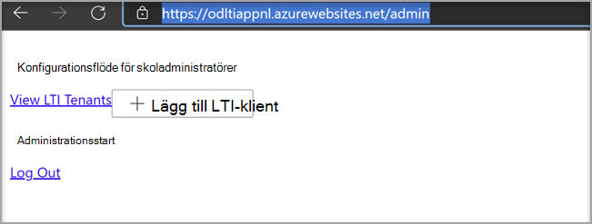

# Använda Microsoft OneDrive med ditt system för utbildningshanteringUse Microsoft OneDrive with your Learning Management System

> [!IMPORTANT]
> En del information gäller förinstallerad produkt som kan ha ändrats mycket innan den släpps kommersiellt.Some information relates to prereleased product which may be substantially modified before it's commercially released. Microsoft lämnar inga garantier, uttryckliga eller underförstådda, med avseende på den information som anges här.Microsoft makes no warranties, express or implied, with respect to the information provided here.

Lär dig fördelarna med att Microsoft OneDrive med ditt system för utbildningshantering (Learning Management System, LMS).Learn the benefits of using Microsoft OneDrive with your Learning Management System (LMS).

**Tar Microsoft Office 365 direkt till dina arbetsflöden****Brings Microsoft Office 365 directly into your workflows**

Appen Microsoft OneDrive Learning Tools Interoperability (LTI) integreras med LMS för att få Microsoft OneDrive och Microsoft Office 365 direkt till de viktigaste arbetsflödena som inkluderar:The Microsoft OneDrive Learning Tools Interoperability (LTI) App integrates with your LMS to bring Microsoft OneDrive and Microsoft Office 365 directly into your most important workflows that include:

- Bifoga resurser och ordna innehåll.Attaching resources and organizing content.
- Starta samarbetsdokument.Starting collaborative documents.
- Skapa och betygsätta uppgifter.Creating and grading assignments.

**Säker och helt kompatibel med de senaste LTI-standarderna****Secure and fully compliant with latest LTI standards**

Appen Microsoft OneDrive LTI är kompatibel med LTI 1.3 och LTI Advantage.The Microsoft OneDrive LTI App is compatible with LTI 1.3 and LTI Advantage. Den här fördelen ger en mycket säker och tätt integrerad användarupplevelse.This advantage allows for a highly secure and tightly integrated user experience.

**Modern och rik användarupplevelse****Modern and Rich User Experience**

Med Microsoft OneDrive LTI-appen får du det bästa av Microsoft direkt i LMS-upplevelsen.The Microsoft OneDrive LTI App brings the best of Microsoft right into your LMS experience. Vi förbättrar den befintliga Office 365-integreringen i LMS genom att tillhandahålla en modernare användarupplevelse, komplett med en ny och utökad Microsoft OneDrive filväljare och mer omfattande redigering för Office-filer.We're improving upon the existing Office 365 integration in your LMS by delivering a more modern user experience, complete with a new and expanded Microsoft OneDrive file picker and richer editing experiences for Office files. Microsoft kommer även att äga Microsoft OneDrive LTI-appen framöver, vilket innebär att du alltid får det senaste och bästa från Microsoft automatiskt.Microsoft will also fully own the Microsoft OneDrive LTI App going forward, which means you’ll always get the latest and greatest from Microsoft automatically.

Med Microsoft OneDrive LTI-appen kan du:The Microsoft OneDrive LTI App allows you to:

- Bifoga Office 365, inklusive Word-dokument, PowerPoint presentationer och Excel från Innehållsredigeraren.Attach Office 365 files including Word documents, PowerPoint presentations, and Excel from the Rich Content Editor.

- Distribuera Office 365 molnuppgifter.Distribute Office 365 cloud assignments.

- Visa och ordna dina personliga filer och Microsoft OneDrive filer.View and organize your personal and course Microsoft OneDrive files.

- Skapa samarbeten där kursmedlemmarna kan arbeta tillsammans med delade dokument i realtid.Create collaborations where course members can work together on shared documents in real time.

- Åtkomst till Microsoft OneDrive konton, inklusive personliga konton och skolkonton.Access multiple Microsoft OneDrive accounts, including personal and school accounts.

- Integrera Office 365 filer med kursmodulerna.Integrate Office 365 files with your course modules.

- Använd ditt Microsoft-konto för enkel inloggning med ditt LMS.Use your Microsoft account for single sign-on with your LMS.

## Integrera med CanvasIntegrate with Canvas

Den person som utför den här integrationen bör vara administratör för Canvas och administratör för Microsoft 365 klientorganisationen.The person who performs this integration should be an admin of Canvas and an admin of the Microsoft 365 tenant.

1. Logga in på Microsoft Azure med klientorganisationens administratörskonto.Sign in to the Microsoft Azure portal with the tenant admin account. Azure-innehavaradministratören bör också ha rollen Gruppadministratör.The Azure tenant administrator should also have the Group administrator role.

    

2. Logga in på Microsoft [OneDrive LTI-portalen](https://odltiappnl.azurewebsites.net/admin).Sign in to the Microsoft [OneDrive LTI portal](https://odltiappnl.azurewebsites.net/admin).

3. Godkänn behörigheterna för att slutföra inloggningen.Accept the permissions to complete the sign-in.

    

4. Välj **Lägg till LTI-klient.**Select **Add LTI Tenant**.

     

5. Välj **LTI Consumer Platform** som **Canvas** i listrutan.Select **LTI Consumer Platform** as **Canvas** from the dropdown.

6. Välj **Arbetsytebas-URL** och välj sedan **Nästa**.Select **Canvas Base URL** and then select **Next**.

    

   På nästa skärm visas fält som är konfidentiella.The next screen shows fields that are confidential to you.

7. Välj **Nästa** från ??Select **Next** from ?? .page. KAN GRANSKARE FYLLA I DET TOMMA HÄR?CAN REVIEWERS FILL IN THE BLANK HERE?

8. Välj **Nästa** på skärmen som visar information som är konfidentiell.Select **Next** in the screen that shows information that's confidential to you.

   Den sista skärmen i Azure-portalen visar nästa steg för att lägga till din Canvas-instans.The final screen of the Azure portal shows the next steps for adding your Canvas instance.

9. Kopiera utvecklarnycklarna från den här skärmen.Copy the Developer Keys from this screen. Du kommer att använda när du skapar Canvas-instansen.You'll use when you create the Canvas instance.

## Lägga till Canvas-instansenAdd the Canvas instance

1. Avmarkera Administratörsutvecklarenycklar i  >  **Canvas-instansen.**In your Canvas instance, deselect **Admin** > **Developer Keys**.

2. Välj **LTI-nyckel** i listrutan på **Utvecklarnyckel**.Choose **LTI Key** in the dropdown on **Developer Key**.

   

3. Klistra in utvecklarnycklarna här.Paste the developer keys here.

     

   Nyckeln skapas i **AV-läge**The key gets created in **OFF** mode

   

4. Kopiera den markerade texten.Copy the highlighted text.
    Det här fungerar som klient-ID Microsoft OneDrive LTI-portalen.This serves as Client ID in Microsoft OneDrive LTI portal.

5. Klistra in texten i fältet **Klient-ID** i Microsoft OneDrive LTI-portalen och välj **sedan Nästa.**Paste the text into the **Client ID** field in Microsoft OneDrive LTI portal, and then select **Next**.

6. Välj **Spara**.Select **Save**.

7. Visa inställningarna genom att välja **Visa LTI-klientorganisation.**View the settings by selecting **View LTI Tenants**.
