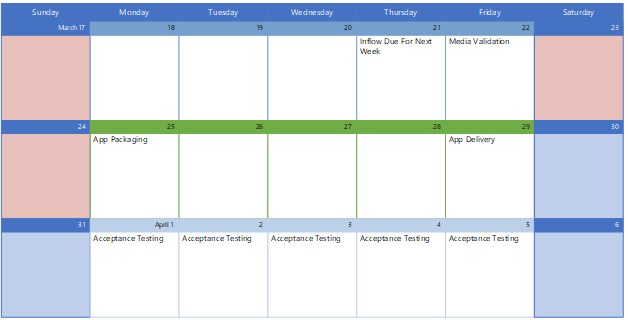

# Arbeta med Microsoft Consulting Services

Du kan kommunicera med Microsoft Consulting Services (MCS) för att få apparna paketerade för användning Microsoft Hanterat skrivbord. Kontakta DIN kontorepresentant för att kontakta MCS och ta kontakt med din specifika appförpackningsprojekt för mer information.

## Roller och ansvar

Om du vill arbeta med **MCS-appförpackningen måste du ange följande element:**

- Installationsfilerna för källan (till exempel setup.exe eller .msi).
- Installationsanvisningarna som anger hur den slutliga installationen ska se ut. Ska det till exempel finnas en genväg till programmet på skrivbordet? Vad ska appens synlighet vara? Ska programmet ansluta till en server och i så fall vilken? Mer information finns i mallen [för paketeringsförfrågan för programmet.](https://github.com/MicrosoftDocs/microsoft-365-docs/raw/public/microsoft-365/managed-desktop/get-ready/downloads/app-packaging-template.docx)
- Du måste utföra egna godkännandetester för att verifiera att appen fungerar som den ska i din miljö.

**MCS sköter de här åtgärderna:**

- Kontrollera om appen är förbjuden eller begränsad i Microsoft Hanterat skrivbord miljön.
- Testning av installation, start och avinstallation av programmet för att säkerställa kompatibilitet med Windows 10. Om MCS upptäcker ett kompatibilitetsproblem lämnar de över appen till [Assure-programmet](/fasttrack/products-and-capabilities#app-assure) för appen för åtgärd.
- Paketera appen till din specifikation och testa sedan appdistribution med hjälp av Microsoft Intune.

## Schema för appleverans

Påbörja paketeringsprocessen genom att överföra appinformationen till Microsoft Hanterat skrivbord portal. Paketeringsteamet granskar nya inskickade inskickade inskickade produkter varje torsdag. Efter granskning och paketering levereras de paketerade apparna följande fredag. Upp till fem appar per vecka kan paketeras för att starta men tjänsten kan skalas efter dina behov.

Du meddelas när appen har levererats. Du har då 21 dagar på dig att utföra godkännandetester och godkänna arbetet i Microsoft Hanterat skrivbord portalen. Om du upptäcker problem med appen under godkännandetestningen avvisar du appen i Microsoft Hanterat skrivbord-portalen så ansluts du via e-post till en MCS-paketerare för att förstå och lösa problemet.

## Testa konton och miljö

För att paketeringsteamet ska slutföra migreringen till Microsoft Intune rekommenderar vi att du anger vissa behörigheter:

- Åtkomst Microsoft Intune programdistributionsfunktionerna för att lägga till och tilldela programmet
- Testa grupper, användarkonton och licenser för paketeraren för att kunna testa apparna

MCS använder behörigheterna för att utföra följande åtgärder:

- Se till att appen fungerar på den virtuella datorn som konfigurerats för Microsoft Hanterat skrivbord
- Ladda upp programmet till Microsoft Intune för distribution till användarna

Utan dessa behörigheter är det möjligt för MCS att gå framåt, men de kommer inte att kunna ladda upp programmen till din miljö.
