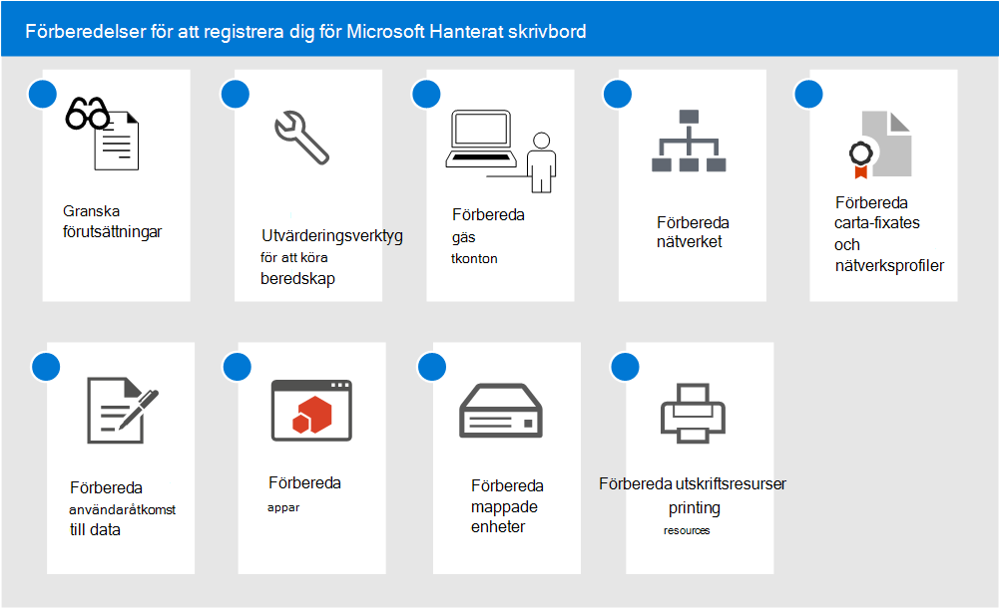

# Förberedelser för att registrera dig för Microsoft Hanterat skrivbordGet ready for enrollment in Microsoft Managed Desktop

Dessa ämnen beskriver de steg som du måste utföra i din organisation för att förbereda för registrering, t. ex. kontroll av att din miljö uppfyller viktiga förutsättningar, konfigurera nätverk, konfigurera certifikat och förbereda appar för inkludering i tjänsten.These topics describe the steps you'll need to take in your organization to prepare for enrollment, including checking that your environment meets key prerequisites, configuring networks, setting up certificates, and preparing your apps for inclusion in the service. När du har kört verktygen för att bedöma beredskap kan du utföra de andra stegen i valfri ordning eller parallellt.Once you have run the readiness assessment tools, you can complete the other steps in any order or in parallel. Beroende på din miljö kanske vissa av stegen inte är relevanta för dig.Depending on your environment, some of the steps might not be relevant to you.

1. Läs [Förutsättningar för Microsoft Hanterat skrivbord](prerequisites.md).Review [prerequisites for Microsoft Managed Desktop](prerequisites.md).
2. Använd [verktygen för beredskapsbedömning](readiness-assessment-tool.md).Use [readiness assessment tools](readiness-assessment-tool.md).
3. [Förutsättningar för gästkontonPrerequisites for guest accounts](guest-accounts.md)
4. [Nätverkskonfiguration för Microsoft Hanterat skrivbordNetwork configuration for Microsoft Managed Desktop](network.md)
5. [Förbereda certifikat och nätverksprofiler för Microsoft Hanterat skrivbordPrepare certificates and network profiles for Microsoft Managed Desktop](certs-wifi-lan.md)
6. [Förbereda åtkomst till lokala resurser för Microsoft Hanterat skrivbordPrepare on-premises resources access for Microsoft Managed Desktop](authentication.md)
7. [Appar i Microsoft Hanterat skrivbordApps in Microsoft Managed Desktop](apps.md)
8. [Förbereda mappade enheter för Microsoft Hanterat skrivbordPrepare mapped drives for Microsoft Managed Desktop](mapped-drives.md)
9. [Förbereda utskriftsresurser för Microsoft Hanterat skrivbordPrepare printing resources for Microsoft Managed Desktop](printing.md)
