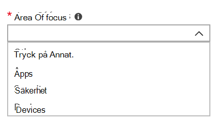

# Lägga till och verifiera administratörskontakter i administratörsportalen

Det finns flera sätt att kommunicera med kunder i Microsoft Managed Desktop.There are several ways that Microsoft Managed Desktop service communicates with customers. För att effektivisera kommunikationen och se till att vi kontrollerar med rätt personer måste du tillhandahålla en uppsättning administratörskontakter. Microsoft Managed Desktop IT Operations kontaktar dessa personer för att få hjälp med felsökningsproblem för din klientorganisation.

> [!IMPORTANT]
> Du kanske redan har lagt till dessa kontakter i administratörsportalen. Om så är fallet, ta en stund nu att dubbelkolla att kontaktlistan är korrekt, eftersom Microsoft Managed Desktop **måste** kunna nå dem om en allvarlig incident inträffar.

## Azure Active Directory-åtkomst för Microsoft Managed Desktop Admin portal

Microsofts administratörsportal för hanterade skrivbord kräver att personer som ansluter till portalen har någon av dessa Azure Active Directory-roller (AD):
- Global administratör
- Administratör för Intune-tjänsten
- Global läsare
- Administratör för servicesupport

Den globala administratören måste vara den som registrerar din organisation i Microsoft Managed Desktop. Alla fem rollerna har samma åtkomst i administratörsportalen för att initiera och visa uppgifter. Mer information om hur du tilldelar dessa roller i Azure AD finns [i Administratörsrollbehörigheter i Azure Active Directory](https://docs.microsoft.com/azure/active-directory/users-groups-roles/directory-assign-admin-roles). 

## Admin kontaktområden i fokus

Administratörskontakter bör vara den bästa personen eller gruppen som kan svara på frågor och fatta beslut för olika fokusområden. **Microsoft Managed Desktop Operations kontaktar dessa administratörskontakter för frågor som rör supportförfrågningar som lämnats in av kunden.** Dessa administratörskontakter får meddelanden om uppdateringar av supportbegäran och nya meddelanden. Dessa områden omfattar:

Fokusområde | För frågor om
--- | ---
Förpackning av appar | Felsöka appförpackningar
Enheter | Enhetshälsa, felsökning med Microsoft Hanterade skrivbordsenheter
Säkerhet | Felsöka säkerhetsproblem med Microsoft Managed Desktop-enheter
IT-helpdesk | i de fall där vår supportpersonal lämnar över slutanvändarbiljetter utanför Microsoft Managed Desktop-supportområden 
Andra | För frågor som inte omfattas av andra områden

**Den du väljer för dessa kontakter måste ha kunskap och behörighet att fatta beslut för din Microsoft Managed Desktop-miljö.** När du är ombord på microsoft managed desktop-miljön uppmanas du att lägga till kontakter för din lokala helpdesk och säkerhet. 

Administratörskontakter krävs när du [skickar en supportbegäran](../service-description/support.md). Du måste ha en administratörskontakt för fokusområdet för supportbegäran. 

**Så här lägger du till administratörskontakter**

1.  Logga in på [Microsoft Managed Desktop admin portal](https://aka.ms/mwaasportal). 

2.  Under **Support**väljer du **Admin-kontakter**. 

    

3. Välj **Lägg till**.

    

4.  Välj ett **fokusområde** och ange information för kontakten. 

    

5. Upprepa för varje fokusområde. 

## Steg för att komma igång med Microsoft Managed Desktop

1. Lägga till och verifiera administratörskontakter i administratörsportalen (det här avsnittet)
2. [Justera villkorlig åtkomst](conditional-access.md)
3. [Tilldela licenser](assign-licenses.md)
4. [Installera Intune Company Portal på enheter](company-portal.md)
5. [Aktivera roaming i företagstillstånd](enterprise-state-roaming.md)
6. [Konfigurera Microsoft Managed Desktop-enheter](set-up-devices.md)
7. [Gör användarna redo att använda enheter](get-started-devices.md)
8. [Distribuera appar till enheter](deploy-apps.md)
