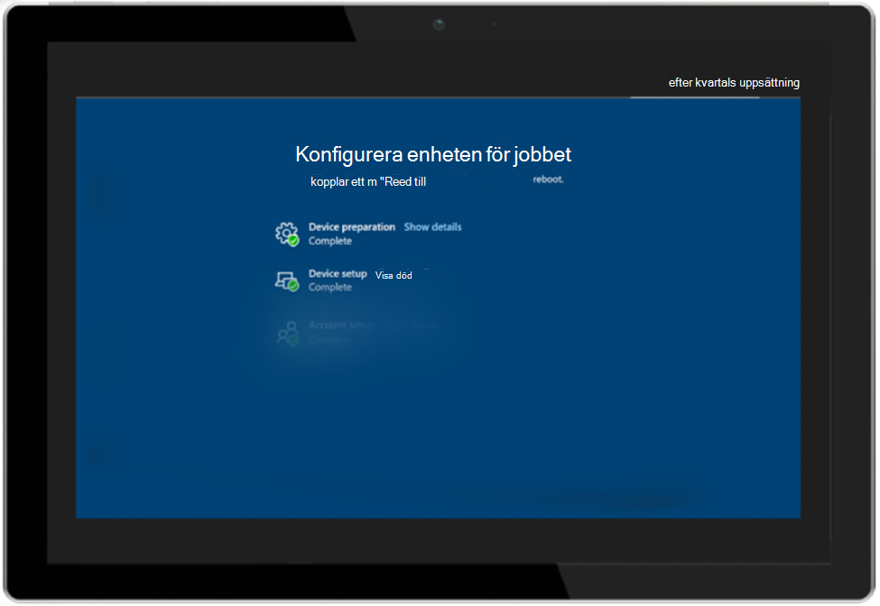

# Välkomstprogrammet med Autopilot och sidan Registreringsstatus

Microsoft Hanterat skrivbord använder [både Windows Autopilot](/windows/deployment/windows-autopilot/windows-autopilot) och Microsoft Inunes ESP [(Enrollment Status Page)](/windows/deployment/windows-autopilot/enrollment-status) för att ge användarna bästa möjliga förstahandsupplevelse.

Statussidan Registrering är för närvarande en offentlig förhandsversion.

## Inledande distribution

För att kunna tillhandahålla ESP-upplevelsen måste du registrera enheter i Microsoft Managed Desktop-tjänsten. Mer information om registrering finns i Registrera [nya enheter själv eller](../get-started/register-devices-self.md) Anvisningar för partner för att registrera [enheter.](../get-started/register-devices-partner.md)

När dina enheter är registrerade med tjänsten kan du aktivera ESP för dina Microsoft Managed Desktop-enheter genom att spara ett support ärende via [administrationsportalen.](https://portal.azure.com/) Vi kommer först att distribuera ESP-konfigurationen till testgruppen när du arkiverar biljetten. Den distribueras till andra efterföljande distributionsgrupper (Första, Snabb och Bred) var 24:e timme. Om du vill pausa distributionen arkiverar du ett annat ärende där åtgärder ska pausas.

## Autopilot-profilinställningar

Microsoft Hanterat skrivbord använder de här inställningarna i Autopilot-profilen som används för användarnas enheter:

|Inställning  |Value  |
|---------|---------|
|Distributionsläge |  Användarberoende       |
|Anslut till Azure AD som     |  Azure AD har anslutit       |
|Språk (region)     | Användarvälj        |
|Konfigurera tangentbord automatiskt     | Nej        |
|Licensvillkor för programvara från Microsoft     |  Dölj       |
|Sekretessinställningar     | Dölj        |
|Dölja alternativ för ändra konto     | Visa        |
|Användarkontotyp     |  Standard       |
|Tillåt vit handskar OOBE     |  Ja       |
|Använda enhetsnamnsmall     | Ja        |
|Ange ett namn     | MMD-%SLUMP:11%        |

## Inställningar för registreringsstatussida

Microsoft Hanterat skrivbord använder de här inställningarna för läget Statussida för registrering:

|Inställning  |Value  |
|---------|---------|
|Visa konfigurationsstatus för appar och profiler     | Ja        |
|Visa ett fel när installationen tar längre tid än angivet antal minuter     |  60       |
|Visa ett anpassat meddelande när fel i tidsgränsen uppstår     |  Ja       |
|Felmeddelande     | Ja, det tar lite längre tid att konfigurera enheten än väntat. Klicka nedan för att komma igång så slutförs inställningarna i bakgrunden        |
|Tillåt användare att samla in loggar om installationsfel     |  Ja       |
|Visa endast sida till enheter som tillhandahålls via in-box (OOBE)     | Ja        |
|Blockera användning av enheten tills alla appar och profiler har installerats     |  Ja       |
|Tillåt användare att återställa enheten om installationsfel uppstår     |  Ja       |
|Tillåt användare att använda enheten om installationsfel uppstår     |  Ja       |
|Blockera användning av enhet tills de här nödvändiga apparna installeras om de tilldelas till användaren/enheten     |  Modern arbetsplats – tidskorrigering       |

Upplevelsen av statussidan Registrering inträffar i tre faser. Mer information finns i [Spårningsinformation för registreringsstatussida.](/mem/intune/enrollment/windows-enrollment-status#enrollment-status-page-tracking-information)

Upplevelsen utförs enligt följande:

1. Autopilot-upplevelsen startas och användaren anger sina autentiseringsuppgifter.
2. Enheten öppnar statussidan Registrering och fortsätter genom faserna Förberedelse av enhet och Enhetskonfiguration. Det tredje steget (Kontokonfiguration) hoppas *för närvarande över i* konfigurationen Microsoft Managed Desktop eftersom ESP för användare är inaktiverat. Enheten startar om.
3. Efter omstarten öppnar enheten inloggningssidan för Windows med **Annan användare**.
4. Användarna anger sina autentiseringsuppgifter igen och skrivbordet öppnas.

> [!NOTE]
> Win32-appar distribueras bara under ESP om Windows 10-versionen är 1903 eller senare.

## Autopilot för förhandsdistribution
> [!NOTE]
> Autopilot för förhandsdistribution i Microsoft Managed Desktop är för närvarande en offentlig förhandsversion.

## Ytterligare krav för Autopilot för före distribuering
- Du måste ha ESP (Enrollment Status Page) aktiverat. Mer information finns i [Inledande distribution.](#initial-deployment)
- Enheten måste ha en trådbunden nätverksanslutning.
- Om du har enheter som registrerats med Microsoft Managed Desktop-portalen före augusti 2020 måste du avregistrera dig och registrera dem igen.
- Enheter måste ha en fabriksavbildning som innehåller den kumulativa uppdateringen för november 2020 [19H1/19H2 2020.11C](https://support.microsoft.com/topic/november-19-2020-kb4586819-os-builds-18362-1237-and-18363-1237-preview-25cbb849-74af-b8b8-29b8-68aa925e8cc3) eller [20H1 2020.11C](https://support.microsoft.com/topic/november-30-2020-kb4586853-os-builds-19041-662-and-19042-662-preview-8fb07fb8-a7dd-ea62-d65e-3305da09f92e) efter behov installerat eller måste uppdateras med den senaste Microsoft Managed Desktop-bilden.
- Fysiska enheter måste ha stöd för TPM 2.0 och enhetsövning. Virtuella datorer stöds inte. I föreetableringsprocessen används funktionerna för själv deployering av Windows Autopilot, så TPM 2.0 är obligatoriskt. För TPM-attestationsprocessen krävs också åtkomst till en uppsättning HTTPS-URL:er som är unika för varje TPM-provider. Mer information finns i posten för Autopilot-självdistributionsläge och förhandsdistribution av Autopilot i Windows [Autopilot-nätverkskrav.](https://docs.microsoft.com/mem/autopilot/networking-requirements#tpm)

## Sekvens av händelser i Autopilot för före distribuering
1. IT-administratören återställer enheten om det behövs.
2. IT-administratören startar enheten, når den indeade upplevelsen och trycker på Windows-tangenten fem gånger.
3. IT-administratören väljer Windows Autopilot Provisioning och väljer sedan **Fortsätt.** På konfigurationsskärmen för Windows Autopilot visas information om enheten.
5. IT-administratören väljer **Etablera** för att starta etableringsprocessen.
6. Enheten startar ESP och går igenom enhetsförberedelser och konfigurationsfaser. Under installationsfasen för enheten visas x av **x** (beroende på den exakta konfigurationen av ESP-profilen).
7. Steget för kontokonfiguration hoppas för närvarande över i Microsoft Managed Desktop-konfigurationen eftersom vi inaktiverar User ESP.
8. Enheten startar om.

När den har startats om visas den gröna statusskärmen på enheten med **knappen Skicka** igen.

> [!IMPORTANT]
> Kända problem: 
> - ESP körs inte igen efter Autopilot-funktionen för före provisionerad distribution.
> - Enheten får inte nytt namn av Autopilot för före etablerad distribution. Enheten byter namn efter att ha gått via ESP-användarflödet.

## Ändra till Inställningar för statussida för Autopilot och registrering

Om konfigurationen som används av Microsoft Managed Desktop inte exakt matchar dina behov kan du arkivera ett support ärende via [administratörsportalen.](https://portal.azure.com/) Här är några exempel på de konfigurationstyper du kan behöva:

### Ändring av Autopilot-inställningar

Du kanske vill begära en annan mall med enhetsnamn. Du kan dock inte ändra distributionsläge, ansluta till Azure AD As, Sekretessinställningar eller Användarkontotyp.

### Inställningar för registreringsstatussida ändras

- Ett längre antal minuter för inställningen "Visa ett fel när installationen tar längre tid än angivet antal minuter".
- Felmeddelandet som visas
- Lägga till eller ta bort program i inställningen Blockera användning av enhet tills de nödvändiga apparna installeras om de är tilldelade till användaren/enheten.

## Program som krävs

- Du måste rikta program i grupperna Test för *enheter på den moderna* arbetsplatsen, första, snabba och breda. Programmen måste installeras i systemsammanhanget. Se till att slutföra testet med ESP i testgruppen innan du tilldelar dem till alla grupper.
- Inga program bör kräva att enheten startas om. Vi rekommenderar att programmen konfigureras till "Gör ingenting" när du skapar programpaketet om de kräver en omstart.
- Begränsa program som krävs till endast de viktigaste programmen som en användare behöver omedelbart när de loggar in på enheten.
- Ha den totala storleken på alla program gemensamt under 1 GB för att undvika timeouts under programinstallationsfasen.
- Under idealiska idealiska områden ska appar inte ha något beroende. Om du har program som *måste* ha beroenden ska du konfigurera, testa och verifiera dem som en del av esp-utvärderingen.
- Inga program som kräver användarkontexten (till exempel Teams) kan ingå i den offentliga förhandsversionen av ESP.