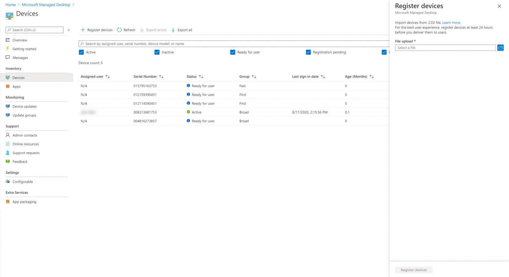

# <a name="register-existing-devices-yourself"></a>Registrera befintliga enheter själv

>[!NOTE]
>I det här avsnittet beskrivs vad du kan göra för att återanvända enheter som du redan har och registrera dem på Microsoft Managed Desktop. Om du arbetar med helt nya enheter följer du anvisningarna i [registrera nya enheter på Microsoft Managed Desktop](register-devices-self.md) i stället.

Processen för partners är dokumenterad i [steg för att partners ska kunna registrera enheter](register-devices-partner.md).

Microsoft Managed Desktop kan fungera med helt nya enheter eller kan du återanvända enheter som du kanske redan har (som kräver att du skriver ut dem igen). Du kan registrera enheter på Microsoft Managed Desktop admin-portalen.

## <a name="prepare-to-register-existing-devices"></a>Förbereda att registrera befintliga enheter


Följ de här stegen för att registrera befintliga enheter:

1. [Skaffa maskinvaru-hashvärdet för varje enhet.](#obtain-the-hardware-hash)
2. [Slå samman hash-data](#merge-hash-data)
3. [Registrera enheterna på Microsoft Managed Desktop](#register-devices-by-using-the-admin-portal).
4. [Kontrol lera att bilden är korrekt.](#check-the-image)
5. [Leverera enheten](#deliver-the-device)

### <a name="obtain-the-hardware-hash"></a>Skaffa maskinvaru-hashvärdet

Microsoft Managed Desktop identifierar varje enhet unikt genom att referera till dess maskinvaru-hash. Du har fyra alternativ för att få informationen från enheter som du redan använder:

- Be din OEM-leverantör om den autopilot registrerings filen som kommer att innehålla maskinvaru-hashar.
- Samla in information i [Microsoft Endpoint Configuration Manager](#microsoft-endpoint-configuration-manager).
- Kör ett Windows PowerShell-skript – antingen via [Active Directory](#active-directory-powershell-script-method) eller [manuellt](#manual-powershell-script-method) på varje enhet – och samla in resultatet i en fil.
- Starta varje enhet, men Slutför inte installations upplevelsen för Windows--och [samla in hash-värden på ett löstagbart minne](#flash-drive-method).

#### <a name="microsoft-endpoint-configuration-manager"></a>Microsoft konfigurationshanterare för slutpunkt

Du kan använda Microsoft Endpoint Configuration Manager för att samla in maskinvaru-hashar från befintliga enheter som du vill registrera med Microsoft Managed Desktop.

> [!IMPORTANT]
> Alla enheter som ska få den här informationen för måste ha Windows 10, version 1703 eller senare. 

Om du har uppfyllt alla dessa krav kan du börja samla in informationen genom att följa de här stegen:

1. I Configuration Manager-konsolen väljer du **övervakning**. 
2. Expandera noden **rapportering** i arbets ytan övervakning, expandera **rapporter**och välj **maskin varan-General-** noden. 
3. Kör informationen i rapporten, **Windows autopilot-enhet**och visa resultaten.
4. I rapport visnings programmet väljer du ikonen **Exportera** och väljer alternativet **CSV (kommaavgränsad)** .
5. När du har sparat filen måste du filtrera resultat efter de enheter som du planerar att registrera med Microsoft Managed Desktop och överföra data till [administrations portalen](https://aka.ms/mmdportal)för Microsoft Managed Desktop, välja **enheter** i det vänstra navigerings fönstret. Välj **+ registrera enheter**; infarten öppnas:


Mer information finns i [registrera enheter med hjälp av administrations portalen](#register-devices-by-using-the-admin-portal) .


#### <a name="active-directory-powershell-script-method"></a>PowerShell-skriptfil för Active Directory

I en Active Directory-miljö kan du använda `Get-WindowsAutoPilotInfo` PowerShell-cmdleten för att fjärrsamla in informationen från enheter i Active Directory-grupper med WinRM. Du kan också använda `Get-AD Computer` cmdleten och få filtrerade resultat för vissa maskin varu modell namn som finns i katalogen. För att göra detta måste du först bekräfta dessa krav och sedan gå vidare med de här stegen:

- WinRM är aktiverat.
- De enheter som du vill registrera är aktiva i nätverket (det vill säga att de inte kopplas bort eller inaktive RAS).
- Kontrol lera att du har en parameter för inloggnings uppgifter som har behörighet att köra på enheterna.
- Kontrol lera att Windows-brandväggen tillåter åtkomst till WMI. Gör så här:

    1. Öppna kontroll panelen i **Windows Defender-brandväggen** och välj **Tillåt en app eller funktion via Windows Defender-brandväggen**.
    
    2. Sök efter **WMI (Windows Management Instrumentation)** i listan, aktivera både **privat och offentlig**och välj sedan **OK**.

1.  Öppna en PowerShell-kommandotolk med administrativa rättigheter.

2.  Kör *något* av följande skript:

    ```powershell
    Install-script -name Get-WindowsAutoPilotInfo 
    #example one – leverage Get-ADComputer to enumerate devices 
    Get-ADComputer -filter * | powershell -ExecutionPolicy Unrestricted Get-WindowsAutoPilotInfo.ps1 -credential Domainname\<accountname>
    ```

    ```powershell 
    #example two – target specific devices: 
    Set-ExecutionPolicy powershell -ExecutionPolicy Unrestricted Get-WindowsAutoPilotInfo.ps1 -credential Domainname\<accountname> -Name Machine1,Machine2,Machine3
    ```

3. Åtkomst till alla kataloger där det finns poster för enheterna. Ta bort poster för varje enhet från *alla* kataloger, inklusive Windows Server Active Directory Domain Services och Azure Active Directory. Tänk på att borttagningen kan ta några timmar innan du slutför processen.

4. Access Management Services där det finns poster för enheterna. Ta bort poster för varje enhet från *alla* hanterings tjänster, inklusive Microsoft Endpoint Configuration Manager, Microsoft Intune och Windows autopilot. Tänk på att borttagningen kan ta några timmar innan du slutför processen.

Nu kan du fortsätta med att [registrera enheter](#register-devices-by-using-the-admin-portal).

#### <a name="manual-powershell-script-method"></a>Metod för manuell PowerShell-skript

1.  Öppna en PowerShell-kommandotolk med administrativa rättigheter.
2.  Använda `Install-Script -Name Get-WindowsAutoPilotInfo`
3.  Använda `powershell -ExecutionPolicy Unrestricted Get-WindowsAutoPilotInfo -OutputFile <path>\hardwarehash.csv`
4. [Slå samman hash-data.](#merge-hash-data)

#### <a name="flash-drive-method"></a>Flash-enhet, metod

1. På en annan enhet än den du registrerar kan du sätta in en USB-enhet.
2. Öppna en PowerShell-kommandotolk med administrativa rättigheter.
3. Använda `Save-Script -Name Get-WindowsAutoPilotInfo -Path <pathToUsb>`
4. Slå på den enhet du registrerar, men *Starta inte installations upplevelsen*. Om du råkar starta installations upplevelsen måste du återställa eller återanvända enheten.
5. Sätt in USB-enheten och tryck sedan på SKIFT + F10.
6. Öppna en PowerShell-kommandotolk med administrativa rättigheter och kör den sedan `cd <pathToUsb>` .
7. Använda `Set-ExecutionPolicy -ExecutionPolicy Unrestricted`
8. Använda `.\Get-WindowsAutoPilotInfo -OutputFile <path>\hardwarehash.csv`
9. Ta bort USB-enheten och stäng sedan av enheten genom att köra `shutdown -s -t 0`
10. [Slå samman hash-data.](#merge-hash-data)

>[!IMPORTANT]
>Koppla inte på den enhet du registrerar igen förrän du har registrerat dig. 


### <a name="merge-hash-data"></a>Slå samman hash-data

Om du har samlat in maskinvaru-hash-data med de manuella PowerShell-eller Flash-enhets metoderna måste du nu använda data i CSV-filerna i en enda fil för att slutföra registreringen. Här är ett exempel på PowerShell-skript som gör det enkelt:

```powershell
Import-CSV -Path (Get-ChildItem -Filter *.csv) | ConvertTo-Csv -NoTypeInformation | % {$_.Replace('"', '')} | Out-File .\aggregatedDevices.csv
```

Med hash-data som kopplats till en CSV-fil kan du fortsätta att [Registrera enheterna](#register-devices-by-using-the-admin-portal).


#### <a name="register-devices-by-using-the-admin-portal"></a>Registrera enheter med hjälp av administrations portalen

Välj **enheter** i det vänstra navigerings fönstret på portalen Microsoft Managed Desktop [admin](https://aka.ms/mmdportal). Välj **+ registrera enheter**; infarten öppnas:

[](../../media/new-registration-ui.png)


<!--Registering any existing devices with Managed Desktop will completely re-image them; make sure you've backed up any important data prior to starting the registration process.-->


Gör så här:

1. Ange en sökväg till CSV-filen som du skapade tidigare i **fil överföring**.

1. Välj **registrera enheter**. Systemet lägger till enheter i listan med enheter i **bladet enheter**, markerade som **AutopilotRegistrationRequested**. Registreringen tar vanligt vis mindre än 10 minuter och när enheten lyckas visas den som **klar för användarna** , vilket betyder att det är klart och väntar på att en användare ska börja använda.


Du kan övervaka förloppet av enhets registreringen på huvud sidan för **hanterade skriv bord i Microsoft** . Möjliga tillstånd rapporterade att inkludera:

| Sessionsläget | Beskrivning |
|---------------|-------------|
| AutopilotRegistrationRequested | Registreringen är inte klar ännu. Kom tillbaka senare. |
| Registreringen misslyckades | Det gick inte att genomföra registreringen. Mer information finns i [fel sökning av enhets registrering](#troubleshooting-device-registration) . |
| Redo för användare | Registreringen lyckades och enheten är nu klar att levereras till slutanvändaren. Microsoft Managed Desktop vägleder dem genom första gången, vilket innebär att du inte behöver göra några fler förberedelser. |
| Aktiva | Enheten har levererats till slutanvändaren och de har registrerat sig hos din klient organisation. Detta indikerar också att de ofta använder enheten. |
| Inaktiv | Enheten har levererats till slutanvändaren och de har registrerat sig hos din klient organisation. De har emellertid inte använt enheten nyligen (under de senaste 7 dagarna).  | 

#### <a name="troubleshooting-device-registration"></a>Felsöka registrering av enheter

| Fel meddelande | Information |
|---------------|-------------|
| Enheten hittades inte | Det gick inte att registrera den här enheten eftersom vi inte kunde hitta en träff för den medföljande tillverkaren, modellen eller serie numret. Bekräfta dessa värden med din enhets leverantör. |
| Maskinvaru-hashvärdet är inte giltigt | Den maskinvaru-hash som du har angett för enheten är inte korrekt formaterad. Dubbel kontrol lera maskinvaru-hashvärdet och skicka sedan igen. |
| Enheten är redan registrerad | Enheten är redan registrerad i din organisation. Ingen ytterligare åtgärd krävs. |
| Enhet som ägs av en annan organisation | Den här enheten har redan hävdats av en annan organisation. Hör med din enhets leverantör. |
| Oväntat fel | Begäran kunde inte behandlas automatiskt. Kontakta supporten och ange begäran-ID: <requestId> |

### <a name="check-the-image"></a>Kontrol lera bilden

Om din enhet kommer från en Microsoft Managed Desktop partner-leverantör ska bilden vara korrekt.

Du är också välkommen att lägga till din egen image om du vill. För att komma igång kontaktar du den Microsoft-representant du arbetar med och ger dig en plats och anvisningar för hur du kan använda bilden.

### <a name="deliver-the-device"></a>Leverera enheten

> [!IMPORTANT]
> Innan du lämnar in enheten till din användare bör du kontrol lera att du har skaffat [rätt licenser](../get-ready/prerequisites.md) för den användaren.

Om alla licenser tillämpas kan du [få användarna redo att använda enheter](get-started-devices.md)och sedan kan användaren starta enheten och gå igenom installations upplevelsen i Windows.


