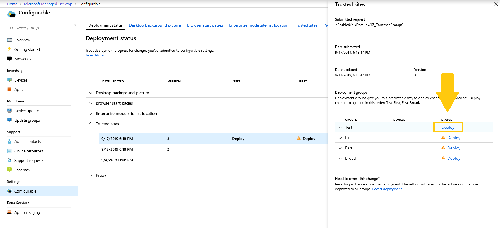

# Distribuera och spåra konfigurerbara inställningar – Microsoft Hanterat skrivbordDeploy and track configurable settings - Microsoft Managed Desktop

När du har gjort ändringar i inställningskategorierna och fasa in en distribution kan du på sidan Distributionsstatus börja distribuera inställningarna till grupper.After you make changes to your setting categories and stage a deployment, the Deployment status page allows you to begin deploying your settings to groups. På den här sidan visas en sammanfattning av varje konfigurerbar inställning.This page shows a summary of each configurable setting. Genom att öppna en inställningskategori kan du distribuera inställningar till grupper och spåra förloppet för distributionerna.By opening a setting category you can deploy settings to groups and track the progress of these deployments.

## DistributionsstatusDeployment statuses 

Det här är de statusar som visas för varje distribution.These are the statuses you’ll see for each deployment.

StatusStatus  | FörklaringExplanation 
--- | --- 
DistribueraDeploy | Ändringen väntar på att distribueras till den här gruppen.Your change is waiting to be deployed to this group.
PågåendeIn progress | Ändringen tillämpas på aktiva enheter i den här gruppen.The change is being applied to active devices in this group. 
SlutförtComplete | Ändringen slutfördes på alla aktiva enheter i den här gruppen.The change completed on all active devices in this group. 
MisslyckadesFailed | Ändringen misslyckades på 10 procent av alla aktiva enheter i gruppen, så distributionen stoppades.The change failed on a 10 percent of active devices in the group, so the deployment was stopped.   En supportbegäran öppnas automatiskt med Microsoft Hanterat skrivbord för att felsöka distributionen.A support request will be automatically opened with Microsoft Managed Desktop operations to troubleshoot the deployment. 
ÅterställdReverted | Ändringen återställdes till den senaste ändringen som distribuerades till alla distributionsgrupper.The change was reverted to the last change that was successfully deployed to all deployment groups.

## Distribuera ändringarDeploy changes

Vi kommer att visa bakgrundsbilden för skrivbordet i de här instruktionerna.We’ll show Desktop background picture in these instructions. När du har gjort en distribution distribuerar du ändringar från sidan Distributionsstatus.After you’ve staged a deployment, you deploy changes from the Deployment status page. 

**Distribuera ändringar****To deploy changes**

1. Logga in på [Microsoft Endpoint Manager](https://endpoint.microsoft.com/) och gå till **menyn** EnheterSign in to [Microsoft Endpoint Manager](https://endpoint.microsoft.com/) and navigate to the **Devices** menu
2. Titta efter avsnittet Microsoft Hanterat skrivbord, välj **Inställningar**.Look for the Microsoft Managed Desktop section, select **Settings**.
3. Välj **den inställning** du vill distribuera i arbetsytan Distributionsstatus och välj sedan den distribution som ska distribueras.In **Deployment status** workspace, select the setting you want to deploy, and then select the staged deployment to deploy.
4. Välj **Distribuera** för att distribuera ändringen till någon av distributionsgrupperna.Select **Deploy** to deploy the change to one of the deployment groups.

> [!NOTE] 
> Den orange varningsikonen visar att det finns en tidigare grupp tillgänglig för distribution eftersom vi rekommenderar att distribuera den i ordning.The orange caution icon indicates there is a previous group available for deployment as it’s recommended to roll out in order. 

<!-- Needs picture updated to show MEM  -->

Vi rekommenderar att du distribuerar till distributionsgrupper i följande ordning: Testa först, snabbt och sedan bred.We recommend deploying to deployment groups in this order: Test, First, Fast, and then Broad. 

När ändringarna är slutförda i varje grupp ändras statusen till **Slutförd.**When changes complete in each group, the status changes to **Complete**.

<!-- Needs picture updated to show MEM  -->

## Återställ distributionRevert deployment

När du har distribuerat en ändring kan du återgå till **Distributionsstatus.**After you’ve deployed a change, you can revert from **Deployment status**. När du återställer en ändring som **pågår eller** **Slutförd upphör** den aktuella distributionen.When you revert a change that is **In progress** or **Complete**, the current deployment stops. Inställningen återgår till den senaste versionen som distribuerades till alla grupper.The setting will revert to the last version that was deployed to all groups. 

Vi kommer att visa stegen för att återställa en ändring med hjälp av skrivbordsbakgrundsbilden som exempel.We’ll show the steps to revert a change using the Desktop background picture as an example. 

**Om du vill återställa en ändring****To revert a change**
1. Logga in på [Microsoft Endpoint Manager](https://endpoint.microsoft.com/) och gå till **menyn** EnheterSign in to [Microsoft Endpoint Manager](https://endpoint.microsoft.com/) and navigate to the **Devices** menu
2. Titta efter avsnittet Microsoft Hanterat skrivbord, välj **Inställningar**.Look for the Microsoft Managed Desktop section, select **Settings**.
3. Välj **den inställning** du vill återställa i arbetsytan Distributionsstatus och välj sedan den stegade distributionen för att återställa.In **Deployment status** workspace, select the setting you want to revert, and then select the staged deployment to revert.
4. Under **Behöver du återställa den här ändringen?** väljer du Återställ **distribution.**Under **Need to revert this change?**, select **Revert deployment**.

<!-- Needs picture updated to show MEM  -->

## Ytterligare resurserAdditional resources
- [Översikt över konfigurerbara inställningarConfigurable settings overview](config-setting-overview.md)
- [Referens för inställningar som kan konfigurerasConfigurable settings reference](config-setting-ref.md) 
