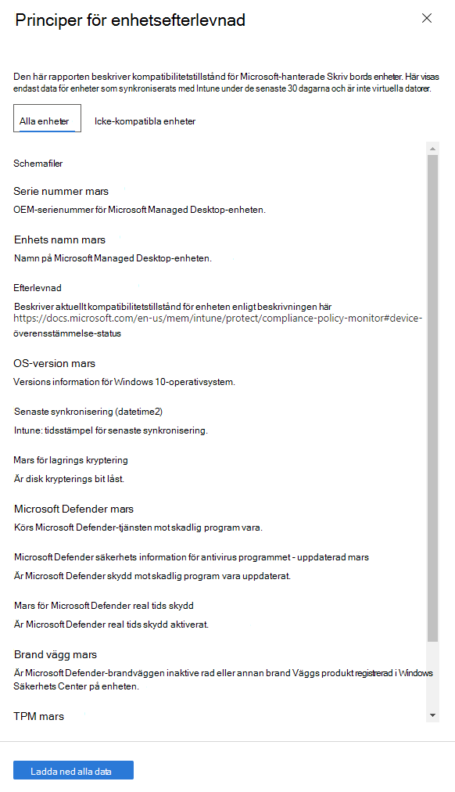

# Kompatibilitetsrapport för enheterDevice compliance report

I den här vyn visas en procent andel av dina Microsoft Managed Station ära enheter som följer de efterlevnadsprinciper som är inställda i Microsoft Intune.This view shows the percentage of your Microsoft Managed Desktop devices that conform to compliance policies set in Microsoft Intune.

Välj **Visa information** om du vill visa specifik information för antingen alla dina Microsoft-hanterade Skriv bords enheter eller endast enheter som inte uppfyller principer för efterlevnad.Select **View details** to view specific information for either all of your Microsoft Managed Desktop devices or only devices that do not conform to compliance policies. Använd PULLDOWN-menyn för att växla mellan de här vyerna.Use the pulldown menu to switch between these views. För att visa i den här vyn måste enheten vara en fysisk dator och har synkroniserats med Intune under de senaste 30 dagarna.To appear in this view, a device must be a physical machine and have synced with Intune in the last 30 days.

I den här vyn väljer du **Ladda ned alla data** för att exportera en kommaavgränsad fil med samma information.From this view, select **Download full data** to export a comma-delimited file with the same information. I export filen visas de områden som visas som **schema** .In the export file, the areas displayed as **Schema** appear as columns.