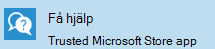

# Få hjälp för användare

Det finns två sätt som användare i organisationen kan få hjälp med på sina Microsoft-hanterade Skriv bords enheter: **få hjälp** program eller telefon support. Båda de här support alternativen är tillgängliga för användare dygnet runt, alla dagar.
 
>[!NOTE]
>De här support alternativen är inte tillgängliga för enheter i test gruppen.

## Skaffa hjälp programmet

Den bästa metoden för att tillhandahålla stöd för dina användare är **att få hjälp**, ett lättanvänt gränssnitt inbyggt i användarnas enheter.  

Få hjälp är ett program som är installerat på alla Microsoft Managed Station ära enheter och är fästa i aktivitets fältet. 

- Användare kan begära ett motanrop till ett angivet telefonnummer eller chatta online med en service representant.
- Förfrågningar som faller utanför Microsoft Managed Desktop support scope dirigeras om till den lokala IT-supportavdelningen via telefonsamtal.

> [!NOTE]
> Visnings språket för Get Help app är endast på engelska, även om en användare har valt ett annat språk när de ställer in sin enhet eller i enhets inställningar. 

### Förutsättningar
För att användarna ska kunna få hjälp via programmet kontrollerar du att följande förutsättningar uppfylls:

- Enheten måste vara registrerad med Microsoft Managed Desktop med någon av metoderna i [Konfigurera Microsoft Managed Station ära enheter](../get-started/set-up-devices.md), till exempel [registrera nya enheter själv](../get-started/register-devices-self.md).
- Visnings språket för enheten måste vara inställt på något av dessa engelska språk: en-US, en-GB, en-au, en-NZ eller en-ca.
- Appen skaffa hjälp ska vara uppdaterad. Kontrol lera program uppdateringar i Microsoft Store för att bekräfta dess status.
- Vissa [slut punkter](../get-ready/network.md#endpoints-allowed-that-are-necessary-for-microsoft-managed-desktop) måste vara tillgängliga från enheten.

> [!NOTE]
> Appen skaffa hjälp kan ta upp till en timme efter att en enhet har distribuerats till helt.

Om du har kontrollerat de här kraven och det inte fungerar att få hjälp appen är det lämpligt att en IT-administratör ska spara ett [support ärende](admin-support.md).

## Telefonsupport

Användare med Microsoft hanterade Station ära Skriv bords enheter har också till gång till avgiftsfria telefonnummer de kan ringa. Siffrorna är avsedda att användas när det inte finns något hjälp avsnitt. Till exempel, om de inte kan logga in på enheten eller om enheten har brutits. Här är telefonnummer för telefon support:

- USA: + 1 855 425 0216
- Kanada (exklusive Quebec): + 1 855 425 0216
- Storbritannien: + 44 800 026 0698
- Belgien: + 32 800 58533
- Luxemburg: + 352 800 40119
- Australien: + 61 180 037 0619
- Nya Zeeland: + 64 988 44380
- Sverige: + 46 20 120 3554
- Norge: + 47 800 62584
- Island: + 354 800 9006
- Irland: + 353 1 800 832272
- Danmark: + 45 80 40 04 01
- Finland: + 358 800 525088

>[!NOTE]
>Du måste ha din organisations e-postadress klar när du ringer för att bekräfta din identitet. 

## Fler resurser
- [Administratörs support för Microsoft Managed Desktop](admin-support.md). 
- [Stöd för Microsoft Managed Desktop](../service-description/support.md).
- Om du redan prenumererar på Microsoft Managed Desktop kan du hitta detaljerade procedurer, process flöden, arbets instruktioner och vanliga frågor och svar i administratörs guiden för Microsoft-  hanterad Skriv bords **Administration** i Microsoft [Endpoint Manager](https://endpoint.microsoft.com/).
