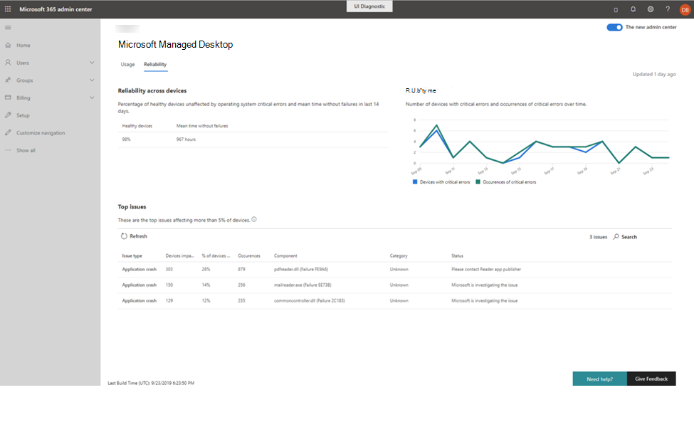

# TillförlitlighetsinsikterReliability insights

I den här vyn får du en översikt över dina hanterade enheter.This view provides you with a health summary of your managed devices. Om du vill visa pålitlighets data väljer du fliken **pålitlighet** .To view reliability data, select the **Reliability** tab.

Avsnittet **tillförlitlighet i flera enheter** erbjuder en översikt över de senaste 14 dagarna genom rapportering om procent andelen av enheter som anses vara "felfri" och genomsnittlig tid som observerats sedan det senaste rapporterade felet.The **Reliability across devices** section offers a quick health summary of your deployment over the last 14 days by reporting the percentage of devices considered to be “healthy” and the mean time observed since the last reported failure. 

 
Diagrammets **tillförlitlighet över tid** till höger rapporterar antalet enheter med kritiska fel och det totala antalet observerade kritiska fel över tiden.The **Reliability over time** graph on the right reports the number of devices with critical errors and the total number of observed critical errors over time.

Avsnittet **TOPY** retails visar specifika upptäckta problem som påverkar minst 5% av dina hanterade enheter.The **Top issues** section details specific detected issues that affect at least 5% of your managed devices. Rapporterade uppgifter inkluderar:Reported details include:

- Typ av problemThe type of issue
    - Program kraschar, där ett program slutar fungera eller oväntat stoppasApplication crashes, in which an app stops functioning or unexpectedly stops
    - Programmet hänger sig, där ett program slutar svara för inmatningApplication hangs, where an application stops responding to input
    - Kritiska fel, som uppstår när ett problem har uppstått i WindowsCritical errors, which occur when Windows has encountered an issue it can't recover from
- Antalet enheter som påverkas av samma problemThe number of devices affected by the same issue
- Procent andelen hanterade enheter som numret representerarThe percentage of managed devices that number represents
- Totalt antal förekomster av det specifika problemetThe total count of occurrences of the specific issue
- Program varu komponenten som verkar vara orsaken till problemetThe software component that appears to be the source of the problem
- Kategorin för det upptäckta problemet:The category of the detected problem:
    - Webbläsare (Edge, Chrome, IE)Browser (Edge, Chrome, IE)
    - Okända (icke-Microsoft-komponenter)Unknown (Non-Microsoft components)
    - Driv rutin (ljud, grafik eller andra driv rutiner)Driver (audio, graphics, or other drivers)
    - Produktivitet (slack, G-sviter, Microsoft Office och tillägg och tillägg, Team)Productivity (Slack, G-Suites, Microsoft Office and its add-ons or extensions, Teams)
    - Media (bild-, musik-eller videoapparMedia (image, music, or video apps
    - Säkerhet (Windows säkerhets komponenter)Security (Windows security components)
- Den aktuella statusen som Microsoft Managed Desktop-operationer undersöker och åtgärdar problemetThe current status as Microsoft Managed Desktop Operations investigates and remediates the issue

