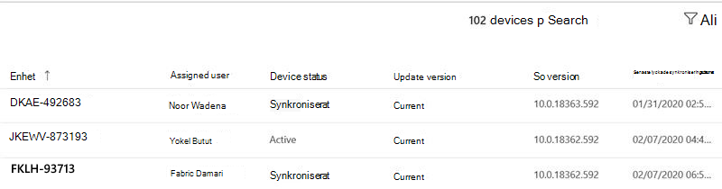

# Insikter om Windows-säkerhetsuppdateringar
Den här vyn ger en översikt över statusen för säkerhetsuppdateringar för dina Microsoft Hanterat skrivbord enheter. 

Om du vill visa användningsdata väljer <strong>Windows fliken Säkerhetsuppdateringar.</strong>

## Enhetsstatus

För att enheter ska uppdateras genom Windows Update måste de vara anslutna till Internet och inte gå in i viloläge i minst sex timmar, av vilka två måste vara kontinuerliga. Även om det är möjligt att en enhet som inte uppfyller dessa krav kommer att uppdateras, kommer enheter som uppfyller dem att ha störst sannolikhet för att uppdateras. 

Vi kategoriserar enhetsaktivitet i samband med Windows med följande termer:

- <strong>Aktiv:</strong> Enheter som har uppfyllt minimikravet för aktivitet (sex timmar, två i kontinuerligt) för den senaste säkerhetsuppdateringen och som har checkat in med Microsoft Intune minst var femte dag
- <strong>Synkroniserat:</strong> Enheter som har checkat in med Intune under de senaste 28 dagarna
- <strong>Inte synkroniserad:</strong> Enheter som inte <i>har checkat</i> in med Intune under de senaste 28 dagarna

## Uppdatera versionsstatus

Microsoft släpper säkerhetsuppdateringar varannan tisdag i månaden. Varje version lägger till viktiga uppdateringar för kända säkerhetsproblem. Microsoft Hanterat skrivbord ser till att 95 % av alla hanterade enheter uppdateras med den senaste tillgängliga säkerhetsuppdateringen varje månad. Säkerhetsuppdateringar släpps ibland vid andra tillfällen för att brådskande hantera nya hot. Microsoft Hanterat skrivbord distribuerar uppdateringarna på ett liknande sätt.

Vi kategoriserar statusen för versioner av säkerhetsuppdateringar med följande villkor:

- <strong>Aktuell:</strong> Enheter som kör uppdateringen som släpptes under den aktuella månaden
- <strong>Föregående:</strong> Enheter som kör uppdateringen som släpptes under föregående månad
- <strong>Äldre:</strong> Enheter som kör en säkerhetsuppdatering som släppts före föregående månad

Du bör se några enheter i kategorin Äldre <strong>–</strong> en stor eller växande befolkning indikerar antagligen ett problem med att vara här och att du bör rapportera till Microsoft Hanterat skrivbord så att vi kan undersöka den.

## Distributionsstatus

I början av varje version av säkerhetsuppdateringen tar Microsoft Hanterat skrivbord en ögonblicksbild av enhetens population och anger dess distributionsmål till 95 % av populationen. I <strong>området Förlopp</strong> för distribution visas en historisk trend som uppdateras varje dag, med en uppföljning av hur nära uppdateringsdistributionen uppfyller detta mål för varje version. Det här diagrammet visar bara enheter med aktiv status.

Du kan visa informationen för tidigare uppdateringscykler med hjälp av den nedrullningsbara menyn i det övre högra hörnet. Den period du väljer i den här menyn gäller för all information på hela sidan.

Området <strong>Uppdaterade aktiva enheter efter</strong> distributionsgrupp erbjuder en annan vy genom att visa förloppet för uppdateringsinstallationen för var och en Microsoft Hanterat skrivbord distributionsgrupper.

I <strong>området Dagar att nå</strong> mål visar hur lång tid det tog för 95 % av det totala antalet enheter att uppdateras med den aktuella säkerhetsuppdateringen. Medan distributionen pågår visas fortfarande uppdatering i det här <strong>området tills</strong> 95 % målet har nåtts för den valda uppdateringen.

## Området Enhetsinformation

Längst ned på instrumentpanelen finns en tabell med detaljerad information om dina enheter, till exempel [enhetsstatus](#device-status) och [uppdateringsversionsstatus.](#update-version-status) Du kan söka i listan eller filtrera den efter vilket värde som helst.

