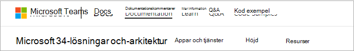
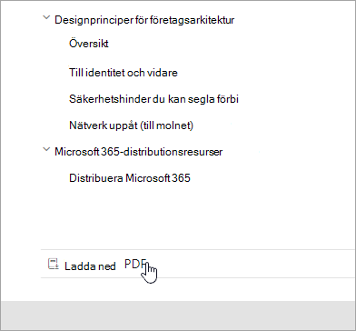
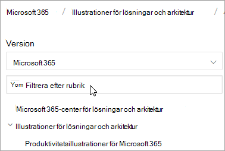
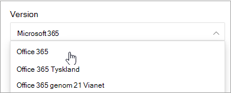
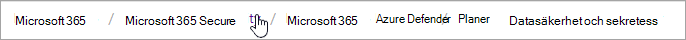
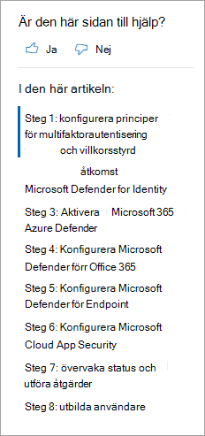
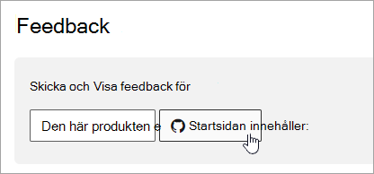

# Microsoft 365 för dokumentnavigering

Det här avsnittet innehåller några tips för hur du navigerar Microsoft 365 i den tekniska dokumentationen.  

## Hubb-sida

Den Microsoft 365 navsidan finns på och är startpunkten för [https://aka.ms/microsoft365docs](./index.yml) att hitta relevant Microsoft 365 innehåll.

Du kan alltid gå tillbaka till den här sidan genom **Microsoft 365** i sidhuvudet högst upp på varje sida i Microsoft 365 tekniska dokumentationsuppsättningen:

## Offlinedokumentation

Om du vill visa Microsoft 365-dokumentationen i ett offlinesystem kan du skapa en PDF-fil var du än befinner dig i den Microsoft 365 tekniska dokumentationen.

Om du vill skapa en PDF-fil väljer du länken **Ladda ned PDF** längst ned i varje innehållsförteckning.

## Sökning i toc 
På docs.microsoft.com kan du söka i innehållet i innehållsförteckningen genom att använda filtersökrutan högst upp:

## Versionsfilter
Den Microsoft 365 tekniska dokumentationen innehåller innehåll för ytterligare produkter, bland annat Office 365 Germany och Office 365 som drivs av 21 Vianet (Kina). Funktionerna kan variera mellan dessa versioner och därför kan själva innehållet ibland variera.

Du kan använda versionsfiltret för att säkerställa att du ser innehåll för rätt version av Microsoft 365:

## Dynamiska länkar

Dynamiska länkar finns under rubriken och ovanför innehållsförteckningen och anger var den aktuella artikeln finns i innehållsförteckningen.  Detta ställer inte bara in kontexten på vilken typ av innehåll du läser, utan du kan också navigera uppåt i innehållsförteckningens träd igen:

## Avsnittsnavigering i artikeln

I det högra navigeringsfönstret kan du snabbt navigera till avsnitt i en artikel och identifiera din plats i artikeln.  

## Skicka feedback om dokument

Om du hittar något fel i en artikel kan du skicka feedback till SQL Content team för den artikeln genom att rulla ned till slutet av sidan och välja **Innehållsfeedback.**

## Delta i Microsoft 365 dokumentation

Visste du att du kunde redigera innehållet på docs.microsoft.com själv? Om du gör det kommer vår dokumentation att förbättras, men du blir också krediterad som deltagare på sidan. Information om hur du kommer igång finns i:

- [Deltagarguide för Microsoft Docs](/contribute/)

## Nästa steg

- Kom igång med den [Microsoft 365 tekniska dokumentationen](index.yml).