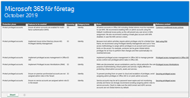
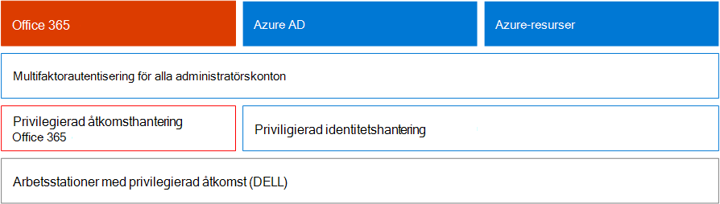
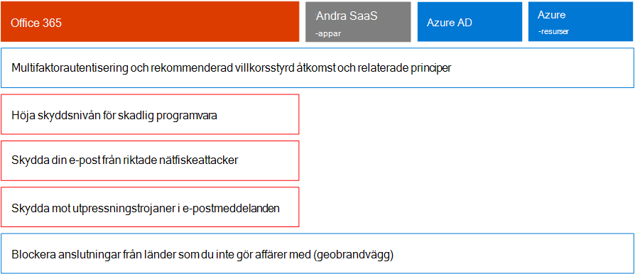
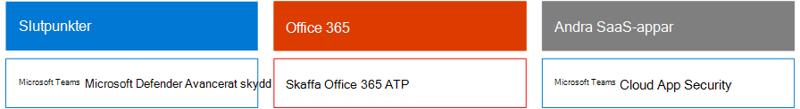
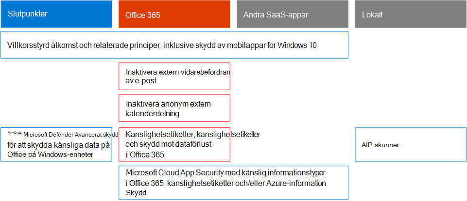
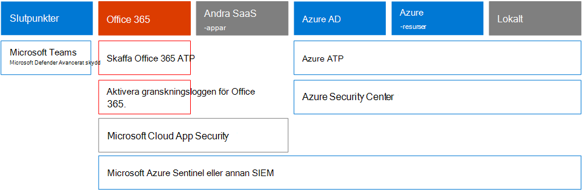

# Microsoft 365 Security for Business Decision Makers (BDMs)Microsoft 365 Security for Business Decision Makers (BDMs)

I den här artikeln beskrivs några av de vanligaste hot och angreppsscenarier som organisationer för närvarande ställs inför i sina Microsoft 365-miljöer och rekommenderade åtgärder för att minimera dessa risker.This article discusses some of the most common threat and attack scenarios currently faced by organizations for their Microsoft 365 environments, and recommended actions for mitigating these risks. Microsoft 365 har ett brett utbud av förkonfigurerade säkerhetsfunktioner, men det kräver också att du som kund tar ansvar för att skydda dina egna identiteter, data och enheter som används för åtkomst till molntjänster.While Microsoft 365 comes with a wide array of pre-configured security features, it also requires you as the customer to take responsibility to secure your own identities, data, and devices used to access cloud services. Den här vägledningen utvecklades av Kozeta Beam (Microsoft Cloud Security Architect) och Thiagaraj Sundararajan (Microsoft Senior Consultant).This guidance was developed by Kozeta Beam (Microsoft Cloud Security Architect) and Thiagaraj Sundararajan (Microsoft Senior Consultant).

Den här artikeln är ordnad efter prioritet, och börjar med att skydda de konton som används för att administrera de mest kritiska tjänsterna och tillgångarna, till exempel klientorganisation, e-post och SharePoint.This article is organized by priority of work, starting with protecting those accounts used to administer the most critical services and assets, such as your tenant, e-mail, and SharePoint. Det är ett metodiskt sätt att närma sig säkerheten och fungerar tillsammans med följande kalkylblad så att du kan följa upp dina framsteg med intressenter och grupper i organisationen: [Microsoft 365 Säkerhet för BDMs-kalkylblad](https://github.com/MicrosoftDocs/microsoft-365-docs/raw/public/microsoft-365/downloads/Microsoft-365-BDM-security-recommendations-spreadsheet.xlsx).It  provides a methodical way for approaching security and works together with the following spreadsheet so you can track your progress with stakeholders and teams across your organization: [Microsoft 365 security for BDMs spreadsheet](https://github.com/MicrosoftDocs/microsoft-365-docs/raw/public/microsoft-365/downloads/Microsoft-365-BDM-security-recommendations-spreadsheet.xlsx). 

Microsoft tillhandahåller verktyget Secure Score i din klientorganisation för att automatiskt analysera säkerheten baserat på dina vanliga aktiviteter, tilldela poäng och rekommendera säkerhetsförbättringar.Microsoft provides you with the Secure Score tool within your tenant to automatically analyze your security posture based on your regular activities, assign a score, and provide security improvement recommendations. Innan du vidtar de åtgärder som rekommenderas i den här artikeln bör du anteckna dina aktuella poäng och rekommendationer.Before taking the actions recommended in this article, take note of your current score and recommendations. De åtgärder som rekommenderas i den här artikeln ökar poängen.The actions recommended in this article will increase your score. Målet är inte att uppnå maxresultatet, utan att vara medveten om möjligheter att skydda din miljö på ett sätt som inte negativt påverkar produktiviteten för dina användare.The goal is not to achieve the max score, but to be aware of opportunities to protect your environment in a way that does not negatively affect productivity for your users. Se [Microsoft Secure Score](defender/microsoft-secure-score.md).See [Microsoft Secure Score](defender/microsoft-secure-score.md).

En sak till innan vi börjar .One more thing before we get started . .. .. se till [att aktivera granskningsloggen](../compliance/search-the-audit-log-in-security-and-compliance.md).be sure to [turn on the audit log](../compliance/search-the-audit-log-in-security-and-compliance.md). Du behöver dessa data senare, om du behöver undersöka en händelse eller ett brott.You'll need this data later, in the event you need to investigate an incident or a breach. 

## Skydda privilegierade kontonProtect privileged accounts

Som ett första steg rekommenderar vi att se till att kritiska konton i miljön får ett extra skyddslager eftersom dessa konton har åtkomst och behörigheter att hantera och ändra kritiska tjänster och resurser, som kan påverka hela organisationen negativt, om de har komprometterats.As a first step, we recommend ensuring critical accounts in the environment are given an extra layer of protection as these accounts have access and permissions to manage and alter critical services and resources, which can negatively impact the entire organization, if compromised. Att skydda behöriga konton är ett av de mest effektiva sätten att skydda mot en attackerare som vill höja behörigheterna för ett komprometterat konto till ett administrativt konto.Protecting privileged accounts is one of the most effective ways to protect against an attacker who seeks to elevate the permissions of a compromised account to an administrative one. 

|RekommendationRecommendation  |E3E3 |E5E5  |
|---------|---------|---------|
|Tillämpa multifaktorautentisering (MFA) för alla administrativa konton.Enforce multi-factor authentication (MFA) for all administrative accounts.||| 
|Implementera PIM (Azure Active Directory) (Privileged Identity Management) för Azure Active Directory (PIM) för att tillämpa direkt privilegierad åtkomst till Azure AD- och Azure-resurser.Implement Azure Active Directory (Azure AD) Privileged Identity Management (PIM) to apply just-in-time privileged access to Azure AD and Azure resources. Du kan också identifiera vem som har åtkomst och granska behörighet.You can also discover who has access and review privileged access.|         | |
|Implementera hantering av privilegierad åtkomst för att hantera detaljerad åtkomstkontroll över behörighetsadministratörsuppgifter i Office 365.Implement privileged access management to manage granular access control over privileged admin tasks in Office 365. |         | |
|Konfigurera och använda arbetsstationer av behörighetsåtkomst (SÅD) för att administrera tjänster.Configure and use Privileged Access Workstations (PAW) to administer services. Använd inte samma arbetsstationer när du surfar på Internet och kontrollerar e-post som inte är relaterad till ditt administratörskonto.Do not use the same workstations for browsing the Internet and checking email not related to your administrative account.|  | | 

I följande diagram visas de här funktionerna.The following diagram illustrates these capabilities.

Ytterligare rekommendationer:Additional recommendations:
- Se till att konton som synkroniseras från den lokala platsen inte har administratörsroller för molntjänster.Ensure accounts that are synchronized from on-premises are not assigned admin roles for cloud services. Det här förhindrar att en attackerare använder lokala konton för att få administrativ åtkomst till molntjänster.This helps prevent an attacker from applying on-premises accounts to gain administrative access to cloud services. 
- Kontrollera att tjänstkonton inte har administratörsroller.Ensure service accounts are not assigned admin roles. Dessa konton övervakas ofta inte och konfigureras med lösenord som inte förfaller.These accounts are often not monitored and set with passwords that do not expire. Börja med att kontrollera att AADConnect- och ADFS-tjänstkonton inte är globala administratörer som standard.Start by ensuring the AADConnect and ADFS services accounts are not Global Admins by default.
- Ta bort licenser från administratörskonton.Remove licenses from admin accounts. Ta bort licenser från dessa konton såvida det inte finns ett specifikt användningsfall för att tilldela licenser till specifika administratörskonton.Unless there is a specific use case to assign licenses to specific admin accounts, remove licenses from these accounts. 

## Minska attackytanReduce the surface of attack

Nästa fokusområde minskar attackytan.The next focus area is reducing the surface of attack. Det kan åstadkommas med minimal ansträngning och påverkan på dina användare och tjänster.This can be accomplished with minimal effort and impact to your users and services. Genom att minska attackytan har attacker färre sätt att starta en attack mot organisationen.By reducing the surface area of attack, attackers have fewer ways to launch an attack against your organization.

Här är några exempel:Here are some examples:
- Inaktivera POP3-, IMAP- och SMTP-protokoll.Disable POP3, IMAP, and SMTP protocols. De flesta moderna organisationer använder inte längre dessa äldre protokoll.Most modern organizations no longer use these older protocols. Du kan tryggt inaktivera dessa och bara tillåta undantag vid behov.You can safely disable these and allow exceptions only as needed. 
- Minska och se till att antalet globala administratörer i klientorganisationen alltid är absolut nödvändigt.Reduce and keep the number of Global Admins in the tenant to the absolute minimum required. Detta minskar direkt attackytan för alla molnappar.This directly reduces the surface area of attack for all Cloud applications. 
- Retire servers and applications that are no longer used in your environment.Retire servers and applications that are no longer used in your environment. 
- Implementera en process för att inaktivera och ta bort konton som inte längre används.Implement a process for disabling and deleting accounts that are no longer used. 

## Skydda mot kända hotProtect against known threats

Kända hot är skadlig programvara, komprometterade konton och nätfiske.Known threats include malware, compromised accounts, and phishing. Vissa skydd mot dessa hot kan implementeras snabbt utan direkt påverkan på användarna, medan andra kräver mer planering och användarutbildning.Some protections against these threats can be implemented quickly with no direct impact to your users, while others require more planning and user training. 

|RekommendationRecommendation  |E3E3  |E5E5  |
|---------|---------|---------|
|**Konfigurera multifaktorautentisering och använd rekommenderade principer för villkorsstyrd åtkomst, inklusive principer för inloggningsrisker.****Setup multi-factor authentication and use recommended conditional access policies, including sign-in risk policies**. Microsoft rekommenderar och har testat en uppsättning principer som fungerar tillsammans för att skydda alla molnappar, inklusive Office 365- och Microsoft 365-tjänster.Microsoft recommends and has tested a set of policies that work together to protect all cloud apps, including Office 365 and Microsoft 365 services. Se [Konfigurationer för identitets- och enhetsåtkomst](./office-365-security/microsoft-365-policies-configurations.md).See [Identity and device access configurations](./office-365-security/microsoft-365-policies-configurations.md). | ||
|**Kräv multifaktorautentisering för alla användare.****Require multi-factor authentication for all users**. Om du inte har den licensiering som krävs för att implementera de rekommenderade principerna för villkorsstyrd åtkomst krävs minst multifaktorautentisering för alla användare.If you don't have the licensing required to implement the recommended conditional access policies, at a minimum require multi-factor authentication for all users.|||
|**Höja skyddsnivån för skadlig programvara i e-post.****Raise the level of protection against malware in mail**. Office 365- eller Microsoft 365-miljön innehåller skydd mot skadlig programvara, men du kan öka skyddet genom att blockera bifogade filer med filtyper som ofta används för skadlig programvara.Your Office 365 or Microsoft 365 environment includes protection against malware, but you can increase this protection by blocking attachments with file types that are commonly used for malware.|||
|**Skydda din e-post från riktade nätfiskeattacker**.**Protect your email from targeted phishing attacks**. Om du har konfigurerat en eller flera egna domäner för din Office 365- eller Microsoft 365-miljö kan du konfigurera riktad skydd mot nätfiske.If you've configured one or more custom domains for your Office 365 or Microsoft 365 environment, you can configure targeted anti-phishing protection. Skydd mot nätfiske, en del av Defender för Office 365, kan skydda organisationen från skadliga personifieringsbaserade nätfiskeattacker och andra nätfiskeattacker.Anti-phishing protection, part of Defender for Office 365, can help protect your organization from malicious impersonation-based phishing attacks and other phishing attacks. Om du inte har konfigurerat en egen domän behöver du inte göra det.If you haven't configured a custom domain, you do not need to do this.| ||
|**Skydda mot utpressningstrojaner i e-postmeddelanden.****Protect against ransomware attacks in email**. Utpressningstrojaner tar bort åtkomsten till dina data genom att kryptera filer eller låsa datorskärmar.Ransomware takes away access to your data by encrypting files or locking computer screens. Den försöker sedan utträlja pengar från en tidigare leverantör genom att begära "utpressningstrojaner", vanligtvis i form av cryptocurrencies som Bitcoin, i utbyte för att returnera åtkomst till dina data.It then attempts to extort money from victims by asking for "ransom," usually in form of cryptocurrencies like Bitcoin, in exchange for returning access to your data. Du kan försvara dig mot utpressning genom att skapa en eller flera e-postflödesregler för att blockera filnamnstillägg som ofta används för utpressningstrojaner, eller för att varna användare som får dessa bifogade filer i e-postmeddelanden.You can help defend against ransomware by creating one or more mail flow rules to block file extensions that are commonly used for ransomware, or to warn users who receive these attachments in email.|||
|**Spärra anslutningar från länder som du inte gör affärer med**.**Block connections from countries that you don't do business with**. Skapa en villkorsstyrd åtkomstprincip i Azure AD för att blockera anslutningar från dessa länder och på ett effektivt sätt skapa en geobrandvägg runt klientorganisationen.Create an Azure AD conditional access policy to block any connections coming from these countries, effectively creating a geo firewall around your tenant.| ||

I följande diagram visas de här funktionerna.The following diagram illustrates these capabilities.

## Skydda mot okända hotProtect against unknown threats

När du har lagt till extra skydd för dina konton med privilegierade konton och skyddat mot kända attacker kan du flytta din uppmärksamhet för att skydda mot okända hot.After adding extra protections to your privileged accounts and protecting against known attacks, shift your attention to protecting against unknown threats. De mer beslutsamma och avancerade adversariesna använder innovativa och nya, okända metoder för att attackera organisationer.The more determined and advanced adversaries use innovative and new, unknown methods to attack organizations. Med Microsofts omfattande telemetri med data som samlats över en miljon enheter, program och tjänster kan vi utföra Defender för Office 365 på Windows, Office 365 och Azure för att förhindra Zero-Day-attacker, användning av sandboxmiljöer och kontrollera giltighet innan åtkomst till ditt innehåll tillåts.With Microsoft's vast telemetry of data gathered over billions of devices, applications, and services, we are able to perform Defender for Office 365 on Windows, Office 365, and Azure to prevent against Zero-Day attacks, utilizing sand box environments, and checking validity before allowing access to your content. 

|RekommendationRecommendation  |E3E3  |E5E5  |
|---------|---------|---------|
|**Konfigurera Microsoft Defender för Office 365:****Configure Microsoft Defender for Office 365**: \* Säkra bifogade filer\*    Safe Attachments \* Säkra länkar\*    Safe Links \* Microsoft Defender för slutpunkt för SharePoint, OneDrive och Microsoft Teams\*    Microsoft Defender for Endpoint for SharePoint, OneDrive, and Microsoft Teams \* Skydd mot nätfiske i Defender för Office 365-skydd\*    Anti-phishing in Defender for Office 365 protection|         | |
|**Konfigurera Microsoft Defender för slutpunktsfunktioner:****Configure Microsoft Defender for Endpoint capabilities**: \* Windows Defender Antivirus\*    Windows Defender Antivirus  \* Sårbarhetsskydd\*    Exploit protection   \* Minskning av attackytan\*    Attack surface reduction   \* Maskinvarubaserad avgränsning\*    Hardware-based isolation  \* Reglerad mappåtkomst\*    Controlled folder access     |         | |
|**Använd Microsoft Cloud App Security för** att upptäcka SaaS-appar och börja använda funktionsanalys och avvikande identifiering.**Use Microsoft Cloud App Security** to discover SaaS apps and begin to use behavior analytics and anomaly detection. |         | |

I följande diagram visas de här funktionerna.The following diagram illustrates these capabilities.

Ytterligare rekommendationer:Additional recommendations:
- Skydda meddelanden från partnerkanaler som e-postmeddelanden med TLS.Secure partner channel communications like Emails using TLS.
- Öppna endast Teams-federation för partner som du kommunicerar med.Open Teams Federation only to Partners you communicate with.
- Lägg inte till avsändardomäner, enskilda avsändare eller käll-IP:er till listan över tillåtna adresser eftersom det gör att dessa kringgår kontroller av skräppost och skadlig programvara – En vanlig metod är att lägga till sina egna godkända domäner eller ett antal andra domäner där problem med e-postflödet kan ha rapporterats till listan över tillåtna.Do not add sender domains, individual senders, or source IPs to your allowlist as this allows these to bypass spam and malware checks — A common practice with customers is adding their own accepted domains or a number of other domains where email flow issues may have been reported to the allowlist. Lägg inte till domäner i listan Skräppost- och anslutningsfiltrering eftersom det kan leda till att du kringgår alla skräppostkontroller.Do not add domains in the Spam and Connection Filtering list as this potentially bypasses all spam checks. 
- Aktivera utgående skräppostaviseringar – Aktivera utgående skräppostaviseringar till en distributionslista internt till support- eller IT-administratörsteamet för att rapportera om någon av de interna användarna skickar ut skräppost-e-postmeddelanden externt.Enable outbound spam notifications — Enable outbound spam notifications to a distribution list internally to the Helpdesk or IT Admin team to report if any of the internal users are sending out Spam emails externally. Det kan vara en indikator på att kontot har komprometterats.This could be an indicator that the account has been compromised.
- Inaktivera Remote PowerShell för alla användare – Remote PowerShell används huvudsakligen av administratörer för att få åtkomst till tjänster i administrativa syften eller programmässiga API-åtkomst.Disable Remote PowerShell for all users — Remote PowerShell is mainly used by Admins to access services for administrative purposes or programmatic API access. Vi rekommenderar att du inaktiverar det här alternativet för användare som inte är administratörer för att undvika ny information om de inte har ett företagskrav för att komma åt det.We recommended disabling this option for non-Admin users to avoid reconnaissance unless they have a business requirement to access it. 
- Blockera åtkomst till Microsoft Azure Management-portalen för alla icke-administratörer.Block access to the Microsoft Azure Management portal to all non-administrators. Du kan åstadkomma detta genom att skapa en regel för villkorsstyrd åtkomst för att blockera alla användare, förutom administratörer.You can accomplish this by creating a conditional access rule to block all users, except for admins. 

## Anta intrångAssume breach

Även om Microsoft vidtar alla möjliga åtgärder för att förhindra mot hot och attacker, rekommenderar vi att alltid arbeta under tänkesättet "Anta intrång".While Microsoft takes every possible measure to prevent against threats and attacks, we recommend always working under the "Assume Breach" mindset. Även om en attackerare har hanterat intrång i miljön måste vi se till att de inte kan föra ut data eller identitetsinformation från miljön.Even if an Attacker has managed to intrude into the environment, we need to make sure they are unable to exfiltrate data or identity information from the environment. Därför rekommenderar vi att skydd mot känsliga data läcker ut, till exempel personnummer, kreditkortsnummer, ytterligare personlig information och annan konfidentiell information på organisationsnivå.For this reason, we recommend enabling protection against sensitive data leaks such as Social Security numbers, credit cards numbers, additional personal information, and other organizational level confidential information. 

Tänkesättet "Anta intrång" kräver att en strategi med noll förtroende-nätverk implementeras, vilket innebär att användarna inte är helt betrodda bara för att de är interna i nätverket.The "Assume Breach" mindset requires implementing a zero trust network strategy, which means users are not fully trusted just because they are internal to the network. Som en del av auktoriseringen av vad användarna kan göra anges villkorsuppsättningar och när sådana villkor uppfylls, tillämpas vissa kontroller.Instead, as part of authorization of what users can do, sets of conditions are specified, and when such conditions are met, certain controls are enforced. Villkoren kan omfatta enhetens hälsotillstånd, programmet som används, åtgärder som utförs och användarrisk.Conditions may include device health status, application being accessed, operations being performed, and user risk. Till exempel bör en åtgärd för enhetsregistrering alltid utlösa MFA-autentisering för att säkerställa att inga enheter läggs till i din miljö.For example, a device enrollment action should always trigger MFA authentication to ensure no rouge devices are added to your environment. 

En nollförtroendestrategi för nätverk kräver också att du vet var informationen lagras och tillämpar lämpliga kontroller för klassificering, skydd och bevarande.A zero trust network strategy also requires that you know where your information is stored and apply appropriate controls for classification, protection, and retention. För att effektivt skydda dina viktigaste och känsliga tillgångar måste du först identifiera var dessa finns och göra inventeringar, vilket kan vara svårt.To effectively protect your most critical and sensitive assets you need to first identify where these are located and take inventory, which can be challenging. Arbeta sedan med din organisation för att definiera en strategi för styrning.Next, work with your organization to define a governance strategy. Att definiera ett klassificeringsschema för en organisation och konfigurera principer, etiketter och villkor kräver noggrann planering och förberedelse.Defining a classification schema for an organization and configuring policies, labels, and conditions require careful planning and preparation. Det är viktigt att inse att det inte är en IT-drivna process.It is important to realize that this is not an IT driven process. Se till att tillsammans med ditt team för juridisk information och efterlevnad ta fram ett lämpligt klassificerings- och etikettschema för organisationens data.Be sure to work with your legal and compliance team to develop an appropriate classification and labeling schema for your organization's data.

Informationsskyddsfunktioner i Microsoft 365 kan hjälpa dig att upptäcka vilken information du har, var den lagras och vilken information som kräver ytterligare skydd.Microsoft 365 information protection capabilities can help you discover what information you have, where it is stored, and which information requires additional protection. Informationsskydd är en kontinuerlig process och Microsoft 365-funktioner ger dig insyn i hur användare använder och distribuerar känslig information, var din information lagras för närvarande och hur den flödar.Information protection is a continuous process and Microsoft 365 capabilities provide you with visibility into how users are using and distributing sensitive information, where your information is currently stored, and where it flows. Du kan också se hur användare som hanterar information som regleras för att se till att lämpliga etiketter och skydd tillämpas.You can also see how users handling information that is regulated to be sure the appropriate labels and protections are applied.

|RekommendationRecommendation |E3E3|E5E5 |
|---------|---------|---------|
|**Granska och optimera villkorsstyrd åtkomst och relaterade principer för att uppfylla dina mål för ett nätverk utan förtroende.****Review and optimize your conditional access and related policies to align with your objectives for a zero trust network**. Skydd mot kända hot omfattar implementering av en uppsättning [rekommenderade principer.](./office-365-security/microsoft-365-policies-configurations.md)Protecting against known threats includes implementing a set of [recommended policies](./office-365-security/microsoft-365-policies-configurations.md). Granska din implementering av de här principerna för att säkerställa att du skyddar dina appar och data mot hackare som har fått åtkomst till ditt nätverk.Review your implementation of these policies to ensure you're protecting your apps and data against hackers who have gained access to your network. Den rekommenderade programskyddsprincipen för Intune för Windows 10 aktiverar Windows informationsskydd (WIP).The recommended Intune app protection policy for Windows 10 enables Windows Information Protection (WIP). WiP skyddar mot oavsiktliga läckor av organisationsdata via appar och tjänster, t.ex. e-post, sociala medier och det offentliga molnet.WIP protects against accidental leaks of your organization data through apps and services, like email, social media, and the public cloud. |         ||
|**Inaktivera extern vidarebefordran av e-post**.**Disable external email forwarding**. Hackare som får åtkomst till en användares postlåda kan stjäla din e-post genom att ställa in så att postlådan automatiskt vidarebefordrar e-post.Hackers who gain access to a user's mailbox can steal your mail by setting the mailbox to automatically forward email. Det här kan inträffa även utan användarens uppmärksamhet.This can happen even without the user's awareness. Du kan förhindra detta genom att konfigurera en e-postflödesregel.You can prevent this from happening by configuring a mail flow rule.| ||
|**Inaktivera anonym extern kalenderdelning**.**Disable anonymous external calendar sharing**. Som standard tillåts extern anonym kalenderdelning.By default external anonymous calendar sharing is allowed. [Inaktivera kalenderdelning för](/exchange/sharing/sharing-policies/modify-a-sharing-policy) att minska potentiella läckage av känslig information.[Disable calendar sharing](/exchange/sharing/sharing-policies/modify-a-sharing-policy) to reduce potential leaks of sensitive information.| ||
|**Konfigurera principer för skydd mot dataförlust för känsliga data.****Configure data loss prevention policies for sensitive data**. Skapa en policy för dataförlustskydd i Säkerhetsefterlevnad för att upptäcka och skydda känsliga data, t.ex. &amp; kreditkortsnummer, personnummer och bankkontonummer.Create a Data Loss Prevention Policy in the Security &amp; Compliance center to discover and protect sensitive data such as credit card numbers, Social Security numbers and bank account numbers. Microsoft 365 innehåller många fördefinierade typer av känslig information som du kan använda i principer för skydd mot dataförlust.Microsoft 365 includes many predefined sensitive information types you can use in data loss prevention policies. Du kan också skapa egna typer av känslig information för känsliga data som är anpassade för din miljö.You can also create your own sensitive information types for sensitive data that is custom to your environment. |||
|**Implementera principer för dataklassificering och informationsskydd.****Implement data classification and information protection policies**. Implementera känslighetsetiketter och använd dem för att klassificera och tillämpa skydd på känsliga data.Implement sensitivity labels and use these to classify and apply protection to sensitive data. Du kan också använda de här etiketterna i principer för skydd mot dataförlust.You can also use these labels in data loss prevention policies. Om du använder Azure Information Protection-etiketter rekommenderar vi att du undviker att skapa nya etiketter i andra administrationscenter.If you are using Azure Information Protection labels, we recommend that you avoid creating new labels in other admin centers.|         ||
|**Skydda data i appar och tjänster från tredje part med hjälp av Cloud App Security.****Protect data in third-party apps and services by using Cloud App Security**. Konfigurera säkerhetsprinciper för molnappar för att skydda känslig information i molnprogram från tredje part, till exempel Salesforce, Box eller Dropbox.Configure Cloud App Security policies to protect sensitive information across third-party cloud apps, such as Salesforce, Box, or Dropbox. Du kan använda typer av känslig information och känslighetsetiketter som du skapat i Säkerhetsprinciper för Cloud App och använda dessa i dina SaaS-appar.You can use sensitive information types and the sensitivity labels you created in Cloud App Security policies and apply these across your SaaS apps.   Med Microsoft Cloud App Security kan du tillämpa en mängd olika automatiserade processer.Microsoft Cloud App Security allow you to enforce a wide range of automated processes. Principer kan ställas in för kontinuerliga genomsökningar av efterlevnad, juridiska eDiscovery-uppgifter, DLP för känsligt innehåll offentligt och mycket mer.Policies can be set to provide continuous compliance scans, legal eDiscovery tasks, DLP for sensitive content shared publicly, and more. Molnappsäkerhet kan övervaka alla filtyper baserat på fler än 20 metadatafilter (till exempel åtkomstnivå, filtyp).Cloud App Security can monitor any file type based on more than 20 metadata filters (for example, access level, file type). |         ||
|**Använd [Microsoft Defender för Slutpunkt för](/windows/security/threat-protection/microsoft-defender-atp/information-protection-in-windows-overview) att identifiera om användare lagrar känslig information på sina Windows-enheter.****Use [Microsoft  Defender for Endpoint](/windows/security/threat-protection/microsoft-defender-atp/information-protection-in-windows-overview) to identify if users store sensitive information on their Windows devices**. |         ||
|**Använd [AIP-skanner](/azure/information-protection/deploy-aip-scanner) för att identifiera och klassificera information över servrar och filresurser.****Use [AIP Scanner](/azure/information-protection/deploy-aip-scanner) to identify and classify information across servers and file shares**. Använd AIP-rapporteringsverktyget för att visa resultaten och vidta lämpliga åtgärder.Use the AIP reporting tool to view the results and take appropriate actions.|         ||

I följande diagram visas de här funktionerna.The following diagram illustrates these capabilities.

## Kontinuerlig övervakning och granskningContinuous monitoring and auditing

Sist men inte minst Kontinuerlig övervakning och granskning av Microsoft 365-miljön tillsammans med Windows och enheter är avgörande för att du snabbt ska kunna identifiera och åtgärda eventuella intrång.Last, but not least Continuous Monitoring and Auditing of the Microsoft 365 environment along with the Windows and Devices is critical to making sure you are able to quickly detect and remediate any intrusions. Verktyg som Secure Score, Säkerhetscenter och avancerade analyser i Microsoft Intelligent Graph ger ovärderlig information i klientorganisationen och länkar stora mängder hotinformation och säkerhetsdata för att ge dig enastående skydd och identifiering av hot.Tools such as Secure Score, Security Center, and Microsoft Intelligent Graph's advanced analytics provide invaluable information into your tenant and link massive amounts of threat intelligence and security data to provide you unparalleled threat protection and detection.

|RekommendationRecommendation |E3E3 |E5E5 |
|---------|---------|---------|
|Kontrollera att **granskningsloggen** är aktiverad.Ensure the **audit log** is turned on.|||
|**Granska Secure Score varje** vecka – Secure score är en central plats för att komma åt företagets säkerhetsstatus och vidta åtgärder baserat på rekommendationer om säkra poäng.**Review Secure Score weekly** — Secure score is a central location to access the Security status of your company and take actions based on Secure score recommendations. Vi rekommenderar att du utför den här kontrollen varje vecka.It is recommended to perform this check weekly.|||
|Använd **Microsoft Defender för Office 365-verktyg:**Use **Microsoft Defender for Office 365** tools: \* Undersökning av hot och svarsfunktioner\*    Threat investigation and response capabilities  \* Automatiserad undersökning och svar\*    Automated investigation and response |         ||
|Använda **Microsoft Defender för slutpunkt:**Use **Microsoft  Defender for Endpoint**:  \*    [Identifiering och svar av slutpunkter](/windows/security/threat-protection/microsoft-defender-atp/overview-endpoint-detection-response)\*    [Endpoint detection and response](/windows/security/threat-protection/microsoft-defender-atp/overview-endpoint-detection-response)   \* Secure-poäng för automatiserad undersökning och åtgärd\*    Automated investigation and remediation Secure score  \*    [Avancerad sökning](/windows/security/threat-protection/microsoft-defender-atp/advanced-hunting-overview)\*    [Advanced hunting](/windows/security/threat-protection/microsoft-defender-atp/advanced-hunting-overview)  |         ||
|Använd **Microsoft Cloud App Security** för att identifiera ovanligt beteende i molnappar för att identifiera utpressningstrojaner, komprometterade användare eller falska program, analysera högriskanvändning och åtgärda automatiskt för att begränsa risken till din organisation.Use **Microsoft Cloud App Security** to detect unusual behavior across cloud apps to identify ransomware, compromised users or rogue applications, analyze high-risk usage and remediate automatically to limit the risk to your organization.|         ||
|Använd **Microsoft Azure Sentinel eller** ditt aktuella SIEM-verktyg för att övervaka potentiella hot i din miljö.Use **Microsoft Azure Sentinel** or your current SIEM tool to monitor for threats across your environment. |         ||
|**Distribuera [Microsoft Defender för identitet](/azure-advanced-threat-protection/what-is-atp)** för att övervaka och skydda mot hot som riktar sig till din lokala Active Directory-miljö.**Deploy [Microsoft Defender for Identity](/azure-advanced-threat-protection/what-is-atp)** to monitor and protect against threats targeted to your on-premises Active Directory environment.   |         | |
|Använd **Azure Defender** _ för att övervaka hot i hybrid- och molnbelastningar.Use the **Azure Defender** _ to monitor for threats across hybrid and cloud workloads. Azure Defender_ inkluderar en kostnadsfri nivå av funktioner och en standardnivå av funktioner som betalas baserat på resurstimmar eller transaktioner.Azure Defender_ includes a free tier of capabilities and a standard tier of capabilities that are paid for based on resource hours or transactions.|         |         |

I följande diagram visas de här funktionerna.The following diagram illustrates these capabilities.

Mest rekommenderade övervakningsåtgärder:Top recommended monitoring actions:
- **Granska Microsoft Secure Score varje** vecka – Secure score är en central plats för att komma åt säkerhetsstatus för din klientorganisation och vidta åtgärder baserat på de viktigaste rekommendationerna.**Review Microsoft Secure Score weekly** — Secure score is a central location to access the security status of your tenant and to take actions based on top recommendations. Vi rekommenderar att du utför den här kontrollen varje vecka.It is recommended to perform this check weekly. Secure Score innehåller rekommendationer från Azure AD, Intune, Cloud App Security och Microsoft Defender för Endpoint, samt Office 365.Secure Score includes recommendations from across Azure AD, Intune, Cloud App Security, and Microsoft Defender for Endpoint, as well as Office 365. 
- **Granska riskfyllda inloggningar varje** vecka – Använd administrationscentret för Azure AD till att granska riskfyllda inloggningar varje vecka.**Review risky logins weekly** — Use the Azure AD admin center to review risky sign-ins weekly. Den rekommenderade identitets- och enhetsåtkomstregleruppsättningen innehåller en princip för att framtvinga lösenordsändring för riskfyllda inloggningar.The recommended identity and device access ruleset includes a policy to enforce password change on risky sign-ins.  
- Gå igenom de populäraste användarna av skadlig programvara och **phished** users varje vecka – Använd Microsoft Defender för Office 365 Threat Explorer för att granska de populäraste användarna med skadlig programvara och nätta och ta reda på orsaken till varför dessa användare påverkas.**Review top malware and phished users weekly** — Use Microsoft Defender for Office 365 Threat Explorer to review top users targeted with malware and phish and to find out the root cause of why these users are affected.