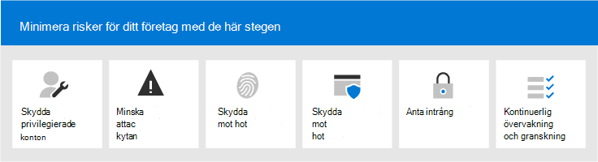

# Microsoft 365 Security for Business Decision Makers (BDMs)

I den här artikeln beskrivs några av de vanligaste hot och angreppsscenarier som organisationer för närvarande ställs inför i sina Microsoft 365-miljöer och rekommenderade åtgärder för att minimera dessa risker. Microsoft 365 har ett brett utbud av förkonfigurerade säkerhetsfunktioner, men det kräver också att du som kund tar ansvar för att skydda dina egna identiteter, data och enheter som används för åtkomst till molntjänster. Den här vägledningen utvecklades av Kozeta Beam (Microsoft Cloud Security Architect) och Thiagaraj Sundararajan (Microsoft Senior Consultant).

Den här artikeln är ordnad efter prioritet, och börjar med att skydda de konton som används för att administrera de mest kritiska tjänsterna och tillgångarna, till exempel klientorganisation, e-post och SharePoint. Det är ett metodiskt sätt att närma sig säkerheten och fungerar tillsammans med följande kalkylblad så att du kan följa upp dina framsteg med intressenter och grupper i organisationen: [Microsoft 365 Säkerhet för BDMs-kalkylblad](https://github.com/MicrosoftDocs/microsoft-365-docs/raw/public/microsoft-365/downloads/Microsoft-365-BDM-security-recommendations-spreadsheet.xlsx). 

Microsoft tillhandahåller verktyget Secure Score i din klientorganisation för att automatiskt analysera säkerheten baserat på dina vanliga aktiviteter, tilldela poäng och rekommendera säkerhetsförbättringar. Innan du vidtar de åtgärder som rekommenderas i den här artikeln bör du anteckna dina aktuella poäng och rekommendationer. De åtgärder som rekommenderas i den här artikeln ökar poängen. Målet är inte att uppnå maxresultatet, utan att vara medveten om möjligheter att skydda din miljö på ett sätt som inte negativt påverkar produktiviteten för dina användare. Se [Microsoft Secure Score](defender/microsoft-secure-score.md).

En sak till innan vi börjar . . . se till [att aktivera granskningsloggen](../compliance/search-the-audit-log-in-security-and-compliance.md). Du behöver dessa data senare, om du behöver undersöka en händelse eller ett brott. 

## Skydda privilegierade konton

Som ett första steg rekommenderar vi att se till att kritiska konton i miljön får ett extra skyddslager eftersom dessa konton har åtkomst och behörigheter att hantera och ändra kritiska tjänster och resurser som kan påverka hela organisationen negativt, om de har komprometterats. Att skydda behöriga konton är ett av de mest effektiva sätten att skydda mot en attackerare som vill höja behörigheterna för ett komprometterat konto till ett administrativt konto. 

|Rekommendation  |E3 |E5  |
|---------|---------|---------|
|Tillämpa multifaktorautentisering (MFA) för alla administrativa konton.||| 
|Implementera PIM (Azure Active Directory) (Privileged Identity Management) för Azure Active Directory (PIM) för att tillämpa direkt privilegierad åtkomst till Azure AD- och Azure-resurser. Du kan också identifiera vem som har åtkomst och granska behörighet.|         | |
|Implementera hantering av privilegierad åtkomst för att hantera detaljerad åtkomstkontroll över behörighetsadministratörsuppgifter i Office 365. |         | |
|Konfigurera och använda arbetsstationer av behörighetsåtkomst (SÅD) för att administrera tjänster. Använd inte samma arbetsstationer när du surfar på Internet och kontrollerar e-post som inte är relaterad till ditt administratörskonto.|  | | 

I följande diagram visas de här funktionerna.

Ytterligare rekommendationer:
- Se till att konton som synkroniseras från den lokala platsen inte har administratörsroller för molntjänster. Det här förhindrar att en attackerare utnyttjar lokala konton för att få administrativ åtkomst till molntjänster. 
- Kontrollera att tjänstkonton inte har administratörsroller. Dessa konton övervakas ofta inte och konfigureras med lösenord som inte förfaller. Börja med att kontrollera att AADConnect- och ADFS-tjänstkonton inte är globala administratörer som standard.
- Ta bort licenser från administratörskonton. Ta bort licenser från dessa konton såvida det inte finns ett specifikt användningsfall för att tilldela licenser till specifika administratörskonton. 

## Minska attackytan

Nästa fokusområde minskar attackytan. Det kan åstadkommas med minimal ansträngning och påverkan på dina användare och tjänster. Genom att minska attackytan har attacker färre sätt att starta en attack mot organisationen.

Här är några exempel:
- Inaktivera POP3-, IMAP- och SMTP-protokoll. De flesta moderna organisationer använder inte längre dessa äldre protokoll. Du kan tryggt inaktivera dessa och bara tillåta undantag vid behov. 
- Minska och se till att antalet globala administratörer i klientorganisationen alltid är absolut nödvändigt. Detta minskar direkt attackytan för alla molnappar. 
- Retire servers and applications that are no longer used in your environment. 
- Implementera en process för att inaktivera och ta bort konton som inte längre används. 

## Skydda mot kända hot

Kända hot är skadlig programvara, komprometterade konton och nätfiske. Vissa skydd mot dessa hot kan implementeras snabbt utan direkt påverkan på användarna, medan andra kräver mer planering och användarutbildning. 

|Rekommendation  |E3  |E5  |
|---------|---------|---------|
|**Konfigurera multifaktorautentisering och använd rekommenderade principer för villkorsstyrd åtkomst, inklusive principer för inloggningsrisker.** Microsoft rekommenderar och har testat en uppsättning principer som fungerar tillsammans för att skydda alla molnappar, inklusive Office 365- och Microsoft 365-tjänster. Se [Konfigurationer för identitets- och enhetsåtkomst](./office-365-security/microsoft-365-policies-configurations.md). | ||
|**Kräv multifaktorautentisering för alla användare.** Om du inte har den licensiering som krävs för att implementera de rekommenderade principerna för villkorsstyrd åtkomst krävs minst multifaktorautentisering för alla användare.|||
|**Höja skyddsnivån för skadlig programvara i e-post.** Office 365- eller Microsoft 365-miljön innehåller skydd mot skadlig programvara, men du kan öka skyddet genom att blockera bifogade filer med filtyper som ofta används för skadlig programvara.|||
|**Skydda din e-post från riktade nätfiskeattacker**. Om du har konfigurerat en eller flera egna domäner för din Office 365- eller Microsoft 365-miljö kan du konfigurera riktad skydd mot nätfiske. Skydd mot nätfiske, en del av Defender för Office 365, kan skydda organisationen från skadliga personifieringsbaserade nätfiskeattacker och andra nätfiskeattacker. Om du inte har konfigurerat en egen domän behöver du inte göra det.| ||
|**Skydda mot utpressningstrojaner i e-postmeddelanden.** Utpressningstrojaner tar bort åtkomsten till dina data genom att kryptera filer eller låsa datorskärmar. Den försöker sedan utträlja pengar från en tidigare leverantör genom att begära "utpressningstrojaner", vanligtvis i form av cryptocurrencies som Bitcoin, i utbyte för att returnera åtkomst till dina data. Du kan försvara dig mot utpressning genom att skapa en eller flera e-postflödesregler för att blockera filnamnstillägg som ofta används för utpressningstrojaner, eller för att varna användare som får dessa bifogade filer i e-postmeddelanden.|||
|**Spärra anslutningar från länder som du inte gör affärer med**. Skapa en villkorsstyrd åtkomstprincip i Azure AD för att blockera anslutningar från dessa länder och på ett effektivt sätt skapa en geobrandvägg runt klientorganisationen.| ||

I följande diagram visas de här funktionerna.

## Skydda mot okända hot

När du har lagt till extra skydd för dina konton med privilegierade konton och skyddat mot kända attacker kan du flytta din uppmärksamhet för att skydda mot okända hot. De mer beslutsamma och avancerade adversariesna använder innovativa och nya, okända metoder för att attackera organisationer. Med Microsofts omfattande telemetri med data som samlats över flera miljoner enheter, program och tjänster kan vi utföra Defender för Office 365 på Windows, Office 365 och Azure för att förhindra attacker mot nolldagarsattacker, användning av sandboxmiljöer och kontrollera giltighet innan åtkomst till ditt innehåll tillåts. 

|Rekommendation  |E3  |E5  |
|---------|---------|---------|
|**Konfigurera Microsoft Defender för Office 365:** * Säkra bifogade filer * Säkra länkar * ATP för SharePoint, OneDrive och Microsoft Teams * Skydd mot nätfiske i Defender för Office 365-skydd|         | |
|**Konfigurera Microsoft Defender för slutpunktsfunktioner:** * Windows Defender Antivirus  * Sårbarhetsskydd   * Minskning av attackytan   * Maskinvarubaserad avgränsning  * Reglerad mappåtkomst     |         | |
|**Använd Microsoft Cloud App Security för** att upptäcka SaaS-appar och börja använda funktionsanalys och avvikande identifiering. |         | |

I följande diagram visas de här funktionerna.

Ytterligare rekommendationer:
- Skydda meddelanden från partnerkanaler som e-postmeddelanden med TLS.
- Öppna endast Teams-federation för partner som du kommunicerar med.
- Lägg inte till avsändardomäner, enskilda avsändare eller käll-IP:er till listan över tillåtna adresser eftersom det gör att dessa kan kringgå kontroller av skräppost och skadlig programvara – En vanlig metod är att lägga till sina egna godkända domäner eller ett antal andra domäner där problem med e-postflödet kan ha rapporterats till listan över tillåtna. Lägg inte till domäner i listan Skräppost- och anslutningsfiltrering eftersom det kan leda till att du kringgår alla skräppostkontroller. 
- Aktivera utgående skräppostaviseringar – Aktivera utgående skräppostaviseringar till en distributionslista internt till support- eller IT-administratörsteamet för att rapportera om någon av de interna användarna skickar ut skräppost-e-postmeddelanden externt. Det kan vara en indikator på att kontot har komprometterats.
- Inaktivera Remote PowerShell för alla användare – Remote PowerShell används huvudsakligen av administratörer för att få åtkomst till tjänster i administrativa syften eller programmässiga API-åtkomst. Vi rekommenderar att du inaktiverar det här alternativet för användare som inte är administratörer för att undvika ny information om de inte har ett företagskrav för att komma åt det. 
- Blockera åtkomst till Microsoft Azure Management-portalen för alla icke-administratörer. Du kan åstadkomma detta genom att skapa en regel för villkorsstyrd åtkomst för att blockera alla användare, med undantag för administratörer. 

## Anta intrång

Även om Microsoft vidtar alla möjliga åtgärder för att förhindra mot hot och attacker, rekommenderar vi att alltid arbeta under tänkesättet "Anta intrång". Även om en attackerare har hanterat intrång i miljön måste vi se till att de inte kan föra ut data eller identitetsinformation från miljön. Därför rekommenderar vi att skydd mot känsliga data läcker ut, till exempel personnummer, kreditkortsnummer, ytterligare personlig information och annan konfidentiell information på organisationsnivå. 

Tänkesättet "Anta intrång" kräver att en strategi med noll förtroende-nätverk implementeras, vilket innebär att användarna inte är helt betrodda bara för att de är interna i nätverket. Som en del av auktoriseringen av vad användarna kan göra anges villkorsuppsättningar och när sådana villkor uppfylls, tillämpas vissa kontroller. Villkoren kan omfatta enhetens hälsostatus, program som används, åtgärder som utförs och användarrisk. Till exempel bör en åtgärd för enhetsregistrering alltid utlösa MFA-autentisering för att säkerställa att inga enheter läggs till i din miljö. 

En nollförtroendestrategi för nätverk kräver också att du vet var informationen lagras och tillämpar lämpliga kontroller för klassificering, skydd och bevarande. För att effektivt skydda dina viktigaste och känsliga tillgångar måste du först identifiera var dessa finns och göra inventeringar, vilket kan vara svårt. Arbeta sedan med din organisation för att definiera en strategi för styrning. Att definiera ett klassificeringsschema för en organisation och konfigurera principer, etiketter och villkor kräver noggrann planering och förberedelse. Det är viktigt att inse att det inte är en IT-drivna process. Se till att tillsammans med ditt team för juridisk information och efterlevnad ta fram ett lämpligt klassificerings- och etikettschema för organisationens data.

Informationsskyddsfunktioner i Microsoft 365 kan hjälpa dig att upptäcka vilken information du har, var den lagras och vilken information som kräver ytterligare skydd. Informationsskydd är en kontinuerlig process och Microsoft 365-funktioner ger dig insyn i hur användare använder och distribuerar känslig information, var din information lagras för närvarande och hur den flödar. Du kan också se hur användare som hanterar information som regleras för att se till att lämpliga etiketter och skydd tillämpas.

|Rekommendation |E3|E5 |
|---------|---------|---------|
|**Granska och optimera villkorsstyrd åtkomst och relaterade principer för att uppfylla dina mål för ett nätverk utan förtroende.** Skydd mot kända hot omfattar implementering av en uppsättning [rekommenderade principer.](./office-365-security/microsoft-365-policies-configurations.md) Granska din implementering av de här principerna för att säkerställa att du skyddar dina appar och data mot hackare som har fått åtkomst till ditt nätverk. Observera att den rekommenderade appskyddsprincipen för Intune för Windows 10 aktiverar Windows informationsskydd (WIP). WiP skyddar mot oavsiktliga läckor av organisationsdata via appar och tjänster, t.ex. e-post, sociala medier och det offentliga molnet. |         ||
|**Inaktivera extern vidarebefordran av e-post**. Hackare som får åtkomst till en användares postlåda kan stjäla din e-post genom att ställa in så att postlådan automatiskt vidarebefordrar e-post. Det här kan inträffa även utan användarens uppmärksamhet. Du kan förhindra detta genom att konfigurera en e-postflödesregel.| ||
|**Inaktivera anonym extern kalenderdelning**. Som standard tillåts extern anonym kalenderdelning. [Inaktivera kalenderdelning för](/exchange/sharing/sharing-policies/modify-a-sharing-policy) att minska potentiella läckage av känslig information.| ||
|**Konfigurera principer för skydd mot dataförlust för känsliga data.** Skapa en policy för dataförlustskydd i Säkerhetsefterlevnad för att upptäcka och skydda känsliga data, t.ex. &amp; kreditkortsnummer, personnummer och bankkontonummer. Microsoft 365 innehåller många fördefinierade typer av känslig information som du kan använda i principer för skydd mot dataförlust. Du kan också skapa egna typer av känslig information för känsliga data som är anpassade för din miljö. |||
|**Implementera principer för dataklassificering och informationsskydd.** Implementera känslighetsetiketter och använd dem för att klassificera och tillämpa skydd på känsliga data. Du kan också använda de här etiketterna i principer för skydd mot dataförlust. Om du använder Azure Information Protection-etiketter rekommenderar vi att du undviker att skapa nya etiketter i andra administrationscenter.|         ||
|**Skydda data i appar och tjänster från tredje part med hjälp av Cloud App Security.** Konfigurera säkerhetsprinciper för molnappar för att skydda känslig information i molnprogram från tredje part, till exempel Salesforce, Box eller Dropbox. Du kan använda typer av känslig information och känslighetsetiketter som du skapat i Säkerhetsprinciper för Cloud App och använda dessa i dina SaaS-appar.   Med Microsoft Cloud App Security kan du tillämpa en mängd olika automatiserade processer. Principer kan ställas in för kontinuerliga genomsökningar av efterlevnad, juridiska eDiscovery-uppgifter, DLP för känsligt innehåll offentligt och mycket mer. Molnappsäkerhet kan övervaka alla filtyper baserat på fler än 20 metadatafilter (till exempel åtkomstnivå, filtyp). |         ||
|**Använd [Microsoft Defender för Slutpunkt för](/windows/security/threat-protection/microsoft-defender-atp/information-protection-in-windows-overview) att identifiera om användare lagrar känslig information på sina Windows-enheter.** |         ||
|**Använd [AIP-skanner](/azure/information-protection/deploy-aip-scanner) för att identifiera och klassificera information över servrar och filresurser.** Använd AIP-rapporteringsverktyget för att visa resultaten och vidta lämpliga åtgärder.|         ||

I följande diagram visas de här funktionerna.

## Kontinuerlig övervakning och granskning

Sist men inte minst Kontinuerlig övervakning och granskning av Microsoft 365-miljön tillsammans med Windows och enheter är avgörande för att du snabbt ska kunna identifiera och åtgärda eventuella intrång. Verktyg som Secure Score, Säkerhetscenter och avancerade analyser i Microsoft Intelligent Graph ger ovärderlig information i klientorganisationen och länkar stora mängder hotinformation och säkerhetsdata för att ge dig enastående skydd och identifiering av hot.

|Rekommendation |E3 |E5 |
|---------|---------|---------|
|Kontrollera att **granskningsloggen** är aktiverad.|||
|**Granska Secure Score varje** vecka – Secure score är en central plats för att komma åt företagets säkerhetsstatus och vidta åtgärder baserat på rekommendationer om säkra poäng. Vi rekommenderar att du utför den här kontrollen varje vecka.|||
|Använd **Microsoft Defender för Office 365-verktyg:** * Undersökning av hot och svarsfunktioner  * Automatiserad undersökning och svar |         ||
|Använda **Microsoft Defender för slutpunkt:**  *    [Identifiering och svar av slutpunkter](/windows/security/threat-protection/microsoft-defender-atp/overview-endpoint-detection-response)   * Secure-poäng för automatiserad undersökning och åtgärd  *    [Avancerad sökning](/windows/security/threat-protection/microsoft-defender-atp/advanced-hunting-overview)  |         ||
|Använd **Microsoft Cloud App Security** för att identifiera ovanligt beteende i molnappar för att identifiera utpressningstrojaner, komprometterade användare eller falska program, analysera högriskanvändning och åtgärda automatiskt för att begränsa risken till din organisation.|         ||
|Använd **Microsoft Azure Sentinel eller** ditt aktuella SIEM-verktyg för att övervaka potentiella hot i din miljö. |         ||
|**Distribuera [Microsoft Defender för identitet](/azure-advanced-threat-protection/what-is-atp)** för att övervaka och skydda mot hot som riktar sig till din lokala Active Directory-miljö.   |         | |
|Använd **Azure Defender** _ för att övervaka hot i hybrid- och molnbelastningar. Azure Defender_ inkluderar en kostnadsfri nivå av funktioner och en standardnivå av funktioner som betalas baserat på resurstimmar eller transaktioner.|         |         |

I följande diagram visas de här funktionerna.

Mest rekommenderade övervakningsåtgärder:
- **Granska Microsoft Secure Score varje** vecka – Secure score är en central plats för att komma åt säkerhetsstatus för din klientorganisation och vidta åtgärder baserat på de viktigaste rekommendationerna. Vi rekommenderar att du utför den här kontrollen varje vecka. Secure Score innehåller rekommendationer från Azure AD, Intune, Cloud App Security och Microsoft Defender för Endpoint, samt Office 365. 
- **Granska riskfyllda inloggningar varje** vecka – Använd administrationscentret för Azure AD till att granska riskfyllda inloggningar varje vecka. Den rekommenderade identitets- och enhetsåtkomstregleruppsättningen innehåller en princip för att framtvinga lösenordsändring för riskfyllda inloggningar.  
- Gå igenom de populäraste användarna av skadlig programvara och **phished** users varje vecka – Använd Microsoft Defender för Office 365 Threat Explorer för att granska de populäraste användarna med skadlig programvara och nätta och ta reda på orsaken till varför dessa användare påverkas.