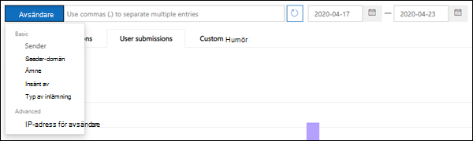

# Använd administrationsinskick för att skicka misstänkt skräppost, nättr ut, URL:er och filer till MicrosoftUse Admin Submission to submit suspected spam, phish, URLs, and files to Microsoft

[!INCLUDE [Microsoft 365 Defender rebranding](../includes/microsoft-defender-for-office.md)]

**Gäller för****Applies to**
- [Exchange Online ProtectionExchange Online Protection](exchange-online-protection-overview.md)
- [Microsoft Defender för Office 365 Abonnemang 1 och Abonnemang 2Microsoft Defender for Office 365 plan 1 and plan 2](defender-for-office-365.md)

I Microsoft 365-organisationer med postlådor i Exchange Online kan administratörer använda portalen för inskickade meddelanden i säkerhets- och efterlevnadscentret för & för att skicka e-postmeddelanden, URL:er och bifogade filer till Microsoft för genomsökning.In Microsoft 365 organizations with mailboxes in Exchange Online, admins can use the Submissions portal in the Security & Compliance Center to submit email messages, URLs, and attachments to Microsoft for scanning.

När du skickar ett e-postmeddelande får du:When you submit an email message, you will get:

1. **Kontroll av e-postautentisering:** Information om e-postautentisering har godkänts eller misslyckats när den levererades.**Email authentication check**: Details on whether email authentication passed or failed when it was delivered.
2. **Principträffar:** Information om principer som kan ha tillåtit eller blockerat inkommande e-post i klientorganisationen, åsidosätter våra tjänstfilters bedömningar.**Policy hits**: Information about any policies that may have allowed or blocked the incoming email into your tenant, overriding our service filter verdicts.
3. **Payload reputation/detonation**: Eng över alla URL:er och bifogade filer i meddelandet.**Payload reputation/detonation**: Examination of any URLs and attachments in the message.
4. **Gradersanalys:** Granska utförts av grader för att bekräfta om meddelanden är skadliga.**Grader analysis**: Review done by human graders in order to confirm whether or not messages are malicious.

> [!IMPORTANT]
> Analys av berytning och gradering av nyttolast görs inte i alla klientorganisationen.Payload reputation/detonation and grader analysis are not done in all tenants. Information blockeras från att gå utanför organisationen när data inte ska lämna klientorganisationsgränsen i efterlevnadssyfte.Information is blocked from going outside the organization when data is not supposed to leave the tenant boundary for compliance purposes.

Andra sätt att skicka e-postmeddelanden, URL:er och bifogade filer till Microsoft finns i [Rapportera meddelanden och filer till Microsoft.](report-junk-email-messages-to-microsoft.md)For other ways to submit email messages, URLs, and attachments to Microsoft, see [Report messages and files to Microsoft](report-junk-email-messages-to-microsoft.md).

## Vad behöver jag veta innan jag börjar?What do you need to know before you begin?

- Öppna Säkerhets- och efterlevnadscentret på <https://protection.office.com/>.You open the Security & Compliance Center at <https://protection.office.com/>. Använd för att gå direkt **till sidan** Inskickat. <https://protection.office.com/reportsubmission>To go directly to the **Submission** page, use <https://protection.office.com/reportsubmission>.

- För att skicka meddelanden och filer till Microsoft måste du vara medlem i någon av följande rollgrupper:To submit messages and files to Microsoft, you need to be a member of one of the following role groups:

  - **Organisationshantering** eller **Säkerhetsadministratör** i [Säkerhets- och efterlevnadscenter](permissions-in-the-security-and-compliance-center.md).**Organization Management** or **Security Administrator** in the [Security & Compliance Center](permissions-in-the-security-and-compliance-center.md).

  - **Organisationshantering** i [Exchange Online.](/Exchange/permissions-exo/permissions-exo#role-groups)**Organization Management** in [Exchange Online](/Exchange/permissions-exo/permissions-exo#role-groups).

    Observera att medlemskap i den här rollgruppen krävs för att [visa användarinskick till den anpassade postlådan enligt](#view-user-submissions-to-the-custom-mailbox) beskrivningen längre fram i den här artikeln.Note that membership in this role group is required to [View user submissions to the custom mailbox](#view-user-submissions-to-the-custom-mailbox) as described later in this article.

- Mer information om hur användare kan skicka meddelanden och filer till Microsoft finns i [Rapportera meddelanden och filer till Microsoft.](report-junk-email-messages-to-microsoft.md)For more information about how users can submit messages and files to Microsoft, see [Report messages and files to Microsoft](report-junk-email-messages-to-microsoft.md).

## Rapportera misstänkt innehåll till MicrosoftReport suspicious content to Microsoft

1. I Säkerhets- & efterlevnadscenter går  du till Inskickade hothantering , kontrollerar att du är på fliken Administratörsinskickningar och klickar sedan \> på **Ny inskickad inskickad information.** In the Security & Compliance Center, go to **Threat management** \> **Submissions**, verify that you're on the **Admin submissions** tab, and then click **New submission**.

2. Använd den utfällingstext för ny inskickning som ser ut att skicka meddelandet, **URL:en** eller den bifogade filen enligt beskrivningen i följande avsnitt.Use **New submission** flyout that appears to submit the message, URL, or attachment as described in the following sections.

### Skicka ett tveksamt e-postmeddelande till MicrosoftSubmit a questionable email to Microsoft

1. Välj **E-post** i avsnittet **Objekttyp.**In the **Object type** section, select **Email**. Använd **något av följande** alternativ i avsnittet Överföringsformat:In the **Submission format** section, use one of the following options:

   - **Nätverksmeddelande-ID:** Det här är ett GUID-värde som är tillgängligt i rubriken **X-MS-Exchange-Organization-Network-Message-Id** i meddelandet eller i **rubriken X-MS-Office365-Filtering-Correlation-Id** i meddelanden i karantän.**Network Message ID**: This is a GUID value that's available in the **X-MS-Exchange-Organization-Network-Message-Id** header in the message, or in the **X-MS-Office365-Filtering-Correlation-Id** header in quarantined messages.

   - **Fil:** Klicka på **Välj fil**.**File**: Click **Choose file**. Leta rätt på och välj .eml- eller .msg-filen i dialogrutan som öppnas och klicka sedan på **Öppna**.In the dialog that opens, find and select the .eml or .msg file, and then click **Open**.

   > [!NOTE]
   > Administratörer med Defender för Office 365 abonnemang 1 eller abonnemang 2 kan skicka meddelanden så gamla som 30 dagar.Admins with Defender for Office 365 Plan 1 or Plan 2 are able to submit messages as old as 30 days. Andra administratörer kan bara gå tillbaka 7 dagar.Other admins will only be able to go back 7 days.

2. I avsnittet **Mottagare** anger du en eller flera mottagare som du vill köra en principkontroll mot.In the **Recipients** section, specify one or more recipients that you would like to run a policy check against. Principkontrollen avgör om förbikoppling av e-post beror på användar- eller organisationsprinciper.The policy check will determine if the email bypassed scanning due to user or organization policies.

3. Välj **något av följande** alternativ i avsnittet Orsak till inskickning:In the **Reason for submission** section, select one of the following options:

   - **Borde inte ha blockerats****Should not have been blocked**

   - **Ska ha blockerats:** Välj **Skräppost,** **Nätfiske** eller **Skadlig kod.****Should have been blocked**: Select **Spam**, **Phishing**, or **Malware**. Om du är osäker kan du använda ditt bästa omdöme.If you're not sure, use your best judgment.

4. När du är klar klickar du på **skicka-knappen.**When you're finished, click the **Submit** button.

   

### Skicka en misstänkt URL till MicrosoftSend a suspect URL to Microsoft

1. Välj URL **i avsnittet** **Objekttyp.**In the **Object type** section, select **URL**. I rutan som visas anger du den fullständiga webbadressen (till exempel `https://www.fabrikam.com/marketing.html` ).In the box that appears, enter the full URL (for example, `https://www.fabrikam.com/marketing.html`).

2. Välj **något av följande** alternativ i avsnittet Orsak till inskickning:In the **Reason for submission** section, select one of the following options:

   - **Borde inte ha blockerats****Should not have been blocked**

   - **Ska ha blockerats:** Välj **Nätfiske** eller **skadlig kod.****Should have been blocked**: Select **Phishing** or **Malware**.

3. När du är klar klickar du på **skicka-knappen.**When you're finished, click the **Submit** button.

   

### Skicka en misstänkt fil till MicrosoftSubmit a suspected file to Microsoft

1. Välj **Bifogad fil** i avsnittet **Objekttyp.**In the **Object type** section, select **Attachment**.

2. Klicka **på Välj fil**.Click **Choose File**. Leta rätt på och markera filen i dialogrutan som öppnas och klicka sedan på **Öppna**.In the dialog that opens, find and select the file, and then click **Open**.

3. Välj **något av följande** alternativ i avsnittet Orsak till inskickning:In the **Reason for submission** section, select one of the following options:

   - **Borde inte ha blockerats****Should not have been blocked**

   - **Borde ha blockerats:** **Skadlig programvara** är det enda alternativet, och väljs automatiskt.**Should have been blocked**: **Malware** is the only choice, and is automatically selected..

4. När du är klar klickar du på **skicka-knappen.**When you're finished, click the **Submit** button.

   

## Visa administrationsinskickView admin submissions

I Säkerhets- & efterlevnadscenter går  du till Inskickade hothantering , kontrollerar att du är på fliken Administratörsinskickningar och klickar sedan \> på **Ny inskickad inskickad information.** In the Security & Compliance Center, go to **Threat management** \> **Submissions**, verify that you're on the **Admin submissions** tab, and then click **New submission**.

Högst upp på sidan kan du ange ett startdatum, ett slutdatum och (som  standard) kan du filtrera efter sändnings-ID (ett GUID-värde som är tilldelat till varje inskickat värde) genom att ange ett värde i rutan och klicka på Uppdatera knapp  .Near the top of the page, you can enter a start date, an end date, and (by default) you can filter by **Submission ID** (a GUID value that's assigned to every submission) by entering a value in the box and clicking . Du kan ange flera värden avgränsade med kommatecken.You can enter multiple values separated by commas.

Om du vill ändra filtervillkor klickar du på knappen Inskickat **ID** och väljer något av följande värden:To change the filter criteria, click the **Submission ID** button and choose one of the following values:

- **Avsändare****Sender**
- **Ämne/URL/Filnamn****Subject/URL/File name**
- **Skickat av****Submitted by**
- **Typ av inskickat material****Submission type**
- **Status****Status**

Om du vill exportera resultaten klickar **du på** Exportera högst upp på sidan och väljer **Diagramdata** eller **Tabell.**To export the results, click **Export** near the top of the page and select **Chart data** or **Table**. Spara CSV-filen i dialogrutan som visas.In the dialog that appears, save the .csv file.

Under diagrammet finns tre **flikar:** E-post (standard), **URL och** **Bifogad fil**.Below the graph, there are three tabs: **Email** (default), **URL**, and **Attachment**.

### Visa e-postinskick från administratörView admin email submissions

Klicka på fliken **E-post.**Click the **Email** tab.

Du kan klicka på **knappen Kolumnalternativ** längst ned på sidan om du vill lägga till eller ta bort kolumner i vyn:You can click the **Column options** button near the bottom of the page to add or remove columns from the view:

- **Datum****Date**
- **Överförings-ID:** Ett GUID-värde som tilldelas till varje sändning.**Submission ID**: A GUID value that's assigned to every submission.
- **Skickat av**\***Submitted by**\*
- **Ämne**\***Subject**\*
- **Avsändare****Sender**
- **Sender IP**\***Sender IP**\*
- **Typ av inskickat material****Submission type**
- **Leveransorsak****Delivery reason**
- **Status**\***Status**\*

  \* Om du klickar på det här värdet visas detaljerad information i en utfäll tillgänglig plats.\* If you click this value, detailed information is displayed in a flyout.

#### Information om administratörsinskickning igenAdmin submission rescan details

Meddelanden som skickas i administratörsinskick genomsöks på ny plats och resultaten visas i den utfällade informationen:Messages that are submitted in admin submissions are rescanned and results shown in the details flyout:

- Om avsändarens e-postautentisering misslyckades vid leveransen.If there was a failure in the sender's email authentication at the time of delivery.
- Information om politiska träffar som kan ha påverkat eller åsidosatt bedömningen av ett meddelande.Information about any policy hits that could have affected or overridden the verdict of a message.
- Aktuella detonationsresultat för att se om webbadresserna eller filerna i meddelandet var skadliga eller inte.Current detonation results to see if the URLs or files contained in the message were malicious or not.
- Feedback från grader.Feedback from graders.

Om en åsidosättning hittades bör omskanningen slutföras på några minuter.If an override was found, the rescan should complete in several minutes. Om det inte uppstod något problem i e-postautentisering eller -leverans påverkades inte av en åsidosättning, kan feedback från grader ta upp till en dag.If there wasn't a problem in email authentication or delivery wasn't affected by an override, then the feedback from graders could take up to a day.

### Visa url-inskickade administratörs-URLView admin URL submissions

Klicka på **fliken URL.**Click the **URL** tab.

Du kan klicka på **knappen Kolumnalternativ** längst ned på sidan om du vill lägga till eller ta bort kolumner i vyn:You can click the **Column options** button near the bottom of the page to add or remove columns from the view:

- **Datum****Date**
- **Sändnings-ID****Submission ID**
- **Skickat av**\***Submitted by**\*
- **URL**\***URL**\*
- **Typ av inskickat material****Submission type**
- **Status**\***Status**\*

  \* Om du klickar på det här värdet visas detaljerad information i en utfäll tillgänglig plats.\* If you click this value, detailed information is displayed in a flyout.

### Visa inskickade bifogade filer från administratörerView admin attachment submissions

Klicka på **fliken Bifogade** filer.Click the **Attachments** tab.

Du kan klicka på **knappen Kolumnalternativ** längst ned på sidan om du vill lägga till eller ta bort kolumner i vyn:You can click the **Column options** button near the bottom of the page to add or remove columns from the view:

- **Datum****Date**
- **Sändnings-ID****Submission ID**
- **Skickat av**\***Submitted by**\*
- **Filnamn**\***File name**\*
- **Typ av inskickat material****Submission type**
- **Status**\***Status**\*

  \* Om du klickar på det här värdet visas detaljerad information i en utfäll tillgänglig plats.\* If you click this value, detailed information is displayed in a flyout.

## Visa användarinskick till MicrosoftView user submissions to Microsoft

Om du har distribuerat tillägget Rapportmeddelande,  tillägget Rapportfiske eller om användarna använder den [inbyggda](report-junk-email-and-phishing-scams-in-outlook-on-the-web-eop.md)rapporteringen i Outlook på webben, kan du se vad användarna rapporterar på fliken Användarinsändning. If you've deployed the [Report Message add-in](enable-the-report-message-add-in.md), the [Report Phishing add-in](enable-the-report-phish-add-in.md), or people use the [built-in reporting in Outlook on the web](report-junk-email-and-phishing-scams-in-outlook-on-the-web-eop.md), you can see what users are reporting on the **User submissions** tab.

1. I Säkerhets- & efterlevnadscenter går du till **Sändning av** \> **hothantering.**In the Security & Compliance Center, go to **Threat management** \> **Submissions**.

2. Välj fliken **Användarinskickningar** och klicka sedan på **Ny inskicking.**Select the **User submissions** tab, and then click **New submission**.

Du kan klicka på **knappen Kolumnalternativ** längst ned på sidan om du vill lägga till eller ta bort kolumner i vyn:You can click the **Column options** button near the bottom of the page to add or remove columns from the view:

- **Skickat****Submitted on**
- **Skickat av**\***Submitted by**\*
- **Ämne**\***Subject**\*
- **Avsändare****Sender**
- **Sender IP**\***Sender IP**\*
- **Typ av inskickat material****Submission type**

\* Om du klickar på det här värdet visas detaljerad information i en utfäll tillgänglig plats.\* If you click this value, detailed information is displayed in a flyout.

Högst upp på sidan kan du ange ett startdatum, ett slutdatum och (som  standard) kan du filtrera efter avsändare genom att ange ett värde i rutan och klicka på  knapp.Near the top of the page, you can enter a start date, an end date, and (by default) you can filter by **Sender** by entering a value in the box and clicking . Du kan ange flera värden avgränsade med kommatecken.You can enter multiple values separated by commas.

Om du vill ändra filtervillkor klickar du **på knappen** Avsändare och väljer något av följande värden:To change the filter criteria, click the **Sender** button and choose one of the following values:

- **Avsändningsdomän****Sender domain**
- **Ämne****Subject**
- **Skickat av****Submitted by**
- **Typ av inskickat material****Submission type**
- **Sender IP****Sender IP**

Om du vill exportera resultaten klickar **du på** Exportera högst upp på sidan och väljer **Diagramdata** eller **Tabell.**To export the results, click **Export** near the top of the page and select **Chart data** or **Table**. Spara CSV-filen i dialogrutan som visas.In the dialog that appears, save the .csv file.

## Visa användarinskick till den anpassade postlådanView user submissions to the custom mailbox

**Om** du har konfigurerat [en anpassad postlåda för](user-submission.md) att ta emot användarrapporterade meddelanden kan du visa och skicka meddelanden som har levererats till den rapportpostlådan.**If** you've [configured a custom mailbox](user-submission.md) to receive user reported messages, you can view and also submit messages that were delivered to the reporting mailbox.

1. I Säkerhets- & efterlevnadscenter går du till **Sändning av** \> **hothantering.**In the Security & Compliance Center, go to **Threat management** \> **Submissions**.

2. Välj fliken **Anpassad** postlåda.Select the **Custom mailbox** tab.

Du kan klicka på **knappen Kolumnalternativ** längst ned på sidan om du vill lägga till eller ta bort kolumner i vyn:You can click the **Column options** button near the bottom of the page to add or remove columns from the view:

- **Skickat****Submitted on**
- **Skickat av**\***Submitted by**\*
- **Ämne**\***Subject**\*
- **Avsändare****Sender**
- **Sender IP**\***Sender IP**\*
- **Typ av inskickat material****Submission type**

Högst upp på sidan kan du ange ett startdatum, ett slutdatum och du kan filtrera efter **Skickat** genom att ange ett värde i rutan och klicka på  Uppdatera.Near the top of the page, you can enter a start date, an end date, and you can filter by **Submitted by** by entering a value in the box and clicking . Du kan ange flera värden avgränsade med kommatecken.You can enter multiple values separated by commas.

Om du vill exportera resultaten klickar **du på** Exportera högst upp på sidan och väljer **Diagramdata** eller **Tabell.**To export the results, click **Export** near the top of the page and select **Chart data** or **Table**. Spara CSV-filen i dialogrutan som visas.In the dialog that appears, save the .csv file.

## Ångra användarinskickUndo user submissions

När en användare skickar ett misstänkt e-postmeddelande till den anpassade postlådan kan användaren och administratören inte ångra inskickat material.Once a user submits a suspicious email to the custom mailbox, the user and admin don't have an option to undo the submission. Om användaren vill återställa e-posten kan den återställas i mapparna Borttagna objekt eller Skräppost.If the user would like to recover the email, it will be available for recovery in the Deleted Items or Junk Email folders.

### Skicka meddelanden till Microsoft från den anpassade postlådanSubmit messages to Microsoft from the custom mailbox

Om du har konfigurerat den anpassade postlådan för att snappa upp användarrapporterade meddelanden utan att skicka meddelanden till Microsoft kan du hitta och skicka specifika meddelanden till Microsoft för analys.If you've configured the custom mailbox to intercept user-reported messages without sending the messages to Microsoft, you can find and send specific messages to Microsoft for analysis. Då flyttas en användarinskickning till en administratörsinskickning.This effectively moves a user submission to an admin submission.

Markera **ett meddelande i** listan på fliken Anpassad postlåda, klicka **på** knappen Åtgärd och gör något av följande:On the **Custom mailbox** tab, select a message in the list, click the **Action** button, and make one of the following selections:

- **Rapportrensning****Report clean**
- **Rapportera nätfiske****Report phishing**
- **Rapportera skadlig programvara****Report malware**
- **Rapportera skräppost****Report spam**

