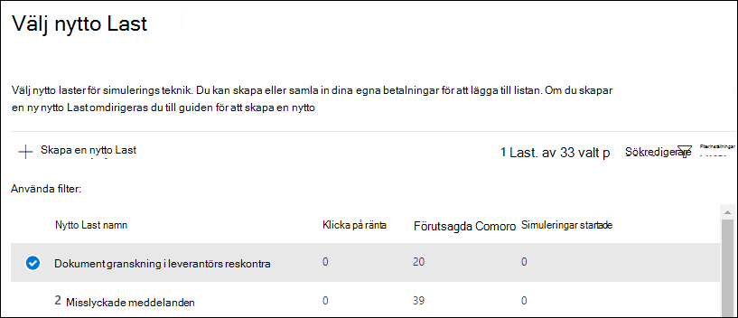

# Simulera en nätfiskeattack

Med simuleringsutbildning för attacker i Microsoft Defender för Office 365 kan du köra simuleringar av cyberattacker på din organisation för att testa dina säkerhetsprinciper och metoder, samt utbilda dina anställda att öka deras medvetenhet och minska deras känslighet för attacker. Den här artikeln beskriver hur du skapar en simulerad nätfiskeattack med hjälp av utbildning om attackbedrägerier.

Information om attack simuleringsutbildning för att komma igång finns i [Komma igång med simulering av attack .](attack-simulation-training-get-started.md)

Om du vill starta en simulerad nätfiskeattack öppnar du [Microsoft 365](https://security.microsoft.com/)säkerhetscenter , går till **E-&-utbildning** för samarbete attackattack och växlar till \>  [**fliken Simuleringar.**](https://security.microsoft.com/attacksimulator?viewid=simulations)

Under **Simuleringar** väljer du **+ Starta en simulering**.

> [!NOTE]
> När som helst under simuleringen kan du spara och stänga för att fortsätta konfigurera simuleringen vid ett senare tillfälle.

## Välja en social engineering teknik

Välj bland fyra olika tekniker som används i [MITRE ATT&CK® framework.](https://attack.mitre.org/techniques/enterprise/) Olika nyttolaster är tillgängliga för olika tekniker:

- **Autentiseringsuppgifter försöker samla** in autentiseringsuppgifter genom att ta användare till en känd webbplats med inmatningsrutor för att skicka ett användarnamn och lösenord.
- **Bifogade filer från skadlig** programvara lägger till en skadlig bilaga i ett meddelande. När användaren öppnar den bifogade filen körs godtycklig kod som hjälper attackeraren att kompromettera målets enhet.
- **Länk i bifogad** fil är en typ av hybrid för autentiseringsuppgifter för hybrid av autentiseringsuppgifter. En attack infogar en URL i en e-postbilaga. URL:en i den bifogade filen följer samma teknik som autentiseringsuppgifter.
- **Länk till skadlig** programvara kör skadlig kod från en fil som finns på en känd fildelningstjänst. Meddelandet som skickas till användaren innehåller en länk till den här skadliga filen. Öppna filen och hjälpa attackerare att kompromettera målets enhet.
- **Drive-by URL** är den plats där den skadliga URL-adressen i meddelandet tar användaren till en välbekant webbplats som tyst kör och/eller installerar kodkod på användarens enhet.

> [!TIP]
> Om du **klickar på** Visa information i beskrivningen av varje teknik visas ytterligare information och simuleringsstegen för tekniken.
>
> 

När du har valt tekniken och klickat på Nästa **ger** du simuleringen ett namn och en beskrivning om du vill.

## Välja en nyttolast

Därefter måste du antingen välja en nyttolast från den befintliga nyttokatalogen.

Nyttolaster har ett antal datapunkter som du kan använda för att välja:

- **Click rate counts** how many people clicked this payload.
- **Förutsagd** komprometterad ränta förutsäger den procentandel av personer som kommer att bli komprometterad av den här nyttolasten baserat på historiska data för nyttolasten i Microsoft Defender för Office 365-kunder.
- **Simuleringar som startas** räknar antalet gånger den här nyttolasten användes i andra simuleringar.
- **Komplexitet ,** som är tillgänglig **via** filter, beräknas baserat på antalet indikatorer i den nyttolast som ledtråden pekar på är en attack. Fler indikatorer ger lägre komplexitet.
- **Källa,** som **är** tillgänglig via filter, anger om nyttolasten skapades i klientorganisationen eller är en del av Microsofts befintliga nyttolastkatalog (global).

Välj en nyttolast i listan om du vill se en förhandsgranskning av nyttolasten med ytterligare information om den.

Om du vill skapa en egen nyttolast kan du läsa skapa [en nyttolast för attack simuleringsutbildning](attack-simulation-training-payloads.md).

## Målgruppsanpassning

Nu är det dags att välja den här simuleringspubliken. Du kan välja att **inkludera alla användare i organisationen eller** att endast ta med specifika användare och **grupper.**

När du väljer att **endast inkludera vissa användare och grupper kan** du antingen:

- **Lägg till** användare , så att du kan utnyttja sökning för din klientorganisation, samt avancerade sök- och filtreringsfunktioner, till exempel rikta användare som inte har riktats av en simulering under de senaste 3 månaderna.
  
- **Med Import från CSV** kan du importera en fördefinierad uppsättning användare för den här simuleringen.

## Tilldela utbildning

Vi rekommenderar att du tilldelar utbildning för varje simulering eftersom anställda som går igenom utbildning inte är lika känsliga för liknande attacker.

Du kan antingen välja att själv tilldela utbildning eller välja utbildningar och moduler.

Välj förfallodatum **för utbildning för** att se till att anställda slutför sin utbildning i tid.

> [!NOTE]
> Om du väljer att själv välja kurser och moduler kan du fortfarande se det rekommenderade innehållet samt alla tillgängliga kurser och moduler.
>
> 

I nästa steg måste du  Lägga till utbildningar om du valt att välja det själv och anpassa startsidan för utbildningen. Du kommer att kunna förhandsgranska startsidan för utbildningen samt ändra sidhuvud och brödtext i den.

## Starta information och granska

Nu när allt är konfigurerat kan du starta den här simuleringen direkt eller schemalägga den till ett senare datum. Du måste också välja när du vill avsluta den här simuleringen. Vi slutar samla in interaktionen med den här simuleringen efter den valda tiden.

**Aktivera regionmedveten leverans av tidszoner** för att leverera simulerade attackmeddelanden till dina anställda under arbetstid baserat på deras region.

När du är klar klickar du på **Nästa och** granskar detaljerna i din simulering. Klicka på **Redigera** på någon av delarna för att gå tillbaka och ändra information som behöver ändras. Klicka på Skicka när du är **klar.**
