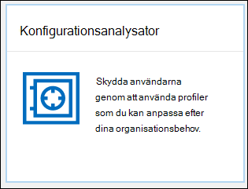
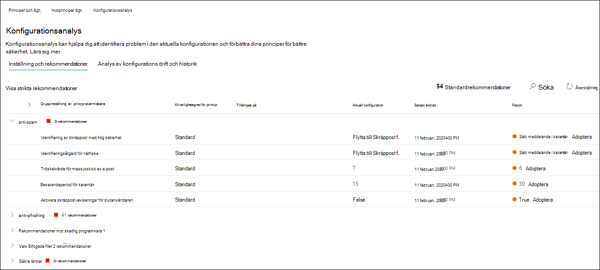
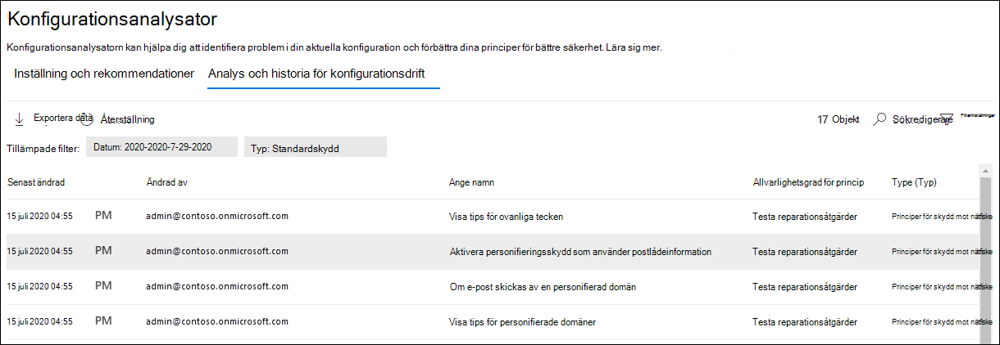

# Konfigurationsanalys för skyddsprinciper i EOP och Microsoft Defender för Office 365Configuration analyzer for protection policies in EOP and Microsoft Defender for Office 365

[!INCLUDE [Microsoft 365 Defender rebranding](../includes/microsoft-defender-for-office.md)]

**Gäller för****Applies to**
- [Exchange Online ProtectionExchange Online Protection](exchange-online-protection-overview.md)
- [Microsoft Defender för Office 365 Abonnemang 1 och Abonnemang 2Microsoft Defender for Office 365 plan 1 and plan 2](defender-for-office-365.md)
- [Microsoft 365 DefenderMicrosoft 365 Defender](../defender/microsoft-365-defender.md)

Konfigurationsanalys i Säkerhets- och efterlevnadscenter för & tillhandahåller en central plats för att hitta och åtgärda säkerhetsprinciper där inställningarna finns under profilinställningarna Standardskydd och Strikt skydd i [förinställda säkerhetsprinciper.](preset-security-policies.md)Configuration analyzer in the Security & Compliance center provides a central location to find and fix security policies where the settings are below the Standard protection and Strict protection profile settings in [preset security policies](preset-security-policies.md).

Följande typer av principer analyseras av konfigurationsanalysatorn:The following types of policies are analyzed by the configuration analyzer:

- **Principer för Exchange Online Protection (EOP):** Det här omfattar Microsoft 365-organisationer med Exchange Online-postlådor och fristående EOP-organisationer utan Exchange Online-postlådor:**Exchange Online Protection (EOP) policies**: This includes Microsoft 365 organizations with Exchange Online mailboxes and standalone EOP organizations without Exchange Online mailboxes:

  - [Principer för skydd mot skräppost.](configure-your-spam-filter-policies.md)[Anti-spam policies](configure-your-spam-filter-policies.md).
  - [Principer för skydd mot skadlig programvara.](configure-anti-malware-policies.md)[Anti-malware policies](configure-anti-malware-policies.md).
  - [Principer för skydd mot nätfiske i EOP.](set-up-anti-phishing-policies.md#spoof-settings)[EOP Anti-phishing policies](set-up-anti-phishing-policies.md#spoof-settings).

- **Principer för Microsoft Defender för Office 365:** Detta omfattar organisationer med Microsoft 365 E5 eller Defender för tilläggsprenumerationer för Office 365:**Microsoft Defender for Office 365 policies**: This includes organizations with Microsoft 365 E5 or Defender for Office 365 add-on subscriptions:

  - Principer mot nätfiske i Microsoft Defender för Office 365, som omfattar:Anti-phishing policies in Microsoft Defender for Office 365, which include:

    - Samma [förfalskningsinställningar som](set-up-anti-phishing-policies.md#spoof-settings) finns i EOP-principer för skydd mot nätfiske.The same [spoof settings](set-up-anti-phishing-policies.md#spoof-settings) that are available in the EOP anti-phishing policies.
    - [Inställningar för personifieringImpersonation settings](set-up-anti-phishing-policies.md#impersonation-settings-in-anti-phishing-policies-in-microsoft-defender-for-office-365)
    - [Avancerade tröskelvärden för nätfiskeAdvanced phishing thresholds](set-up-anti-phishing-policies.md#advanced-phishing-thresholds-in-anti-phishing-policies-in-microsoft-defender-for-office-365)

  - [Principer för säkra länkar.](set-up-safe-links-policies.md)[Safe Links policies](set-up-safe-links-policies.md).

  - [Principer för säkra bifogade filer.](set-up-safe-attachments-policies.md)[Safe Attachments policies](set-up-safe-attachments-policies.md).

**Standard-** och **Strikt-principinställningsvärdena** som används som baslinjer beskrivs i Rekommenderade inställningar för EOP och Microsoft Defender för Office [365-säkerhet.](recommended-settings-for-eop-and-office365.md)The **Standard** and **Strict** policy setting values that are used as baselines are described in [Recommended settings for EOP and Microsoft Defender for Office 365 security](recommended-settings-for-eop-and-office365.md).

## Vad behöver jag veta innan jag börjar?What do you need to know before you begin?

- Öppna Säkerhets- och efterlevnadscentret på <https://protection.office.com/>.You open the Security & Compliance Center at <https://protection.office.com/>. Använd för att gå **direkt till sidan Configuration analyzer** <https://protection.office.com/configurationAnalyzer> .To go directly to the **Configuration analyzer** page, use <https://protection.office.com/configurationAnalyzer>.

- Information om hur du ansluter till Exchange Online PowerShell finns i [Anslut till Exchange Online PowerShell](/powershell/exchange/connect-to-exchange-online-powershell).To connect to Exchange Online PowerShell, see [Connect to Exchange Online PowerShell](/powershell/exchange/connect-to-exchange-online-powershell).

- Du måste ha tilldelats behörigheter i Säkerhets- och efterlevnadscentret innan du kan genomföra procedurerna i den här artikeln:You need to be assigned permissions in the Security & Compliance Center before you can do the procedures in this article:
  - Om du vill använda konfigurationsanalysatorn och uppdatera säkerhetsprinciper måste  du vara medlem i rollgrupperna Organisationshantering eller **Säkerhetsadministratör.** To use the configuration analyzer **and** make updates to security policies, you need to be a member of the **Organization Management** or **Security Administrator** role groups.
  - För skrivskyddade åtkomst till konfigurationsanalys behöver du vara medlem i rollgrupperna **Global Reader** eller **Säkerhetsläsare.**For read-only access to the configuration analyzer, you need to be a member of the **Global Reader** or **Security Reader** role groups.

  Mer information finns i [Behörigheter i Säkerhets- och efterlevnadscentret](permissions-in-the-security-and-compliance-center.md).For more information, see [Permissions in the Security & Compliance Center](permissions-in-the-security-and-compliance-center.md).

  > [!NOTE]
  >  
  > - Genom att lägga till användare i motsvarande Azure Active Directory-rollen i Administrationscentret för Microsoft 365 får användarna den behörighet som krävs i Säkerhets- och efterlevnadscentret _och_ behörigheter för andra funktioner i Microsoft 365.Adding users to the corresponding Azure Active Directory role in the Microsoft 365 admin center gives users the required permissions in the Security & Compliance Center _and_ permissions for other features in Microsoft 365. Mer information finns i [Om administratörsroller](../../admin/add-users/about-admin-roles.md).For more information, see [About admin roles](../../admin/add-users/about-admin-roles.md).
  >
  > - Rollgruppen **Skrivskyddad organisationshantering** i [Exchange Online](/Exchange/permissions-exo/permissions-exo#role-groups) ger också skrivskyddad åtkomst till funktionen.The **View-Only Organization Management** role group in [Exchange Online](/Exchange/permissions-exo/permissions-exo#role-groups) also gives read-only access to the feature.

## Använda konfigurationsanalysen i Säkerhets- & Säkerhets- och efterlevnadscenterUse the configuration analyzer in the Security & Compliance Center

I Säkerhets- & säkerhets- och efterlevnadscenter går du **till Analysverktyg** för \> **hantering av** \> **hotprinciper.**In the Security & Compliance Center, go to **Threat management** \> **Policy** \> **Configuration analyzer**.

Konfigurationsanalysen har två huvudflikar:The configuration analyzer has two main tabs:

- **Inställningar och rekommendationer:** Du väljer Standard eller Strikt och jämför inställningarna med dina befintliga säkerhetsprinciper.**Settings and recommendations**: You pick Standard or Strict and compare those settings to your existing security policies. I resultatet kan du justera värdena i inställningarna så att de hamnar på samma nivå som Standard eller Strikt.In the results, you can adjust the values of your settings to bring them up to the same level as Standard or Strict.

- **Konfigurationsanalys och historik:** I den här vyn kan du spåra principändringar över tid.**Configuration drift analysis and history**: This view allows you to track policy changes over time.

### Fliken Inställningar och rekommendationer i konfigurationsanalysSetting and recommendations tab in the configuration analyzer

Som standard öppnas fliken med jämförelsen av profilen för standardskydd.By default, the tab opens on the comparison to the Standard protection profile. Du kan växla till jämförelsen av profilen för strikt skydd genom att klicka på **Visa strikt rekommendationer.**You can switch to the comparison of the Strict protection profile by clicking **View Strict recommendations**. Om du vill växla tillbaka väljer du **Visa standardrekommendationer**.To switch back, select **View Standard recommendations**.

Som standard innehåller **namnkolumnen Principgrupp/inställning** en komprimerad vy av de olika typerna av säkerhetsprinciper och antalet inställningar som behöver förbättras (om sådana finns).By default, the **Policy group/setting name** column contains a collapsed view of the different types of security policies and the number of settings that need improvement (if any). Här är typerna av principer:The types of policies are:

- **Skräppostskydd****Anti-spam**
- **Skydd mot nätfiske****Anti-phishing**
- **Skydd mot skadlig programvara****Anti-malware**
- **ATP – säkra bifogade** filer (om prenumerationen omfattar Microsoft Defender för Office 365)**ATP Safe Attachments** (if your subscription includes Microsoft Defender for Office 365)
- **ATP – säkra** länkar (om microsoft Defender för Office 365 ingår i prenumerationen)**ATP Safe Links** (if your subscription includes Microsoft Defender for Office 365)

I standardvyn döljs allt.In the default view, everything is collapsed. Bredvid varje princip finns en sammanfattning av jämförelseresultat från dina principer (som du kan ändra) och inställningarna i motsvarande principer för standard- eller striktskyddsprofilerna (som du inte kan ändra).Next to each policy, there's a summary of comparison results from your policies (which you can modify) and the settings in the corresponding policies for the Standard or Strict protection profiles (which you can't modify). Följande information visas för den skyddsprofil som du jämför med:You'll see the following information for the protection profile that you're comparing to:

- **Grön**: Alla inställningar i alla befintliga principer är minst lika säkra som skyddsprofilen.**Green**: All settings in all existing policies are at least as secure as the protection profile.
- **Gult** antal: Ett litet antal inställningar i de befintliga principerna är inte lika säkra som skyddsprofilen.**Amber**: A small number of settings in the existing policies are not as secure as the protection profile.
- **Röd**: Ett stort antal inställningar i de befintliga principerna är inte lika säkra som skyddsprofilen.**Red**: A significant number of settings in the existing policies are not as secure as the protection profile. Det kan vara några inställningar i många principer eller många inställningar i en princip.This could be a few settings in many policies or many settings in one policy.

För bra jämförelser ser du texten: Alla inställningar **följer** \<**Standard** or **Strict**\> **rekommendationer**.For favorable comparisons, you'll see the text: **All settings follow** \<**Standard** or **Strict**\> **recommendations**. I annat fall visas antalet rekommenderade inställningar som ska ändras.Otherwise, you'll see the number of recommended settings to change.

Om du **expanderar grupp-/inställningsnamn** för princip visas alla principer och de associerade inställningarna i varje specifik princip som kräver uppmärksamhet.If you expand **Policy group/setting name**, all of the policies and the associated settings in each specific policy that require attention are revealed. Du kan också expandera en viss typ av princip (till exempel Skräppostskydd) om du bara vill visa de inställningarna i de policytyper som kräver din uppmärksamhet.Or, you can expand a specific type of policy (for example, **Anti-spam**) to see just those settings in those types of policies that require your attention.

Om jämförelsen inte har några rekommendationer för förbättring (grön) visar expanderande princip ingenting.If the comparison has no recommendations for improvement (green), expanding the policy reveals nothing. Om det finns något antal rekommendationer för förbättring (gult eller rött) visas de inställningar som kräver uppmärksamhet och motsvarande information visas i följande kolumner:If there are any number of recommendations for improvement (amber or red), the settings that require attention are revealed, and corresponding information is revealed in the following columns:

- Namnet på den inställning som kräver din uppmärksamhet.The name of the setting that requires your attention. I den föregående skärmbilden är till exempel tröskelvärdet för **massutskick** av e-post i en princip mot skräppost.For example, in the previous screenshot, it's the **Bulk email threshold** in an anti-spam policy.

- **Princip:** Namnet på den princip som påverkas som innehåller inställningen.**Policy**: The name of the affected policy that contains the setting.

- **Tillämpas på:** Antalet användare som de aktuella principerna tillämpas på.**Applied to**: The number of users that the affected policies are applied to.

- **Aktuell konfiguration:** Det aktuella värdet för inställningen.**Current configuration**: The current value of the setting.

- **Senast ändrad:** Datumet då principen senast ändrades.**Last modified**: The date that the policy was last modified.

- **Rekommendationer:** Värdet på inställningen i profilen standard eller strikt skydd.**Recommendations**: The value of the setting in the Standard or Strict protection profile. Om du vill ändra värdet för inställningen i principen så att den matchar det rekommenderade värdet i skyddsprofilen klickar du på **Adopt**.To change the value of the setting in your policy to match the recommended value in the protection profile, click **Adopt**. Om ändringen lyckas visas meddelandet: Rekommendationer **har godkänts**.If the change is successful, you'll see the message: **Recommendations successfully adopted**. Klicka **på** Uppdatera om du vill se det minskade antalet rekommendationer och borttagningen av den specifika inställnings-/principraden från resultatet.Click **Refresh** to see the reduced number of recommendations, and the removal of the specific setting/policy row from the results.

### Konfigurationsanalys och historikfliken i konfigurationsanalysConfiguration drift analysis and history tab in the configuration analyzer

På den här fliken kan du spåra de ändringar som du har gjort av dina anpassade säkerhetsprinciper.This tab allows you to track the changes that you've made to your custom security policies. Som standard visas följande information:By default, the following information is displayed:

- **Senast ändrad****Last modified**
- **Ändrad av****Modified by**
- **Inställningsnamn****Setting Name**
- **Princip****Policy**
- **Typ****Type**

Om du vill filtrera resultaten klickar du på **Filter**.To filter the results, click **Filter**. I  den utfällna listan Filter som visas kan du välja bland följande filter:In the **Filters** flyout that appears, you can select from the following filters:

- **Starttid** **och Sluttid** (datum)**Start time** and **End time** (date)
- **Standardskydd** eller **Strikt skydd****Standard protection** or **Strict protection**

Om du vill exportera resultaten till en CSV-fil klickar du på **Exportera**.To export the results to a .csv file, click **Export**.

