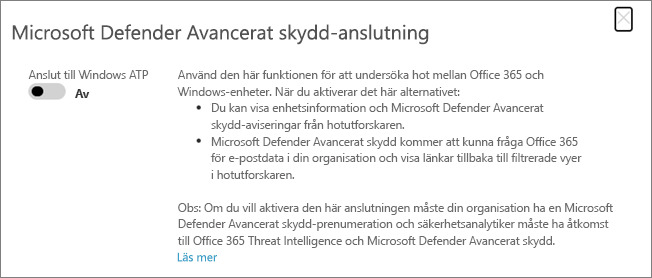

# Använda Microsoft Defender för Office 365 tillsammans med Microsoft Defender för EndpointUse Microsoft Defender for Office 365 together with Microsoft Defender for Endpoint

[!INCLUDE [Microsoft 365 Defender rebranding](../includes/microsoft-defender-for-office.md)]

[Microsoft Defender för Office 365](defender-for-office-365.md) kan konfigureras för att fungera med [Microsoft Defender för slutpunkt.](/windows/security/threat-protection)[Microsoft Defender for Office 365](defender-for-office-365.md) can be configured to work with [Microsoft Defender for Endpoint](/windows/security/threat-protection).

Genom att integrera Microsoft Defender för Office 365 med Microsoft Defender för Endpoint kan du hjälpa din säkerhetsåtgärdsgrupp att övervaka och vidta åtgärder snabbt om användarnas enheter är i risktagande.Integrating Microsoft Defender for Office 365 with Microsoft Defender for Endpoint can help your security operations team monitor and take action quickly if users' devices are at risk. När integration har aktiverats kan teamet för säkerhetsåtgärder till exempel se de enheter som eventuellt påverkas av ett upptäckt e-postmeddelande, samt hur många aviseringar som nyligen har genererats för dessa enheter i Microsoft Defender för Slutpunkt.For example, once integration is enabled, your security operations team will be able to see the devices that are potentially affected by a detected email message, as well as how many recent alerts were generated for those devices in Microsoft Defender for Endpoint.

I följande bild visas hur fliken **Enheter ser** ut när du har aktiverat Microsoft Defender för slutpunktsintegrering:The following image depicts what the **Devices** tab looks like when you have Microsoft Defender for Endpoint integration enabled:

I det här exemplet kan du se att mottagarna av det identifierade e-postmeddelandet har fyra enheter och en har en avisering.In this example, you can see that the recipients of the detected email message have four devices and one has an alert. När du klickar på länken för en enhet öppnas sidan i Microsoft Defender Säkerhetscenter ( <https://securitycenter.windows.com> ).Clicking the link for a device opens its page in the Microsoft Defender Security Center (<https://securitycenter.windows.com>).

> [!TIP]
> **[Läs mer om Microsoft Defender Säkerhetscenter](/windows/security/threat-protection/microsoft-defender-atp/use)** (kallas även Microsoft Defender för Slutpunktsportalen).**[Learn more about the Microsoft Defender Security Center](/windows/security/threat-protection/microsoft-defender-atp/use)** (also referred to as the Microsoft Defender for Endpoint portal.)

## KravRequirements

- Din organisation måste ha Microsoft Defender för Office 365 (eller Office 365 E5) och Microsoft Defender för Slutpunkt.Your organization must have Microsoft Defender for Office 365 (or Office 365 E5) and Microsoft Defender for Endpoint.

- Du måste vara global administratör eller ha en säkerhetsadministratörsroll (till exempel säkerhetsadministratör) som har [tilldelats i & Säkerhets- och efterlevnadscenter.](https://protection.office.com)You must be a global administrator or have a security administrator role (such as Security Administrator) assigned in the [Security & Compliance Center](https://protection.office.com). (Se [Behörigheter i säkerhets- & Säkerhets- och efterlevnadscenter](permissions-in-the-security-and-compliance-center.md))(See [Permissions in the Security & Compliance Center](permissions-in-the-security-and-compliance-center.md))

- Du måste ha tillgång till både [Utforskaren (eller](threat-explorer.md) identifieringar i realtid) i säkerhets- & säkerhets- och efterlevnadscentret för Microsoft Defender.You must have access to both [Explorer (or real-time detections)](threat-explorer.md) in the Security & Compliance Center and the Microsoft Defender Security Center.

## Integrera Microsoft Defender för Office 365 med Microsoft Defender för slutpunktTo integrate Microsoft Defender for Office 365 with Microsoft Defender for Endpoint

Integrering av Microsoft Defender för Office 365 med Microsoft Defender för slutpunkt konfigureras med hjälp av både Säkerhets- och &-efterlevnadscenter och Microsoft Defender Säkerhetscenter.Integrating Microsoft Defender for Office 365 with Microsoft Defender for Endpoint is set up by using both the Security & Compliance Center AND the Microsoft Defender Security Center.

1. Som global administratör eller säkerhetsadministratör går du till <https://protection.office.com> och loggar in.As a global administrator or a security administrator, go to <https://protection.office.com> and sign in. (Då kommer du till Säkerhets- & Säkerhets- & Office 365.)(This takes you to the Office 365 Security & Compliance Center.)

2. Välj Hothanteringsutforskaren **i** \> **navigeringsfönstret.**In the navigation pane, choose **Threat management** \> **Explorer**.

   

3. I skärmens övre högra hörn väljer du **Defender för Slutpunktsinställningar (MDE-inställningar).**In the upper right corner of the screen, choose **Defender for Endpoint Settings (MDE Settings)**.

4. I dialogrutan Anslutning till Microsoft Defender för slutpunkt aktiverar du **Anslut till Microsoft Defender för Slutpunkt.**In the Microsoft Defender for Endpoint connection dialog box, turn on **Connect to Microsoft Defender for Endpoint**.

   

5. Gå till Microsoft Defender Säkerhetscenter ( <https://securitycenter.windows.com> ).Go to the Microsoft Defender Security Center (<https://securitycenter.windows.com>).

6. Välj Inställningar i **navigeringsfältet.**In the navigation bar, choose **Settings**. Välj sedan **Avancerade funktioner** under **Allmänt.**Then, under **General**, choose **Advanced features**.

7. Bläddra ned till **Office 365 Threat Intelligence-anslutning** och aktivera anslutningen.Scroll down to **Office 365 Threat Intelligence connection**, and turn the connection on.

   

## Relaterade artiklarRelated articles

[Funktioner för undersökning av hot och svar i Office 365Threat investigation and response capabilities in Office 365](office-365-ti.md)

[Microsoft Defender för Office 365Microsoft Defender for Office 365](defender-for-office-365.md)

[Microsoft Defender för EndpointMicrosoft Defender for Endpoint](/windows/security/threat-protection)