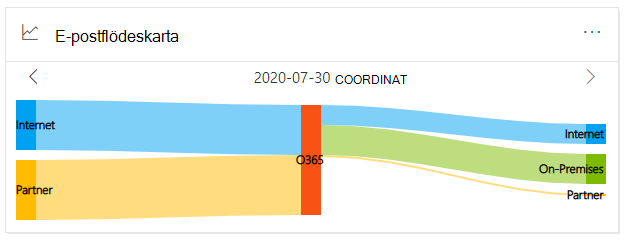

# E-postflödeskarta i säkerhets- & Säkerhets- och efterlevnadscenterMail flow map in the Security & Compliance Center

[!INCLUDE [Microsoft 365 Defender rebranding](../includes/microsoft-defender-for-office.md)]

**Gäller för****Applies to**
- [Exchange Online ProtectionExchange Online Protection](exchange-online-protection-overview.md)
- [Microsoft Defender för Office 365 Abonnemang 1 och Abonnemang 2Microsoft Defender for Office 365 plan 1 and plan 2](defender-for-office-365.md)
- [Microsoft 365 DefenderMicrosoft 365 Defender](../defender/microsoft-365-defender.md)

**E-postflödeskartan** [på instrumentpanelen](mail-flow-insights-v2.md) för e-postflöde i säkerhets- & [efterlevnadscenter](https://protection.office.com) ger insyn i hur e-post flödar genom organisationen.The **Mail flow map** in the [Mail flow dashboard](mail-flow-insights-v2.md) in the [Security & Compliance Center](https://protection.office.com) gives insight as to how mail flows through your organization. Du kan använda den här informationen till att lära dig mönster, identifiera problem och åtgärda problem när de uppstår.You can use this information to learn patterns, identify anomalies, and fix issues as they occur.

Som standard visar widgeten e-postflödesmönstret från föregående dag i ett diagram som kallas *för Ett Sankey-diagram.*By default, the widget shows the mail flow pattern from the previous day in a chart known as a *Sankey* diagram. Du kan använda vänsterpilen  och Högerpil för  dagar.You can use the left arrow  and right arrow  to show information from different days. Varje färg representerar e-postflöde över en annan inkommande eller utgående koppling (eller utan att använda kopplingar).Each different color represents mail flow over a different inbound or outbound connector (or without using connectors). Om du hovrar över en viss färg visas antalet meddelanden för den typen av koppling.If you hover over a specific color, the number of messages is displayed for that type of connector.

## Rapportvy för e-postflödeskartanReport view for the Mail flow map

Om du klickar på **widgeten E-postflödeskarta** kommer du till **rapporten E-postflödeskarta.**Clicking on the **Mail flow map** widget will take you to the **Mail flow map** report.

Följande diagram är tillgängliga i rapportvyn:The following charts are available in the report view:

- **Visa data för: Översikt:** Det här är i stort sett en större vy av widgeten.**Show data for: Overview**: This is basically a larger view of the widget. Om du hovrar över en viss färg visas antalet meddelanden för den typen av koppling.If you hover over a specific color, the number of messages is displayed for that type of connector.

  

- **Visa data för: Information:** I den här vyn visas information om kopplingarna och måldomänerna.**Show data for: Detail**: This view shows details about the connectors and destination domains. De översta domänerna för avsändare och mottagare visas och resten finns i **Andra**.The top sender and recipient domains are listed, and the rest are put in **Others**. Om du hovrar över en viss färg och ett visst avsnitt visas antalet meddelanden.If you hover over a specific color and section, the number of messages is displayed.

  

Om du klickar **på** Filter i en rapportvy kan du ange ett datumintervall **med Startdatum** **och Slutdatum.**If you click **Filters** in a report view, you can specify a date range with **Start date** and **End date**.

Om du vill skicka rapporten med ett visst datumintervall till en eller flera mottagare klickar du på **Begär nedladdning.**To email the report for a specific date range to one or more recipients, click **Request download**.

Relaterade insikter visas under e-postflödeskartan om de är tillgängliga (till exempel åtgärda möjliga insikter om [e-postslinga](mfi-mail-loop-insight.md)).Related insights are shown beneath the Mail flow map if they're available (for example, the [Fix possible mail loop insight](mfi-mail-loop-insight.md)).

## Detaljtabellvyn för e-postflödeskartanDetails table view for the Mail flow map

Om du **klickar på Visa informationstabell** i en rapportvy visas följande information:If you click **View details table** in a report view, the following information is shown:

- **Datum****Date**
- **Kategori****Category**
- **Anslutare/tredjepartsleverantör****Connector / Third-party service provider**
- **Sender/Recipient domain****Sender/Recipient domain**
- **Antal meddelanden****Message count**

Om du klickar **på** Filter i en detaljtabellvy kan du ange ett datumintervall **med Startdatum** **och Slutdatum.**If you click **Filters** in a details table view, you can specify a date range with **Start date** and **End date**.

Om du markerar en rad visas liknande information i en utfällbladstext:If you select a row, similar details are shown in a flyout:

Om du vill skicka rapporten med ett visst datumintervall till en eller flera mottagare klickar du på **Begär nedladdning.**To email the report for a specific date range to one or more recipients, click **Request download**.

Om du vill gå tillbaka till rapportvyn klickar du **på Visa rapport**.To go back to the reports view, click **View report**.

## Se ävenSee also

Mer information om andra insikter i instrumentpanelen för e-postflöde finns i [E-postflödesinformation i Säkerhets- & efterlevnadscenter.](mail-flow-insights-v2.md)For information about other insights in the Mail flow dashboard, see [Mail flow insights in the Security & Compliance Center](mail-flow-insights-v2.md).
