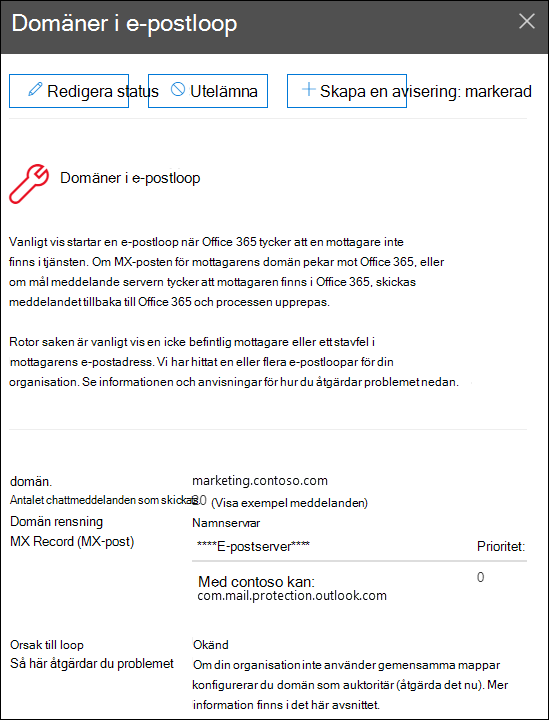

# Åtgärda möjliga insikter om e-postslingan i & Säkerhets- och efterlevnadscenterFix possible mail loop insight in the Security & Compliance Center

[!INCLUDE [Microsoft 365 Defender rebranding](../includes/microsoft-defender-for-office.md)]

**Gäller för****Applies to**
- [Exchange Online ProtectionExchange Online Protection](exchange-online-protection-overview.md)
- [Microsoft Defender för Office 365 Abonnemang 1 och Abonnemang 2Microsoft Defender for Office 365 plan 1 and plan 2](defender-for-office-365.md)
- [Microsoft 365 DefenderMicrosoft 365 Defender](../defender/microsoft-365-defender.md)

E-postslingor är dåliga eftersom:Mail loops are bad because:

- De slösar på systemresurser.They waste system resources.
- De använder organisationens e-postvolym.They consume your organization's mail volume quota.
- De skickar förvirrande rapporter om utebliven leverans (kallas även NDR-rapporter eller icke-leveranskända meddelanden) till de ursprungliga meddelandeavsändarna.They send confusing non-delivery reports (also known as NDRs or bounce messages) to the original message senders.

Åtgärda **möjliga insikter** om  e-postslingor  i området Rekommenderas för dig på instrumentpanelen för e-postflöde i Säkerhets- och [&-efterlevnadscenter](https://protection.office.com) meddelar dig när en e-postslinga identifieras i organisationen.The **Fix possible mail loop** insight in the **Recommended for you** area of the [Mail flow dashboard](mail-flow-insights-v2.md) in the [Security & Compliance Center](https://protection.office.com) notifies you when a mail loop is detected in your organization.

Den här insikten visas bara när villkoret har upptäckts (om du inte har några e-postslingor kan du inte se insikten).This insight appears only after the condition is detected (if you don't have any mail loops, you won't see the insight).

När du klickar **på Visa information** om widgeten visas en utfäll tillgänglig meny med mer information:When you click **View details** on the widget, a flyout appears with more information:

- **Domain****Domain**
- **Antal meddelanden:** Du kan klicka på Visa **exempelmeddelanden** för att se resultatet [av meddelandespårningen](message-trace-scc.md) för ett exempel på meddelanden som har påverkats av loopen.**Number of messages**: You can click **View sample messages** to see the [message trace](message-trace-scc.md) results for a sample of the messages that were affected by the loop.
- **Domäntyp**" Till exempel Auktoritativ eller Icke-auktoritativ.**Domain type**" For example, Authoritative or Non-authoritative.
- **MX-post:** Värden **(e-postserver)** **och prioritetsvärden** för MX-posten för domänen.**MX record**: The host (**Mail server**) and **Priority** values of the MX record for the domain.
- **Looporsak** och **Hur du åtgärdar**: Vi identifierar de vanligaste e-postslingsscenarierna och tillhandahåller rekommenderade åtgärder för att åtgärda slingan.**Loop reason** and **How to fix**: We'll identify the most common mail loop scenarios and provide recommended actions to fix the loop.

## Se ävenSee also

Mer information om andra insikter i instrumentpanelen för e-postflöde finns i [E-postflödesinformation i Säkerhets- & efterlevnadscenter.](mail-flow-insights-v2.md)For information about other insights in the Mail flow dashboard, see [Mail flow insights in the Security & Compliance Center](mail-flow-insights-v2.md).
