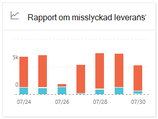
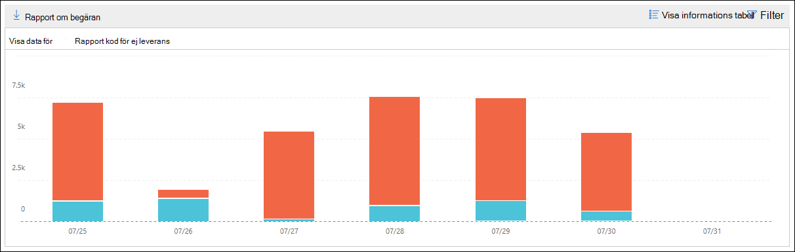
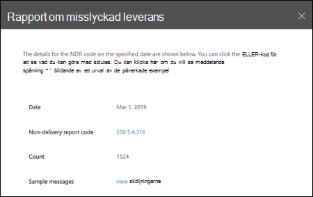

# Rapport om utebliven leverans i säkerhets- & Säkerhets- och efterlevnadscenter

[!INCLUDE [Microsoft 365 Defender rebranding](../includes/microsoft-defender-for-office.md)]

**Gäller för**
- [Exchange Online Protection](exchange-online-protection-overview.md)
- [Microsoft Defender för Office 365 Abonnemang 1 och Abonnemang 2](defender-for-office-365.md)
- [Microsoft 365 Defender](../defender/microsoft-365-defender.md)

Rapporten **Icke &-leverans** på instrumentpanelen  för e-postflöde i Säkerhets- och efterlevnadscenter visar de mest påträffade felkoderna i rapporter om utebliven leverans (kallas även NDR-rapporter eller icke-leveransk så kallade icke-leveranskroller) för användare i organisationen.  Den här rapporten innehåller information om NDR-rapporter så att du kan felsöka problem med e-postleveransen.

## Rapportvy för rapporten om utebliven leverans

Om du klickar **på widgeten Rapport om** utebliven leverans kommer du till rapporten Ej **leverans.**

Som standard visas aktiviteten för alla felkoder. Om du klickar **på Visa data** för kan du välja en specifik felkod i listrutan.

Om du hovrar över en viss färg (felkod) en viss dag i diagrammet visas det totala antalet meddelanden för felet.

## Tabellvyn Information för rapporten om utebliven leverans

Om du **klickar på Visa informationstabell** i en rapportvy visas följande information:

- **Datum**
- **Rapportkod för utebliven leverans**
- **Antal**
- **Exempelmeddelanden:** Meddelande-ID:na för ett exempel på påverkade meddelanden.

Om du klickar **på** Filter i en detaljtabellvy kan du ange ett datumintervall **med Startdatum** **och Slutdatum.**

Om du vill skicka rapporten med ett visst datumintervall till en eller flera mottagare klickar du på **Begär nedladdning.**

När du markerar en rad i tabellen visas en utfälltabell med följande information:

- **Datum**
- **Rapportkod för utebliven** leverans: Du kan klicka på länken för att hitta mer information om orsaker och lösningar för den specifika felkoden.
- **Antal**
- **Exempelmeddelanden:** Du kan klicka på **Visa exempelmeddelanden** om du vill se [resultatet av meddelandespårningen](message-trace-scc.md) för ett exempel på de berörda meddelandena.

## Relaterade ämnen

Mer information om andra insikter i instrumentpanelen för e-postflöde finns i [E-postflödesinformation i Säkerhets- & efterlevnadscenter.](mail-flow-insights-v2.md)
