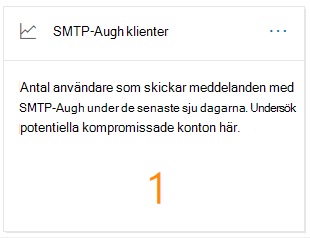
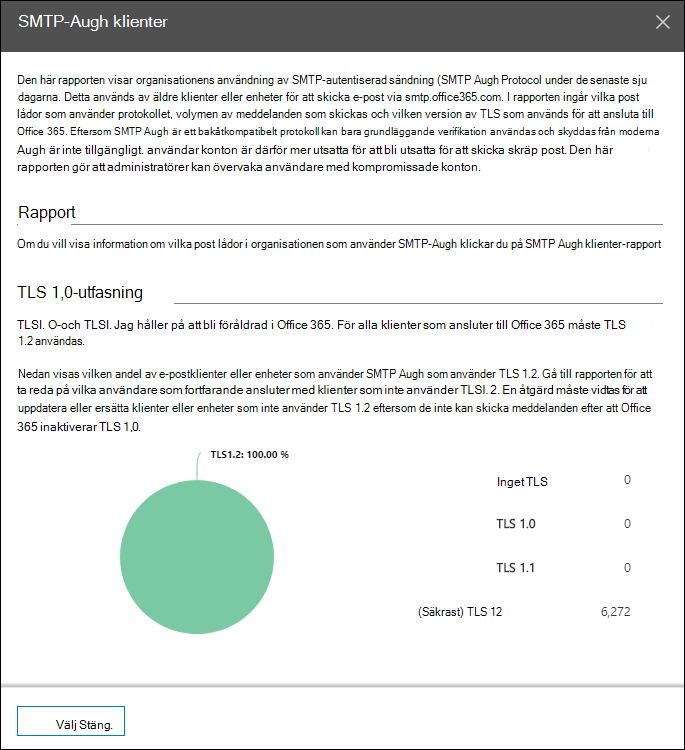
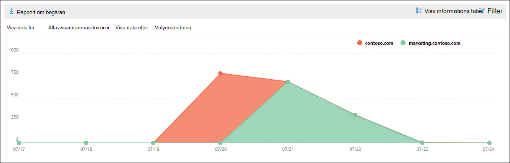
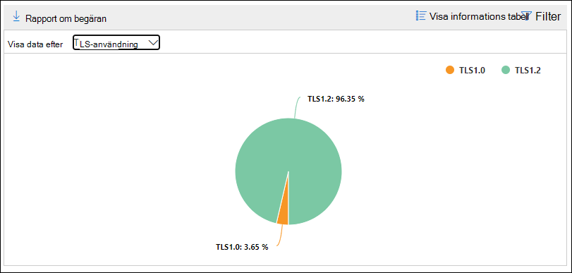
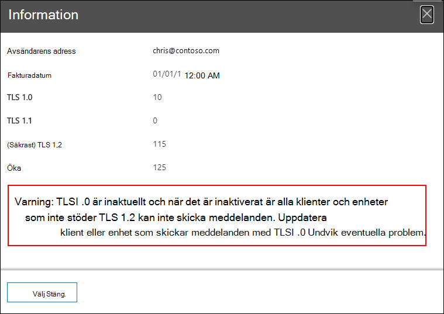

# Insikt och rapport för SMTP-autentiseringsklienter i Säkerhets- & efterlevnadscenter

[!INCLUDE [Microsoft 365 Defender rebranding](../includes/microsoft-defender-for-office.md)]

**Gäller för**
- [Exchange Online Protection](exchange-online-protection-overview.md)
- [Microsoft Defender för Office 365 Abonnemang 1 och Abonnemang 2](defender-for-office-365.md)
- [Microsoft 365 Defender](../defender/microsoft-365-defender.md)

Insikten **för SMTP-autentiseringsklienter** i instrumentpanelen för e-postflöde och rapporten tillhörande [SMTP-autentiseringsklienter](#smtp-auth-clients-report) i kompatibilitetscentret för [säkerhet i &](https://protection.office.com) markerar användningen av sändningsprotokoll för SMTP-AUTH-klienten för användare eller systemkonton i organisationen.  Det här äldre protokollet (som använder slutpunkts-smtp.office365.com) erbjuder endast grundläggande autentisering och är känslig för användning av komprometterade konton för att skicka e-post. Med insikten och rapporten kan du kontrollera ovanlig aktivitet för sändning via SMTP AUTH-e-post. Den visar även TLS-användningsdata för klienter eller enheter som använder SMTP AUTH.

Widgeten anger antalet användare eller tjänstkonton som har använt SMTP-autentiseringsprotokoll under de senaste 7 dagarna.

Om du klickar på antalet meddelanden på widgeten visas den utfällade **menyn SMTP Auth-klienter.** Den utfällda utfällningen ger en aggregerad vy över TLS-användning och -volymer för den senaste veckan.

Du kan klicka på **rapportlänken SMTP Auth-klienter** för att gå till rapporten SMTP Auth-klienter enligt beskrivningen i nästa avsnitt.

## Rapporten SMTP Auth-klienter

### Rapportvyn för rapporten SMTP Auth-klienter

Som standard visar rapporten data för de senaste 7 dagarna, men data är tillgängliga för de senaste 90 dagarna.

Översiktsavsnittet innehåller följande diagram:

- **Visa data efter: Skicka** volym: Som standard visar diagrammet antalet SMTP-klientmeddelanden som skickades från alla domäner **(Visa data för:** Alla avsändardomäner är markerat som standard). Du kan filtrera resultatet till en viss avsändardomän genom att klicka på Visa **data** för och välja avsändardomänen i listrutan. Om du hovrar över en specifik datapunkt (dag) visas antalet meddelanden.

  

- **Visa data efter: TLS-användning:** I diagrammet visas procentandelen TLS-användning för alla meddelanden från SMTP-autentiseringsklienten under den valda tidsperioden. Med det här diagrammet kan du identifiera och vidta åtgärder på användare och systemkonton som fortfarande använder äldre versioner av TLS.

  

Om du klickar **på** Filter i en rapportvy kan du ange ett datumintervall **med Startdatum** **och Slutdatum.**

Klicka **på Begär rapport** om du vill få en mer detaljerad version av rapporten i ett e-postmeddelande. Du kan ange datumintervallet och mottagarna för att ta emot rapporten.

### Tabellvyn Information för rapporten SMTP Auth-klienter

Om du **klickar på Visa** informationstabell beror den information som visas på det diagram som du tittar på:

- **Visa data genom: Skicka volym:** Följande information visas i en tabell:

  - **Avsändarens adress**
  - **Antal meddelanden**

  Om du markerar en rad visas samma information i en utfällbladstext.

- **Visa data efter: TLS-användning:** Följande information visas i en tabell:

  - **Avsändarens adress**
  - **TLS1,0 %**\*
  - **TLS1,1 %**\*
  - **TLS1,2 %**\*
  - **Antal meddelanden**

  \* I den här kolumnen visas både procentandelen och antalet meddelanden från avsändaren.

Om du klickar **på** Filter i en detaljtabellvy kan du ange ett datumintervall **med Startdatum** **och Slutdatum.**

Om du markerar en rad visas liknande information i en utfällbladstext:

Klicka **på Begär rapport** om du vill få en mer detaljerad version av rapporten i ett e-postmeddelande. Du kan ange datumintervallet och mottagarna för att ta emot rapporten.

Om du vill gå tillbaka till rapportvyn klickar du **på Visa rapport**.

## Relaterade ämnen

Mer information om andra insikter i instrumentpanelen för e-postflöde finns i [E-postflödesinformation i Säkerhets- & efterlevnadscenter.](mail-flow-insights-v2.md)
