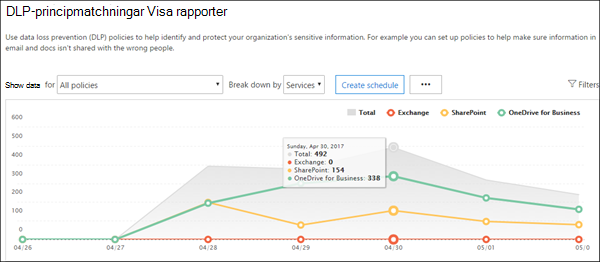
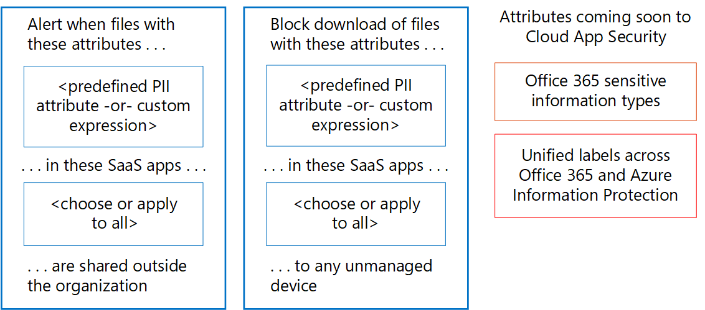

# Övervaka läckage av personliga data

[!INCLUDE [Microsoft 365 Defender rebranding](../includes/microsoft-defender-for-office.md)]

Det finns många verktyg som kan användas för att övervaka användning och transport av personliga data. I det här avsnittet beskrivs tre verktyg som fungerar bra.

På bilden:

- Börja med Microsoft 365-rapporter för dataförlustskydd för att övervaka personliga data i SharePoint Online, OneDrive för företag och e-post under överföring. De här rapporterna ger den högsta detaljnivån för övervakning av personliga data. Rapporterna innefattar dock inte alla tjänster i Office 365.

- Använd sedan aviseringsprinciper och granskningsloggen för att övervaka aktiviteten i flera tjänster. Konfigurera löpande övervakning eller sök efter en händelse i granskningsloggen. Granskningsloggen fungerar för alla tjänster: Sway, PowerBI, eDiscovery, Dynamics 365, Microsoft Flow, Microsoft Teams, administratörsaktivitet, OneDrive för företag, SharePoint Online, e-post under överföring och vilande inkorgar. Skype-konversationer ingår i vilande inkorgar.

- Till sist ska du använda Microsoft Cloud App Security för att övervaka filer med känsliga data hos andra SaaS-leverantörer. Inom kort blir det möjligt att använda känsliga informationstyper och enhetliga etiketter för Azure Information Protection och Office med Cloud App Security. Du kan konfigurera principer som gäller för alla dina SaaS-appar eller vissa appar (som Box). Cloud App Security identifierar inte filer i Exchange Online, till exempel bifogade filer i e-post.

## Rapporter för dataförlustskydd

När du har skapat dina principer för dataförlustskydd (DLP) ska du kontrollera att de fungerar som de ska och hjälper dig att hålla dig uppdaterad. Med DLP-rapporterna i Office 365 kan du snabbt visa antalet DLP-principmatchningar, åsidosättningar eller falska positiva identifieringar, kontrollera om de ökar eller minskar med tiden, filtrera rapporten på olika sätt och visa ytterligare information genom att markera en punkt på en linje i diagrammet.

Du kan använda DLP-rapporterna för att:

- Fokusera på vissa tidsperioder och förstå orsakerna till toppar och trender.

- Upptäck affärsprocesser som strider mot organisationens DLP-principer.

- Förstå alla affärseffekter i DLP-principerna.

- Visa de resultat som skickats av användare när de löser ett principtips genom att åsidosätta principen eller rapportera en falsk positiv identifiering.

- Kontrollera efterlevnaden med en särskild DLP-princip genom att visa de olika matchningarna för den principen.

- Visa en lista med filer med känsliga data som överensstämmer med dina DLP-principer i informationsfönstret.

Du kan också använda DLP-rapporterna för att finjustera dina DLP-principer när du kör dem i testläge.

DLP-rapporter finns i säkerhetscenter och efterlevnadscenter. Gå till Rapporter \> Visa rapporter. Under Dataförlustskydd (DLP) går du till antingen Matchning mot DLP-principer och regler eller Falskt positiva identifieringar och åsidosättningar för DLP.

Mer information finns i [Visa rapporterna för dataförlustskydd](../../compliance/view-the-dlp-reports.md).

## Principer för granskningslogg och aviseringar

I granskningsloggen finns händelser från Exchange Online, SharePoint Online, OneDrive för företag, Azure Active Directory, Microsoft Teams, Power BI, Sway och andra tjänster.

Säkerhetscenter och efterlevnadscenter tillhandahåller två olika sätt att övervaka och rapportera mot granskningsloggen:

- Konfigurera aviseringsprinciper, visa aviseringar och följa trender: använd verktygen för aviseringsprinciper och avisering på instrumentpanelen i säkerhetscenter eller efterlevnadscenter.

- Sök direkt i granskningsloggen – sök efter alla händelser i ett specifikt datumintervall. Du kan också filtrera resultatet utifrån vissa villkor, t. ex. användaren som utförde åtgärden, åtgärden eller målobjektet.

Informationssäkerhets- och regelefterlevnadsteam kan använda de här verktygen för att proaktivt granska aktiviteter som utförs av både slutanvändare och administratörer i olika tjänster. Automatiska aviseringar kan konfigureras för att skicka e-postmeddelanden när vissa aktiviteter förekommer på särskilda webbplatssamlingar, till exempel när innehåll delas från webbplatser som är kända för att innehålla GDPR-relaterad information. På så sätt kan teamen följa upp användare för att säkerställa att företagets säkerhetsprinciper följs eller för att erbjuda ytterligare utbildning.

Team med ansvar för informationssäkerhet kan även söka i granskningsloggen för att undersöka misstänkta dataöverträdelser och fastställa både överträdelsens grundorsak och omfattning. Denna inbyggda funktion underlättar efterlevnaden av artikel 33 och 34 i GDPR, som kräver att anmälningar lämnas in till GDPR-tillsynsmyndigheterna och till de registrerade själva vid en dataöverträdelse under en viss tidsperiod. Poster i granskningsloggen sparas bara i 90 dagar i tjänsten, men det rekommenderas ofta (och många organisationer har krävt) att loggarna sparas under längre tidsperioder.

Det finns lösningar som du kan använda för att prenumerera på enhetliga granskningsloggar via API för Microsoft Management Activity och som kan lagra loggposter efter behov och tillhandahålla avancerade instrumentpaneler och aviseringar. Ett exempel är [Microsoft Operations Management Suite (OMS)](/azure/operations-management-suite/oms-solution-office-365).

Mer information om aviseringsprinciper och sökning i granskningsloggen:

- [Aviseringsprinciper i säkerhets- och efterlevnadscenter för Microsoft 365](../../compliance/alert-policies.md)

- [Söka i granskningsloggen efter användar- och administratörsaktivitet i Office 365](../../compliance/search-the-audit-log-in-security-and-compliance.md) (introduktion)

- [Aktivera och inaktivera granskningsloggsökning](../../compliance/turn-audit-log-search-on-or-off.md)

- [Söka i granskningsloggen](../../compliance/search-the-audit-log-in-security-and-compliance.md)

- [Search-UnifiedAuditLog](/powershell/module/exchange/search-unifiedauditlog) (cmdlet)

- [Detaljerade egenskaper i granskningsloggen](../../compliance/detailed-properties-in-the-office-365-audit-log.md)

## Microsoft Cloud App Security

Med Microsoft Cloud App Security får du hjälp att upptäcka andra SaaS-appar som används i dina nätverk och känsliga data som skickas till och från dessa appar.

Microsoft Cloud App Security är en omfattande tjänst som ger dig djup insyn, detaljerad kontroll och förbättrat skydd mot hot för dina molnbaserade appar. Den identifierar fler än 15 000 molnprogram i nätverket – från alla enheter – och presenterar riskpoäng samt fortlöpande riskbedömning och -analys. Inga agenter krävs: informationen samlas in från dina brandväggar och proxyservrar för att ge dig fullständig insyn och sammanhang för molnanvändning och skugg-IT.

För att få en bättre förståelse för molnmiljön ger undersökningsfunktionen i Cloud App Security djup insyn i alla aktiviteter, filer och konton för sanktionerade och hanterade appar. Du kan få detaljerad information om en filnivå och identifiera varifrån data överförs i molnprogrammen.

Som exempel visar följande bild två Cloud App Security-principer som kan hjälpa dig med GDPR.

Den första principen varnar när filer med ett fördefinierat PII-attribut eller ett anpassat uttryck som du väljer delas utanför organisationen från de SaaS-appar som du väljer.

Den andra principen blockerar nedladdning av filer till en ohanterad enhet. Du väljer vilka attribut i filerna du vill söka efter och vilka SaaS-appar du vill att principen ska gälla för.

Dessa attributtyper kommer snart att ingå i Cloud App Security:

- Typer av känslig information
- Enhetliga etiketter i Microsoft 365 och Azure Information Protection

### Instrumentpanelen i Cloud App Security

Börja med att starta Cloud App Security om du inte redan har börjat använda det. Så här får du tillgång till Cloud App Security: <https://portal.cloudappsecurity.com>.

OBS! Kom ihåg att aktivera automatiskt genomsökning av filnamn för Azure Information Protection-klassificeringsetiketter (i Allmänna inställningar) när du ska komma igång med Cloud App Security eller innan du tilldelar etiketter. När du har gjort det genomsöker inte Cloud App Security befintliga filer igen förrän de ändras.

Mer information:

- [Distribuera Cloud App Security](/cloud-app-security/getting-started-with-cloud-app-security)

- [Mer information om Microsoft Cloud App Security](https://www.microsoft.com/cloud-platform/cloud-app-security)

- [Blockera nedladdning av känslig information med Microsoft Cloud App Security-proxyn](/cloud-app-security/use-case-proxy-block-session-aad)

## Exempel på fil- och aktivitetsprinciper som identifierar delning av personliga data

### Identifiera delning av filer som innehåller PII – kreditkortsnummer

Avisera när en fil som innehåller ett kreditkortsnummer delas från en godkänd molnapp.

****

|Kontroll|Inställningar|
|---|---|
|Typ av princip|Filprincip|
|Principmall|Ingen mall|
|Allvarlighetsgrad för princip|Högsta|
|Kategori|DLP|
|Filterinställningar|Åtkomstnivå = offentlig (Internet), offentlig, extern 
 App = \<select apps\>(använd den här inställningen om du vill begränsa övervakning till vissa SaaS-appar)|
|Använd för|Alla filer, alla ägare|
|Innehållsgranskning|Innefattar filer som matchar ett befintligt uttryck: Alla länder: Ekonomi: Kreditkortsnummer 
 Kräv inte relevant kontext: avmarkerat (den här inställningen matchar nyckelord och regex) 
 Innefattar filer med minst 1 matchning 
 Ta bort mask för de fyra sista tecknen i överträdelsen: markerat|
|Varningar|Skapa en avisering för varje matchande fil: markerat 
 Daglig aviseringsgräns: 1 000 
 Välj en avisering som e-post: markerat 
 Till: infosec@contoso.com|
|Styrning|Microsoft OneDrive för företag 
 Gör privat: markera Ta bort externa användare 
 Alla andra inställningar: avmarkerade 
 Microsoft SharePoint Online 
 Gör privat: markera Ta bort externa användare 
 Alla andra inställningar: avmarkerade|
|

Liknande principer:

- Identifiera delning av filer som innehåller PII – e-postadress
- Identifiera delning av filer som innehåller PII – passnummer

### Identifiera kund- eller HR-data i Box eller OneDrive för företag

Avisera när en fil som är markerad som kunddata eller HR-information överförs till OneDrive för företag eller Box.

Kommentarer:

- Box-övervakning kräver att en anslutning konfigureras med hjälp av API-anslutaren SDK.
- Principen kräver funktioner som för närvarande är i privat förhandsversion.

****

|Kontroll|Inställningar|
|---|---|
|Typ av princip|Aktivitetspolicy|
|Principmall|Ingen mall|
|Allvarlighetsgrad för princip|Högsta|
|Kategori|Delningskontroll|
|Agera på|Enskild aktivitet|
|Filterinställningar|Aktivitetstyp = överföra fil 
 App = Microsoft OneDrive för företag och Box 
 Klassificeringsetikett (för närvarande i privat förhandsversion): Azure Information Protection = kunddata, personal – löneuppgifter, personal – information om anställda|
|Varningar|Skapa en avisering: markerad 
 Daglig aviseringsgräns: 1 000 
 Välj en avisering som e-post: markerat 
 Till: infosec@contoso.com|
|Styrning|Alla appar 
 Placera användare i karantän: markerad 
 Alla andra inställningar: avmarkerade 
 Office 365 
 Placera användare i karantän: markerad 
 Alla andra inställningar: avmarkerade|
|

Liknande principer:

- Identifiera stora nedladdningar med kunddata eller HR-data; avisera när ett stort antal filer som innehåller kunddata eller HR-data har laddats ned av en enskild användare under en begränsad tidsperiod.
- Identifiera delning av kunddata och HR-data: avisera när filer som innehåller kund- eller HR-data delas.