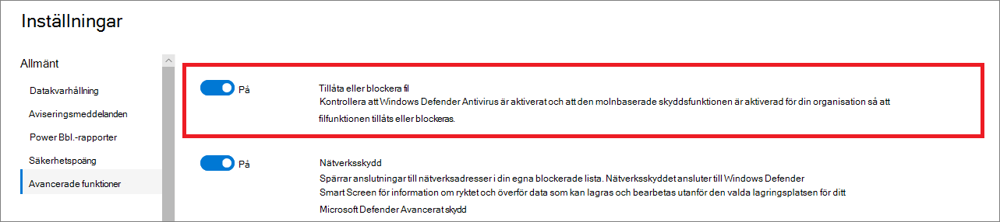

# Konfigurera avancerade funktioner i Defender för Slutpunkt

**Gäller för:**
- [Microsoft Defender för Endpoint](https://go.microsoft.com/fwlink/p/?linkid=2154037)
- [Microsoft 365 Defender](https://go.microsoft.com/fwlink/?linkid=2118804)

[!INCLUDE [Microsoft 365 Defender rebranding](../../includes/microsoft-defender.md)]

> Vill du använda Defender för Slutpunkt? [Registrera dig för en kostnadsfri utvärderingsversion.](https://www.microsoft.com/microsoft-365/windows/microsoft-defender-atp?ocid=docs-wdatp-advancedfeats-abovefoldlink)

Beroende på vilka Microsoft-säkerhetsprodukter du använder kan vissa avancerade funktioner vara tillgängliga för dig att integrera Defender för Slutpunkt med.

## Aktivera avancerade funktioner

1. I navigeringsfönstret väljer du **Inställningar inställningar Avancerade**  >  **funktioner**.
2. Välj den avancerade funktion du vill konfigurera och växla inställningen **mellan** På och **Av.**
3. Klicka **på Spara inställningar.**

Använd följande avancerade funktioner för att få bättre skydd från potentiellt skadliga filer och få bättre insyn under säkerhetsundersökningen.

## Automatiserad undersökning

Aktivera den här funktionen för att dra nytta av tjänstens funktioner för automatisk undersökning och åtgärder. Mer information finns i [Automatiserad undersökning](automated-investigations.md).

## Livesvar

Aktivera den här funktionen så att användare med rätt behörighet kan starta en direkt svarssession på enheter.

Mer information om rolltilldelningar finns i [Skapa och hantera roller.](user-roles.md)

## Live-svar för servrar
Aktivera den här funktionen så att användare med rätt behörighet kan starta en live-svarssession på servrar.

Mer information om rolltilldelningar finns i [Skapa och hantera roller.](user-roles.md)

## Körning av skript som inte har signerats med Live Response

Om du aktiverar den här funktionen kan du köra osignerade skript i en svarssession i direktsändning.

## Åtgärdat autoresole-aviseringar

För klientprogram som skapats i eller efter Windows 10, version 1809, konfigureras automatisk undersökning och åtgärd som standard för att lösa varningar där status för automatisk analys är "Inga hot hittades" eller "Åtgärdat".  Om du inte vill att aviseringarna ska matchas automatiskt måste du inaktivera funktionen manuellt.

> [!TIP]
> För klientorganisationen som skapats tidigare än den versionen måste du manuellt aktivera den här funktionen på sidan [Avancerade](https://securitycenter.windows.com/preferences2/integration) funktioner.

> [!NOTE]
>
> - Resultatet av åtgärden för automatisk lösning kan påverka beräkningen av enhetrisknivå som baseras på de aktiva aviseringarna som finns på en enhet.
> - Om en analytiker för säkerhetsåtgärder manuellt anger statusen för en avisering till "Pågår" eller "Löst" skriver funktionen för automatisk resolve inte över den.

## Tillåta eller blockera fil

Blockering är bara tillgängligt om din organisation uppfyller följande krav:

- Använder Microsoft Defender Antivirus som den aktiva antimalwarelösningen och
- Den molnbaserade skyddsfunktionen är aktiverad

Med den här funktionen kan du blockera potentiellt skadliga filer i nätverket. När du blockerar en fil förhindrar du att den läses, skrivs eller körs på enheter i organisationen.

Aktivera Tillåt **eller blockera** filer:

1. Välj Inställningar Avancerade funktioner Tillåt eller **blockera**  >    >  **fil i navigeringsfönstret.**

1. Ändra inställningen mellan **På och** **Av.**

    

1. Välj **Spara inställningar** längst ned på sidan.

När du har aktiverat den här funktionen kan [du blockera](respond-file-alerts.md#allow-or-block-file) filer via **fliken** Lägg till indikator på en fils profilsida.

## Anpassade nätverksindikatorer

Om du slår på den här funktionen kan du skapa indikatorer för IP-adresser, domäner och URL-adresser, som avgör om de tillåts eller blockeras baserat på en anpassad indikatorlista.

Om du vill använda den här funktionen måste enheterna köra Windows 10 version 1709 eller senare. De bör också ha nätverksskydd i blockläge och version 4.18.1906.3 eller senare av program mot skadlig programvara, se [KB 4052623.](https://go.microsoft.com/fwlink/?linkid=2099834)

Mer information finns i [Hantera indikatorer](manage-indicators.md).

> [!NOTE]
> Nätverksskydd utnyttjar ryktestjänster som bearbetar förfrågningar på platser som kan vara utanför den plats du har valt för Defender för Slutpunktsdata.

## Visa användarinformation

Aktivera den här funktionen så att du kan se användarinformation som lagras i Azure Active Directory. Informationen omfattar en användares bild, namn, titel och avdelningsinformation när du undersöker enheter med användarkonton. Användarkontoinformationen finns i följande vyer:

- Instrumentpanel för säkerhetsåtgärder
- Aviseringskö
- Sidan Enhetsinformation

Mer information finns i [Undersöka ett användarkonto.](investigate-user.md)

## Skype för företag-integrering

Om du aktiverar Skype för företag-integreringen kan du kommunicera med användare via Skype för företag, e-post eller telefon. Det kan vara praktiskt när du behöver kommunicera med användaren och minimera risker.

> [!NOTE]
> När en enhet isoleras från nätverket visas ett popup-fönster där du kan välja att aktivera Outlook- och Skype-kommunikationer som tillåter kommunikation till användaren när han eller hon kopplas bort från nätverket. Den här inställningen gäller för Skype- och Outlook-kommunikation när enheter är i separat läge.

## Azure Advanced Threat Protection-integrering

Integreringen med Azure Advanced Threat Protection gör att du kan pivotera direkt till en annan Microsoft Identity-säkerhetsprodukt. Med Azure Avancerat skydd utökas en undersökning med ytterligare insikter om ett misstänkt komprometterat konto och relaterade resurser. Genom att aktivera den här funktionen kan du utöka den enhetsbaserade undersökningsfunktionen genom att pivotera över nätverket från en synpunkt.

> [!NOTE]
> Du måste ha rätt licens för att aktivera den här funktionen.

## Office 365 Threat Intelligence-anslutning

Den här funktionen är endast tillgänglig om du har ett aktivt Office 365 E5- eller Threat Intelligence-tillägg. Mer information finns på produktsidan för Office 365 Enterprise, E5.

När du aktiverar den här funktionen kan du införliva data från Avancerat skydd för Office 365 i Microsoft Defender Säkerhetscenter för att genomföra en omfattande säkerhetsundersökning i alla Office 365-postlådor och Windows-enheter.

> [!NOTE]
> Du måste ha rätt licens för att aktivera den här funktionen.

Om du vill få sammanhangsbaserad enhetsintegration i Office 365 Threat Intelligence måste du aktivera Defender för Slutpunktsinställningar i instrumentpanelen för & säkerhet och efterlevnad. Mer information finns i Undersökning [av hot och svar.](https://docs.microsoft.com/microsoft-365/security/office-365-security/office-365-ti)

## Microsoft Threat Experts

Av de två Microsoft Threat Expert-komponenterna är riktade attackmeddelanden i allmän tillgänglighet. Experter på begäran är fortfarande i förhandsversion. Du kan bara använda funktionen för experter på begäran om du har tillämpat en förhandsgranskning och programmet har godkänts. Du kan få riktade attackmeddelanden från Microsoft Threat Experts via din Defender för Endpoint-portalens aviseringar-instrumentpanel och via e-post om du konfigurerar den.

> [!NOTE]
> Microsoft Threat Experts-funktionen i Defender för Endpoint är tillgänglig med en E5-licens för [Enterprise Mobility + Security.](https://www.microsoft.com/cloud-platform/enterprise-mobility-security)

## Microsoft Cloud App Security

Aktivering av den här inställningen vidarebefordrar Defender för Endpoint-signaler till Microsoft Cloud App Security för att bättre kunna se användningen av molnprogram. Vidarebefordrade data lagras och bearbetas på samma plats som dina Cloud App Security-data.

> [!NOTE]
> Den här funktionen är tillgänglig med en E5-licens för [Enterprise Mobility + Security](https://www.microsoft.com/cloud-platform/enterprise-mobility-security) på enheter som kör Windows 10, version 1709 (OS-version 16299.1085 med [KB4493441),](https://support.microsoft.com/help/4493441)Windows 10, version 1803 (OS Version 17134.704 med [KB4493464](https://support.microsoft.com/help/4493464)), Windows 10, version 1809 (OS Build 17763.379 med [KB4489899](https://support.microsoft.com/help/4489899)) eller senare Windows 10-versioner.

## Azure Information Protection

Om du slår på den här inställningen kan signaler vidarebefordras till Azure Information Protection. Det ger dataägare och administratörer insyn i skyddade data på enheter som är registrerade och riskklassificeringar för enheter.

## Microsoft Secure Score

Vidarebefordrar Microsoft Defender för Endpoint-signaler till Microsoft Secure Score i Microsoft 365 säkerhetscenter. Om du slår på den här funktionen kan Microsoft Secure Score hålla ordning på enhetens säkerhetssystem. Vidarebefordrade data lagras och bearbetas på samma plats som dina Microsoft Secure Score-data.

### Aktivera Microsoft Defender för slutpunktsintegrering från Microsoft Defender för identitetsportalen

Om du vill få en sammanhangsberoende enhetsintegration i Microsoft Defender för identitet måste du också aktivera funktionen i Microsoft Defender för identitetsportalen.

1. Logga in på [Microsoft Defender för identitetsportalen med](https://portal.atp.azure.com/) en global administratör eller säkerhetsadministratörsroll.

2. Klicka **på Skapa din instans**.

3. Ändra inställningen Integration till På **och** klicka på **Spara**.

När du har slutfört integrationsstegen på båda portalerna kan du se relevanta aviseringar på sidan med enhetsinformation eller användarinformation.

## Microsoft Intune-anslutning

Defender för Endpoint kan integreras med [Microsoft Intune för att aktivera](https://docs.microsoft.com/intune/what-is-intune) [enhetsriskbaserad villkorlig åtkomst.](https://docs.microsoft.com/intune/advanced-threat-protection#enable-windows-defender-atp-in-intune) När du [aktiverar den här funktionen](configure-conditional-access.md)kan du dela Information om Endpoint-enheter med Intune och förbättra tvingande policy.

> [!IMPORTANT]
> Du måste aktivera integreringen på både Intune och Defender för Endpoint om du vill använda den här funktionen. Mer information om specifika steg finns i Konfigurera [villkorsstyrd åtkomst i Defender för slutpunkt.](configure-conditional-access.md)

Den här funktionen är endast tillgänglig om du har följande:

- En licensierad klientorganisation för Enterprise Mobility + Security E3 och Windows E5 (eller Microsoft 365 Enterprise E5)
- En aktiv Microsoft Intune-miljö med Intune-hanterade Windows 10-enheter [med Azure AD-anslutna](https://docs.microsoft.com/azure/active-directory/devices/concept-azure-ad-join/).

### Princip för villkorsstyrd åtkomst

När du aktiverar Intune-integrering skapar Intune automatiskt en klassisk CA-princip (Conditional Access). Den här klassiska CA-principen är en förutsättning för att kunna konfigurera statusrapporter till Intune. Den ska inte tas bort.

> [!NOTE]
> Den klassiska CA-principen som skapas av Intune skiljer sig från moderna [villkorsstyrda](https://docs.microsoft.com/azure/active-directory/conditional-access/overview/)åtkomstprinciper, som används för att konfigurera slutpunkter.

## Förhandsgranskningsfunktioner

Lär dig mer om nya funktioner i förhandsversionen av Defender för slutpunkt och bli bland de första som kan prova kommande funktioner genom att aktivera förhandsversionen.

Du har tillgång till kommande funktioner som du kan ge feedback på för att förbättra den övergripande upplevelsen innan funktionerna blir tillgängliga i allmänhet.

## Dela slutpunktsaviseringar med Microsofts efterlevnadscenter

Vidarebefordrar säkerhetsvarningar för slutpunkter och deras status till Microsofts efterlevnadscenter, så att du kan förbättra principer för insiderriskhantering med varningar och åtgärda interna risker innan de kan orsaka skada. Vidarebefordrade data bearbetas och lagras på samma plats som dina Office 365-data.

När du har [konfigurerat indikatorerna för brott](https://docs.microsoft.com/microsoft-365/compliance/insider-risk-management-settings.md#indicators) mot säkerhetsprinciper i inställningarna för Insider-riskhantering delas Defender för Slutpunktsaviseringar med Insider-riskhantering för tillämpliga användare.

## Relaterade ämnen

- [Uppdatera inställningar för datalagring](data-retention-settings.md)
- [Konfigurera aviseringsmeddelanden](configure-email-notifications.md)
